# ⬆️ Microsoft Azure AZ-204 (Developing Solutions for Microsoft Azure) Practice Tests Exams Questions & Answers

## ❣️ Support

There are many ways to support us; in exchange, you'll get this material in a proper format:

- ❤️ [shop.ditectrev.com, in EPUB or PDF formats, with answers marked](https://shop.ditectrev.com/product/microsoft-azure-az-204-developing-solutions-for-azure-practice-tests-exams-questions-answers),
- ❤️ [shop.ditectrev.com, in EPUB or PDF formats, without answers marked](https://shop.ditectrev.com/product/microsoft-azure-az-204-developing-solutions-for-azure-practice-tests-exams-questions-no-answers),
- 📖 [Udemy is the only one to have explanations for questions](https://www.udemy.com/course/developing-solutions-for-azure-az-204-practice-test-exams/?referralCode=94E823A45873B0E39FE3),
- 📚 [Google Play Books, in PDF format, with answers marked](https://play.google.com/store/books/details?id=vvwcEQAAQBAJ),
- 📚 [Google Play Books, in PDF format, without answers marked](https://play.google.com/store/books/details?id=wPwcEQAAQBAJ),
- 🛍️ [Etsy, in PDF format, with answers marked](https://ditectrev.etsy.com/listing/1506993824),
- 🛍️ [Etsy, in PDF format, without answers marked](https://ditectrev.etsy.com/listing/1521177797),
- 🛒 [eBay, in PDF format, with answers marked](https://www.ebay.com/itm/404899852791?mkcid=16&mkevt=1&mkrid=711-127632-2357-0&ssspo=_ptbuk3gqdw&sssrc=2524149&ssuid=_ptbuk3gqdw&widget_ver=artemis&media=COPY),
- 🛒 [eBay, in PDF format, without answers marked](https://www.ebay.com/itm/405079754203?mkcid=16&mkevt=1&mkrid=711-127632-2357-0&ssspo=_ptbuk3gqdw&sssrc=2524149&ssuid=_ptbuk3gqdw&widget_ver=artemis&media=COPY),
- 🔄 [Patreon subscription allows you to get access to all of the materials in EPUB and PDF formats. You can also buy separate items on Patreon, but the subscription technically allows us to include all updates for EPUB and PDF formats. Hence, you get EPUB and PDF updates when you subscribe to Patreon](https://patreon.com/Ditectrev?utm_medium=unknown&utm_source=join_link&utm_campaign=creatorshare_creator&utm_content=copyLink).

💰 If you work for a company, you could probably easily claim this expense while preparing for your exam. For us, it's about being in the game or not.

⭐ Good ratings & reviews help us to survive. Please don't forget to leave a nice one when you purchase an item.

## 👩‍💻 & 👨‍💻 Interactive Course(s)

It's great to learn these questions as your exam preparation, and, yes, you should pass just based on that. However, we highly recommend more interactive learning if you want to become an expert. Currently, we're recommending those courses:

- 📖 [Educative: text-based, video-free course, including set up out-of-the-box for you Cloud Labs to practice hands-on without the need to set up an environment (and payments). The link includes the highest available discount Educative offers](https://www.educative.io/courses/event-driven-microservices-azure?aff=VALz).

Yes, we have a little commission from that link. Therefore, by using that link, you're supporting us.

## ✨ This course is unlike any Microsoft Azure AZ-204 (Developing Solutions for Azure) course you will find online.

✋ Join a live online community and a course taught by industry experts and pass the Microsoft Azure AZ-204 (Developing Solutions for Azure) confidently. We aim to build an ecosystem of Information Technology (IT) certifications and online courses in cooperation with the technology industry. We believe it will give our students 100% confidence in the pacing market in an open-source environment. We are just at the beginning of our way, so it's even better for you to join now!

## ⌛️ Short and to the point; why should you take the course:

1. Always happy to answer your questions on Udemy's Q&A's and outside :)
2. Failed? Please submit a screenshot of your exam result and request a refund (via our upcoming platform, not possible on Udemy); we'll always accept it.
3. Learn about topics, such as:
   - Access Control;
   - Authentication & Authorization;
   - Azure Active Directory (Azure AD);
   - Azure API Management;
   - Azure App Service;
   - Azure Command Line Interface (Azure CLI);
   - Azure Cosmos DB;
   - Azure Event Hubs;
   - Azure Front Door;
   - Azure Functions;
   - Azure Log Analytics;
   - Azure Logic Apps;
   - Azure Monitor;
   - Azure Policies;
   - Azure Resources;
   - Azure Service Buses;
   - Azure Services;
   - Azure SQL Databases;
   - Azure Storage;
   - Azure Storage Queues;
   - Azure Web Application Firewall (Azure WAF);
   - Azure Web Apps;
   - Inbound Data Traffic & Outbound Data Traffic;
   - PowerShell;
   - Public & Private Cloud;
   - Resource Groups;
   - Serverless;
   - Service Level Agreement (SLA);
   - Software as a Service (SaaS);
   - Virtual Machines (VMs);
   - **Much More!**
4. Questions are similar to the actual exam, without duplications (like in other courses ;-)).
5. The Practice Tests Exams simulate the actual exam's content, timing, and percentage required to pass the exam.
6. This course is **not** a Microsoft Azure AZ-204 (Developing Solutions for Azure) Exam Dump. Some people use brain dumps or exam dumps, but that's absurd, which we don't practice.
7. 220 **unique** questions.

## ☝️ Course Updates

**[v1.0.0](../../releases/tag/v1.0.0): July 10, 2023.**

- Launch of the course.

**[v1.0.1](../../releases/tag/v1.0.1): August 7, 2023.**

- Fix 2 wrong answers.

**[v1.1.0](../../releases/tag/v1.1.0): November 10, 2023.**

- Fix all remaining typos with support of automated proofreading software and 4 wrong answers.

**[v1.1.1](../../releases/tag/v1.1.1): February 4, 2024.**

- Update 1 question with deprecated answer.

**[v1.1.1](../../releases/tag/v1.1.1): August 6, 2024.**

- AI-generated explanations (only paid [Udemy](https://www.udemy.com/course/developing-solutions-for-azure-az-204-practice-test-exams/?referralCode=94E823A45873B0E39FE3)).

**[v1.1.2](../../releases/tag/v1.1.2): November 11, 2024.**

- Fix 4 wrong answers.

**[v1.1.3](../../releases/tag/v1.1.3): March 1, 2025.**

- Fix 3 wrong answers.

## 🙋‍♀️ & 🙋‍♂️ Contribution

We are so thankful for every contribution, which makes sure we can deliver top-notch content. Whenever you find a missing resource, broken link in a [Table of Contents](../..#table-of-contents), the wrong answer, please submit an [issue](../../issues). Even better would be a [Pull Request (PR)](../../pulls).

## Who this course is for:

- 👨‍🎓 Students preparing for the Developing Solutions for Azure (AZ-204) Exam;
- 👨‍🎓 Amazon Web Services (AWS) Engineers;
- 👨‍🎓 Azure Engineers;
- 👨‍🎓 Cloud Engineers;
- 👨‍🎓 DevOps Engineers;
- 👨‍🎓 Google Cloud Platform (GCP) Engineers;
- 👨‍🎓 Infrastructure Engineers;
- 👨‍🎓 Lead Engineers;
- 👨‍🎓 Site Reliability Engineers;
- 👨‍🎓 Software Developers/Engineers;
- 👨‍🎓 Team Leaders.

## Requirements

- 🤩 Excitement to learn!
- 0️⃣ Prior knowledge is required;
- ✅ You can pass the Developing Solutions for Azure (AZ-204) Exam solely based on our Practice Tests Exams.

## Table of Contents

| No. | Questions |
| --- | --------------------------- |
| 1   | [You are implementing a software as a service (SaaS) ASP.NET Core web service that will run as an Azure Web App. The web service will use an on-premises SQL Server database for storage. The web service also includes a WebJob that processes data updates. Four customers will use the web service. Each instance of the WebJob processes data for a single customer and must run as a singleton instance. Each deployment must be tested by using deployment slots prior to serving production data. Azure costs must be minimized. Azure resources must be located in an isolated network. You need to configure the App Service plan for the Web App. How should you configure the App Service plan?](#you-are-implementing-a-software-as-a-service-saas-aspnet-core-web-service-that-will-run-as-an-azure-web-app-the-web-service-will-use-an-on-premises-sql-server-database-for-storage-the-web-service-also-includes-a-webjob-that-processes-data-updates-four-customers-will-use-the-web-service-each-instance-of-the-webjob-processes-data-for-a-single-customer-and-must-run-as-a-singleton-instance-each-deployment-must-be-tested-by-using-deployment-slots-prior-to-serving-production-data-azure-costs-must-be-minimized-azure-resources-must-be-located-in-an-isolated-network-you-need-to-configure-the-app-service-plan-for-the-web-app-how-should-you-configure-the-app-service-plan)
| 2   | [You are a developer for a software as a service (SaaS) company that uses an Azure Function to process orders. The Azure Function currently runs on an Azure Function app that is triggered by an Azure Storage queue. You are preparing to migrate the Azure Function to Kubernetes using Kubernetes-based Event Driven Autoscaling (KEDA). You need to configure Kubernetes Custom Resource Definitions (CRD) for the Azure Function. Which CRDs should you configure?](#you-are-a-developer-for-a-software-as-a-service-saas-company-that-uses-an-azure-function-to-process-orders-the-azure-function-currently-runs-on-an-azure-function-app-that-is-triggered-by-an-azure-storage-queue-you-are-preparing-to-migrate-the-azure-function-to-kubernetes-using-kubernetes-based-event-driven-autoscaling-keda-you-need-to-configure-kubernetes-custom-resource-definitions-crd-for-the-azure-function-which-crds-should-you-configure)
| 3   | [You are creating a CLI script that creates an Azure web app and related services in Azure App Service. The web app uses the following variables. You need to automatically deploy code from GitHub to the newly created web app. How should you complete the script?](#you-are-creating-a-cli-script-that-creates-an-azure-web-app-and-related-services-in-azure-app-service-the-web-app-uses-the-following-variables-you-need-to-automatically-deploy-code-from-github-to-the-newly-created-web-app-how-should-you-complete-the-script)
| 4   | [You develop a software as a service (SaaS) offering to manage photographs. Users upload photos to a web service which then stores the photos in Azure Storage Blob storage. The storage account type is General-purpose V2. When photos are uploaded, they must be processed to produce and save a mobile-friendly version of the image. The process to produce a mobile-friendly version of the image must start in less than one minute. You need to design the process that starts the photo processing. Solution: Trigger the photo processing from Blob storage events. Does the solution meet the goal?](#you-develop-a-software-as-a-service-saas-offering-to-manage-photographs-users-upload-photos-to-a-web-service-which-then-stores-the-photos-in-azure-storage-blob-storage-the-storage-account-type-is-general-purpose-v2-when-photos-are-uploaded-they-must-be-processed-to-produce-and-save-a-mobile-friendly-version-of-the-image-the-process-to-produce-a-mobile-friendly-version-of-the-image-must-start-in-less-than-one-minute-you-need-to-design-the-process-that-starts-the-photo-processing-solution-trigger-the-photo-processing-from-blob-storage-events-does-the-solution-meet-the-goal)
| 5   | [You develop and deploy an Azure App Service API app to a Windows-hosted deployment slot named Development. You create additional deployment slots named `Testing` and `Production`. You enable auto swap on the Production deployment slot. You need to ensure that scripts run and resources are available before a swap operation occurs. Solution: Update the web.config file to include the applicationInitialization configuration element. Specify custom initialization actions to run the scripts. Does the solution meet the goal?](#you-develop-and-deploy-an-azure-app-service-api-app-to-a-windows-hosted-deployment-slot-named-development-you-create-additional-deployment-slots-named-testing-and-production-you-enable-auto-swap-on-the-production-deployment-slot-you-need-to-ensure-that-scripts-run-and-resources-are-available-before-a-swap-operation-occurs-solution-update-the-webconfig-file-to-include-the-applicationinitialization-configuration-element-specify-custom-initialization-actions-to-run-the-scripts-does-the-solution-meet-the-goal)
| 6   | [You develop and deploy an Azure App Service API app to a Windows-hosted deployment slot named Development. You create additional deployment slots named `Testing` and `Production`. You enable auto swap on the Production deployment slot. You need to ensure that scripts run and resources are available before a swap operation occurs. Solution: Enable auto swap for the Testing slot. Deploy the app to the Testing slot. Does the solution meet the goal?](#you-develop-and-deploy-an-azure-app-service-api-app-to-a-windows-hosted-deployment-slot-named-development-you-create-additional-deployment-slots-named-testing-and-production-you-enable-auto-swap-on-the-production-deployment-slot-you-need-to-ensure-that-scripts-run-and-resources-are-available-before-a-swap-operation-occurs-solution-enable-auto-swap-for-the-testing-slot-deploy-the-app-to-the-testing-slot-does-the-solution-meet-the-goal)
| 7   | [You develop and deploy an Azure App Service API app to a Windows-hosted deployment slot named Development. You create additional deployment slots named `Testing` and `Production`. You enable auto swap on the Production deployment slot. You need to ensure that scripts run and resources are available before a swap operation occurs. Solution: Disable auto swap. Update the app with a method named `statuscheck` to run the scripts. Re-enable auto swap and deploy the app to the Production slot. Does the solution meet the goal?](#you-develop-and-deploy-an-azure-app-service-api-app-to-a-windows-hosted-deployment-slot-named-development-you-create-additional-deployment-slots-named-testing-and-production-you-enable-auto-swap-on-the-production-deployment-slot-you-need-to-ensure-that-scripts-run-and-resources-are-available-before-a-swap-operation-occurs-solution-disable-auto-swap-update-the-app-with-a-method-named-statuscheck-to-run-the-scripts-re-enable-auto-swap-and-deploy-the-app-to-the-production-slot-does-the-solution-meet-the-goal)
| 8   | [You develop a software as a service (SaaS) offering to manage photographs. Users upload photos to a web service which then stores the photos in Azure Storage Blob storage. The storage account type is General-purpose V2. When photos are uploaded, they must be processed to produce and save a mobile-friendly version of the image. The process to produce a mobile-friendly version of the image must start in less than one minute. You need to design the process that starts the photo processing. Solution: Convert the Azure Storage account to a BlockBlobStorage storage account. Does the solution meet the goal?](#you-develop-a-software-as-a-service-saas-offering-to-manage-photographs-users-upload-photos-to-a-web-service-which-then-stores-the-photos-in-azure-storage-blob-storage-the-storage-account-type-is-general-purpose-v2-when-photos-are-uploaded-they-must-be-processed-to-produce-and-save-a-mobile-friendly-version-of-the-image-the-process-to-produce-a-mobile-friendly-version-of-the-image-must-start-in-less-than-one-minute-you-need-to-design-the-process-that-starts-the-photo-processing-solution-convert-the-azure-storage-account-to-a-blockblobstorage-storage-account-does-the-solution-meet-the-goal)
| 9   | [You are developing an Azure Web App. You configure TLS mutual authentication for the web app. You need to validate the client certificate in the web app.](#you-are-developing-an-azure-web-app-you-configure-tls-mutual-authentication-for-the-web-app-you-need-to-validate-the-client-certificate-in-the-web-app)
| 10   | [You are developing a Docker/Go using Azure App Service Web App for Containers. You plan to run the container in an App Service on Linux. You identify a Docker container image to use. None of your current resource groups reside in a location that supports Linux. You must minimize the number of resource groups required. You need to create the application and perform an initial deployment. Which three Azure CLI commands should you use to develop the solution?](#you-are-developing-a-dockergo-using-azure-app-service-web-app-for-containers-you-plan-to-run-the-container-in-an-app-service-on-linux-you-identify-a-docker-container-image-to-use-none-of-your-current-resource-groups-reside-in-a-location-that-supports-linux-you-must-minimize-the-number-of-resource-groups-required-you-need-to-create-the-application-and-perform-an-initial-deployment-which-three-azure-cli-commands-should-you-use-to-develop-the-solution)
| 11   | [Fourth Coffee has an ASP.NET Core web app that runs in Docker. The app is mapped to the `www.fourthcoffee.com` domain. Fourth Coffee is migrating this application to Azure. You need to provision an App Service Web App to host this docker image and map the custom domain to the App Service web app. A resource group named `FourthCoffeePublicWebResourceGroup` has been created in the WestUS region that contains an App Service Plan named `AppServiceLinuxDockerPlan`. Which order should the CLI commands be used to develop the solution?](#fourth-coffee-has-an-aspnet-core-web-app-that-runs-in-docker-the-app-is-mapped-to-the-wwwfourthcoffeecom-domain-fourth-coffee-is-migrating-this-application-to-azure-you-need-to-provision-an-app-service-web-app-to-host-this-docker-image-and-map-the-custom-domain-to-the-app-service-web-app-a-resource-group-named-fourthcoffeepublicwebresourcegroup-has-been-created-in-the-westus-region-that-contains-an-app-service-plan-named-appservicelinuxdockerplan-which-order-should-the-cli-commands-be-used-to-develop-the-solution)
| 12   | [You are developing a serverless Java application on Azure. You create a new Azure Key Vault to work with secrets from a new Azure Functions application. The application must meet the following requirements: Reference the Azure Key Vault without requiring any changes to the Java code. Dynamically add and remove instances of the Azure Functions host based on the number of incoming application events. Ensure that instances are perpetually warm to avoid any cold starts. Connect to a VNet. Authentication to the Azure Key Vault instance must be removed if the Azure Function application is deleted. You need to grant the Azure Functions application access to the Azure Key Vault. Which three actions should you perform in sequence?](#you-are-developing-a-serverless-java-application-on-azure-you-create-a-new-azure-key-vault-to-work-with-secrets-from-a-new-azure-functions-application-the-application-must-meet-the-following-requirements-reference-the-azure-key-vault-without-requiring-any-changes-to-the-java-code-dynamically-add-and-remove-instances-of-the-azure-functions-host-based-on-the-number-of-incoming-application-events-ensure-that-instances-are-perpetually-warm-to-avoid-any-cold-starts-connect-to-a-vnet-authentication-to-the-azure-key-vault-instance-must-be-removed-if-the-azure-function-application-is-deleted-you-need-to-grant-the-azure-functions-application-access-to-the-azure-key-vault-which-three-actions-should-you-perform-in-sequence)
| 13   | [You develop a website. You plan to host the website in Azure. You expect the website to experience high traffic volumes after it is published. You must ensure that the website remains available and responsive while minimizing cost. You need to deploy the website. What should you do?](#you-develop-a-website-you-plan-to-host-the-website-in-azure-you-expect-the-website-to-experience-high-traffic-volumes-after-it-is-published-you-must-ensure-that-the-website-remains-available-and-responsive-while-minimizing-cost-you-need-to-deploy-the-website-what-should-you-do)
| 14   | [A company is developing a Java web app. The web app code is hosted in a GitHub repository located at https://github.com/Contoso/webapp. The web app must be evaluated before it is moved to production. You must deploy the initial code release to a deployment slot named `staging`. You need to create the web app and deploy the code. How should you complete the commands?](#a-company-is-developing-a-java-web-app-the-web-app-code-is-hosted-in-a-github-repository-located-at-httpsgithubcomcontosowebapp-the-web-app-must-be-evaluated-before-it-is-moved-to-production-you-must-deploy-the-initial-code-release-to-a-deployment-slot-named-staging-you-need-to-create-the-web-app-and-deploy-the-code-how-should-you-complete-the-commands)
| 15   | [You have a web service that is used to pay for food deliveries. The web service uses Azure Cosmos DB as the data store. You plan to add a new feature that allows users to set a tip amount. The new feature requires that a property named tip on the document in Cosmos DB must be present and contain a numeric value. There are many existing websites and mobile apps that use the web service that will not be updated to set the tip property for some time. How should you complete the trigger?](#you-have-a-web-service-that-is-used-to-pay-for-food-deliveries-the-web-service-uses-azure-cosmos-db-as-the-data-store-you-plan-to-add-a-new-feature-that-allows-users-to-set-a-tip-amount-the-new-feature-requires-that-a-property-named-tip-on-the-document-in-cosmos-db-must-be-present-and-contain-a-numeric-value-there-are-many-existing-websites-and-mobile-apps-that-use-the-web-service-that-will-not-be-updated-to-set-the-tip-property-for-some-time-how-should-you-complete-the-trigger)
| 16   | [You develop an HTTP triggered Azure Function app to process Azure Storage blob data. The app is triggered using an output binding on the blob. The app continues to time out after four minutes. The app must process the blob data. You need to ensure the app does not time out and processes the blob data. Solution: Use the Durable Function async pattern to process the blob data. Does the solution meet the goal?](#you-develop-an-http-triggered-azure-function-app-to-process-azure-storage-blob-data-the-app-is-triggered-using-an-output-binding-on-the-blob-the-app-continues-to-time-out-after-four-minutes-the-app-must-process-the-blob-data-you-need-to-ensure-the-app-does-not-time-out-and-processes-the-blob-data-solution-use-the-durable-function-async-pattern-to-process-the-blob-data-does-the-solution-meet-the-goal)
| 17   | [You develop an HTTP triggered Azure Function app to process Azure Storage blob data. The app is triggered using an output binding on the blob. The app continues to time out after four minutes. The app must process the blob data. You need to ensure the app does not time out and processes the blob data. Solution: Pass the HTTP trigger payload into an Azure Service Bus queue to be processed by a queue trigger function and return an immediate HTTP success response. Does the solution meet the goal?](#you-develop-an-http-triggered-azure-function-app-to-process-azure-storage-blob-data-the-app-is-triggered-using-an-output-binding-on-the-blob-the-app-continues-to-time-out-after-four-minutes-the-app-must-process-the-blob-data-you-need-to-ensure-the-app-does-not-time-out-and-processes-the-blob-data-solution-pass-the-http-trigger-payload-into-an-azure-service-bus-queue-to-be-processed-by-a-queue-trigger-function-and-return-an-immediate-http-success-response-does-the-solution-meet-the-goal)
| 18   | [You develop an HTTP triggered Azure Function app to process Azure Storage blob data. The app is triggered using an output binding on the blob. The app continues to time out after four minutes. The app must process the blob data. You need to ensure the app does not time out and processes the blob data. Solution: Configure the app to use an App Service hosting plan and enable the Always On setting. Does the solution meet the goal?](#you-develop-an-http-triggered-azure-function-app-to-process-azure-storage-blob-data-the-app-is-triggered-using-an-output-binding-on-the-blob-the-app-continues-to-time-out-after-four-minutes-the-app-must-process-the-blob-data-you-need-to-ensure-the-app-does-not-time-out-and-processes-the-blob-data-solution-configure-the-app-to-use-an-app-service-hosting-plan-and-enable-the-always-on-setting-does-the-solution-meet-the-goal)
| 19   | [You develop a software as a service (SaaS) offering to manage photographs. Users upload photos to a web service which then stores the photos in Azure Storage Blob storage. The storage account type is General-purpose V2. When photos are uploaded, they must be processed to produce and save a mobile-friendly version of the image. The process to produce a mobile-friendly version of the image must start in less than one minute. You need to design the process that starts the photo processing. Solution: Move photo processing to an Azure Function triggered from the blob upload. Does the solution meet the goal?](#you-develop-a-software-as-a-service-saas-offering-to-manage-photographs-users-upload-photos-to-a-web-service-which-then-stores-the-photos-in-azure-storage-blob-storage-the-storage-account-type-is-general-purpose-v2-when-photos-are-uploaded-they-must-be-processed-to-produce-and-save-a-mobile-friendly-version-of-the-image-the-process-to-produce-a-mobile-friendly-version-of-the-image-must-start-in-less-than-one-minute-you-need-to-design-the-process-that-starts-the-photo-processing-solution-move-photo-processing-to-an-azure-function-triggered-from-the-blob-upload-does-the-solution-meet-the-goal)
| 20   | [You are developing an application that uses Azure Blob storage. The application must read the transaction logs of all the changes that occur to the blobs and the blob metadata in the storage account for auditing purposes. The changes must be in the order in which they occurred, include only create, update, delete, and copy operations and be retained for compliance reasons. You need to process the transaction logs asynchronously. What should you do?](#you-are-developing-an-application-that-uses-azure-blob-storage-the-application-must-read-the-transaction-logs-of-all-the-changes-that-occur-to-the-blobs-and-the-blob-metadata-in-the-storage-account-for-auditing-purposes-the-changes-must-be-in-the-order-in-which-they-occurred-include-only-create-update-delete-and-copy-operations-and-be-retained-for-compliance-reasons-you-need-to-process-the-transaction-logs-asynchronously-what-should-you-do)
| 21   | [You plan to create a Docker image that runs an ASP.NET Core application named `ContosoApp`. You have a setup script named `setupScript.ps1` and a series of application files including `ContosoApp.dll`. You need to create a Dockerfile document that meets the following requirements: Call setupScripts.ps1 when the container is built. Run `ContosoApp.dll` when the container starts. The Dockerfile document must be created in the same folder where `ContosoApp.dll` and `setupScript.ps1` are stored. Which five commands should you use to develop the solution?](#you-plan-to-create-a-docker-image-that-runs-an-aspnet-core-application-named-contosoapp-you-have-a-setup-script-named-setupscriptps1-and-a-series-of-application-files-including-contosoappdll-you-need-to-create-a-dockerfile-document-that-meets-the-following-requirements-call-setupscriptsps1-when-the-container-is-built-run-contosoappdll-when-the-container-starts-the-dockerfile-document-must-be-created-in-the-same-folder-where-contosoappdll-and-setupscriptps1-are-stored-which-five-commands-should-you-use-to-develop-the-solution)
| 22   | [You are developing an Azure Function App that processes images that are uploaded to an Azure Blob container. Images must be processed as quickly as possible after they are uploaded, and the solution must minimize latency. You create code to process images when the Function App is triggered. You need to configure the Function App. What should you do?](#you-are-developing-an-azure-function-app-that-processes-images-that-are-uploaded-to-an-azure-blob-container-images-must-be-processed-as-quickly-as-possible-after-they-are-uploaded-and-the-solution-must-minimize-latency-you-create-code-to-process-images-when-the-function-app-is-triggered-you-need-to-configure-the-function-app-what-should-you-do)
| 23   | [You are configuring a new development environment for a Java application. The environment requires a Virtual Machine Scale Set (VMSS), several storage accounts, and networking components. The VMSS must not be created until the storage accounts have been successfully created and an associated load balancer and virtual network is configured. How should you complete the Azure Resource Manager template?](#you-are-configuring-a-new-development-environment-for-a-java-application-the-environment-requires-a-virtual-machine-scale-set-vmss-several-storage-accounts-and-networking-components-the-vmss-must-not-be-created-until-the-storage-accounts-have-been-successfully-created-and-an-associated-load-balancer-and-virtual-network-is-configured-how-should-you-complete-the-azure-resource-manager-template)
| 24   | [You are developing an Azure Function App by using Visual Studio. The app will process orders input by an Azure Web App. The web app places the order information into Azure Queue Storage. You need to review the Azure Function App code shown below. Question 1: The code will log the time that the order was processed from the queue.](#you-are-developing-an-azure-function-app-by-using-visual-studio-the-app-will-process-orders-input-by-an-azure-web-app-the-web-app-places-the-order-information-into-azure-queue-storage-you-need-to-review-the-azure-function-app-code-shown-below-question-1-the-code-will-log-the-time-that-the-order-was-processed-from-the-queue)
| 25   | [You are developing an Azure Function App by using Visual Studio. The app will process orders input by an Azure Web App. The web app places the order information into Azure Queue Storage. You need to review the Azure Function App code shown below. Question 2: When the ProcessOrders function fails, the function will retry up to five times for a given order, including the first try.](#you-are-developing-an-azure-function-app-by-using-visual-studio-the-app-will-process-orders-input-by-an-azure-web-app-the-web-app-places-the-order-information-into-azure-queue-storage-you-need-to-review-the-azure-function-app-code-shown-below-question-2-when-the-processorders-function-fails-the-function-will-retry-up-to-five-times-for-a-given-order-including-the-first-try)
| 26   | [You are developing an Azure Function App by using Visual Studio. The app will process orders input by an Azure Web App. The web app places the order information into Azure Queue Storage. You need to review the Azure Function App code shown below. Question 3: When there are multiple orders in the queue, a batch of orders will be received from the queue and the ProcessOrders function will run multiple instances concurrently to process the orders.](#you-are-developing-an-azure-function-app-by-using-visual-studio-the-app-will-process-orders-input-by-an-azure-web-app-the-web-app-places-the-order-information-into-azure-queue-storage-you-need-to-review-the-azure-function-app-code-shown-below-question-3-when-there-are-multiple-orders-in-the-queue-a-batch-of-orders-will-be-received-from-the-queue-and-the-processorders-function-will-run-multiple-instances-concurrently-to-process-the-orders)
| 27   | [You are developing an Azure Function App by using Visual Studio. The app will process orders input by an Azure Web App. The web app places the order information into Azure Queue Storage. You need to review the Azure Function App code shown below. Question 4: The ProcessOrders function will output the order to an Orders table in Azure Table Storage.](#you-are-developing-an-azure-function-app-by-using-visual-studio-the-app-will-process-orders-input-by-an-azure-web-app-the-web-app-places-the-order-information-into-azure-queue-storage-you-need-to-review-the-azure-function-app-code-shown-below-question-4-the-processorders-function-will-output-the-order-to-an-orders-table-in-azure-table-storage)
| 28   | [You are developing a solution for a hospital to support the following use cases: The most recent patient status details must be retrieved even if multiple users in different locations have updated the patient record. Patient health monitoring data retrieved must be the current version or the prior version. After a patient is discharged and all charges have been assessed, the patient billing record contains the final charges. You provision a Cosmos DB NoSQL database and set the default consistency level for the database account to Strong. You set the value for Indexing Mode to Consistent. You need to minimize latency and any impact to the availability of the solution. You must override the default consistency level at the query level to meet the required consistency guarantees for the scenarios. Which consistency levels should you implement?](#you-are-developing-a-solution-for-a-hospital-to-support-the-following-use-cases-the-most-recent-patient-status-details-must-be-retrieved-even-if-multiple-users-in-different-locations-have-updated-the-patient-record-patient-health-monitoring-data-retrieved-must-be-the-current-version-or-the-prior-version-after-a-patient-is-discharged-and-all-charges-have-been-assessed-the-patient-billing-record-contains-the-final-charges-you-provision-a-cosmos-db-nosql-database-and-set-the-default-consistency-level-for-the-database-account-to-strong-you-set-the-value-for-indexing-mode-to-consistent-you-need-to-minimize-latency-and-any-impact-to-the-availability-of-the-solution-you-must-override-the-default-consistency-level-at-the-query-level-to-meet-the-required-consistency-guarantees-for-the-scenarios-which-consistency-levels-should-you-implement)
| 29   | [You are configuring a development environment for your team. You deploy the latest Visual Studio image from the Azure Marketplace to your Azure subscription. The development environment requires several software development kits (SDKs) and third-party components to support application development across the organization. You install and customize the deployed virtual machine (VM) for your development team. The customized VM must be saved to allow provisioning of a new team member development environment. You need to save the customized VM for future provisioning. Which tools or services should you use?](#you-are-configuring-a-development-environment-for-your-team-you-deploy-the-latest-visual-studio-image-from-the-azure-marketplace-to-your-azure-subscription-the-development-environment-requires-several-software-development-kits-sdks-and-third-party-components-to-support-application-development-across-the-organization-you-install-and-customize-the-deployed-virtual-machine-vm-for-your-development-team-the-customized-vm-must-be-saved-to-allow-provisioning-of-a-new-team-member-development-environment-you-need-to-save-the-customized-vm-for-future-provisioning-which-tools-or-services-should-you-use)
| 30   | [You are preparing to deploy a website to an Azure Web App from a GitHub repository. The website includes static content generated by a script. You plan to use the Azure Web App continuous deployment feature. You need to run the static generation script before the website starts serving traffic. What are two possible ways to achieve this goal?](#you-are-preparing-to-deploy-a-website-to-an-azure-web-app-from-a-github-repository-the-website-includes-static-content-generated-by-a-script-you-plan-to-use-the-azure-web-app-continuous-deployment-feature-you-need-to-run-the-static-generation-script-before-the-website-starts-serving-traffic-what-are-two-possible-ways-to-achieve-this-goal)
| 31   | [You are developing an application to use Azure Blob storage. You have configured Azure Blob storage to include change feeds. A copy of your storage account must be created in another region. Data must be copied from the current storage account to the new storage account directly between the storage servers. You need to create a copy of the storage account in another region and copy the data. In which order should you perform the actions?](#you-are-developing-an-application-to-use-azure-blob-storage-you-have-configured-azure-blob-storage-to-include-change-feeds-a-copy-of-your-storage-account-must-be-created-in-another-region-data-must-be-copied-from-the-current-storage-account-to-the-new-storage-account-directly-between-the-storage-servers-you-need-to-create-a-copy-of-the-storage-account-in-another-region-and-copy-the-data-in-which-order-should-you-perform-the-actions)
| 32   | [You are preparing to deploy an Azure virtual machine (VM)-based application. The VMs that run the application have the following requirements: When a VM is provisioned the firewall must be automatically configured before it can access Azure resources. Supporting services must be installed by using an Azure PowerShell script that is stored in Azure Storage. You need to ensure that the requirements are met. Which features should you use?](#you-are-preparing-to-deploy-an-azure-virtual-machine-vm-based-application-the-vms-that-run-the-application-have-the-following-requirements-when-a-vm-is-provisioned-the-firewall-must-be-automatically-configured-before-it-can-access-azure-resources-supporting-services-must-be-installed-by-using-an-azure-powershell-script-that-is-stored-in-azure-storage-you-need-to-ensure-that-the-requirements-are-met-which-features-should-you-use)
| 33   | [A company is developing a Node.js web app. The web app code is hosted in a GitHub repository located at https://github.com/TailSpinToys/webapp. The web app must be reviewed before it is moved to production. You must deploy the initial code release to a deployment slot named `review`. You need to create the web app and deploy the code. How should you complete the commands?](#a-company-is-developing-a-nodejs-web-app-the-web-app-code-is-hosted-in-a-github-repository-located-at-httpsgithubcomtailspintoyswebapp-the-web-app-must-be-reviewed-before-it-is-moved-to-production-you-must-deploy-the-initial-code-release-to-a-deployment-slot-named-review-you-need-to-create-the-web-app-and-deploy-the-code-how-should-you-complete-the-commands)
| 34   | [You are developing an application that needs access to an Azure virtual machine (VM). The access lifecycle for the application must be associated with the VM service instance. You need to enable managed identity for the VM. How should you complete the PowerShell segment?](#you-are-developing-an-application-that-needs-access-to-an-azure-virtual-machine-vm-the-access-lifecycle-for-the-application-must-be-associated-with-the-vm-service-instance-you-need-to-enable-managed-identity-for-the-vm-how-should-you-complete-the-powershell-segment)
| 35   | [You develop a software as a service (SaaS) offering to manage photographs. Users upload photos to a web service which then stores the photos in Azure Storage Blob storage. The storage account type is General-purpose V2. When photos are uploaded, they must be processed to produce and save a mobile-friendly version of the image. The process to produce a mobile-friendly version of the image must start in less than one minute. You need to design the process that starts the photo processing. Solution: Create an Azure Function app that uses the Consumption hosting model and that is triggered from the blob upload. Does the solution meet the goal?](#you-develop-a-software-as-a-service-saas-offering-to-manage-photographs-users-upload-photos-to-a-web-service-which-then-stores-the-photos-in-azure-storage-blob-storage-the-storage-account-type-is-general-purpose-v2-when-photos-are-uploaded-they-must-be-processed-to-produce-and-save-a-mobile-friendly-version-of-the-image-the-process-to-produce-a-mobile-friendly-version-of-the-image-must-start-in-less-than-one-minute-you-need-to-design-the-process-that-starts-the-photo-processing-solution-create-an-azure-function-app-that-uses-the-consumption-hosting-model-and-that-is-triggered-from-the-blob-upload-does-the-solution-meet-the-goal)
| 36   | [You develop and deploy an Azure App Service API app to a Windows-hosted deployment slot named Development. You create additional deployment slots named `Testing` and `Production`. You enable auto swap on the Production deployment slot. You need to ensure that scripts run and resources are available before a swap operation occurs. Solution: Update the app with a method named `statuscheck` to run the scripts. Update the app settings for the app. Set the `WEBSITE_SWAP_WARMUP_PING_PATH` and `WEBSITE_SWAP_WARMUP_PING_STATUSES` with a path to the new method and appropriate response codes. Does the solution meet the goal?](#you-develop-and-deploy-an-azure-app-service-api-app-to-a-windows-hosted-deployment-slot-named-development-you-create-additional-deployment-slots-named-testing-and-production-you-enable-auto-swap-on-the-production-deployment-slot-you-need-to-ensure-that-scripts-run-and-resources-are-available-before-a-swap-operation-occurs-solution-update-the-app-with-a-method-named-statuscheck-to-run-the-scripts-update-the-app-settings-for-the-app-set-the-website_swap_warmup_ping_path-and-website_swap_warmup_ping_statuses-with-a-path-to-the-new-method-and-appropriate-response-codes-does-the-solution-meet-the-goal)
| 37   | [You create the following PowerShell script. Question 1: A log alert is created that sends an email when the CPU percentage is above 60 percent for five minutes.](#you-create-the-following-powershell-script-question-1-a-log-alert-is-created-that-sends-an-email-when-the-cpu-percentage-is-above-60-percent-for-five-minutes)
| 38   | [You create the following PowerShell script. Question 2: A log alert is created that sends an email when the number of machine heartbeats in the past hour is less than five.](#you-create-the-following-powershell-script-question-2-a-log-alert-is-created-that-sends-an-email-when-the-number-of-machine-heartbeats-in-the-past-hour-is-less-than-five)
| 39   | [You create the following PowerShell script. Question 3: The log alert is scheduled to run every two hours.](#you-create-the-following-powershell-script-question-3-the-log-alert-is-scheduled-to-run-every-two-hours)
| 40   | [You are developing an Azure Function app. The app must meet the following requirements: Enable developers to write the functions by using the Rust language. Declaratively connect to an Azure Blob Storage account. You need to implement the app. Which Azure Function app features should you use?](#you-are-developing-an-azure-function-app-the-app-must-meet-the-following-requirements-enable-developers-to-write-the-functions-by-using-the-rust-language-declaratively-connect-to-an-azure-blob-storage-account-you-need-to-implement-the-app-which-azure-function-app-features-should-you-use)
| 41   | [You are developing an ASP.NET Core web application. You plan to deploy the application to Azure Web App for Containers. The application needs to store runtime diagnostic data that must be persisted across application restarts. You have the following code. You need to configure the application settings so that diagnostic data is stored as required. How should you configure the web app's settings?](#you-are-developing-an-aspnet-core-web-application-you-plan-to-deploy-the-application-to-azure-web-app-for-containers-the-application-needs-to-store-runtime-diagnostic-data-that-must-be-persisted-across-application-restarts-you-have-the-following-code-you-need-to-configure-the-application-settings-so-that-diagnostic-data-is-stored-as-required-how-should-you-configure-the-web-apps-settings)
| 42   | [You are developing a web app that is protected by Azure Web Application Firewall (WAF). All traffic to the web app is routed through an Azure Application Gateway instance that is used by multiple web apps. The web app address is `contoso.azurewebsites.net`. All traffic must be secured with SSL. The Azure Application Gateway instance is used by multiple web apps. You need to configure the Azure Application Gateway for the web app. Which two actions should you perform?](#you-are-developing-a-web-app-that-is-protected-by-azure-web-application-firewall-waf-all-traffic-to-the-web-app-is-routed-through-an-azure-application-gateway-instance-that-is-used-by-multiple-web-apps-the-web-app-address-is-contosoazurewebsitesnet-all-traffic-must-be-secured-with-ssl-the-azure-application-gateway-instance-is-used-by-multiple-web-apps-you-need-to-configure-the-azure-application-gateway-for-the-web-app-which-two-actions-should-you-perform)
| 43   | [You develop a software as a service (SaaS) offering to manage photographs. Users upload photos to a web service which then stores the photos in Azure Storage Blob storage. The storage account type is General-purpose V2. When photos are uploaded, they must be processed to produce and save a mobile-friendly version of the image. The process to produce a mobile-friendly version of the image must start in less than one minute. You need to design the process that starts the photo processing. Solution: Use the Azure Blob Storage change feed to trigger photo processing. Does the solution meet the goal?](#you-develop-a-software-as-a-service-saas-offering-to-manage-photographs-users-upload-photos-to-a-web-service-which-then-stores-the-photos-in-azure-storage-blob-storage-the-storage-account-type-is-general-purpose-v2-when-photos-are-uploaded-they-must-be-processed-to-produce-and-save-a-mobile-friendly-version-of-the-image-the-process-to-produce-a-mobile-friendly-version-of-the-image-must-start-in-less-than-one-minute-you-need-to-design-the-process-that-starts-the-photo-processing-solution-use-the-azure-blob-storage-change-feed-to-trigger-photo-processing-does-the-solution-meet-the-goal)
| 44   | [A company develops a series of mobile games. All games use a single leaderboard service. You have the following requirements: Code must be scalable and allow for growth. Each record must consist of a playerId, gameId, score, and time played. When users reach a new high score, the system will save the new score using the SaveScore function below. Each game is assigned an Id based on the series title. You plan to store customer information in Azure Cosmos DB. The following data already exists in the database: You develop the following code to save scores in the data store. (Line numbers are included for reference only.) You develop the following code to query the database. (Line numbers are included for reference only.). Question 1: SaveScore will work with Cosmos DB.](#a-company-develops-a-series-of-mobile-games-all-games-use-a-single-leaderboard-service-you-have-the-following-requirements-code-must-be-scalable-and-allow-for-growth-each-record-must-consist-of-a-playerid-gameid-score-and-time-played-when-users-reach-a-new-high-score-the-system-will-save-the-new-score-using-the-savescore-function-below-each-game-is-assigned-an-id-based-on-the-series-title-you-plan-to-store-customer-information-in-azure-cosmos-db-the-following-data-already-exists-in-the-database-you-develop-the-following-code-to-save-scores-in-the-data-store-line-numbers-are-included-for-reference-only-you-develop-the-following-code-to-query-the-database-line-numbers-are-included-for-reference-only-question-1-savescore-will-work-with-cosmos-db)
| 45   | [A company develops a series of mobile games. All games use a single leaderboard service. You have the following requirements: Code must be scalable and allow for growth. Each record must consist of a playerId, gameId, score, and time played. When users reach a new high score, the system will save the new score using the SaveScore function below. Each game is assigned an Id based on the series title. You plan to store customer information in Azure Cosmos DB. The following data already exists in the database: You develop the following code to save scores in the data store. (Line numbers are included for reference only.) You develop the following code to query the database. (Line numbers are included for reference only.). Question 2: SaveScore will update and replace a record if one already exists with the same playerId and gameId.](#a-company-develops-a-series-of-mobile-games-all-games-use-a-single-leaderboard-service-you-have-the-following-requirements-code-must-be-scalable-and-allow-for-growth-each-record-must-consist-of-a-playerid-gameid-score-and-time-played-when-users-reach-a-new-high-score-the-system-will-save-the-new-score-using-the-savescore-function-below-each-game-is-assigned-an-id-based-on-the-series-title-you-plan-to-store-customer-information-in-azure-cosmos-db-the-following-data-already-exists-in-the-database-you-develop-the-following-code-to-save-scores-in-the-data-store-line-numbers-are-included-for-reference-only-you-develop-the-following-code-to-query-the-database-line-numbers-are-included-for-reference-only-question-2-savescore-will-update-and-replace-a-record-if-one-already-exists-with-the-same-playerid-and-gameid)
| 46   | [A company develops a series of mobile games. All games use a single leaderboard service. You have the following requirements: Code must be scalable and allow for growth. Each record must consist of a playerId, gameId, score, and time played. When users reach a new high score, the system will save the new score using the SaveScore function below. Each game is assigned an Id based on the series title. You plan to store customer information in Azure Cosmos DB. The following data already exists in the database: You develop the following code to save scores in the data store. (Line numbers are included for reference only.) You develop the following code to query the database. (Line numbers are included for reference only.). Question 3: Leader board data for the game will be automatically partitioned using gameId.](#a-company-develops-a-series-of-mobile-games-all-games-use-a-single-leaderboard-service-you-have-the-following-requirements-code-must-be-scalable-and-allow-for-growth-each-record-must-consist-of-a-playerid-gameid-score-and-time-played-when-users-reach-a-new-high-score-the-system-will-save-the-new-score-using-the-savescore-function-below-each-game-is-assigned-an-id-based-on-the-series-title-you-plan-to-store-customer-information-in-azure-cosmos-db-the-following-data-already-exists-in-the-database-you-develop-the-following-code-to-save-scores-in-the-data-store-line-numbers-are-included-for-reference-only-you-develop-the-following-code-to-query-the-database-line-numbers-are-included-for-reference-only-question-3-leader-board-data-for-the-game-will-be-automatically-partitioned-using-gameid)
| 47   | [A company develops a series of mobile games. All games use a single leaderboard service. You have the following requirements: Code must be scalable and allow for growth. Each record must consist of a playerId, gameId, score, and time played. When users reach a new high score, the system will save the new score using the SaveScore function below. Each game is assigned an Id based on the series title. You plan to store customer information in Azure Cosmos DB. The following data already exists in the database: You develop the following code to save scores in the data store. (Line numbers are included for reference only.) You develop the following code to query the database. (Line numbers are included for reference only.). Question 4: SaveScore will store the values for the gameId and playerId parameters in the database.](#a-company-develops-a-series-of-mobile-games-all-games-use-a-single-leaderboard-service-you-have-the-following-requirements-code-must-be-scalable-and-allow-for-growth-each-record-must-consist-of-a-playerid-gameid-score-and-time-played-when-users-reach-a-new-high-score-the-system-will-save-the-new-score-using-the-savescore-function-below-each-game-is-assigned-an-id-based-on-the-series-title-you-plan-to-store-customer-information-in-azure-cosmos-db-the-following-data-already-exists-in-the-database-you-develop-the-following-code-to-save-scores-in-the-data-store-line-numbers-are-included-for-reference-only-you-develop-the-following-code-to-query-the-database-line-numbers-are-included-for-reference-only-question-4-savescore-will-store-the-values-for-the-gameid-and-playerid-parameters-in-the-database)
| 48   | [You are developing a solution that uses the Azure Storage Client library for .NET. You have the following code: (Line numbers are included for reference only.). Question 1: The code creates an infinite lease.](#you-are-developing-a-solution-that-uses-the-azure-storage-client-library-for-net-you-have-the-following-code-line-numbers-are-included-for-reference-only-question-1-the-code-creates-an-infinite-lease)
| 49   | [You are developing a solution that uses the Azure Storage Client library for .NET. You have the following code: (Line numbers are included for reference only.). Question 2: The code at line 06 always creates a new blob.](#you-are-developing-a-solution-that-uses-the-azure-storage-client-library-for-net-you-have-the-following-code-line-numbers-are-included-for-reference-only-question-2-the-code-at-line-06-always-creates-a-new-blob)
| 50   | [You are developing a solution that uses the Azure Storage Client library for .NET. You have the following code: (Line numbers are included for reference only.). Question 3: The finally block releases the lease.](#you-are-developing-a-solution-that-uses-the-azure-storage-client-library-for-net-you-have-the-following-code-line-numbers-are-included-for-reference-only-question-3-the-finally-block-releases-the-lease)
| 51   | [You are building a website that uses Azure Blob storage for data storage. You configure Azure Blob storage lifecycle to move all blobs to the archive tier after 30 days. Customers have requested a service-level agreement (SLA) for viewing data older than 30 days. You need to document the minimum SLA for data recovery. Which SLA should you use?](#you-are-building-a-website-that-uses-azure-blob-storage-for-data-storage-you-configure-azure-blob-storage-lifecycle-to-move-all-blobs-to-the-archive-tier-after-30-days-customers-have-requested-a-service-level-agreement-sla-for-viewing-data-older-than-30-days-you-need-to-document-the-minimum-sla-for-data-recovery-which-sla-should-you-use)
| 52   | [You are developing a ticket reservation system for an airline. The storage solution for the application must meet the following requirements: Ensure at least 99.99% availability and provide low latency. Accept reservations even when localized network outages or other unforeseen failures occur. Process reservations in the exact sequence as reservations are submitted to minimize overbooking or selling the same seat to multiple travelers. Allow simultaneous and out-of-order reservations with a maximum five-second tolerance window. You provision a resource group named `airlineResourceGroup` in the Azure South-Central US region. You need to provision a SQL API Cosmos DB account to support the app. How should you complete the Azure CLI commands?](#you-are-developing-a-ticket-reservation-system-for-an-airline-the-storage-solution-for-the-application-must-meet-the-following-requirements-ensure-at-least-9999-availability-and-provide-low-latency-accept-reservations-even-when-localized-network-outages-or-other-unforeseen-failures-occur-process-reservations-in-the-exact-sequence-as-reservations-are-submitted-to-minimize-overbooking-or-selling-the-same-seat-to-multiple-travelers-allow-simultaneous-and-out-of-order-reservations-with-a-maximum-five-second-tolerance-window-you-provision-a-resource-group-named-airlineresourcegroup-in-the-azure-south-central-us-region-you-need-to-provision-a-sql-api-cosmos-db-account-to-support-the-app-how-should-you-complete-the-azure-cli-commands)
| 53   | [You are preparing to deploy a Python website to an Azure Web App using a container. The solution will use multiple containers in the same container group. The Dockerfile that builds the container is as follows. You build a container by using the following command. The Azure Container Registry instance named `images` is a private registry. The user name and password for the registry is admin. The Web App must always run the same version of the website regardless of future builds. You need to create an Azure Web App to run the website. How should you complete the commands?](#you-are-preparing-to-deploy-a-python-website-to-an-azure-web-app-using-a-container-the-solution-will-use-multiple-containers-in-the-same-container-group-the-dockerfile-that-builds-the-container-is-as-follows-you-build-a-container-by-using-the-following-command-the-azure-container-registry-instance-named-images-is-a-private-registry-the-user-name-and-password-for-the-registry-is-admin-the-web-app-must-always-run-the-same-version-of-the-website-regardless-of-future-builds-you-need-to-create-an-azure-web-app-to-run-the-website-how-should-you-complete-the-commands)
| 54   | [You are developing a back-end Azure App Service that scales based on the number of messages contained in a Service Bus queue. A rule already exists to scale up the App Service when the average queue length of unprocessed and valid queue messages is greater than 1000. You need to add a new rule that will continuously scale down the App Service as long as the scale up condition is not met. How should you configure the Scale rule?](#you-are-developing-a-back-end-azure-app-service-that-scales-based-on-the-number-of-messages-contained-in-a-service-bus-queue-a-rule-already-exists-to-scale-up-the-app-service-when-the-average-queue-length-of-unprocessed-and-valid-queue-messages-is-greater-than-1000-you-need-to-add-a-new-rule-that-will-continuously-scale-down-the-app-service-as-long-as-the-scale-up-condition-is-not-met-how-should-you-configure-the-scale-rule)
| 55   | [You have an application that uses Azure Blob storage. You need to update the metadata of the blobs. Which three methods should you use to develop the solution?](#you-have-an-application-that-uses-azure-blob-storage-you-need-to-update-the-metadata-of-the-blobs-which-three-methods-should-you-use-to-develop-the-solution)
| 56   | [You are developing an Azure solution to collect point-of-sale (POS) device data from 2,000 stores located throughout the world. A single device can produce 2 megabytes (MB) of data every 24 hours. Each store location has one to five devices that send data. You must store the device data in Azure Blob storage. Device data must be correlated based on a device identifier. Additional stores are expected to open in the future. You need to implement a solution to receive the device data. Solution: Provision an Azure Event Grid. Configure the machine identifier as the partition key and enable capture. Does the solution meet the goal?](#you-are-developing-an-azure-solution-to-collect-point-of-sale-pos-device-data-from-2000-stores-located-throughout-the-world-a-single-device-can-produce-2-megabytes-mb-of-data-every-24-hours-each-store-location-has-one-to-five-devices-that-send-data-you-must-store-the-device-data-in-azure-blob-storage-device-data-must-be-correlated-based-on-a-device-identifier-additional-stores-are-expected-to-open-in-the-future-you-need-to-implement-a-solution-to-receive-the-device-data-solution-provision-an-azure-event-grid-configure-the-machine-identifier-as-the-partition-key-and-enable-capture-does-the-solution-meet-the-goal)
| 57   | [You develop Azure solutions. A .NET application needs to receive a message each time an Azure virtual machine finishes processing data. The messages must NOT persist after being processed by the receiving application. You need to implement the .NET object that will receive the messages. Which object should you use?](#you-develop-azure-solutions-a-net-application-needs-to-receive-a-message-each-time-an-azure-virtual-machine-finishes-processing-data-the-messages-must-not-persist-after-being-processed-by-the-receiving-application-you-need-to-implement-the-net-object-that-will-receive-the-messages-which-object-should-you-use)
| 58   | [You are maintaining an existing application that uses an Azure Blob GPv1 Premium storage account. Data older than three months is rarely used. Data newer than three months must be available immediately. Data older than a year must be saved but does not need to be available immediately. You need to configure the account to support a lifecycle management rule that moves blob data to archive storage for data not modified in the last year. Which three actions should you perform in sequence?](#you-are-maintaining-an-existing-application-that-uses-an-azure-blob-gpv1-premium-storage-account-data-older-than-three-months-is-rarely-used-data-newer-than-three-months-must-be-available-immediately-data-older-than-a-year-must-be-saved-but-does-not-need-to-be-available-immediately-you-need-to-configure-the-account-to-support-a-lifecycle-management-rule-that-moves-blob-data-to-archive-storage-for-data-not-modified-in-the-last-year-which-three-actions-should-you-perform-in-sequence)
| 59   | [You develop Azure solutions. You must connect to a No-SQL globally-distributed database by using the .NET API. You need to create an object to configure and execute requests in the database. Which code segment should you use?](#you-develop-azure-solutions-you-must-connect-to-a-no-sql-globally-distributed-database-by-using-the-net-api-you-need-to-create-an-object-to-configure-and-execute-requests-in-the-database-which-code-segment-should-you-use)
| 60   | [You have an existing Azure storage account that stores large volumes of data across multiple containers. You need to copy all data from the existing storage account to a new storage account. The copy process must meet the following requirements: Automate data movement. Minimize user input required to perform the operation. Ensure that the data movement process is recoverable. What should you use?](#you-have-an-existing-azure-storage-account-that-stores-large-volumes-of-data-across-multiple-containers-you-need-to-copy-all-data-from-the-existing-storage-account-to-a-new-storage-account-the-copy-process-must-meet-the-following-requirements-automate-data-movement-minimize-user-input-required-to-perform-the-operation-ensure-that-the-data-movement-process-is-recoverable-what-should-you-use)
| 61   | [You are developing a web service that will run on Azure virtual machines that use Azure Storage. You configure all virtual machines to use managed identities. You have the following requirements: Secret-based authentication mechanisms are not permitted for accessing an Azure Storage account. Must use only Azure Instance Metadata Service endpoints. You need to write code to retrieve an access token to access Azure Storage.](#you-are-developing-a-web-service-that-will-run-on-azure-virtual-machines-that-use-azure-storage-you-configure-all-virtual-machines-to-use-managed-identities-you-have-the-following-requirements-secret-based-authentication-mechanisms-are-not-permitted-for-accessing-an-azure-storage-account-must-use-only-azure-instance-metadata-service-endpoints-you-need-to-write-code-to-retrieve-an-access-token-to-access-azure-storage)
| 62   | [You are developing a new page for a website that uses Azure Cosmos DB for data storage. The feature uses documents that have the following format. You must display data for the new page in a specific order. You create the following query for the page. You need to configure a Cosmos DB policy to support the query. How should you configure the policy?](#you-are-developing-a-new-page-for-a-website-that-uses-azure-cosmos-db-for-data-storage-the-feature-uses-documents-that-have-the-following-format-you-must-display-data-for-the-new-page-in-a-specific-order-you-create-the-following-query-for-the-page-you-need-to-configure-a-cosmos-db-policy-to-support-the-query-how-should-you-configure-the-policy)
| 63   | [You are building a traffic monitoring system that monitors traffic along six highways. The system produces time series analysis-based reports for each highway. Data from traffic sensors are stored in Azure Event Hub. Traffic data is consumed by four departments. Each department has an Azure Web App that displays the time series-based reports and contains a WebJob that processes the incoming data from Event Hub. All Web Apps run on App Service Plans with three instances. Data throughput must be maximized. Latency must be minimized. You need to implement the Azure Event Hub. Which settings should you use?](#you-are-building-a-traffic-monitoring-system-that-monitors-traffic-along-six-highways-the-system-produces-time-series-analysis-based-reports-for-each-highway-data-from-traffic-sensors-are-stored-in-azure-event-hub-traffic-data-is-consumed-by-four-departments-each-department-has-an-azure-web-app-that-displays-the-time-series-based-reports-and-contains-a-webjob-that-processes-the-incoming-data-from-event-hub-all-web-apps-run-on-app-service-plans-with-three-instances-data-throughput-must-be-maximized-latency-must-be-minimized-you-need-to-implement-the-azure-event-hub-which-settings-should-you-use)
| 64   | [You are developing a microservices solution. You plan to deploy the solution to a multinode Azure Kubernetes Service (AKS) cluster. You need to deploy a solution that includes the following features: reverse proxy capabilities configurable traffic routing TLS termination with a custom certificate. Which components should you use?](#you-are-developing-a-microservices-solution-you-plan-to-deploy-the-solution-to-a-multinode-azure-kubernetes-service-aks-cluster-you-need-to-deploy-a-solution-that-includes-the-following-features-reverse-proxy-capabilities-configurable-traffic-routing-tls-termination-with-a-custom-certificate-which-components-should-you-use)
| 65   | [You are implementing an order processing system. A point of sale application publishes orders to topics in an Azure Service Bus queue. The Label property for the topic includes the following data. The system has the following requirements for subscriptions. You need to implement filtering and maximize throughput while evaluating filters. Which filter types should you implement?](#you-are-implementing-an-order-processing-system-a-point-of-sale-application-publishes-orders-to-topics-in-an-azure-service-bus-queue-the-label-property-for-the-topic-includes-the-following-data-the-system-has-the-following-requirements-for-subscriptions-you-need-to-implement-filtering-and-maximize-throughput-while-evaluating-filters-which-filter-types-should-you-implement)
| 66   | [Your company has several websites that use a company logo image. You use Azure Content Delivery Network (CDN) to store the static image. You need to determine the correct process of how the CDN and the Point of Presence (POP) server will distribute the image and list the items in the correct order. In which order do the actions occur?](#your-company-has-several-websites-that-use-a-company-logo-image-you-use-azure-content-delivery-network-cdn-to-store-the-static-image-you-need-to-determine-the-correct-process-of-how-the-cdn-and-the-point-of-presence-pop-server-will-distribute-the-image-and-list-the-items-in-the-correct-order-in-which-order-do-the-actions-occur)
| 67   | [You are developing an Azure Cosmos DB solution by using the Azure Cosmos DB SQL API. The data includes millions of documents. Each document may contain hundreds of properties. The properties of the documents do not contain distinct values for partitioning. Azure Cosmos DB must scale individual containers in the database to meet the performance needs of the application by spreading the workload evenly across all partitions over time. You need to select a partition key. Which two partition keys can you use?](#you-are-developing-an-azure-cosmos-db-solution-by-using-the-azure-cosmos-db-sql-api-the-data-includes-millions-of-documents-each-document-may-contain-hundreds-of-properties-the-properties-of-the-documents-do-not-contain-distinct-values-for-partitioning-azure-cosmos-db-must-scale-individual-containers-in-the-database-to-meet-the-performance-needs-of-the-application-by-spreading-the-workload-evenly-across-all-partitions-over-time-you-need-to-select-a-partition-key-which-two-partition-keys-can-you-use)
| 68   | [You are developing an Azure-hosted e-commerce web application. The application will use Azure Cosmos DB to store sales orders. You are using the latest SDK to manage the sales orders in the database. You create a new Azure Cosmos DB instance. You include a valid endpoint and valid authorization key to an appSettings.json file in the code project. You are evaluating the following application code: (Line number are included for reference only.). Question 1: A database named `SalesOrders` is created. The database will include two containers.](#you-are-developing-an-azure-hosted-e-commerce-web-application-the-application-will-use-azure-cosmos-db-to-store-sales-orders-you-are-using-the-latest-sdk-to-manage-the-sales-orders-in-the-database-you-create-a-new-azure-cosmos-db-instance-you-include-a-valid-endpoint-and-valid-authorization-key-to-an-appsettingsjson-file-in-the-code-project-you-are-evaluating-the-following-application-code-line-number-are-included-for-reference-only-question-1-a-database-named-salesorders-is-created-the-database-will-include-two-containers)
| 69   | [You are developing an Azure-hosted e-commerce web application. The application will use Azure Cosmos DB to store sales orders. You are using the latest SDK to manage the sales orders in the database. You create a new Azure Cosmos DB instance. You include a valid endpoint and valid authorization key to an appSettings.json file in the code project. You are evaluating the following application code: (Line number are included for reference only.). Question 2: Container1 will contain two items.](#you-are-developing-an-azure-hosted-e-commerce-web-application-the-application-will-use-azure-cosmos-db-to-store-sales-orders-you-are-using-the-latest-sdk-to-manage-the-sales-orders-in-the-database-you-create-a-new-azure-cosmos-db-instance-you-include-a-valid-endpoint-and-valid-authorization-key-to-an-appsettingsjson-file-in-the-code-project-you-are-evaluating-the-following-application-code-line-number-are-included-for-reference-only-question-2-container1-will-contain-two-items)
| 70   | [You are developing an Azure-hosted e-commerce web application. The application will use Azure Cosmos DB to store sales orders. You are using the latest SDK to manage the sales orders in the database. You create a new Azure Cosmos DB instance. You include a valid endpoint and valid authorization key to an appSettings.json file in the code project. You are evaluating the following application code: (Line number are included for reference only.). Question 3: Container2 will contain one item.](#you-are-developing-an-azure-hosted-e-commerce-web-application-the-application-will-use-azure-cosmos-db-to-store-sales-orders-you-are-using-the-latest-sdk-to-manage-the-sales-orders-in-the-database-you-create-a-new-azure-cosmos-db-instance-you-include-a-valid-endpoint-and-valid-authorization-key-to-an-appsettingsjson-file-in-the-code-project-you-are-evaluating-the-following-application-code-line-number-are-included-for-reference-only-question-3-container2-will-contain-one-item)
| 71   | [You develop an Azure solution that uses Cosmos DB. The current Cosmos DB container must be replicated and must use a partition key that is optimized for queries. You need to implement a change feed processor solution. Which change feed processor components should you use?](#you-develop-an-azure-solution-that-uses-cosmos-db-the-current-cosmos-db-container-must-be-replicated-and-must-use-a-partition-key-that-is-optimized-for-queries-you-need-to-implement-a-change-feed-processor-solution-which-change-feed-processor-components-should-you-use)
| 72   | [You develop a web application. You need to register the application with an active Azure Active Directory (Azure AD) tenant. Which three actions should you perform in sequence?](#you-develop-a-web-application-you-need-to-register-the-application-with-an-active-azure-active-directory-azure-ad-tenant-which-three-actions-should-you-perform-in-sequence)
| 73   | [You have a new Azure subscription. You are developing an internal website for employees to view sensitive data. The website uses Azure Active Directory (Azure AD) for authentication. You need to implement multifactor authentication for the website. Which two actions should you perform?](#you-have-a-new-azure-subscription-you-are-developing-an-internal-website-for-employees-to-view-sensitive-data-the-website-uses-azure-active-directory-azure-ad-for-authentication-you-need-to-implement-multifactor-authentication-for-the-website-which-two-actions-should-you-perform)
| 74   | [You are developing a Java application that uses Cassandra to store key and value data. You plan to use a new Azure Cosmos DB resource and the Cassandra API in the application. You create an Azure Active Directory (Azure AD) group named Cosmos DB Creators to enable provisioning of Azure Cosmos accounts, databases, and containers. The Azure AD group must not be able to access the keys that are required to access the data. You need to restrict access to the Azure AD group. Which role-based access control should you use?](#you-are-developing-a-java-application-that-uses-cassandra-to-store-key-and-value-data-you-plan-to-use-a-new-azure-cosmos-db-resource-and-the-cassandra-api-in-the-application-you-create-an-azure-active-directory-azure-ad-group-named-cosmos-db-creators-to-enable-provisioning-of-azure-cosmos-accounts-databases-and-containers-the-azure-ad-group-must-not-be-able-to-access-the-keys-that-are-required-to-access-the-data-you-need-to-restrict-access-to-the-azure-ad-group-which-role-based-access-control-should-you-use)
| 75   | [You are developing a website that will run as an Azure Web App. Users will authenticate by using their Azure Active Directory (Azure AD) credentials. You plan to assign users one of the following permission levels for the website: `admin`, `normal`, and `reader`. A user's Azure AD group membership must be used to determine the permission level. You need to configure authorization. Solution: Configure the Azure Web App for the website to allow only authenticated requests and require Azure AD log on. Does the solution meet the goal?](#you-are-developing-a-website-that-will-run-as-an-azure-web-app-users-will-authenticate-by-using-their-azure-active-directory-azure-ad-credentials-you-plan-to-assign-users-one-of-the-following-permission-levels-for-the-website-admin-normal-and-reader-a-users-azure-ad-group-membership-must-be-used-to-determine-the-permission-level-you-need-to-configure-authorization-solution-configure-the-azure-web-app-for-the-website-to-allow-only-authenticated-requests-and-require-azure-ad-log-on-does-the-solution-meet-the-goal)
| 76   | [You are developing a website that will run as an Azure Web App. Users will authenticate by using their Azure Active Directory (Azure AD) credentials. You plan to assign users one of the following permission levels for the website: `admin`, `normal`, and `reader`. A user's Azure AD group membership must be used to determine the permission level. You need to configure authorization. Solution: Create a new Azure AD application. In the application's manifest, set value of the `groupMembershipClaims` option to All. In the website, use the value of the groups claim from the JWT for the user to determine permissions. Does the solution meet the goal?](#you-are-developing-a-website-that-will-run-as-an-azure-web-app-users-will-authenticate-by-using-their-azure-active-directory-azure-ad-credentials-you-plan-to-assign-users-one-of-the-following-permission-levels-for-the-website-admin-normal-and-reader-a-users-azure-ad-group-membership-must-be-used-to-determine-the-permission-level-you-need-to-configure-authorization-solution-create-a-new-azure-ad-application-in-the-applications-manifest-set-value-of-the-groupmembershipclaims-option-to-all-in-the-website-use-the-value-of-the-groups-claim-from-the-jwt-for-the-user-to-determine-permissions-does-the-solution-meet-the-goal)
| 77   | [You are developing a website that will run as an Azure Web App. Users will authenticate by using their Azure Active Directory (Azure AD) credentials. You plan to assign users one of the following permission levels for the website: `admin`, `normal`, and `reader`. A user's Azure AD group membership must be used to determine the permission level. You need to configure authorization. Solution: Create a new Azure AD application. In the application's manifest, define application roles that match the required permission levels for the application. Assign the appropriate Azure AD group to each role. In the website, use the value of the roles claim from the JWT for the user to determine permissions. Does the solution meet the goal?](#you-are-developing-a-website-that-will-run-as-an-azure-web-app-users-will-authenticate-by-using-their-azure-active-directory-azure-ad-credentials-you-plan-to-assign-users-one-of-the-following-permission-levels-for-the-website-admin-normal-and-reader-a-users-azure-ad-group-membership-must-be-used-to-determine-the-permission-level-you-need-to-configure-authorization-solution-create-a-new-azure-ad-application-in-the-applications-manifest-define-application-roles-that-match-the-required-permission-levels-for-the-application-assign-the-appropriate-azure-ad-group-to-each-role-in-the-website-use-the-value-of-the-roles-claim-from-the-jwt-for-the-user-to-determine-permissions-does-the-solution-meet-the-goal)
| 78   | [You are developing an application to securely transfer data between on-premises file systems and Azure Blob storage. The application stores keys, secrets, and certificates in Azure Key Vault. The application uses the Azure Key Vault APIs. The application must allow recovery of an accidental deletion of the key vault or key vault objects. Key vault objects must be retained for 90 days after deletion. You need to protect the key vault and key vault objects. Which Azure Key Vault feature should you use?](#you-are-developing-an-application-to-securely-transfer-data-between-on-premises-file-systems-and-azure-blob-storage-the-application-stores-keys-secrets-and-certificates-in-azure-key-vault-the-application-uses-the-azure-key-vault-apis-the-application-must-allow-recovery-of-an-accidental-deletion-of-the-key-vault-or-key-vault-objects-key-vault-objects-must-be-retained-for-90-days-after-deletion-you-need-to-protect-the-key-vault-and-key-vault-objects-which-azure-key-vault-feature-should-you-use)
| 79   | [You provide an Azure API Management managed web service to clients. The back-end web service implements HTTP Strict Transport Security (HSTS). Every request to the backend service must include a valid HTTP authorization header. You need to configure the Azure API Management instance with an authentication policy. Which two policies can you use?](#you-provide-an-azure-api-management-managed-web-service-to-clients-the-back-end-web-service-implements-http-strict-transport-security-hsts-every-request-to-the-backend-service-must-include-a-valid-http-authorization-header-you-need-to-configure-the-azure-api-management-instance-with-an-authentication-policy-which-two-policies-can-you-use)
| 80   | [You are developing an ASP.NET Core website that can be used to manage photographs which are stored in Azure Blob Storage containers. Users of the website authenticate by using their Azure Active Directory (Azure AD) credentials. You implement role-based access control (RBAC) role permissions on the containers that store photographs. You assign users to RBAC roles. You need to configure the website's Azure AD Application so that user's permissions can be used with the Azure Blob containers. How should you configure the application?](#you-are-developing-an-aspnet-core-website-that-can-be-used-to-manage-photographs-which-are-stored-in-azure-blob-storage-containers-users-of-the-website-authenticate-by-using-their-azure-active-directory-azure-ad-credentials-you-implement-role-based-access-control-rbac-role-permissions-on-the-containers-that-store-photographs-you-assign-users-to-rbac-roles-you-need-to-configure-the-websites-azure-ad-application-so-that-users-permissions-can-be-used-with-the-azure-blob-containers-how-should-you-configure-the-application)
| 81   | [You are developing an ASP.NET Core app that includes feature flags which are managed by Azure App Configuration. You create an Azure App Configuration store named `AppFeatureFlagStore` that contains a feature flag named `Export`. You need to update the app to meet the following requirements: Use the `Export` feature in the app without requiring a restart of the app. Validate users before users are allowed access to secure resources. Permit users to access secure resources. How should you complete the code segment?](#you-are-developing-an-aspnet-core-app-that-includes-feature-flags-which-are-managed-by-azure-app-configuration-you-create-an-azure-app-configuration-store-named-appfeatureflagstore-that-contains-a-feature-flag-named-export-you-need-to-update-the-app-to-meet-the-following-requirements-use-the-export-feature-in-the-app-without-requiring-a-restart-of-the-app-validate-users-before-users-are-allowed-access-to-secure-resources-permit-users-to-access-secure-resources-how-should-you-complete-the-code-segment)
| 82   | [You have an application that includes an Azure Web app and several Azure Function apps. Application secrets including connection strings and certificates are stored in Azure Key Vault. Secrets must not be stored in the application or application runtime environment. Changes to Azure Active Directory (Azure AD) must be minimized. You need to design the approach to loading application secrets. What should you do?](#you-have-an-application-that-includes-an-azure-web-app-and-several-azure-function-apps-application-secrets-including-connection-strings-and-certificates-are-stored-in-azure-key-vault-secrets-must-not-be-stored-in-the-application-or-application-runtime-environment-changes-to-azure-active-directory-azure-ad-must-be-minimized-you-need-to-design-the-approach-to-loading-application-secrets-what-should-you-do)
| 83   | [You are developing a medical records document management website. The website is used to store scanned copies of patient intake forms. If the stored intake forms are downloaded from storage by a third party, the contents of the forms must not be compromised. You need to store the intake forms according to the requirements. Solution: 1. Create an Azure Key Vault key named `skey`. 2. Encrypt the intake forms using the public key portion of skey. 3. Store the encrypted data in Azure Blob storage. Does the solution meet the goal?](#you-are-developing-a-medical-records-document-management-website-the-website-is-used-to-store-scanned-copies-of-patient-intake-forms-if-the-stored-intake-forms-are-downloaded-from-storage-by-a-third-party-the-contents-of-the-forms-must-not-be-compromised-you-need-to-store-the-intake-forms-according-to-the-requirements-solution-1-create-an-azure-key-vault-key-named-skey-2-encrypt-the-intake-forms-using-the-public-key-portion-of-skey-3-store-the-encrypted-data-in-azure-blob-storage-does-the-solution-meet-the-goal)
| 84   | [You are developing a medical records document management website. The website is used to store scanned copies of patient intake forms. If the stored intake forms are downloaded from storage by a third party, the contents of the forms must not be compromised. You need to store the intake forms according to the requirements. Solution: 1. Create an Azure Cosmos DB database with Storage Service Encryption enabled. 2. Store the intake forms in the Azure Cosmos DB database. Does the solution meet the goal?](#you-are-developing-a-medical-records-document-management-website-the-website-is-used-to-store-scanned-copies-of-patient-intake-forms-if-the-stored-intake-forms-are-downloaded-from-storage-by-a-third-party-the-contents-of-the-forms-must-not-be-compromised-you-need-to-store-the-intake-forms-according-to-the-requirements-solution-1-create-an-azure-cosmos-db-database-with-storage-service-encryption-enabled-2-store-the-intake-forms-in-the-azure-cosmos-db-database-does-the-solution-meet-the-goal)
| 85   | [You are developing a medical records document management website. The website is used to store scanned copies of patient intake forms. If the stored intake forms are downloaded from storage by a third party, the contents of the forms must not be compromised. You need to store the intake forms according to the requirements. Solution: Store the intake forms as Azure Key Vault secrets. Does the solution meet the goal?](#you-are-developing-a-medical-records-document-management-website-the-website-is-used-to-store-scanned-copies-of-patient-intake-forms-if-the-stored-intake-forms-are-downloaded-from-storage-by-a-third-party-the-contents-of-the-forms-must-not-be-compromised-you-need-to-store-the-intake-forms-according-to-the-requirements-solution-store-the-intake-forms-as-azure-key-vault-secrets-does-the-solution-meet-the-goal)
| 86   | [You plan to deploy a new application to a Linux virtual machine (VM) that is hosted in Azure. The entire VM must be secured at rest by using industry-standard encryption technology to address organizational security and compliance requirements. You need to configure Azure Disk Encryption for the VM. How should you complete the Azure CLI commands?](#you-plan-to-deploy-a-new-application-to-a-linux-virtual-machine-vm-that-is-hosted-in-azure-the-entire-vm-must-be-secured-at-rest-by-using-industry-standard-encryption-technology-to-address-organizational-security-and-compliance-requirements-you-need-to-configure-azure-disk-encryption-for-the-vm-how-should-you-complete-the-azure-cli-commands)
| 87   | [Your company is developing an Azure API hosted in Azure. You need to implement authentication for the Azure API to access other Azure resources. You have the following requirements: All API calls must be authenticated. Callers to the API must not send credentials to the API. Which authentication mechanism should you use?](#your-company-is-developing-an-azure-api-hosted-in-azure-you-need-to-implement-authentication-for-the-azure-api-to-access-other-azure-resources-you-have-the-following-requirements-all-api-calls-must-be-authenticated-callers-to-the-api-must-not-send-credentials-to-the-api-which-authentication-mechanism-should-you-use)
| 88   | [You are using Azure Front Door Service. You are expecting inbound files to be compressed by using Brotli compression. You discover that inbound XML files are not compressed. The files are 9 megabytes (MB) in size. You need to determine the root cause for the issue. Question 1: The file MIME type is supported by the service.](#you-are-using-azure-front-door-service-you-are-expecting-inbound-files-to-be-compressed-by-using-brotli-compression-you-discover-that-inbound-xml-files-are-not-compressed-the-files-are-9-megabytes-mb-in-size-you-need-to-determine-the-root-cause-for-the-issue-question-1-the-file-mime-type-is-supported-by-the-service)
| 89   | [You are using Azure Front Door Service. You are expecting inbound files to be compressed by using Brotli compression. You discover that inbound XML files are not compressed. The files are 9 megabytes (MB) in size. You need to determine the root cause for the issue. Question 2: Edge nodes must be purged of all cache assets.](#you-are-using-azure-front-door-service-you-are-expecting-inbound-files-to-be-compressed-by-using-brotli-compression-you-discover-that-inbound-xml-files-are-not-compressed-the-files-are-9-megabytes-mb-in-size-you-need-to-determine-the-root-cause-for-the-issue-question-2-edge-nodes-must-be-purged-of-all-cache-assets)
| 90   | [You are using Azure Front Door Service. You are expecting inbound files to be compressed by using Brotli compression. You discover that inbound XML files are not compressed. The files are 9 megabytes (MB) in size. You need to determine the root cause for the issue. Question 3: The compression type is supported.](#you-are-using-azure-front-door-service-you-are-expecting-inbound-files-to-be-compressed-by-using-brotli-compression-you-discover-that-inbound-xml-files-are-not-compressed-the-files-are-9-megabytes-mb-in-size-you-need-to-determine-the-root-cause-for-the-issue-question-3-the-compression-type-is-supported)
| 91   | [You are developing an application. You have an Azure user account that has access to two subscriptions. You need to retrieve a storage account key secret from Azure Key Vault. In which order should you arrange the PowerShell commands to develop the solution?](#you-are-developing-an-application-you-have-an-azure-user-account-that-has-access-to-two-subscriptions-you-need-to-retrieve-a-storage-account-key-secret-from-azure-key-vault-in-which-order-should-you-arrange-the-powershell-commands-to-develop-the-solution)
| 92   | [You develop Azure solutions. You must grant a virtual machine (VM) access to specific resource groups in Azure Resource Manager. You need to obtain an Azure Resource Manager access token. Solution: Use an `X.509` certificate to authenticate the VM with Azure Resource Manager. Does the solution meet the goal?](#you-develop-azure-solutions-you-must-grant-a-virtual-machine-vm-access-to-specific-resource-groups-in-azure-resource-manager-you-need-to-obtain-an-azure-resource-manager-access-token-solution-use-an-x509-certificate-to-authenticate-the-vm-with-azure-resource-manager-does-the-solution-meet-the-goal)
| 93   | [You develop Azure solutions. You must grant a virtual machine (VM) access to specific resource groups in Azure Resource Manager. You need to obtain an Azure Resource Manager access token. Solution: Use the Reader role-based access control (RBAC) role to authenticate the VM with Azure Resource Manager. Does the solution meet the goal?](#you-develop-azure-solutions-you-must-grant-a-virtual-machine-vm-access-to-specific-resource-groups-in-azure-resource-manager-you-need-to-obtain-an-azure-resource-manager-access-token-solution-use-the-reader-role-based-access-control-rbac-role-to-authenticate-the-vm-with-azure-resource-manager-does-the-solution-meet-the-goal)
| 94   | [You are building a website that is used to review restaurants. The website will use an Azure CDN to improve performance and add functionality to requests. You build and deploy a mobile app for Apple iPhones. Whenever a user accesses the website from an iPhone, the user must be redirected to the app store. You need to implement an Azure CDN rule that ensures that iPhone users are redirected to the app store. How should you complete the Azure Resource Manager template?](#you-are-building-a-website-that-is-used-to-review-restaurants-the-website-will-use-an-azure-cdn-to-improve-performance-and-add-functionality-to-requests-you-build-and-deploy-a-mobile-app-for-apple-iphones-whenever-a-user-accesses-the-website-from-an-iphone-the-user-must-be-redirected-to-the-app-store-you-need-to-implement-an-azure-cdn-rule-that-ensures-that-iphone-users-are-redirected-to-the-app-store-how-should-you-complete-the-azure-resource-manager-template)
| 95   | [You are developing a website that will run as an Azure Web App. Users will authenticate by using their Azure Active Directory (Azure AD) credentials. You plan to assign users one of the following permission levels for the website: `admin`, `normal`, and `reader`. A user's Azure AD group membership must be used to determine the permission level. You need to configure authorization. Solution: Configure and use Integrated Windows Authentication in the website. In the website, query Microsoft Graph API to load the group to which the user is a member. Does the solution meet the goal?](#you-are-developing-a-website-that-will-run-as-an-azure-web-app-users-will-authenticate-by-using-their-azure-active-directory-azure-ad-credentials-you-plan-to-assign-users-one-of-the-following-permission-levels-for-the-website-admin-normal-and-reader-a-users-azure-ad-group-membership-must-be-used-to-determine-the-permission-level-you-need-to-configure-authorization-solution-configure-and-use-integrated-windows-authentication-in-the-website-in-the-website-query-microsoft-graph-api-to-load-the-group-to-which-the-user-is-a-member-does-the-solution-meet-the-goal)
| 96   | [You develop Azure solutions. You must grant a virtual machine (VM) access to specific resource groups in Azure Resource Manager. You need to obtain an Azure Resource Manager access token. Solution: Run the `Invoke-RestMethod` cmdlet to make a request to the local managed identity for Azure resources endpoint. Does the solution meet the goal?](#you-develop-azure-solutions-you-must-grant-a-virtual-machine-vm-access-to-specific-resource-groups-in-azure-resource-manager-you-need-to-obtain-an-azure-resource-manager-access-token-solution-run-the-invoke-restmethod-cmdlet-to-make-a-request-to-the-local-managed-identity-for-azure-resources-endpoint-does-the-solution-meet-the-goal)
| 97   | [Your company's Azure subscription includes an Azure Log Analytics workspace. Your company has a hundred on-premises servers that run either Windows Server 2012 R2 or Windows Server 2016, and is linked to the Azure Log Analytics workspace. The Azure Log Analytics workspace is set up to gather performance counters associated with security from these linked servers. You must configure alerts based on the information gathered by the Azure Log Analytics workspace. You have to make sure that alert rules allow for dimensions, and that alert creation time should be kept to a minimum. Furthermore, a single alert notification must be created when the alert is created and when the alert is resolved. You need to make use of the necessary signal type when creating the alert rules. Which of the following is the option you should use?](#your-companys-azure-subscription-includes-an-azure-log-analytics-workspace-your-company-has-a-hundred-on-premises-servers-that-run-either-windows-server-2012-r2-or-windows-server-2016-and-is-linked-to-the-azure-log-analytics-workspace-the-azure-log-analytics-workspace-is-set-up-to-gather-performance-counters-associated-with-security-from-these-linked-servers-you-must-configure-alerts-based-on-the-information-gathered-by-the-azure-log-analytics-workspace-you-have-to-make-sure-that-alert-rules-allow-for-dimensions-and-that-alert-creation-time-should-be-kept-to-a-minimum-furthermore-a-single-alert-notification-must-be-created-when-the-alert-is-created-and-when-the-alert-is-resolved-you-need-to-make-use-of-the-necessary-signal-type-when-creating-the-alert-rules-which-of-the-following-is-the-option-you-should-use)
| 98   | [You are developing a .NET Core MVC application that allows customers to research independent holiday accommodation providers. You want to implement Azure Search to allow the application to search the index by using various criteria to locate documents related to accommodation. You want the application to allow customers to search the index by using regular expressions. What should you do?](#you-are-developing-a-net-core-mvc-application-that-allows-customers-to-research-independent-holiday-accommodation-providers-you-want-to-implement-azure-search-to-allow-the-application-to-search-the-index-by-using-various-criteria-to-locate-documents-related-to-accommodation-you-want-the-application-to-allow-customers-to-search-the-index-by-using-regular-expressions-what-should-you-do)
| 99   | [You are a developer at your company. You need to update the definitions for an existing Logic App. What should you use?](#you-are-a-developer-at-your-company-you-need-to-update-the-definitions-for-an-existing-logic-app-what-should-you-use)
| 100   | [The cluster uses Azure Monitor for containers to monitor the cluster. The application has sticky sessions enabled on the ingress controller. Some customers report a large number of errors in the application over the last 24 hours. You need to determine on which virtual machines (VMs) the errors are occurring. How should you complete the Azure Monitor query?](#the-cluster-uses-azure-monitor-for-containers-to-monitor-the-cluster-the-application-has-sticky-sessions-enabled-on-the-ingress-controller-some-customers-report-a-large-number-of-errors-in-the-application-over-the-last-24-hours-you-need-to-determine-on-which-virtual-machines-vms-the-errors-are-occurring-how-should-you-complete-the-azure-monitor-query)
| 101   | [You plan to deploy a web app to App Service on Linux. You create an App Service plan. You create and push a custom Docker image that contains the web app to Azure Container Registry. You need to access the console logs generated from inside the container in real-time. How should you complete the Azure CLI command?](#you-plan-to-deploy-a-web-app-to-app-service-on-linux-you-create-an-app-service-plan-you-create-and-push-a-custom-docker-image-that-contains-the-web-app-to-azure-container-registry-you-need-to-access-the-console-logs-generated-from-inside-the-container-in-real-time-how-should-you-complete-the-azure-cli-command)
| 102   | [You develop an app that allows users to upload photos and videos to Azure storage. The app uses a storage REST API call to upload the media to a blob storage account named `Account1`. You have blob storage containers named `Container1` and `Container2`. Uploading of videos occurs on an irregular basis. You need to copy specific blobs from `Container1` to `Container2` when a new video is uploaded. What should you do?](#you-develop-an-app-that-allows-users-to-upload-photos-and-videos-to-azure-storage-the-app-uses-a-storage-rest-api-call-to-upload-the-media-to-a-blob-storage-account-named-account1-you-have-blob-storage-containers-named-container1-and-container2-uploading-of-videos-occurs-on-an-irregular-basis-you-need-to-copy-specific-blobs-from-container1-to-container2-when-a-new-video-is-uploaded-what-should-you-do)
| 103   | [A web service provides customer summary information for e-commerce partners. The web service is implemented as an Azure Function app with an HTTP trigger. Access to the API is provided by an Azure API Management instance. The API Management instance is configured in consumption plan mode. All API calls are authenticated by using OAuth. API calls must be cached. Customers must not be able to view cached data for other customers. You need to configure API Management policies for caching. How should you complete the policy statement?](#a-web-service-provides-customer-summary-information-for-e-commerce-partners-the-web-service-is-implemented-as-an-azure-function-app-with-an-http-trigger-access-to-the-api-is-provided-by-an-azure-api-management-instance-the-api-management-instance-is-configured-in-consumption-plan-mode-all-api-calls-are-authenticated-by-using-oauth-api-calls-must-be-cached-customers-must-not-be-able-to-view-cached-data-for-other-customers-you-need-to-configure-api-management-policies-for-caching-how-should-you-complete-the-policy-statement)
| 104   | [You are developing an ASP.NET Core website that uses Azure FrontDoor. The website is used to build custom weather data sets for researchers. Data sets are downloaded by users as Comma Separated Value (CSV) files. The data is refreshed every 10 hours. Specific files must be purged from the FrontDoor cache based upon Response Header values. You need to purge individual assets from the Front Door cache. Which type of cache purge should you use?](#you-are-developing-an-aspnet-core-website-that-uses-azure-frontdoor-the-website-is-used-to-build-custom-weather-data-sets-for-researchers-data-sets-are-downloaded-by-users-as-comma-separated-value-csv-files-the-data-is-refreshed-every-10-hours-specific-files-must-be-purged-from-the-frontdoor-cache-based-upon-response-header-values-you-need-to-purge-individual-assets-from-the-front-door-cache-which-type-of-cache-purge-should-you-use)
| 105   | [Contoso, Ltd. provides an API to customers by using Azure API Management (APIM). The API authorizes users with a JWT token. You must implement response caching for the APIM gateway. The caching mechanism must detect the user ID of the client that accesses data for a given location and cache the response for that user ID. You need to add the following policies to the policies file: a set-variable policy to store the detected user identity a cache-lookup-value policy a cache-store-value policy a find-and-replace policy to update the response body with the user profile information To which policy section should you add the policies?](#contoso-ltd-provides-an-api-to-customers-by-using-azure-api-management-apim-the-api-authorizes-users-with-a-jwt-token-you-must-implement-response-caching-for-the-apim-gateway-the-caching-mechanism-must-detect-the-user-id-of-the-client-that-accesses-data-for-a-given-location-and-cache-the-response-for-that-user-id-you-need-to-add-the-following-policies-to-the-policies-file-a-set-variable-policy-to-store-the-detected-user-identity-a-cache-lookup-value-policy-a-cache-store-value-policy-a-find-and-replace-policy-to-update-the-response-body-with-the-user-profile-information-to-which-policy-section-should-you-add-the-policies)
| 106   | [You are developing an application to retrieve user profile information. The application will use the Microsoft Graph SDK. The app must retrieve user profile information by using a Microsoft Graph API call. You need to call the Microsoft Graph API from the application. In which order should you perform the actions?](#you-are-developing-an-application-to-retrieve-user-profile-information-the-application-will-use-the-microsoft-graph-sdk-the-app-must-retrieve-user-profile-information-by-using-a-microsoft-graph-api-call-you-need-to-call-the-microsoft-graph-api-from-the-application-in-which-order-should-you-perform-the-actions)
| 107   | [You develop and deploy an Azure Logic App that calls an Azure Function app. The Azure Function App includes an OpenAPI (Swagger) definition and uses an Azure Blob storage account. All resources are secured by using Azure Active Directory (Azure AD). The Logic App must use Azure Monitor logs to record and store information about runtime data and events. The logs must be stored in the Azure Blob storage account. You need to set up Azure Monitor logs and collect diagnostics data for the Azure Logic App. Which three actions should you perform in sequence?](#you-develop-and-deploy-an-azure-logic-app-that-calls-an-azure-function-app-the-azure-function-app-includes-an-openapi-swagger-definition-and-uses-an-azure-blob-storage-account-all-resources-are-secured-by-using-azure-active-directory-azure-ad-the-logic-app-must-use-azure-monitor-logs-to-record-and-store-information-about-runtime-data-and-events-the-logs-must-be-stored-in-the-azure-blob-storage-account-you-need-to-set-up-azure-monitor-logs-and-collect-diagnostics-data-for-the-azure-logic-app-which-three-actions-should-you-perform-in-sequence)
| 108   | [You develop an application. You plan to host the application on a set of virtual machines (VMs) in Azure. You need to configure Azure Monitor to collect logs from the application. Which four actions should you perform in sequence?](#you-develop-an-application-you-plan-to-host-the-application-on-a-set-of-virtual-machines-vms-in-azure-you-need-to-configure-azure-monitor-to-collect-logs-from-the-application-which-four-actions-should-you-perform-in-sequence)
| 109   | [You have an application that provides weather forecasting data to external partners. You use Azure API Management to publish APIs. You must change the behavior of the API to meet the following requirements: Support alternative input parameters. Remove formatting text from responses. Provide additional context to back-end services. Which types of policies should you implement?](#you-have-an-application-that-provides-weather-forecasting-data-to-external-partners-you-use-azure-api-management-to-publish-apis-you-must-change-the-behavior-of-the-api-to-meet-the-following-requirements-support-alternative-input-parameters-remove-formatting-text-from-responses-provide-additional-context-to-back-end-services-which-types-of-policies-should-you-implement)
| 110   | [Your company is developing an Azure API. You need to implement authentication for the Azure API. You have the following requirements: All API calls must be secure. Callers to the API must not send credentials to the API. Which authentication mechanism should you use?](#your-company-is-developing-an-azure-api-you-need-to-implement-authentication-for-the-azure-api-you-have-the-following-requirements-all-api-calls-must-be-secure-callers-to-the-api-must-not-send-credentials-to-the-api-which-authentication-mechanism-should-you-use)
| 111   | [You are a developer for a SaaS company that offers many web services. All web services for the company must meet the following requirements: Use API Management to access the services Use OpenID Connect for authentication Prevent anonymous usage A recent security audit found that several web services can be called without any authentication. Which API Management policy should you implement?](#you-are-a-developer-for-a-saas-company-that-offers-many-web-services-all-web-services-for-the-company-must-meet-the-following-requirements-use-api-management-to-access-the-services-use-openid-connect-for-authentication-prevent-anonymous-usage-a-recent-security-audit-found-that-several-web-services-can-be-called-without-any-authentication-which-api-management-policy-should-you-implement)
| 112   | [You are developing an Azure App Service REST API. The API must be called by an Azure App Service web app. The API must retrieve and update user profile information stored in Azure Active Directory (Azure AD). You need to configure the API to make the updates. Which two tools should you use?](#you-are-developing-an-azure-app-service-rest-api-the-api-must-be-called-by-an-azure-app-service-web-app-the-api-must-retrieve-and-update-user-profile-information-stored-in-azure-active-directory-azure-ad-you-need-to-configure-the-api-to-make-the-updates-which-two-tools-should-you-use)
| 113   | [You develop a REST API. You implement a user delegation SAS token to communicate with Azure Blob storage. The token is compromised. You need to revoke the token. What are two possible ways to achieve this goal?](#you-develop-a-rest-api-you-implement-a-user-delegation-sas-token-to-communicate-with-azure-blob-storage-the-token-is-compromised-you-need-to-revoke-the-token-what-are-two-possible-ways-to-achieve-this-goal)
| 114   | [You are developing an Azure-hosted application that must use an on-premises hardware security module (HSM) key. The key must be transferred to your existing Azure Key Vault by using the Bring Your Own Key (BYOK) process. You need to securely transfer the key to Azure Key Vault. Which four actions should you perform in sequence?](#you-are-developing-an-azure-hosted-application-that-must-use-an-on-premises-hardware-security-module-hsm-key-the-key-must-be-transferred-to-your-existing-azure-key-vault-by-using-the-bring-your-own-key-byok-process-you-need-to-securely-transfer-the-key-to-azure-key-vault-which-four-actions-should-you-perform-in-sequence)
| 115   | [You develop and deploy an Azure Logic app that calls an Azure Function app. The Azure Function app includes an OpenAPI (Swagger) definition and uses an Azure Blob storage account. All resources are secured by using Azure Active Directory (Azure AD). The Azure Logic app must securely access the Azure Blob storage account. Azure AD resources must remain if the Azure Logic app is deleted. You need to secure the Azure Logic app. What should you do?](#you-develop-and-deploy-an-azure-logic-app-that-calls-an-azure-function-app-the-azure-function-app-includes-an-openapi-swagger-definition-and-uses-an-azure-blob-storage-account-all-resources-are-secured-by-using-azure-active-directory-azure-ad-the-azure-logic-app-must-securely-access-the-azure-blob-storage-account-azure-ad-resources-must-remain-if-the-azure-logic-app-is-deleted-you-need-to-secure-the-azure-logic-app-what-should-you-do)
| 116   | [You manage several existing Logic Apps. You need to change definitions, add new logic, and optimize these apps on a regular basis. What should you use?](#you-manage-several-existing-logic-apps-you-need-to-change-definitions-add-new-logic-and-optimize-these-apps-on-a-regular-basis-what-should-you-use)
| 117   | [You are developing a solution that will use a multi-partitioned Azure Cosmos DB database. You plan to use the latest Azure Cosmos DB SDK for development. The solution must meet the following requirements: Send insert and update operations to an Azure Blob storage account. Process changes to all partitions immediately. Allow parallelization of change processing. You need to process the Azure Cosmos DB operations. What are two possible ways to achieve this goal?](#you-are-developing-a-solution-that-will-use-a-multi-partitioned-azure-cosmos-db-database-you-plan-to-use-the-latest-azure-cosmos-db-sdk-for-development-the-solution-must-meet-the-following-requirements-send-insert-and-update-operations-to-an-azure-blob-storage-account-process-changes-to-all-partitions-immediately-allow-parallelization-of-change-processing-you-need-to-process-the-azure-cosmos-db-operations-what-are-two-possible-ways-to-achieve-this-goal)
| 118   | [You are developing an application that uses Azure Storage Queues. You have the following code. Question 1: The code configures the lock duration for the queue.](#you-are-developing-an-application-that-uses-azure-storage-queues-you-have-the-following-code-question-1-the-code-configures-the-lock-duration-for-the-queue)
| 119   | [You are developing an application that uses Azure Storage Queues. You have the following code. Question 2: The last message read remains in the queue after the code runs.](#you-are-developing-an-application-that-uses-azure-storage-queues-you-have-the-following-code-question-2-the-last-message-read-remains-in-the-queue-after-the-code-runs)
| 120   | [You are developing an application that uses Azure Storage Queues. You have the following code. Question 3: The storage queue remains in the storage account after the code runs.](#you-are-developing-an-application-that-uses-azure-storage-queues-you-have-the-following-code-question-3-the-storage-queue-remains-in-the-storage-account-after-the-code-runs)
| 121   | [You develop software solutions for a mobile delivery service. You are developing a mobile app that users can use to order from a restaurant in their area. The app uses the following workflow: 1. A driver selects the restaurants for which they will deliver orders. 2. Orders are sent to all available drivers in an area. 3. Only orders for the selected restaurants will appear for the driver. 4. The first driver to accept an order removes it from the list of available orders. You need to implement an Azure Service Bus solution. Which three actions should you perform in sequence?](#you-develop-software-solutions-for-a-mobile-delivery-service-you-are-developing-a-mobile-app-that-users-can-use-to-order-from-a-restaurant-in-their-area-the-app-uses-the-following-workflow-1-a-driver-selects-the-restaurants-for-which-they-will-deliver-orders-2-orders-are-sent-to-all-available-drivers-in-an-area-3-only-orders-for-the-selected-restaurants-will-appear-for-the-driver-4-the-first-driver-to-accept-an-order-removes-it-from-the-list-of-available-orders-you-need-to-implement-an-azure-service-bus-solution-which-three-actions-should-you-perform-in-sequence)
| 122   | [You develop a news and blog content app for Windows devices. A notification must arrive on a user's device when there is a new article available for them to view. You need to implement push notifications. How should you complete the code segment?](#you-develop-a-news-and-blog-content-app-for-windows-devices-a-notification-must-arrive-on-a-users-device-when-there-is-a-new-article-available-for-them-to-view-you-need-to-implement-push-notifications-how-should-you-complete-the-code-segment)
| 123   | [You are developing an Azure messaging solution. You need to ensure that the solution meets the following requirements: Provide transactional support. Provide duplicate detection. Store the messages for an unlimited period of time. Which two technologies will meet the requirements?](#you-are-developing-an-azure-messaging-solution-you-need-to-ensure-that-the-solution-meets-the-following-requirements-provide-transactional-support-provide-duplicate-detection-store-the-messages-for-an-unlimited-period-of-time-which-two-technologies-will-meet-the-requirements)
| 124   | [You develop a gateway solution for a public facing news API. The news API back end is implemented as a RESTful service and hosted in an Azure App Service instance. You need to configure back-end authentication for the API Management service instance. Which target and gateway credential type should you use?](#you-develop-a-gateway-solution-for-a-public-facing-news-api-the-news-api-back-end-is-implemented-as-a-restful-service-and-hosted-in-an-azure-app-service-instance-you-need-to-configure-back-end-authentication-for-the-api-management-service-instance-which-target-and-gateway-credential-type-should-you-use)
| 125   | [You are creating an app that uses Event Grid to connect with other services. Your app's event data will be sent to a serverless function that checks compliance. This function is maintained by your company. You write a new event subscription at the scope of your resource. The event must be invalidated after a specific period of time. You need to configure Event Grid. What should you do?](#you-are-creating-an-app-that-uses-event-grid-to-connect-with-other-services-your-apps-event-data-will-be-sent-to-a-serverless-function-that-checks-compliance-this-function-is-maintained-by-your-company-you-write-a-new-event-subscription-at-the-scope-of-your-resource-the-event-must-be-invalidated-after-a-specific-period-of-time-you-need-to-configure-event-grid-what-should-you-do)
| 126   | [You are working for Contoso, Ltd. You define an API Policy object by using the following XML markup. Question 1: The XML segment belongs in the `<inbound>` section of the policy.](#you-are-working-for-contoso-ltd-you-define-an-api-policy-object-by-using-the-following-xml-markup-question-1-the-xml-segment-belongs-in-the-inbound-section-of-the-policy)
| 127   | [You are working for Contoso, Ltd. You define an API Policy object by using the following XML markup. Question 2: If the body size is >256k, an error will occur.](#you-are-working-for-contoso-ltd-you-define-an-api-policy-object-by-using-the-following-xml-markup-question-2-if-the-body-size-is-256k-an-error-will-occur)
| 128   | [You are working for Contoso, Ltd. You define an API Policy object by using the following XML markup. Question 3: If the request is `<http://contoso.com/api/9.2/>`, the policy will retain the higher version.](#you-are-working-for-contoso-ltd-you-define-an-api-policy-object-by-using-the-following-xml-markup-question-3-if-the-request-is-httpcontosocomapi92-the-policy-will-retain-the-higher-version)
| 129   | [You develop a gateway solution for a public facing news API. The news API back end is implemented as a RESTful service and uses an OpenAPI specification. You need to ensure that you can access the news API by using an Azure API Management service instance. Which Azure PowerShell command should you run?](#you-develop-a-gateway-solution-for-a-public-facing-news-api-the-news-api-back-end-is-implemented-as-a-restful-service-and-uses-an-openapi-specification-you-need-to-ensure-that-you-can-access-the-news-api-by-using-an-azure-api-management-service-instance-which-azure-powershell-command-should-you-run)
| 130   | [You are developing an Azure function that connects to an Azure SQL Database instance. The function is triggered by an Azure Storage queue. You receive reports of numerous System.InvalidOperationExceptions with the following message: 'Timeout expired. The timeout period elapsed prior to obtaining a connection from the pool. This may have occurred because all pooled connections were in use and max pool size was reached.' You need to prevent the exception. What should you do?](#you-are-developing-an-azure-function-that-connects-to-an-azure-sql-database-instance-the-function-is-triggered-by-an-azure-storage-queue-you-receive-reports-of-numerous-systeminvalidoperationexceptions-with-the-following-message-timeout-expired-the-timeout-period-elapsed-prior-to-obtaining-a-connection-from-the-pool-this-may-have-occurred-because-all-pooled-connections-were-in-use-and-max-pool-size-was-reached-you-need-to-prevent-the-exception-what-should-you-do)
| 131   | [You are developing a REST web service. Customers will access the service by using an Azure API Management instance. The web service does not correctly handle conflicts. Instead of returning an HTTP status code of 409, the service returns a status code of 500. The body of the status message contains only the word conflict. You need to ensure that conflicts produce the correct response. How should you complete the policy?](#you-are-developing-a-rest-web-service-customers-will-access-the-service-by-using-an-azure-api-management-instance-the-web-service-does-not-correctly-handle-conflicts-instead-of-returning-an-http-status-code-of-409-the-service-returns-a-status-code-of-500-the-body-of-the-status-message-contains-only-the-word-conflict-you-need-to-ensure-that-conflicts-produce-the-correct-response-how-should-you-complete-the-policy)
| 132   | [You are a developer for a Software as a Service (SaaS) company. You develop solutions that provide the ability to send notifications by using Azure Notification Hubs. You need to create sample code that customers can use as a reference for how to send raw notifications to Windows Push Notification Services (WNS) devices. The sample code must not use external packages. How should you complete the code segment?](#you-are-a-developer-for-a-software-as-a-service-saas-company-you-develop-solutions-that-provide-the-ability-to-send-notifications-by-using-azure-notification-hubs-you-need-to-create-sample-code-that-customers-can-use-as-a-reference-for-how-to-send-raw-notifications-to-windows-push-notification-services-wns-devices-the-sample-code-must-not-use-external-packages-how-should-you-complete-the-code-segment)
| 133   | [You develop and deploy an ASP.NET web app to Azure App Service. You use Application Insights telemetry to monitor the app. You must test the app to ensure that the app is available and responsive from various points around the world and at regular intervals. If the app is not responding, you must send an alert to support staff. You need to configure a test for the web app. Which two test types can you use?](#you-develop-and-deploy-an-aspnet-web-app-to-azure-app-service-you-use-application-insights-telemetry-to-monitor-the-app-you-must-test-the-app-to-ensure-that-the-app-is-available-and-responsive-from-various-points-around-the-world-and-at-regular-intervals-if-the-app-is-not-responding-you-must-send-an-alert-to-support-staff-you-need-to-configure-a-test-for-the-web-app-which-two-test-types-can-you-use)
| 134   | [You are developing an Azure solution to collect inventory data from thousands of stores located around the world. Each store location will send the inventory data hourly to an Azure Blob storage account for processing. The solution must meet the following requirements: Begin processing when data is saved to Azure Blob storage. Filter data based on store location information. Trigger an Azure Logic App to process the data for output to Azure Cosmos DB. Enable high availability and geographic distribution. Allow 24-hours for retries. Implement an exponential back off data processing. You need to configure the solution. What should you implement?](#you-are-developing-an-azure-solution-to-collect-inventory-data-from-thousands-of-stores-located-around-the-world-each-store-location-will-send-the-inventory-data-hourly-to-an-azure-blob-storage-account-for-processing-the-solution-must-meet-the-following-requirements-begin-processing-when-data-is-saved-to-azure-blob-storage-filter-data-based-on-store-location-information-trigger-an-azure-logic-app-to-process-the-data-for-output-to-azure-cosmos-db-enable-high-availability-and-geographic-distribution-allow-24-hours-for-retries-implement-an-exponential-back-off-data-processing-you-need-to-configure-the-solution-what-should-you-implement)
| 135   | [Determine whether the solution meets the stated goals. You are developing and deploying several ASP.NET web applications to Azure App Service. You plan to save session state information and HTML output. You must use a storage mechanism with the following requirements: Share session state across all ASP.NET web applications. Support controlled, concurrent access to the same session state data for multiple readers and a single writer. Save full HTTP responses for concurrent requests. You need to store the information. Proposed Solution: Enable Application Request Routing (ARR). Does the solution meet the goal?](#determine-whether-the-solution-meets-the-stated-goals-you-are-developing-and-deploying-several-aspnet-web-applications-to-azure-app-service-you-plan-to-save-session-state-information-and-html-output-you-must-use-a-storage-mechanism-with-the-following-requirements-share-session-state-across-all-aspnet-web-applications-support-controlled-concurrent-access-to-the-same-session-state-data-for-multiple-readers-and-a-single-writer-save-full-http-responses-for-concurrent-requests-you-need-to-store-the-information-proposed-solution-enable-application-request-routing-arr-does-the-solution-meet-the-goal)
| 136   | [Determine whether the solution meets the stated goals. You are developing and deploying several ASP.NET web applications to Azure App Service. You plan to save session state information and HTML output. You must use a storage mechanism with the following requirements: Share session state across all ASP.NET web applications. Support controlled, concurrent access to the same session state data for multiple readers and a single writer. Save full HTTP responses for concurrent requests. You need to store the information. Proposed Solution: Deploy and configure an Azure Database for PostgreSQL. Update the web applications. Does the solution meet the goal?](#determine-whether-the-solution-meets-the-stated-goals-you-are-developing-and-deploying-several-aspnet-web-applications-to-azure-app-service-you-plan-to-save-session-state-information-and-html-output-you-must-use-a-storage-mechanism-with-the-following-requirements-share-session-state-across-all-aspnet-web-applications-support-controlled-concurrent-access-to-the-same-session-state-data-for-multiple-readers-and-a-single-writer-save-full-http-responses-for-concurrent-requests-you-need-to-store-the-information-proposed-solution-deploy-and-configure-an-azure-database-for-postgresql-update-the-web-applications-does-the-solution-meet-the-goal)
| 137   | [Determine whether the solution meets the stated goals. You are developing and deploying several ASP.NET web applications to Azure App Service. You plan to save session state information and HTML output. You must use a storage mechanism with the following requirements: Share session state across all ASP.NET web applications. Support controlled, concurrent access to the same session state data for multiple readers and a single writer. Save full HTTP responses for concurrent requests. You need to store the information. Proposed Solution: Deploy and configure Azure Cache for Redis. Update the web applications. Does the solution meet the goal?](#determine-whether-the-solution-meets-the-stated-goals-you-are-developing-and-deploying-several-aspnet-web-applications-to-azure-app-service-you-plan-to-save-session-state-information-and-html-output-you-must-use-a-storage-mechanism-with-the-following-requirements-share-session-state-across-all-aspnet-web-applications-support-controlled-concurrent-access-to-the-same-session-state-data-for-multiple-readers-and-a-single-writer-save-full-http-responses-for-concurrent-requests-you-need-to-store-the-information-proposed-solution-deploy-and-configure-azure-cache-for-redis-update-the-web-applications-does-the-solution-meet-the-goal)
| 138   | [A company is developing a gaming platform. Users can join teams to play online and see leaderboards that include player statistics. The solution includes an entity named `Team`. You plan to implement an Azure Redis Cache instance to improve the efficiency of data operations for entities that rarely change. You need to invalidate the cache when team data is changed. How should you complete the code?](#a-company-is-developing-a-gaming-platform-users-can-join-teams-to-play-online-and-see-leaderboards-that-include-player-statistics-the-solution-includes-an-entity-named-team-you-plan-to-implement-an-azure-redis-cache-instance-to-improve-the-efficiency-of-data-operations-for-entities-that-rarely-change-you-need-to-invalidate-the-cache-when-team-data-is-changed-how-should-you-complete-the-code)
| 139   | [A company has multiple warehouses. Each warehouse contains IoT temperature devices which deliver temperature data to an Azure Service Bus queue. You need to send email alerts to facility supervisors immediately if the temperature at a warehouse goes above or below specified threshold temperatures. Which five actions should you perform in sequence?](#a-company-has-multiple-warehouses-each-warehouse-contains-iot-temperature-devices-which-deliver-temperature-data-to-an-azure-service-bus-queue-you-need-to-send-email-alerts-to-facility-supervisors-immediately-if-the-temperature-at-a-warehouse-goes-above-or-below-specified-threshold-temperatures-which-five-actions-should-you-perform-in-sequence)
| 140   | [You are creating a hazard notification system that has a single signaling server which triggers audio and visual alarms to start and stop. You implement Azure Service Bus to publish alarms. Each alarm controller uses Azure Service Bus to receive alarm signals as part of a transaction. Alarm events must be recorded for audit purposes. Each transaction record must include information about the alarm type that was activated. You need to implement a reply trail auditing solution. Which two actions should you perform?](#you-are-creating-a-hazard-notification-system-that-has-a-single-signaling-server-which-triggers-audio-and-visual-alarms-to-start-and-stop-you-implement-azure-service-bus-to-publish-alarms-each-alarm-controller-uses-azure-service-bus-to-receive-alarm-signals-as-part-of-a-transaction-alarm-events-must-be-recorded-for-audit-purposes-each-transaction-record-must-include-information-about-the-alarm-type-that-was-activated-you-need-to-implement-a-reply-trail-auditing-solution-which-two-actions-should-you-perform)
| 141   | [You are developing applications for a company. You plan to host the applications on Azure App Services. The company has the following requirements: Every five minutes verify that the websites are responsive. Verify that the websites respond within a specified time threshold. Dependent requests such as images and JavaScript files must load properly. Generate alerts if a website is experiencing issues. If a website fails to load, the system must attempt to reload the site three more times. You need to implement this process with the least amount of effort. What should you do?](#you-are-developing-applications-for-a-company-you-plan-to-host-the-applications-on-azure-app-services-the-company-has-the-following-requirements-every-five-minutes-verify-that-the-websites-are-responsive-verify-that-the-websites-respond-within-a-specified-time-threshold-dependent-requests-such-as-images-and-javascript-files-must-load-properly-generate-alerts-if-a-website-is-experiencing-issues-if-a-website-fails-to-load-the-system-must-attempt-to-reload-the-site-three-more-times-you-need-to-implement-this-process-with-the-least-amount-of-effort-what-should-you-do)
| 142   | [You develop and add several functions to an Azure Function app that uses the latest runtime host. The functions contain several REST API endpoints secured by using SSL. The Azure Function app runs in a Consumption plan. You must send an alert when any of the function endpoints are unavailable or responding too slowly. You need to monitor the availability and responsiveness of the functions. What should you do?](#you-develop-and-add-several-functions-to-an-azure-function-app-that-uses-the-latest-runtime-host-the-functions-contain-several-rest-api-endpoints-secured-by-using-ssl-the-azure-function-app-runs-in-a-consumption-plan-you-must-send-an-alert-when-any-of-the-function-endpoints-are-unavailable-or-responding-too-slowly-you-need-to-monitor-the-availability-and-responsiveness-of-the-functions-what-should-you-do)
| 143   | [You are developing an e-commerce solution that uses a microservice architecture. You need to design a communication backplane for communicating transactional messages between various parts of the solution. Messages must be communicated in first-in-first-out (FIFO) order. What should you use?](#you-are-developing-an-e-commerce-solution-that-uses-a-microservice-architecture-you-need-to-design-a-communication-backplane-for-communicating-transactional-messages-between-various-parts-of-the-solution-messages-must-be-communicated-in-first-in-first-out-fifo-order-what-should-you-use)
| 144   | [You are developing an Azure Service application that processes queue data when it receives a message from a mobile application. Messages may not be sent to the service consistently. You have the following requirements: Queue size must not grow larger than 80 gigabytes (GB). Use first-in-first-out (FIFO) ordering of messages. Minimize Azure costs. You need to implement the messaging solution. Solution: Use the .Net API to add a message to an Azure Service Bus Queue from the mobile application. Create an Azure Function App that uses an Azure Service Bus Queue trigger. Does the solution meet the goal?](#you-are-developing-an-azure-service-application-that-processes-queue-data-when-it-receives-a-message-from-a-mobile-application-messages-may-not-be-sent-to-the-service-consistently-you-have-the-following-requirements-queue-size-must-not-grow-larger-than-80-gigabytes-gb-use-first-in-first-out-fifo-ordering-of-messages-minimize-azure-costs-you-need-to-implement-the-messaging-solution-solution-use-the-net-api-to-add-a-message-to-an-azure-service-bus-queue-from-the-mobile-application-create-an-azure-function-app-that-uses-an-azure-service-bus-queue-trigger-does-the-solution-meet-the-goal)
| 145   | [You are developing an Azure solution to collect point-of-sale (POS) device data from 2,000 stores located throughout the world. A single device can produce 2 megabytes (MB) of data every 24 hours. Each store location has one to five devices that send data. You must store the device data in Azure Blob storage. Device data must be correlated based on a device identifier. Additional stores are expected to open in the future. You need to implement a solution to receive the device data. Solution: Provision an Azure Notification Hub. Register all devices with the hub. Does the solution meet the goal?](#you-are-developing-an-azure-solution-to-collect-point-of-sale-pos-device-data-from-2000-stores-located-throughout-the-world-a-single-device-can-produce-2-megabytes-mb-of-data-every-24-hours-each-store-location-has-one-to-five-devices-that-send-data-you-must-store-the-device-data-in-azure-blob-storage-device-data-must-be-correlated-based-on-a-device-identifier-additional-stores-are-expected-to-open-in-the-future-you-need-to-implement-a-solution-to-receive-the-device-data-solution-provision-an-azure-notification-hub-register-all-devices-with-the-hub-does-the-solution-meet-the-goal)
| 146   | [You are developing an Azure solution to collect point-of-sale (POS) device data from 2,000 stores located throughout the world. A single device can produce 2 megabytes (MB) of data every 24 hours. Each store location has one to five devices that send data. You must store the device data in Azure Blob storage. Device data must be correlated based on a device identifier. Additional stores are expected to open in the future. You need to implement a solution to receive the device data. Solution: Provision an Azure Service Bus. Configure a topic to receive the device data by using a correlation filter. Does the solution meet the goal?](#you-are-developing-an-azure-solution-to-collect-point-of-sale-pos-device-data-from-2000-stores-located-throughout-the-world-a-single-device-can-produce-2-megabytes-mb-of-data-every-24-hours-each-store-location-has-one-to-five-devices-that-send-data-you-must-store-the-device-data-in-azure-blob-storage-device-data-must-be-correlated-based-on-a-device-identifier-additional-stores-are-expected-to-open-in-the-future-you-need-to-implement-a-solution-to-receive-the-device-data-solution-provision-an-azure-service-bus-configure-a-topic-to-receive-the-device-data-by-using-a-correlation-filter-does-the-solution-meet-the-goal)
| 147   | [You are developing an Azure solution to collect point-of-sale (POS) device data from 2,000 stores located throughout the world. A single device can produce 2 megabytes (MB) of data every 24 hours. Each store location has one to five devices that send data. You must store the device data in Azure Blob storage. Device data must be correlated based on a device identifier. Additional stores are expected to open in the future. You need to implement a solution to receive the device data. Solution: Provision an Azure Event Grid. Configure event filtering to evaluate the device identifier. Does the solution meet the goal?](#you-are-developing-an-azure-solution-to-collect-point-of-sale-pos-device-data-from-2000-stores-located-throughout-the-world-a-single-device-can-produce-2-megabytes-mb-of-data-every-24-hours-each-store-location-has-one-to-five-devices-that-send-data-you-must-store-the-device-data-in-azure-blob-storage-device-data-must-be-correlated-based-on-a-device-identifier-additional-stores-are-expected-to-open-in-the-future-you-need-to-implement-a-solution-to-receive-the-device-data-solution-provision-an-azure-event-grid-configure-event-filtering-to-evaluate-the-device-identifier-does-the-solution-meet-the-goal)
| 148   | [You are developing an Azure Service application that processes queue data when it receives a message from a mobile application. Messages may not be sent to the service consistently. You have the following requirements: Queue size must not grow larger than 80 gigabytes (GB). Use first-in-first-out (FIFO) ordering of messages. Minimize Azure costs. You need to implement the messaging solution. Solution: Use the .Net API to add a message to an Azure Storage Queue from the mobile application. Create an Azure Function App that uses an Azure Storage Queue trigger. Does the solution meet the goal?](#you-are-developing-an-azure-service-application-that-processes-queue-data-when-it-receives-a-message-from-a-mobile-application-messages-may-not-be-sent-to-the-service-consistently-you-have-the-following-requirements-queue-size-must-not-grow-larger-than-80-gigabytes-gb-use-first-in-first-out-fifo-ordering-of-messages-minimize-azure-costs-you-need-to-implement-the-messaging-solution-solution-use-the-net-api-to-add-a-message-to-an-azure-storage-queue-from-the-mobile-application-create-an-azure-function-app-that-uses-an-azure-storage-queue-trigger-does-the-solution-meet-the-goal)
| 149   | [You are developing an Azure Service application that processes queue data when it receives a message from a mobile application. Messages may not be sent to the service consistently. You have the following requirements: Queue size must not grow larger than 80 gigabytes (GB). Use first-in-first-out (FIFO) ordering of messages. Minimize Azure costs. You need to implement the messaging solution. Solution: Use the .Net API to add a message to an Azure Storage Queue from the mobile application. Create an Azure VM that is triggered from Azure Storage Queue events. Does the solution meet the goal?](#you-are-developing-an-azure-service-application-that-processes-queue-data-when-it-receives-a-message-from-a-mobile-application-messages-may-not-be-sent-to-the-service-consistently-you-have-the-following-requirements-queue-size-must-not-grow-larger-than-80-gigabytes-gb-use-first-in-first-out-fifo-ordering-of-messages-minimize-azure-costs-you-need-to-implement-the-messaging-solution-solution-use-the-net-api-to-add-a-message-to-an-azure-storage-queue-from-the-mobile-application-create-an-azure-vm-that-is-triggered-from-azure-storage-queue-events-does-the-solution-meet-the-goal)
| 150   | [You are developing a solution that will use Azure messaging services. You need to ensure that the solution uses a publish-subscribe model and eliminates the need for constant polling. What are two possible ways to achieve the goal?](#you-are-developing-a-solution-that-will-use-azure-messaging-services-you-need-to-ensure-that-the-solution-uses-a-publish-subscribe-model-and-eliminates-the-need-for-constant-polling-what-are-two-possible-ways-to-achieve-the-goal)
| 151   | [A company is implementing a publish-subscribe (Pub/Sub) messaging component by using Azure Service Bus. You are developing the first subscription application. In the Azure portal you see that messages are being sent to the subscription for each topic. You create and initialize a subscription client object by supplying the correct details, but the subscription application is still not consuming the messages. You need to ensure that the subscription client processes all messages. Which code segment should you use?](#a-company-is-implementing-a-publish-subscribe-pubsub-messaging-component-by-using-azure-service-bus-you-are-developing-the-first-subscription-application-in-the-azure-portal-you-see-that-messages-are-being-sent-to-the-subscription-for-each-topic-you-create-and-initialize-a-subscription-client-object-by-supplying-the-correct-details-but-the-subscription-application-is-still-not-consuming-the-messages-you-need-to-ensure-that-the-subscription-client-processes-all-messages-which-code-segment-should-you-use)
| 152   | [You are developing an Azure solution to collect point-of-sale (POS) device data from 2,000 stores located throughout the world. A single device can produce 2 megabytes (MB) of data every 24 hours. Each store location has one to five devices that send data. You must store the device data in Azure Blob storage. Device data must be correlated based on a device identifier. Additional stores are expected to open in the future. You need to implement a solution to receive the device data. Solution: Provision an Azure Event Hub. Configure the machine identifier as the partition key and enable capture. Does the solution meet the goal?](#you-are-developing-an-azure-solution-to-collect-point-of-sale-pos-device-data-from-2000-stores-located-throughout-the-world-a-single-device-can-produce-2-megabytes-mb-of-data-every-24-hours-each-store-location-has-one-to-five-devices-that-send-data-you-must-store-the-device-data-in-azure-blob-storage-device-data-must-be-correlated-based-on-a-device-identifier-additional-stores-are-expected-to-open-in-the-future-you-need-to-implement-a-solution-to-receive-the-device-data-solution-provision-an-azure-event-hub-configure-the-machine-identifier-as-the-partition-key-and-enable-capture-does-the-solution-meet-the-goal)
| 153   | [A company is developing a solution that allows smart refrigerators to send temperature information to a central location. The solution must receive and store messages until they can be processed. You create an Azure Service Bus instance by providing a name, pricing tier, subscription, resource group, and location. You need to complete the configuration. Which Azure CLI or PowerShell command should you run?](#a-company-is-developing-a-solution-that-allows-smart-refrigerators-to-send-temperature-information-to-a-central-location-the-solution-must-receive-and-store-messages-until-they-can-be-processed-you-create-an-azure-service-bus-instance-by-providing-a-name-pricing-tier-subscription-resource-group-and-location-you-need-to-complete-the-configuration-which-azure-cli-or-powershell-command-should-you-run)
| 154   | [Your company has an azure subscription that includes a storage account, a resource group, a blob container and a file share. A fellow administrator named `Jon Ross` used an Azure Resource Manager template to deploy a virtual machine and an Azure Storage account. You need to identify the Azure Resource Manager template the Jon Ross used. Solution: You access the `Container` blade. Does the solution meet the goal?](#your-company-has-an-azure-subscription-that-includes-a-storage-account-a-resource-group-a-blob-container-and-a-file-share-a-fellow-administrator-named-jon-ross-used-an-azure-resource-manager-template-to-deploy-a-virtual-machine-and-an-azure-storage-account-you-need-to-identify-the-azure-resource-manager-template-the-jon-ross-used-solution-you-access-the-container-blade-does-the-solution-meet-the-goal)
| 155   | [Your company has an azure subscription that includes a storage account, a resource group, a blob container and a file share. A fellow administrator named `Jon Ross` used an Azure Resource Manager template to deploy a virtual machine and an Azure Storage account. You need to identify the Azure Resource Manager template the Jon Ross used. Solution: You access the `Virtual Machine` blade. Does the solution meet the goal?](#your-company-has-an-azure-subscription-that-includes-a-storage-account-a-resource-group-a-blob-container-and-a-file-share-a-fellow-administrator-named-jon-ross-used-an-azure-resource-manager-template-to-deploy-a-virtual-machine-and-an-azure-storage-account-you-need-to-identify-the-azure-resource-manager-template-the-jon-ross-used-solution-you-access-the-virtual-machine-blade-does-the-solution-meet-the-goal)
| 156   | [Your company has an azure subscription that includes a storage account, a resource group, a blob container and a file share. A fellow administrator named `Jon Ross` used an Azure Resource Manager template to deploy a virtual machine and an Azure Storage account. You need to identify the Azure Resource Manager template the Jon Ross used. Solution: You access the `Resource Group` blade. Does the solution meet the goal?](#your-company-has-an-azure-subscription-that-includes-a-storage-account-a-resource-group-a-blob-container-and-a-file-share-a-fellow-administrator-named-jon-ross-used-an-azure-resource-manager-template-to-deploy-a-virtual-machine-and-an-azure-storage-account-you-need-to-identify-the-azure-resource-manager-template-the-jon-ross-used-solution-you-access-the-resource-group-blade-does-the-solution-meet-the-goal)
| 157   | [You are developing a web app named `mywebapp1`. `Mywebapp1` uses the address myapp1.azurewebsites.net. You protect `mywebapp1` by implementing an Azure Web Application Firewall (WAF). The traffic to `mywebapp1` is routed through an Azure Application Gateway instance that is also used by other web apps. You want to secure all traffic to `mywebapp1` by using SSL. Solution: You open the Azure Application Gateway's HTTP setting and set the Override backend path option to `mywebapp1.azurewebsites.net`. You then enable the Use for App service option. Does this meet the goal?](#you-are-developing-a-web-app-named-mywebapp1-mywebapp1-uses-the-address-myapp1azurewebsitesnet-you-protect-mywebapp1-by-implementing-an-azure-web-application-firewall-waf-the-traffic-to-mywebapp1-is-routed-through-an-azure-application-gateway-instance-that-is-also-used-by-other-web-apps-you-want-to-secure-all-traffic-to-mywebapp1-by-using-ssl-solution-you-open-the-azure-application-gateways-http-setting-and-set-the-override-backend-path-option-to-mywebapp1azurewebsitesnet-you-then-enable-the-use-for-app-service-option-does-this-meet-the-goal)
| 158   | [You are developing a web app named `mywebapp1`. `Mywebapp1` uses the address myapp1.azurewebsites.net. You protect `mywebapp1` by implementing an Azure Web Application Firewall (WAF). The traffic to `mywebapp1` is routed through an Azure Application Gateway instance that is also used by other web apps. You want to secure all traffic to `mywebapp1` by using SSL. Solution: You configure `mywebapp1` to run in an Azure App service environment (ASE). Does this meet the goal?](#you-are-developing-a-web-app-named-mywebapp1-mywebapp1-uses-the-address-myapp1azurewebsitesnet-you-protect-mywebapp1-by-implementing-an-azure-web-application-firewall-waf-the-traffic-to-mywebapp1-is-routed-through-an-azure-application-gateway-instance-that-is-also-used-by-other-web-apps-you-want-to-secure-all-traffic-to-mywebapp1-by-using-ssl-solution-you-configure-mywebapp1-to-run-in-an-azure-app-service-environment-ase-does-this-meet-the-goal)
| 159   | [You are developing a web app named `mywebapp1`. `Mywebapp1` uses the address myapp1.azurewebsites.net. You protect `mywebapp1` by implementing an Azure Web Application Firewall (WAF). The traffic to `mywebapp1` is routed through an Azure Application Gateway instance that is also used by other web apps. You want to secure all traffic to `mywebapp1` by using SSL. Solution: You open the Azure Application Gateway's HTTP setting and set the Override backend path option to `mywebapp1.azurewebsites.net`. You then add an authentication certificate for `mywebapp1.azurewebsites.net`. Does this meet the goal?](#you-are-developing-a-web-app-named-mywebapp1-mywebapp1-uses-the-address-myapp1azurewebsitesnet-you-protect-mywebapp1-by-implementing-an-azure-web-application-firewall-waf-the-traffic-to-mywebapp1-is-routed-through-an-azure-application-gateway-instance-that-is-also-used-by-other-web-apps-you-want-to-secure-all-traffic-to-mywebapp1-by-using-ssl-solution-you-open-the-azure-application-gateways-http-setting-and-set-the-override-backend-path-option-to-mywebapp1azurewebsitesnet-you-then-add-an-authentication-certificate-for-mywebapp1azurewebsitesnet-does-this-meet-the-goal)
| 160   | [Your company has a web app named `WebApp1`. You use the WebJobs SDK to design a triggered App Service background task that automatically invokes a function in the code every time new data is received in a queue. You are preparing to configure the service processes a queue data item. Which of the following is the service you should use?](#your-company-has-a-web-app-named-webapp1-you-use-the-webjobs-sdk-to-design-a-triggered-app-service-background-task-that-automatically-invokes-a-function-in-the-code-every-time-new-data-is-received-in-a-queue-you-are-preparing-to-configure-the-service-processes-a-queue-data-item-which-of-the-following-is-the-service-you-should-use)
| 161   | [Your company has an Azure subscription. You need to deploy a number of Azure virtual machines to the subscription by using Azure Resource Manager (ARM) templates. The virtual machines will be included in a single availability set. You need to ensure that the ARM template allows for as many virtual machines as possible to remain accessible in the event of fabric failure or maintenance. Which of the following is the value that you should configure for the `platformFaultDomainCount` property?](#your-company-has-an-azure-subscription-you-need-to-deploy-a-number-of-azure-virtual-machines-to-the-subscription-by-using-azure-resource-manager-arm-templates-the-virtual-machines-will-be-included-in-a-single-availability-set-you-need-to-ensure-that-the-arm-template-allows-for-as-many-virtual-machines-as-possible-to-remain-accessible-in-the-event-of-fabric-failure-or-maintenance-which-of-the-following-is-the-value-that-you-should-configure-for-the-platformfaultdomaincount-property)
| 162   | [You have two Hyper-V hosts named `Host1` and `Host2`. Host1 has an Azure virtual machine named `VM1` that was deployed by using a custom Azure Resource Manager template. You need to move `VM1` to `Host2`. What should you do?](#you-have-two-hyper-v-hosts-named-host1-and-host2-host1-has-an-azure-virtual-machine-named-vm1-that-was-deployed-by-using-a-custom-azure-resource-manager-template-you-need-to-move-vm1-to-host2-what-should-you-do)
| 163   | [Your company has an Azure Kubernetes Service (AKS) cluster that you manage from an Azure AD-joined device. The cluster is located in a resource group. Developers have created an application named `MyApp`. `MyApp` was packaged into a container image. You need to deploy the YAML manifest file for the application. Solution: You install the Azure CLI on the device and run the `kubectl apply -f myapp.yaml` command. Does this meet the goal?](#your-company-has-an-azure-kubernetes-service-aks-cluster-that-you-manage-from-an-azure-ad-joined-device-the-cluster-is-located-in-a-resource-group-developers-have-created-an-application-named-myapp-myapp-was-packaged-into-a-container-image-you-need-to-deploy-the-yaml-manifest-file-for-the-application-solution-you-install-the-azure-cli-on-the-device-and-run-the-kubectl-apply--f-myappyaml-command-does-this-meet-the-goal)
| 164   | [Your company has an Azure Kubernetes Service (AKS) cluster that you manage from an Azure AD-joined device. The cluster is located in a resource group. Developers have created an application named `MyApp`. `MyApp` was packaged into a container image. You need to deploy the YAML manifest file for the application. Solution: You install the docker client on the device and run the `docker run -it microsoft/azure-cli:0.10.17` command. Does this meet the goal?](#your-company-has-an-azure-kubernetes-service-aks-cluster-that-you-manage-from-an-azure-ad-joined-device-the-cluster-is-located-in-a-resource-group-developers-have-created-an-application-named-myapp-myapp-was-packaged-into-a-container-image-you-need-to-deploy-the-yaml-manifest-file-for-the-application-solution-you-install-the-docker-client-on-the-device-and-run-the-docker-run--it-microsoftazure-cli01017-command-does-this-meet-the-goal)
| 165   | [Your company has an Azure subscription. You need to deploy a number of Azure virtual machines to the subscription by using Azure Resource Manager (ARM) templates. The virtual machines will be included in a single availability set. You need to ensure that the ARM template allows for as many virtual machines as possible to remain accessible in the event of fabric failure or maintenance. Which of the following is the value that you should configure for the platformUpdateDomainCount property?](#your-company-has-an-azure-subscription-you-need-to-deploy-a-number-of-azure-virtual-machines-to-the-subscription-by-using-azure-resource-manager-arm-templates-the-virtual-machines-will-be-included-in-a-single-availability-set-you-need-to-ensure-that-the-arm-template-allows-for-as-many-virtual-machines-as-possible-to-remain-accessible-in-the-event-of-fabric-failure-or-maintenance-which-of-the-following-is-the-value-that-you-should-configure-for-the-platformupdatedomaincount-property)
| 166   | [You are designing an Azure WebJob that will run on the same instances as a web app. You want to make use of a suitable WebJob type. The webjob type should also allow for the option to restrict the WebJob to a single instance. Solution: You configure the use of the Triggered WebJob type. Does the solution meet the goal?](#you-are-designing-an-azure-webjob-that-will-run-on-the-same-instances-as-a-web-app-you-want-to-make-use-of-a-suitable-webjob-type-the-webjob-type-should-also-allow-for-the-option-to-restrict-the-webjob-to-a-single-instance-solution-you-configure-the-use-of-the-triggered-webjob-type-does-the-solution-meet-the-goal)
| 167   | [You are designing an Azure WebJob that will run on the same instances as a web app. You want to make use of a suitable WebJob type. The webjob type should also allow for the option to restrict the WebJob to a single instance. Solution: You configure the use of the Continuous WebJob type. Does the solution meet the goal?](#you-are-designing-an-azure-webjob-that-will-run-on-the-same-instances-as-a-web-app-you-want-to-make-use-of-a-suitable-webjob-type-the-webjob-type-should-also-allow-for-the-option-to-restrict-the-webjob-to-a-single-instance-solution-you-configure-the-use-of-the-continuous-webjob-type-does-the-solution-meet-the-goal)
| 168   | [You company has an on-premises deployment of MongoDB, and an Azure Cosmos DB account that makes use of the MongoDB API. You need to devise a strategy to migrate MongoDB to the Azure Cosmos DB account. You include the [Data Management Gateway] tool in your migration strategy.](#you-company-has-an-on-premises-deployment-of-mongodb-and-an-azure-cosmos-db-account-that-makes-use-of-the-mongodb-api-you-need-to-devise-a-strategy-to-migrate-mongodb-to-the-azure-cosmos-db-account-you-include-the-data-management-gateway-tool-in-your-migration-strategy)
| 169   | [You are developing an application that processes Azure Blob storage events. Your application has the following requirements: Process transaction logs asynchronously for changes that occur to the blobs and the blob metadata. Process changes in the order in which they occurred. Retain changes for compliance reasons. Solution: You use Azure Event Grid with a subscriber Azure Function app. Does the solution meet the goal?](#you-are-developing-an-application-that-processes-azure-blob-storage-events-your-application-has-the-following-requirements-process-transaction-logs-asynchronously-for-changes-that-occur-to-the-blobs-and-the-blob-metadata-process-changes-in-the-order-in-which-they-occurred-retain-changes-for-compliance-reasons-solution-you-use-azure-event-grid-with-a-subscriber-azure-function-app-does-the-solution-meet-the-goal)
| 170   | [You are developing an application that processes Azure Blob storage events. Your application has the following requirements: Process transaction logs asynchronously for changes that occur to the blobs and the blob metadata. Process changes in the order in which they occurred. Retain changes for compliance reasons. Solution: You use Azure Monitor HTTP Data Collector API. Does the solution meet the goal?](#you-are-developing-an-application-that-processes-azure-blob-storage-events-your-application-has-the-following-requirements-process-transaction-logs-asynchronously-for-changes-that-occur-to-the-blobs-and-the-blob-metadata-process-changes-in-the-order-in-which-they-occurred-retain-changes-for-compliance-reasons-solution-you-use-azure-monitor-http-data-collector-api-does-the-solution-meet-the-goal)
| 171   | [You are developing a mobile app that uses an Azure SQL Database named `Weyland`. The database contains a table names Customers that has a field named `email_address`. You want to implement dynamic data masking to hide the data in the `email_address` field. Solution: You run the follows transact-SQL statement: `ALTER TABLE [dbo].[Weyland].[Customers] ALTER COLUMN [email_address] ADD MASKED WITH (FUNCTION = 'email()')`. Does the solution meet the goal?](#you-are-developing-a-mobile-app-that-uses-an-azure-sql-database-named-weyland-the-database-contains-a-table-names-customers-that-has-a-field-named-email_address-you-want-to-implement-dynamic-data-masking-to-hide-the-data-in-the-email_address-field-solution-you-run-the-follows-transact-sql-statement-alter-table-dboweylandcustomers-alter-column-email_address-add-masked-with-function--email-does-the-solution-meet-the-goal)
| 172   | [You are developing a mobile app that uses an Azure SQL Database named `Weyland`. The database contains a table names Customers that has a field named `email_address`. You want to implement dynamic data masking to hide the data in the `email_address` field. Solution: You run the `Set-AzSqlDatabaseDataMaskingPolicy -DatabaseName 'Weyland'` Powershell cmdlet Does the solution meet the goal?](#you-are-developing-a-mobile-app-that-uses-an-azure-sql-database-named-weyland-the-database-contains-a-table-names-customers-that-has-a-field-named-email_address-you-want-to-implement-dynamic-data-masking-to-hide-the-data-in-the-email_address-field-solution-you-run-the-set-azsqldatabasedatamaskingpolicy--databasename-weyland-powershell-cmdlet-does-the-solution-meet-the-goal)
| 173   | [You are developing a mobile app that uses an Azure SQL Database named `Weyland`. The database contains a table names Customers that has a field named `email_address`. You want to implement dynamic data masking to hide the data in the `email_address` field. Solution: You run the `Set-AzSqlDatabaseDataMaskingRule -DatabaseName 'Weyland' -SchemaName 'dbo' -TableName 'Customers' -ColumnName 'email_address' -MaskingFunction 'email'` Powershell cmdlet Does the solution meet the goal?](#you-are-developing-a-mobile-app-that-uses-an-azure-sql-database-named-weyland-the-database-contains-a-table-names-customers-that-has-a-field-named-email_address-you-want-to-implement-dynamic-data-masking-to-hide-the-data-in-the-email_address-field-solution-you-run-the-set-azsqldatabasedatamaskingrule--databasename-weyland--schemaname-dbo--tablename-customers--columnname-email_address--maskingfunction-email-powershell-cmdlet-does-the-solution-meet-the-goal)
| 174   | [You are developing an e-Commerce Web App. You want to use Azure Key Vault to ensure that sign-ins to the e-Commerce Web App are secured by using Azure App Service authentication and Azure Active Directory (AAD). What should you do on the e-Commerce Web App?](#you-are-developing-an-e-commerce-web-app-you-want-to-use-azure-key-vault-to-ensure-that-sign-ins-to-the-e-commerce-web-app-are-secured-by-using-azure-app-service-authentication-and-azure-active-directory-aad-what-should-you-do-on-the-e-commerce-web-app)
| 175   | [You are developing a web app that uses Azure Active Directory (Azure AD) for authentication. You want to configure the web app to use multifactor authentication. What should you do?](#you-are-developing-a-web-app-that-uses-azure-active-directory-azure-ad-for-authentication-you-want-to-configure-the-web-app-to-use-multifactor-authentication-what-should-you-do)
| 176   | [You are creating an Azure key vault using PowerShell. Objects deleted from the key vault must be kept for a set period of 90 days. Which two of the following parameters must be used in conjunction to meet the requirement? (Choose two.)](#you-are-creating-an-azure-key-vault-using-powershell-objects-deleted-from-the-key-vault-must-be-kept-for-a-set-period-of-90-days-which-two-of-the-following-parameters-must-be-used-in-conjunction-to-meet-the-requirement-choose-two)
| 177   | [Your company has an Azure Active Directory (Azure AD) environment. Users occasionally connect to Azure AD via the Internet. You need to ensure that users who connect to Azure AD via the internet using an unidentified IP address, are automatically instructed to change their passwords. Solution: You configure the use of Azure Key Vault. Does the solution meet the goal?](#your-company-has-an-azure-active-directory-azure-ad-environment-users-occasionally-connect-to-azure-ad-via-the-internet-you-need-to-ensure-that-users-who-connect-to-azure-ad-via-the-internet-using-an-unidentified-ip-address-are-automatically-instructed-to-change-their-passwords-solution-you-configure-the-use-of-azure-key-vault-does-the-solution-meet-the-goal)
| 178   | [Your company has an Azure Active Directory (Azure AD) environment. Users occasionally connect to Azure AD via the Internet. You need to ensure that users who connect to Azure AD via the internet using an unidentified IP address, are automatically instructed to change their passwords. Solution: You configure the use of Azure AD Identity Protection. Does the solution meet the goal?](#your-company-has-an-azure-active-directory-azure-ad-environment-users-occasionally-connect-to-azure-ad-via-the-internet-you-need-to-ensure-that-users-who-connect-to-azure-ad-via-the-internet-using-an-unidentified-ip-address-are-automatically-instructed-to-change-their-passwords-solution-you-configure-the-use-of-azure-ad-identity-protection-does-the-solution-meet-the-goal)
| 179   | [Your company has an Azure Active Directory (Azure AD) environment. Users occasionally connect to Azure AD via the Internet. You need to ensure that users who connect to Azure AD via the internet using an unidentified IP address, are automatically instructed to change their passwords. Solution: You configure the use of Azure AD Privileged Identity Management. Does the solution meet the goal?](#your-company-has-an-azure-active-directory-azure-ad-environment-users-occasionally-connect-to-azure-ad-via-the-internet-you-need-to-ensure-that-users-who-connect-to-azure-ad-via-the-internet-using-an-unidentified-ip-address-are-automatically-instructed-to-change-their-passwords-solution-you-configure-the-use-of-azure-ad-privileged-identity-management-does-the-solution-meet-the-goal)
| 180   | [You manage an Azure SQL database that allows for Azure AD authentication. You need to make sure that database developers can connect to the SQL database via Microsoft SQL Server Management Studio (SSMS). You also need to make sure the developers use their on-premises Active Directory account for authentication. Your strategy should allow for authentication prompts to be kept to a minimum. Which of the following should you implement?](#you-manage-an-azure-sql-database-that-allows-for-azure-ad-authentication-you-need-to-make-sure-that-database-developers-can-connect-to-the-sql-database-via-microsoft-sql-server-management-studio-ssms-you-also-need-to-make-sure-the-developers-use-their-on-premises-active-directory-account-for-authentication-your-strategy-should-allow-for-authentication-prompts-to-be-kept-to-a-minimum-which-of-the-following-should-you-implement)
| 181   | [You are developing an application to transfer data between on-premises file servers and Azure Blob storage. The application stores keys, secrets, and certificates in Azure Key Vault and makes use of the Azure Key Vault APIs. You want to configure the application to allow recovery of an accidental deletion of the key vault or key vault objects for 90 days after deletion. What should you do?](#you-are-developing-an-application-to-transfer-data-between-on-premises-file-servers-and-azure-blob-storage-the-application-stores-keys-secrets-and-certificates-in-azure-key-vault-and-makes-use-of-the-azure-key-vault-apis-you-want-to-configure-the-application-to-allow-recovery-of-an-accidental-deletion-of-the-key-vault-or-key-vault-objects-for-90-days-after-deletion-what-should-you-do)
| 182   | [You are configuring a web app that delivers streaming video to users. The application makes use of continuous integration and deployment. You need to ensure that the application is highly available and that the users' streaming experience is constant. You also want to configure the application to store data in a geographic location that is nearest to the user. Solution: You include the use of Azure Redis Cache in your design. Does the solution meet the goal?](#you-are-configuring-a-web-app-that-delivers-streaming-video-to-users-the-application-makes-use-of-continuous-integration-and-deployment-you-need-to-ensure-that-the-application-is-highly-available-and-that-the-users-streaming-experience-is-constant-you-also-want-to-configure-the-application-to-store-data-in-a-geographic-location-that-is-nearest-to-the-user-solution-you-include-the-use-of-azure-redis-cache-in-your-design-does-the-solution-meet-the-goal)
| 183   | [You are configuring a web app that delivers streaming video to users. The application makes use of continuous integration and deployment. You need to ensure that the application is highly available and that the users' streaming experience is constant. You also want to configure the application to store data in a geographic location that is nearest to the user. Solution: You include the use of an Azure Content Delivery Network (CDN) in your design. Does the solution meet the goal?](#you-are-configuring-a-web-app-that-delivers-streaming-video-to-users-the-application-makes-use-of-continuous-integration-and-deployment-you-need-to-ensure-that-the-application-is-highly-available-and-that-the-users-streaming-experience-is-constant-you-also-want-to-configure-the-application-to-store-data-in-a-geographic-location-that-is-nearest-to-the-user-solution-you-include-the-use-of-an-azure-content-delivery-network-cdn-in-your-design-does-the-solution-meet-the-goal)
| 184   | [You are configuring a web app that delivers streaming video to users. The application makes use of continuous integration and deployment. You need to ensure that the application is highly available and that the users' streaming experience is constant. You also want to configure the application to store data in a geographic location that is nearest to the user. Solution: You include the use of a Storage Area Network (SAN) in your design. Does the solution meet the goal?](#you-are-configuring-a-web-app-that-delivers-streaming-video-to-users-the-application-makes-use-of-continuous-integration-and-deployment-you-need-to-ensure-that-the-application-is-highly-available-and-that-the-users-streaming-experience-is-constant-you-also-want-to-configure-the-application-to-store-data-in-a-geographic-location-that-is-nearest-to-the-user-solution-you-include-the-use-of-a-storage-area-network-san-in-your-design-does-the-solution-meet-the-goal)
| 185   | [You develop a Web App on a tier D1 app service plan. You notice that page load times increase during periods of peak traffic. You want to implement automatic scaling when CPU load is above 80 percent. Your solution must minimize costs. What should you do first?](#you-develop-a-web-app-on-a-tier-d1-app-service-plan-you-notice-that-page-load-times-increase-during-periods-of-peak-traffic-you-want-to-implement-automatic-scaling-when-cpu-load-is-above-80-percent-your-solution-must-minimize-costs-what-should-you-do-first)
| 186   | [You are developing a solution for a public facing API. The API back end is hosted in an Azure App Service instance. You have implemented a RESTful service for the API back end. You must configure back-end authentication for the API Management service instance. Solution: You configure Basic gateway credentials for the Azure resource. Does the solution meet the goal?](#you-are-developing-a-solution-for-a-public-facing-api-the-api-back-end-is-hosted-in-an-azure-app-service-instance-you-have-implemented-a-restful-service-for-the-api-back-end-you-must-configure-back-end-authentication-for-the-api-management-service-instance-solution-you-configure-basic-gateway-credentials-for-the-azure-resource-does-the-solution-meet-the-goal)
| 187   | [You are developing a solution for a public facing API. The API back end is hosted in an Azure App Service instance. You have implemented a RESTful service for the API back end. You must configure back-end authentication for the API Management service instance. Solution: You configure Client cert gateway credentials for the HTTP(s) endpoint. Does the solution meet the goal?](#you-are-developing-a-solution-for-a-public-facing-api-the-api-back-end-is-hosted-in-an-azure-app-service-instance-you-have-implemented-a-restful-service-for-the-api-back-end-you-must-configure-back-end-authentication-for-the-api-management-service-instance-solution-you-configure-client-cert-gateway-credentials-for-the-https-endpoint-does-the-solution-meet-the-goal)
| 188   | [You are developing a solution for a public facing API. The API back end is hosted in an Azure App Service instance. You have implemented a RESTful service for the API back end. You must configure back-end authentication for the API Management service instance. Solution: You configure Basic gateway credentials for the HTTP(s) endpoint. Does the solution meet the goal?](#you-are-developing-a-solution-for-a-public-facing-api-the-api-back-end-is-hosted-in-an-azure-app-service-instance-you-have-implemented-a-restful-service-for-the-api-back-end-you-must-configure-back-end-authentication-for-the-api-management-service-instance-solution-you-configure-basic-gateway-credentials-for-the-https-endpoint-does-the-solution-meet-the-goal)
| 189   | [You are developing a solution for a public facing API. The API back end is hosted in an Azure App Service instance. You have implemented a RESTful service for the API back end. You must configure back-end authentication for the API Management service instance. Solution: You configure Client cert gateway credentials for the Azure resource. Does the solution meet the goal?](#you-are-developing-a-solution-for-a-public-facing-api-the-api-back-end-is-hosted-in-an-azure-app-service-instance-you-have-implemented-a-restful-service-for-the-api-back-end-you-must-configure-back-end-authentication-for-the-api-management-service-instance-solution-you-configure-client-cert-gateway-credentials-for-the-azure-resource-does-the-solution-meet-the-goal)
| 190   | [You are developing a .NET Core MVC application that allows customers to research independent holiday accommodation providers. You want to implement Azure Search to allow the application to search the index by using various criteria to locate documents related to accommodation venues. You want the application to list holiday accommodation venues that fall within a specific price range and are within a specified distance to an airport. What should you do?](#you-are-developing-a-net-core-mvc-application-that-allows-customers-to-research-independent-holiday-accommodation-providers-you-want-to-implement-azure-search-to-allow-the-application-to-search-the-index-by-using-various-criteria-to-locate-documents-related-to-accommodation-venues-you-want-the-application-to-list-holiday-accommodation-venues-that-fall-within-a-specific-price-range-and-are-within-a-specified-distance-to-an-airport-what-should-you-do)
| 191   | [You are a developer at your company. You need to edit the workflows for an existing Logic App. What should you use?](#you-are-a-developer-at-your-company-you-need-to-edit-the-workflows-for-an-existing-logic-app-what-should-you-use)
| 192   | [You are developing an application that applies a set of governance policies for internal and external services, as well as for applications. You develop a stateful ASP.NET Core 2.1 web application named `PolicyApp` and deploy it to an Azure App Service Web App. The `PolicyApp` reacts to events from Azure Event Grid and performs policy actions based on those events. You have the following requirements: Authentication events must be used to monitor users when they sign in and sign out. All authentication events must be processed by `PolicyApp`. Sign outs must be processed as fast as possible. What should you do?](#you-are-developing-an-application-that-applies-a-set-of-governance-policies-for-internal-and-external-services-as-well-as-for-applications-you-develop-a-stateful-aspnet-core-21-web-application-named-policyapp-and-deploy-it-to-an-azure-app-service-web-app-the-policyapp-reacts-to-events-from-azure-event-grid-and-performs-policy-actions-based-on-those-events-you-have-the-following-requirements-authentication-events-must-be-used-to-monitor-users-when-they-sign-in-and-sign-out-all-authentication-events-must-be-processed-by-policyapp-sign-outs-must-be-processed-as-fast-as-possible-what-should-you-do)
| 193   | [You are a developer for Contoso, Ltd. The company has a social networking website that is developed as a Single Page Application (SPA). The main web application for the social networking website loads user uploaded content from blob storage. You are developing a solution to monitor uploaded data for inappropriate content. The following process occurs when users upload content by using the SPA: Messages are sent to ContentUploadService. Content is processed by ContentAnalysisService. After processing is complete, the content is posted to the social network or a rejection message is posted in its place. The `ContentAnalysisService` is deployed with Azure Container Instances from a private Azure Container Registry named `contosoimages`. The solution will use eight CPU cores. Azure Active Directory: Contoso, Ltd. uses Azure Active Directory (Azure AD) for both internal and guest accounts. Requirements: `ContentAnalysisService` - The company's data science group built `ContentAnalysisService` which accepts user generated content as a string and returns a probable value for inappropriate content. Any values over a specific threshold must be reviewed by an employee of Contoso, Ltd. You must create an Azure Function named `CheckUserContent` to perform the content checks. Costs: You must minimize costs for all Azure services. Manual review: To review content, the user must authenticate to the website portion of the `ContentAnalysisService` using their Azure AD credentials. The website is built using React and all pages and API endpoints require authentication. In order to review content a user must be part of a ContentReviewer role. All completed reviews must include the reviewer's email address for auditing purposes. High availability: All services must run in multiple regions. The failure of any service in a region must not impact overall application availability. Monitoring: An alert must be raised if the `ContentUploadService` uses more than 80 percent of available CPU cores. Security: You have the following security requirements: Any web service accessible over the Internet must be protected from cross site scripting attacks. All websites and services must use SSL from a valid root certificate authority. Azure Storage access keys must only be stored in memory and must be available only to the service. All Internal services must only be accessible from internal Virtual Networks (VNets). All parts of the system must support inbound and outbound traffic restrictions. All service calls must be authenticated by using Azure AD. User agreements: When a user submits content, they must agree to a user agreement. The agreement allows employees of Contoso, Ltd. to review content, store cookies on user devices, and track user's IP addresses. Information regarding agreements is used by multiple divisions within Contoso, Ltd. User responses must not be lost and must be available to all parties regardless of individual service uptime. The volume of agreements is expected to be in the millions per hour. Validation testing: When a new version of the `ContentAnalysisService` is available the previous seven days of content must be processed with the new version to verify that the new version does not significantly deviate from the old version. Issues: Users of the `ContentUploadService` report that they occasionally see HTTP `502` responses on specific pages. Code - `ContentUploadService` - `ApplicationManifest`. You need to add code at line AM09 to ensure that users can review content using ContentAnalysisService. How should you complete the code?](#you-are-a-developer-for-contoso-ltd-the-company-has-a-social-networking-website-that-is-developed-as-a-single-page-application-spa-the-main-web-application-for-the-social-networking-website-loads-user-uploaded-content-from-blob-storage-you-are-developing-a-solution-to-monitor-uploaded-data-for-inappropriate-content-the-following-process-occurs-when-users-upload-content-by-using-the-spa-messages-are-sent-to-contentuploadservice-content-is-processed-by-contentanalysisservice-after-processing-is-complete-the-content-is-posted-to-the-social-network-or-a-rejection-message-is-posted-in-its-place-the-contentanalysisservice-is-deployed-with-azure-container-instances-from-a-private-azure-container-registry-named-contosoimages-the-solution-will-use-eight-cpu-cores-azure-active-directory-contoso-ltd-uses-azure-active-directory-azure-ad-for-both-internal-and-guest-accounts-requirements-contentanalysisservice---the-companys-data-science-group-built-contentanalysisservice-which-accepts-user-generated-content-as-a-string-and-returns-a-probable-value-for-inappropriate-content-any-values-over-a-specific-threshold-must-be-reviewed-by-an-employee-of-contoso-ltd-you-must-create-an-azure-function-named-checkusercontent-to-perform-the-content-checks-costs-you-must-minimize-costs-for-all-azure-services-manual-review-to-review-content-the-user-must-authenticate-to-the-website-portion-of-the-contentanalysisservice-using-their-azure-ad-credentials-the-website-is-built-using-react-and-all-pages-and-api-endpoints-require-authentication-in-order-to-review-content-a-user-must-be-part-of-a-contentreviewer-role-all-completed-reviews-must-include-the-reviewers-email-address-for-auditing-purposes-high-availability-all-services-must-run-in-multiple-regions-the-failure-of-any-service-in-a-region-must-not-impact-overall-application-availability-monitoring-an-alert-must-be-raised-if-the-contentuploadservice-uses-more-than-80-percent-of-available-cpu-cores-security-you-have-the-following-security-requirements-any-web-service-accessible-over-the-internet-must-be-protected-from-cross-site-scripting-attacks-all-websites-and-services-must-use-ssl-from-a-valid-root-certificate-authority-azure-storage-access-keys-must-only-be-stored-in-memory-and-must-be-available-only-to-the-service-all-internal-services-must-only-be-accessible-from-internal-virtual-networks-vnets-all-parts-of-the-system-must-support-inbound-and-outbound-traffic-restrictions-all-service-calls-must-be-authenticated-by-using-azure-ad-user-agreements-when-a-user-submits-content-they-must-agree-to-a-user-agreement-the-agreement-allows-employees-of-contoso-ltd-to-review-content-store-cookies-on-user-devices-and-track-users-ip-addresses-information-regarding-agreements-is-used-by-multiple-divisions-within-contoso-ltd-user-responses-must-not-be-lost-and-must-be-available-to-all-parties-regardless-of-individual-service-uptime-the-volume-of-agreements-is-expected-to-be-in-the-millions-per-hour-validation-testing-when-a-new-version-of-the-contentanalysisservice-is-available-the-previous-seven-days-of-content-must-be-processed-with-the-new-version-to-verify-that-the-new-version-does-not-significantly-deviate-from-the-old-version-issues-users-of-the-contentuploadservice-report-that-they-occasionally-see-http-502-responses-on-specific-pages-code---contentuploadservice---applicationmanifest-you-need-to-add-code-at-line-am09-to-ensure-that-users-can-review-content-using-contentanalysisservice-how-should-you-complete-the-code)
| 194   | [You are a developer for Contoso, Ltd. The company has a social networking website that is developed as a Single Page Application (SPA). The main web application for the social networking website loads user uploaded content from blob storage. You are developing a solution to monitor uploaded data for inappropriate content. The following process occurs when users upload content by using the SPA: Messages are sent to ContentUploadService. Content is processed by ContentAnalysisService. After processing is complete, the content is posted to the social network or a rejection message is posted in its place. The `ContentAnalysisService` is deployed with Azure Container Instances from a private Azure Container Registry named `contosoimages`. The solution will use eight CPU cores. Azure Active Directory: Contoso, Ltd. uses Azure Active Directory (Azure AD) for both internal and guest accounts. Requirements: `ContentAnalysisService` - The company's data science group built `ContentAnalysisService` which accepts user generated content as a string and returns a probable value for inappropriate content. Any values over a specific threshold must be reviewed by an employee of Contoso, Ltd. You must create an Azure Function named `CheckUserContent` to perform the content checks. Costs: You must minimize costs for all Azure services. Manual review: To review content, the user must authenticate to the website portion of the `ContentAnalysisService` using their Azure AD credentials. The website is built using React and all pages and API endpoints require authentication. In order to review content a user must be part of a ContentReviewer role. All completed reviews must include the reviewer's email address for auditing purposes. High availability: All services must run in multiple regions. The failure of any service in a region must not impact overall application availability. Monitoring: An alert must be raised if the `ContentUploadService` uses more than 80 percent of available CPU cores. Security: You have the following security requirements: Any web service accessible over the Internet must be protected from cross site scripting attacks. All websites and services must use SSL from a valid root certificate authority. Azure Storage access keys must only be stored in memory and must be available only to the service. All Internal services must only be accessible from internal Virtual Networks (VNets). All parts of the system must support inbound and outbound traffic restrictions. All service calls must be authenticated by using Azure AD. User agreements: When a user submits content, they must agree to a user agreement. The agreement allows employees of Contoso, Ltd. to review content, store cookies on user devices, and track user's IP addresses. Information regarding agreements is used by multiple divisions within Contoso, Ltd. User responses must not be lost and must be available to all parties regardless of individual service uptime. The volume of agreements is expected to be in the millions per hour. Validation testing: When a new version of the `ContentAnalysisService` is available the previous seven days of content must be processed with the new version to verify that the new version does not significantly deviate from the old version. Issues: Users of the `ContentUploadService` report that they occasionally see HTTP `502` responses on specific pages. Code - `ContentUploadService` - `ApplicationManifest`. You need to add code at line AM10 of the application manifest to ensure that the requirement for manually reviewing content can be met. How should you complete the code?](#you-are-a-developer-for-contoso-ltd-the-company-has-a-social-networking-website-that-is-developed-as-a-single-page-application-spa-the-main-web-application-for-the-social-networking-website-loads-user-uploaded-content-from-blob-storage-you-are-developing-a-solution-to-monitor-uploaded-data-for-inappropriate-content-the-following-process-occurs-when-users-upload-content-by-using-the-spa-messages-are-sent-to-contentuploadservice-content-is-processed-by-contentanalysisservice-after-processing-is-complete-the-content-is-posted-to-the-social-network-or-a-rejection-message-is-posted-in-its-place-the-contentanalysisservice-is-deployed-with-azure-container-instances-from-a-private-azure-container-registry-named-contosoimages-the-solution-will-use-eight-cpu-cores-azure-active-directory-contoso-ltd-uses-azure-active-directory-azure-ad-for-both-internal-and-guest-accounts-requirements-contentanalysisservice---the-companys-data-science-group-built-contentanalysisservice-which-accepts-user-generated-content-as-a-string-and-returns-a-probable-value-for-inappropriate-content-any-values-over-a-specific-threshold-must-be-reviewed-by-an-employee-of-contoso-ltd-you-must-create-an-azure-function-named-checkusercontent-to-perform-the-content-checks-costs-you-must-minimize-costs-for-all-azure-services-manual-review-to-review-content-the-user-must-authenticate-to-the-website-portion-of-the-contentanalysisservice-using-their-azure-ad-credentials-the-website-is-built-using-react-and-all-pages-and-api-endpoints-require-authentication-in-order-to-review-content-a-user-must-be-part-of-a-contentreviewer-role-all-completed-reviews-must-include-the-reviewers-email-address-for-auditing-purposes-high-availability-all-services-must-run-in-multiple-regions-the-failure-of-any-service-in-a-region-must-not-impact-overall-application-availability-monitoring-an-alert-must-be-raised-if-the-contentuploadservice-uses-more-than-80-percent-of-available-cpu-cores-security-you-have-the-following-security-requirements-any-web-service-accessible-over-the-internet-must-be-protected-from-cross-site-scripting-attacks-all-websites-and-services-must-use-ssl-from-a-valid-root-certificate-authority-azure-storage-access-keys-must-only-be-stored-in-memory-and-must-be-available-only-to-the-service-all-internal-services-must-only-be-accessible-from-internal-virtual-networks-vnets-all-parts-of-the-system-must-support-inbound-and-outbound-traffic-restrictions-all-service-calls-must-be-authenticated-by-using-azure-ad-user-agreements-when-a-user-submits-content-they-must-agree-to-a-user-agreement-the-agreement-allows-employees-of-contoso-ltd-to-review-content-store-cookies-on-user-devices-and-track-users-ip-addresses-information-regarding-agreements-is-used-by-multiple-divisions-within-contoso-ltd-user-responses-must-not-be-lost-and-must-be-available-to-all-parties-regardless-of-individual-service-uptime-the-volume-of-agreements-is-expected-to-be-in-the-millions-per-hour-validation-testing-when-a-new-version-of-the-contentanalysisservice-is-available-the-previous-seven-days-of-content-must-be-processed-with-the-new-version-to-verify-that-the-new-version-does-not-significantly-deviate-from-the-old-version-issues-users-of-the-contentuploadservice-report-that-they-occasionally-see-http-502-responses-on-specific-pages-code---contentuploadservice---applicationmanifest-you-need-to-add-code-at-line-am10-of-the-application-manifest-to-ensure-that-the-requirement-for-manually-reviewing-content-can-be-met-how-should-you-complete-the-code)
| 195   | [You are a developer for Contoso, Ltd. The company has a social networking website that is developed as a Single Page Application (SPA). The main web application for the social networking website loads user uploaded content from blob storage. You are developing a solution to monitor uploaded data for inappropriate content. The following process occurs when users upload content by using the SPA: Messages are sent to ContentUploadService. Content is processed by ContentAnalysisService. After processing is complete, the content is posted to the social network or a rejection message is posted in its place. The `ContentAnalysisService` is deployed with Azure Container Instances from a private Azure Container Registry named `contosoimages`. The solution will use eight CPU cores. Azure Active Directory: Contoso, Ltd. uses Azure Active Directory (Azure AD) for both internal and guest accounts. Requirements: `ContentAnalysisService` - The company's data science group built `ContentAnalysisService` which accepts user generated content as a string and returns a probable value for inappropriate content. Any values over a specific threshold must be reviewed by an employee of Contoso, Ltd. You must create an Azure Function named `CheckUserContent` to perform the content checks. Costs: You must minimize costs for all Azure services. Manual review: To review content, the user must authenticate to the website portion of the `ContentAnalysisService` using their Azure AD credentials. The website is built using React and all pages and API endpoints require authentication. In order to review content a user must be part of a ContentReviewer role. All completed reviews must include the reviewer's email address for auditing purposes. High availability: All services must run in multiple regions. The failure of any service in a region must not impact overall application availability. Monitoring: An alert must be raised if the `ContentUploadService` uses more than 80 percent of available CPU cores. Security: You have the following security requirements: Any web service accessible over the Internet must be protected from cross site scripting attacks. All websites and services must use SSL from a valid root certificate authority. Azure Storage access keys must only be stored in memory and must be available only to the service. All Internal services must only be accessible from internal Virtual Networks (VNets). All parts of the system must support inbound and outbound traffic restrictions. All service calls must be authenticated by using Azure AD. User agreements: When a user submits content, they must agree to a user agreement. The agreement allows employees of Contoso, Ltd. to review content, store cookies on user devices, and track user's IP addresses. Information regarding agreements is used by multiple divisions within Contoso, Ltd. User responses must not be lost and must be available to all parties regardless of individual service uptime. The volume of agreements is expected to be in the millions per hour. Validation testing: When a new version of the `ContentAnalysisService` is available the previous seven days of content must be processed with the new version to verify that the new version does not significantly deviate from the old version. Issues: Users of the `ContentUploadService` report that they occasionally see HTTP `502` responses on specific pages. Code - `ContentUploadService` - `ApplicationManifest`. You need to ensure that network security policies are met. How should you configure network security?](#you-are-a-developer-for-contoso-ltd-the-company-has-a-social-networking-website-that-is-developed-as-a-single-page-application-spa-the-main-web-application-for-the-social-networking-website-loads-user-uploaded-content-from-blob-storage-you-are-developing-a-solution-to-monitor-uploaded-data-for-inappropriate-content-the-following-process-occurs-when-users-upload-content-by-using-the-spa-messages-are-sent-to-contentuploadservice-content-is-processed-by-contentanalysisservice-after-processing-is-complete-the-content-is-posted-to-the-social-network-or-a-rejection-message-is-posted-in-its-place-the-contentanalysisservice-is-deployed-with-azure-container-instances-from-a-private-azure-container-registry-named-contosoimages-the-solution-will-use-eight-cpu-cores-azure-active-directory-contoso-ltd-uses-azure-active-directory-azure-ad-for-both-internal-and-guest-accounts-requirements-contentanalysisservice---the-companys-data-science-group-built-contentanalysisservice-which-accepts-user-generated-content-as-a-string-and-returns-a-probable-value-for-inappropriate-content-any-values-over-a-specific-threshold-must-be-reviewed-by-an-employee-of-contoso-ltd-you-must-create-an-azure-function-named-checkusercontent-to-perform-the-content-checks-costs-you-must-minimize-costs-for-all-azure-services-manual-review-to-review-content-the-user-must-authenticate-to-the-website-portion-of-the-contentanalysisservice-using-their-azure-ad-credentials-the-website-is-built-using-react-and-all-pages-and-api-endpoints-require-authentication-in-order-to-review-content-a-user-must-be-part-of-a-contentreviewer-role-all-completed-reviews-must-include-the-reviewers-email-address-for-auditing-purposes-high-availability-all-services-must-run-in-multiple-regions-the-failure-of-any-service-in-a-region-must-not-impact-overall-application-availability-monitoring-an-alert-must-be-raised-if-the-contentuploadservice-uses-more-than-80-percent-of-available-cpu-cores-security-you-have-the-following-security-requirements-any-web-service-accessible-over-the-internet-must-be-protected-from-cross-site-scripting-attacks-all-websites-and-services-must-use-ssl-from-a-valid-root-certificate-authority-azure-storage-access-keys-must-only-be-stored-in-memory-and-must-be-available-only-to-the-service-all-internal-services-must-only-be-accessible-from-internal-virtual-networks-vnets-all-parts-of-the-system-must-support-inbound-and-outbound-traffic-restrictions-all-service-calls-must-be-authenticated-by-using-azure-ad-user-agreements-when-a-user-submits-content-they-must-agree-to-a-user-agreement-the-agreement-allows-employees-of-contoso-ltd-to-review-content-store-cookies-on-user-devices-and-track-users-ip-addresses-information-regarding-agreements-is-used-by-multiple-divisions-within-contoso-ltd-user-responses-must-not-be-lost-and-must-be-available-to-all-parties-regardless-of-individual-service-uptime-the-volume-of-agreements-is-expected-to-be-in-the-millions-per-hour-validation-testing-when-a-new-version-of-the-contentanalysisservice-is-available-the-previous-seven-days-of-content-must-be-processed-with-the-new-version-to-verify-that-the-new-version-does-not-significantly-deviate-from-the-old-version-issues-users-of-the-contentuploadservice-report-that-they-occasionally-see-http-502-responses-on-specific-pages-code---contentuploadservice---applicationmanifest-you-need-to-ensure-that-network-security-policies-are-met-how-should-you-configure-network-security)
| 196   | [You are building a website to access project data related to teams within your organization. The website does not allow anonymous access. Authentication is performed using an Azure Active Directory (Azure AD) app named internal. The website has the following authentication requirements: Azure AD users must be able to login to the website. Personalization of the website must be based on membership in Active Directory groups. You need to configure the application's manifest to meet the authentication requirements. How should you configure the manifest?](#you-are-building-a-website-to-access-project-data-related-to-teams-within-your-organization-the-website-does-not-allow-anonymous-access-authentication-is-performed-using-an-azure-active-directory-azure-ad-app-named-internal-the-website-has-the-following-authentication-requirements-azure-ad-users-must-be-able-to-login-to-the-website-personalization-of-the-website-must-be-based-on-membership-in-active-directory-groups-you-need-to-configure-the-applications-manifest-to-meet-the-authentication-requirements-how-should-you-configure-the-manifest)
| 197   | [You are developing an Azure solution. You need to develop code to access a secret stored in Azure Key Vault. How should you complete the code segment?](#you-are-developing-an-azure-solution-you-need-to-develop-code-to-access-a-secret-stored-in-azure-key-vault-how-should-you-complete-the-code-segment)
| 198   | [You are developing a web application that makes calls to the Microsoft Graph API. You register the application in the Azure portal and upload a valid `X509` certificate. You create an appsettings.json file containing the certificate name, client identifier for the application, and the tenant identifier of the Azure Active Directory (Azure AD). You create a method named `ReadCertificate` to return the `X509` certificate by name. You need to implement code that acquires a token by using the certificate. How should you complete the code segment?](#you-are-developing-a-web-application-that-makes-calls-to-the-microsoft-graph-api-you-register-the-application-in-the-azure-portal-and-upload-a-valid-x509-certificate-you-create-an-appsettingsjson-file-containing-the-certificate-name-client-identifier-for-the-application-and-the-tenant-identifier-of-the-azure-active-directory-azure-ad-you-create-a-method-named-readcertificate-to-return-the-x509-certificate-by-name-you-need-to-implement-code-that-acquires-a-token-by-using-the-certificate-how-should-you-complete-the-code-segment)
| 199   | [You are developing an ASP.NET Core Web API web service. The web service uses Azure Application Insights for all telemetry and dependency tracking. The web service reads and writes data to a database other than Microsoft SQL Server. You need to ensure that dependency tracking works for calls to the third-party database. Which two dependency telemetry properties should you use?](#you-are-developing-an-aspnet-core-web-api-web-service-the-web-service-uses-azure-application-insights-for-all-telemetry-and-dependency-tracking-the-web-service-reads-and-writes-data-to-a-database-other-than-microsoft-sql-server-you-need-to-ensure-that-dependency-tracking-works-for-calls-to-the-third-party-database-which-two-dependency-telemetry-properties-should-you-use)
| 200   | [You are developing an Azure App Service hosted ASP.NET Core web app to deliver video-on-demand streaming media. You enable an Azure Content Delivery Network (CDN) Standard for the web endpoint. Customer videos are downloaded from the web app by using the following example URL: `http://www.contoso.com/content.mp4?quality=1`. All media content must expire from the cache after one hour. Customer videos with varying quality must be delivered to the closest regional point of presence (POP) node. You need to configure Azure CDN caching rules. Which options should you use?](#you-are-developing-an-azure-app-service-hosted-aspnet-core-web-app-to-deliver-video-on-demand-streaming-media-you-enable-an-azure-content-delivery-network-cdn-standard-for-the-web-endpoint-customer-videos-are-downloaded-from-the-web-app-by-using-the-following-example-url-httpwwwcontosocomcontentmp4quality1-all-media-content-must-expire-from-the-cache-after-one-hour-customer-videos-with-varying-quality-must-be-delivered-to-the-closest-regional-point-of-presence-pop-node-you-need-to-configure-azure-cdn-caching-rules-which-options-should-you-use)
| 201   | [You develop a web app that uses tier D1 app service plan by using the Web Apps feature of Microsoft Azure App Service. Spikes in traffic have caused increases in page load times. You need to ensure that the web app automatically scales when CPU load is about 85 percent and minimize costs. Which four actions should you perform in sequence?](#you-develop-a-web-app-that-uses-tier-d1-app-service-plan-by-using-the-web-apps-feature-of-microsoft-azure-app-service-spikes-in-traffic-have-caused-increases-in-page-load-times-you-need-to-ensure-that-the-web-app-automatically-scales-when-cpu-load-is-about-85-percent-and-minimize-costs-which-four-actions-should-you-perform-in-sequence)
| 202   | [A company backs up all manufacturing data to Azure Blob Storage. Admins move blobs from hot storage to archive tier storage every month. You must automatically move blobs to Archive tier after they have not been modified within 180 days. The path for any item that is not archived must be placed in an existing queue. This operation must be performed automatically once a month. You set the value of TierAgeInDays to -180. How should you configure the Logic App?](#a-company-backs-up-all-manufacturing-data-to-azure-blob-storage-admins-move-blobs-from-hot-storage-to-archive-tier-storage-every-month-you-must-automatically-move-blobs-to-archive-tier-after-they-have-not-been-modified-within-180-days-the-path-for-any-item-that-is-not-archived-must-be-placed-in-an-existing-queue-this-operation-must-be-performed-automatically-once-a-month-you-set-the-value-of-tierageindays-to--180-how-should-you-configure-the-logic-app)
| 203   | [You have an Azure Web app that uses Cosmos DB as a data store. You create a CosmosDB container by running the following PowerShell script: `$resourceGroupName = 'testResourceGroup' $accountName = 'testCosmosAccount' $databaseName = 'testDatabase' $containerName = 'testContainer' $partitionKeyPath = '/EmployeeId' $autoscaleMaxThroughput = 5000 New-AzCosmosDBSqlContainer - -ResourceGroupName $resourceGroupName -AccountName $accountName -DatabaseName $databaseName -Name $containerName -PartitionKeyKind Hash -PartitionKeyPath $partitionKeyPath -AutoscaleMaxThroughput $autoscaleMaxThroughput`. You create the following queries that target the container: `SELECT * FROM c WHERE c.EmployeeId > '12345' SELECT * FROM c WHERE c.UserID = '12345'`. Question 1: The minimum throughput for the container is 400 R/Us.](#you-have-an-azure-web-app-that-uses-cosmos-db-as-a-data-store-you-create-a-cosmosdb-container-by-running-the-following-powershell-script-resourcegroupname--testresourcegroup-accountname--testcosmosaccount-databasename--testdatabase-containername--testcontainer-partitionkeypath--employeeid-autoscalemaxthroughput--5000-new-azcosmosdbsqlcontainer----resourcegroupname-resourcegroupname--accountname-accountname--databasename-databasename--name-containername--partitionkeykind-hash--partitionkeypath-partitionkeypath--autoscalemaxthroughput-autoscalemaxthroughput-you-create-the-following-queries-that-target-the-container-select--from-c-where-cemployeeid--12345-select--from-c-where-cuserid--12345-question-1-the-minimum-throughput-for-the-container-is-400-rus)
| 204   | [You have an Azure Web app that uses Cosmos DB as a data store. You create a CosmosDB container by running the following PowerShell script: `$resourceGroupName = 'testResourceGroup' $accountName = 'testCosmosAccount' $databaseName = 'testDatabase' $containerName = 'testContainer' $partitionKeyPath = '/EmployeeId' $autoscaleMaxThroughput = 5000 New-AzCosmosDBSqlContainer - -ResourceGroupName $resourceGroupName -AccountName $accountName -DatabaseName $databaseName -Name $containerName -PartitionKeyKind Hash -PartitionKeyPath $partitionKeyPath -AutoscaleMaxThroughput $autoscaleMaxThroughput`. You create the following queries that target the container: `SELECT * FROM c WHERE c.EmployeeId > '12345' SELECT * FROM c WHERE c.UserID = '12345'`. Question 2: The first query statement is an in-partition query.](#you-have-an-azure-web-app-that-uses-cosmos-db-as-a-data-store-you-create-a-cosmosdb-container-by-running-the-following-powershell-script-resourcegroupname--testresourcegroup-accountname--testcosmosaccount-databasename--testdatabase-containername--testcontainer-partitionkeypath--employeeid-autoscalemaxthroughput--5000-new-azcosmosdbsqlcontainer----resourcegroupname-resourcegroupname--accountname-accountname--databasename-databasename--name-containername--partitionkeykind-hash--partitionkeypath-partitionkeypath--autoscalemaxthroughput-autoscalemaxthroughput-you-create-the-following-queries-that-target-the-container-select--from-c-where-cemployeeid--12345-select--from-c-where-cuserid--12345-question-2-the-first-query-statement-is-an-in-partition-query)
| 205   | [You have an Azure Web app that uses Cosmos DB as a data store. You create a CosmosDB container by running the following PowerShell script: `$resourceGroupName = 'testResourceGroup' $accountName = 'testCosmosAccount' $databaseName = 'testDatabase' $containerName = 'testContainer' $partitionKeyPath = '/EmployeeId' $autoscaleMaxThroughput = 5000 New-AzCosmosDBSqlContainer - -ResourceGroupName $resourceGroupName -AccountName $accountName -DatabaseName $databaseName -Name $containerName -PartitionKeyKind Hash -PartitionKeyPath $partitionKeyPath -AutoscaleMaxThroughput $autoscaleMaxThroughput`. You create the following queries that target the container: `SELECT * FROM c WHERE c.EmployeeId > '12345' SELECT * FROM c WHERE c.UserID = '12345'`. Question 3: The second query statement is a cross-partition query.](#you-have-an-azure-web-app-that-uses-cosmos-db-as-a-data-store-you-create-a-cosmosdb-container-by-running-the-following-powershell-script-resourcegroupname--testresourcegroup-accountname--testcosmosaccount-databasename--testdatabase-containername--testcontainer-partitionkeypath--employeeid-autoscalemaxthroughput--5000-new-azcosmosdbsqlcontainer----resourcegroupname-resourcegroupname--accountname-accountname--databasename-databasename--name-containername--partitionkeykind-hash--partitionkeypath-partitionkeypath--autoscalemaxthroughput-autoscalemaxthroughput-you-create-the-following-queries-that-target-the-container-select--from-c-where-cemployeeid--12345-select--from-c-where-cuserid--12345-question-3-the-second-query-statement-is-a-cross-partition-query)
| 206   | [Your Azure Active Directory Azure (Azure AD) tenant has an Azure subscription linked to it. Your developer has created a mobile application that obtains Azure AD access tokens using the OAuth 2 implicit grant type. The mobile application must be registered in Azure AD. You require [a redirect URI] from the developer for registration purposes.](#your-azure-active-directory-azure-azure-ad-tenant-has-an-azure-subscription-linked-to-it-your-developer-has-created-a-mobile-application-that-obtains-azure-ad-access-tokens-using-the-oauth-2-implicit-grant-type-the-mobile-application-must-be-registered-in-azure-ad-you-require-a-redirect-uri-from-the-developer-for-registration-purposes)
| 207   | [You develop an ASP.NET Core MVC application. You configure the application to track webpages and custom events. You need to identify trends in application usage. Which Azure Application Insights Usage Analysis features should you use?](#you-develop-an-aspnet-core-mvc-application-you-configure-the-application-to-track-webpages-and-custom-events-you-need-to-identify-trends-in-application-usage-which-azure-application-insights-usage-analysis-features-should-you-use)
| 208   | [You are developing an application that uses a premium block blob storage account. You are optimizing costs by automating Azure Blob Storage access tiers. You apply the following policy rules to the storage account. You must determine the implications of applying the rules to the data. (Line numbers are included for reference only.) Question 1: Block blobs prefixed with container1/salesorders or container2/inventory which have not been modified in over 60 days are moved to cool storage. Blobs that have not been modified in 120 days are moved to the archive tier.](#you-are-developing-an-application-that-uses-a-premium-block-blob-storage-account-you-are-optimizing-costs-by-automating-azure-blob-storage-access-tiers-you-apply-the-following-policy-rules-to-the-storage-account-you-must-determine-the-implications-of-applying-the-rules-to-the-data-line-numbers-are-included-for-reference-only-question-1-block-blobs-prefixed-with-container1salesorders-or-container2inventory-which-have-not-been-modified-in-over-60-days-are-moved-to-cool-storage-blobs-that-have-not-been-modified-in-120-days-are-moved-to-the-archive-tier)
| 209   | [You are developing an application that uses a premium block blob storage account. You are optimizing costs by automating Azure Blob Storage access tiers. You apply the following policy rules to the storage account. You must determine the implications of applying the rules to the data. (Line numbers are included for reference only.) Question 2: Blobs are moved to cool storage if they have not been accessed for 30 days.](#you-are-developing-an-application-that-uses-a-premium-block-blob-storage-account-you-are-optimizing-costs-by-automating-azure-blob-storage-access-tiers-you-apply-the-following-policy-rules-to-the-storage-account-you-must-determine-the-implications-of-applying-the-rules-to-the-data-line-numbers-are-included-for-reference-only-question-2-blobs-are-moved-to-cool-storage-if-they-have-not-been-accessed-for-30-days)
| 210   | [You are developing an application that uses a premium block blob storage account. You are optimizing costs by automating Azure Blob Storage access tiers. You apply the following policy rules to the storage account. You must determine the implications of applying the rules to the data. (Line numbers are included for reference only.) Question 3: Blobs will automatically be tiered from cool back to hot if accessed again after being tiered to cool.](#you-are-developing-an-application-that-uses-a-premium-block-blob-storage-account-you-are-optimizing-costs-by-automating-azure-blob-storage-access-tiers-you-apply-the-following-policy-rules-to-the-storage-account-you-must-determine-the-implications-of-applying-the-rules-to-the-data-line-numbers-are-included-for-reference-only-question-3-blobs-will-automatically-be-tiered-from-cool-back-to-hot-if-accessed-again-after-being-tiered-to-cool)
| 211   | [You are developing an application that uses a premium block blob storage account. You are optimizing costs by automating Azure Blob Storage access tiers. You apply the following policy rules to the storage account. You must determine the implications of applying the rules to the data. (Line numbers are included for reference only.) Question 4: All block blobs older than 730 days will be deleted.](#you-are-developing-an-application-that-uses-a-premium-block-blob-storage-account-you-are-optimizing-costs-by-automating-azure-blob-storage-access-tiers-you-apply-the-following-policy-rules-to-the-storage-account-you-must-determine-the-implications-of-applying-the-rules-to-the-data-line-numbers-are-included-for-reference-only-question-4-all-block-blobs-older-than-730-days-will-be-deleted)
| 212   | [You are a developer for Contoso, Ltd. The company has a social networking website that is developed as a Single Page Application (SPA). The main web application for the social networking website loads user uploaded content from blob storage. You are developing a solution to monitor uploaded data for inappropriate content. The following process occurs when users upload content by using the SPA: Messages are sent to ContentUploadService. Content is processed by ContentAnalysisService. After processing is complete, the content is posted to the social network or a rejection message is posted in its place. The `ContentAnalysisService` is deployed with Azure Container Instances from a private Azure Container Registry named `contosoimages`. The solution will use eight CPU cores. Azure Active Directory: Contoso, Ltd. uses Azure Active Directory (Azure AD) for both internal and guest accounts. Requirements: `ContentAnalysisService` - The company's data science group built `ContentAnalysisService` which accepts user generated content as a string and returns a probable value for inappropriate content. Any values over a specific threshold must be reviewed by an employee of Contoso, Ltd. You must create an Azure Function named `CheckUserContent` to perform the content checks. Costs: You must minimize costs for all Azure services. Manual review: To review content, the user must authenticate to the website portion of the `ContentAnalysisService` using their Azure AD credentials. The website is built using React and all pages and API endpoints require authentication. In order to review content a user must be part of a ContentReviewer role. All completed reviews must include the reviewer's email address for auditing purposes. High availability: All services must run in multiple regions. The failure of any service in a region must not impact overall application availability. Monitoring: An alert must be raised if the `ContentUploadService` uses more than 80 percent of available CPU cores. Security: You have the following security requirements: Any web service accessible over the Internet must be protected from cross site scripting attacks. All websites and services must use SSL from a valid root certificate authority. Azure Storage access keys must only be stored in memory and must be available only to the service. All Internal services must only be accessible from internal Virtual Networks (VNets). All parts of the system must support inbound and outbound traffic restrictions. All service calls must be authenticated by using Azure AD. User agreements: When a user submits content, they must agree to a user agreement. The agreement allows employees of Contoso, Ltd. to review content, store cookies on user devices, and track user's IP addresses. Information regarding agreements is used by multiple divisions within Contoso, Ltd. User responses must not be lost and must be available to all parties regardless of individual service uptime. The volume of agreements is expected to be in the millions per hour. Validation testing: When a new version of the `ContentAnalysisService` is available the previous seven days of content must be processed with the new version to verify that the new version does not significantly deviate from the old version. Issues: Users of the `ContentUploadService` report that they occasionally see HTTP `502` responses on specific pages. Code - `ContentUploadService` - `ApplicationManifest`. You need to store the user agreements. Where should you store the agreement after it is completed?](#you-are-a-developer-for-contoso-ltd-the-company-has-a-social-networking-website-that-is-developed-as-a-single-page-application-spa-the-main-web-application-for-the-social-networking-website-loads-user-uploaded-content-from-blob-storage-you-are-developing-a-solution-to-monitor-uploaded-data-for-inappropriate-content-the-following-process-occurs-when-users-upload-content-by-using-the-spa-messages-are-sent-to-contentuploadservice-content-is-processed-by-contentanalysisservice-after-processing-is-complete-the-content-is-posted-to-the-social-network-or-a-rejection-message-is-posted-in-its-place-the-contentanalysisservice-is-deployed-with-azure-container-instances-from-a-private-azure-container-registry-named-contosoimages-the-solution-will-use-eight-cpu-cores-azure-active-directory-contoso-ltd-uses-azure-active-directory-azure-ad-for-both-internal-and-guest-accounts-requirements-contentanalysisservice---the-companys-data-science-group-built-contentanalysisservice-which-accepts-user-generated-content-as-a-string-and-returns-a-probable-value-for-inappropriate-content-any-values-over-a-specific-threshold-must-be-reviewed-by-an-employee-of-contoso-ltd-you-must-create-an-azure-function-named-checkusercontent-to-perform-the-content-checks-costs-you-must-minimize-costs-for-all-azure-services-manual-review-to-review-content-the-user-must-authenticate-to-the-website-portion-of-the-contentanalysisservice-using-their-azure-ad-credentials-the-website-is-built-using-react-and-all-pages-and-api-endpoints-require-authentication-in-order-to-review-content-a-user-must-be-part-of-a-contentreviewer-role-all-completed-reviews-must-include-the-reviewers-email-address-for-auditing-purposes-high-availability-all-services-must-run-in-multiple-regions-the-failure-of-any-service-in-a-region-must-not-impact-overall-application-availability-monitoring-an-alert-must-be-raised-if-the-contentuploadservice-uses-more-than-80-percent-of-available-cpu-cores-security-you-have-the-following-security-requirements-any-web-service-accessible-over-the-internet-must-be-protected-from-cross-site-scripting-attacks-all-websites-and-services-must-use-ssl-from-a-valid-root-certificate-authority-azure-storage-access-keys-must-only-be-stored-in-memory-and-must-be-available-only-to-the-service-all-internal-services-must-only-be-accessible-from-internal-virtual-networks-vnets-all-parts-of-the-system-must-support-inbound-and-outbound-traffic-restrictions-all-service-calls-must-be-authenticated-by-using-azure-ad-user-agreements-when-a-user-submits-content-they-must-agree-to-a-user-agreement-the-agreement-allows-employees-of-contoso-ltd-to-review-content-store-cookies-on-user-devices-and-track-users-ip-addresses-information-regarding-agreements-is-used-by-multiple-divisions-within-contoso-ltd-user-responses-must-not-be-lost-and-must-be-available-to-all-parties-regardless-of-individual-service-uptime-the-volume-of-agreements-is-expected-to-be-in-the-millions-per-hour-validation-testing-when-a-new-version-of-the-contentanalysisservice-is-available-the-previous-seven-days-of-content-must-be-processed-with-the-new-version-to-verify-that-the-new-version-does-not-significantly-deviate-from-the-old-version-issues-users-of-the-contentuploadservice-report-that-they-occasionally-see-http-502-responses-on-specific-pages-code---contentuploadservice---applicationmanifest-you-need-to-store-the-user-agreements-where-should-you-store-the-agreement-after-it-is-completed)
| 213   | [You are a developer for Contoso, Ltd. The company has a social networking website that is developed as a Single Page Application (SPA). The main web application for the social networking website loads user uploaded content from blob storage. You are developing a solution to monitor uploaded data for inappropriate content. The following process occurs when users upload content by using the SPA: Messages are sent to ContentUploadService. Content is processed by ContentAnalysisService. After processing is complete, the content is posted to the social network or a rejection message is posted in its place. The `ContentAnalysisService` is deployed with Azure Container Instances from a private Azure Container Registry named `contosoimages`. The solution will use eight CPU cores. Azure Active Directory: Contoso, Ltd. uses Azure Active Directory (Azure AD) for both internal and guest accounts. Requirements: `ContentAnalysisService` - The company's data science group built `ContentAnalysisService` which accepts user generated content as a string and returns a probable value for inappropriate content. Any values over a specific threshold must be reviewed by an employee of Contoso, Ltd. You must create an Azure Function named `CheckUserContent` to perform the content checks. Costs: You must minimize costs for all Azure services. Manual review: To review content, the user must authenticate to the website portion of the `ContentAnalysisService` using their Azure AD credentials. The website is built using React and all pages and API endpoints require authentication. In order to review content a user must be part of a ContentReviewer role. All completed reviews must include the reviewer's email address for auditing purposes. High availability: All services must run in multiple regions. The failure of any service in a region must not impact overall application availability. Monitoring: An alert must be raised if the `ContentUploadService` uses more than 80 percent of available CPU cores. Security: You have the following security requirements: Any web service accessible over the Internet must be protected from cross site scripting attacks. All websites and services must use SSL from a valid root certificate authority. Azure Storage access keys must only be stored in memory and must be available only to the service. All Internal services must only be accessible from internal Virtual Networks (VNets). All parts of the system must support inbound and outbound traffic restrictions. All service calls must be authenticated by using Azure AD. User agreements: When a user submits content, they must agree to a user agreement. The agreement allows employees of Contoso, Ltd. to review content, store cookies on user devices, and track user's IP addresses. Information regarding agreements is used by multiple divisions within Contoso, Ltd. User responses must not be lost and must be available to all parties regardless of individual service uptime. The volume of agreements is expected to be in the millions per hour. Validation testing: When a new version of the `ContentAnalysisService` is available the previous seven days of content must be processed with the new version to verify that the new version does not significantly deviate from the old version. Issues: Users of the `ContentUploadService` report that they occasionally see HTTP `502` responses on specific pages. Code - `ContentUploadService` - `ApplicationManifest`. You need to monitor `ContentUploadService` according to the requirements. Which command should you use?](#you-are-a-developer-for-contoso-ltd-the-company-has-a-social-networking-website-that-is-developed-as-a-single-page-application-spa-the-main-web-application-for-the-social-networking-website-loads-user-uploaded-content-from-blob-storage-you-are-developing-a-solution-to-monitor-uploaded-data-for-inappropriate-content-the-following-process-occurs-when-users-upload-content-by-using-the-spa-messages-are-sent-to-contentuploadservice-content-is-processed-by-contentanalysisservice-after-processing-is-complete-the-content-is-posted-to-the-social-network-or-a-rejection-message-is-posted-in-its-place-the-contentanalysisservice-is-deployed-with-azure-container-instances-from-a-private-azure-container-registry-named-contosoimages-the-solution-will-use-eight-cpu-cores-azure-active-directory-contoso-ltd-uses-azure-active-directory-azure-ad-for-both-internal-and-guest-accounts-requirements-contentanalysisservice---the-companys-data-science-group-built-contentanalysisservice-which-accepts-user-generated-content-as-a-string-and-returns-a-probable-value-for-inappropriate-content-any-values-over-a-specific-threshold-must-be-reviewed-by-an-employee-of-contoso-ltd-you-must-create-an-azure-function-named-checkusercontent-to-perform-the-content-checks-costs-you-must-minimize-costs-for-all-azure-services-manual-review-to-review-content-the-user-must-authenticate-to-the-website-portion-of-the-contentanalysisservice-using-their-azure-ad-credentials-the-website-is-built-using-react-and-all-pages-and-api-endpoints-require-authentication-in-order-to-review-content-a-user-must-be-part-of-a-contentreviewer-role-all-completed-reviews-must-include-the-reviewers-email-address-for-auditing-purposes-high-availability-all-services-must-run-in-multiple-regions-the-failure-of-any-service-in-a-region-must-not-impact-overall-application-availability-monitoring-an-alert-must-be-raised-if-the-contentuploadservice-uses-more-than-80-percent-of-available-cpu-cores-security-you-have-the-following-security-requirements-any-web-service-accessible-over-the-internet-must-be-protected-from-cross-site-scripting-attacks-all-websites-and-services-must-use-ssl-from-a-valid-root-certificate-authority-azure-storage-access-keys-must-only-be-stored-in-memory-and-must-be-available-only-to-the-service-all-internal-services-must-only-be-accessible-from-internal-virtual-networks-vnets-all-parts-of-the-system-must-support-inbound-and-outbound-traffic-restrictions-all-service-calls-must-be-authenticated-by-using-azure-ad-user-agreements-when-a-user-submits-content-they-must-agree-to-a-user-agreement-the-agreement-allows-employees-of-contoso-ltd-to-review-content-store-cookies-on-user-devices-and-track-users-ip-addresses-information-regarding-agreements-is-used-by-multiple-divisions-within-contoso-ltd-user-responses-must-not-be-lost-and-must-be-available-to-all-parties-regardless-of-individual-service-uptime-the-volume-of-agreements-is-expected-to-be-in-the-millions-per-hour-validation-testing-when-a-new-version-of-the-contentanalysisservice-is-available-the-previous-seven-days-of-content-must-be-processed-with-the-new-version-to-verify-that-the-new-version-does-not-significantly-deviate-from-the-old-version-issues-users-of-the-contentuploadservice-report-that-they-occasionally-see-http-502-responses-on-specific-pages-code---contentuploadservice---applicationmanifest-you-need-to-monitor-contentuploadservice-according-to-the-requirements-which-command-should-you-use)
| 214   | [You are a developer for Contoso, Ltd. The company has a social networking website that is developed as a Single Page Application (SPA). The main web application for the social networking website loads user uploaded content from blob storage. You are developing a solution to monitor uploaded data for inappropriate content. The following process occurs when users upload content by using the SPA: Messages are sent to ContentUploadService. Content is processed by ContentAnalysisService. After processing is complete, the content is posted to the social network or a rejection message is posted in its place. The `ContentAnalysisService` is deployed with Azure Container Instances from a private Azure Container Registry named `contosoimages`. The solution will use eight CPU cores. Azure Active Directory: Contoso, Ltd. uses Azure Active Directory (Azure AD) for both internal and guest accounts. Requirements: `ContentAnalysisService` - The company's data science group built `ContentAnalysisService` which accepts user generated content as a string and returns a probable value for inappropriate content. Any values over a specific threshold must be reviewed by an employee of Contoso, Ltd. You must create an Azure Function named `CheckUserContent` to perform the content checks. Costs: You must minimize costs for all Azure services. Manual review: To review content, the user must authenticate to the website portion of the `ContentAnalysisService` using their Azure AD credentials. The website is built using React and all pages and API endpoints require authentication. In order to review content a user must be part of a ContentReviewer role. All completed reviews must include the reviewer's email address for auditing purposes. High availability: All services must run in multiple regions. The failure of any service in a region must not impact overall application availability. Monitoring: An alert must be raised if the `ContentUploadService` uses more than 80 percent of available CPU cores. Security: You have the following security requirements: Any web service accessible over the Internet must be protected from cross site scripting attacks. All websites and services must use SSL from a valid root certificate authority. Azure Storage access keys must only be stored in memory and must be available only to the service. All Internal services must only be accessible from internal Virtual Networks (VNets). All parts of the system must support inbound and outbound traffic restrictions. All service calls must be authenticated by using Azure AD. User agreements: When a user submits content, they must agree to a user agreement. The agreement allows employees of Contoso, Ltd. to review content, store cookies on user devices, and track user's IP addresses. Information regarding agreements is used by multiple divisions within Contoso, Ltd. User responses must not be lost and must be available to all parties regardless of individual service uptime. The volume of agreements is expected to be in the millions per hour. Validation testing: When a new version of the `ContentAnalysisService` is available the previous seven days of content must be processed with the new version to verify that the new version does not significantly deviate from the old version. Issues: Users of the `ContentUploadService` report that they occasionally see HTTP `502` responses on specific pages. Code - `ContentUploadService` - `ApplicationManifest`. You need to investigate the http server log output to resolve the issue with the ContentUploadService. Which command should you use first?](#you-are-a-developer-for-contoso-ltd-the-company-has-a-social-networking-website-that-is-developed-as-a-single-page-application-spa-the-main-web-application-for-the-social-networking-website-loads-user-uploaded-content-from-blob-storage-you-are-developing-a-solution-to-monitor-uploaded-data-for-inappropriate-content-the-following-process-occurs-when-users-upload-content-by-using-the-spa-messages-are-sent-to-contentuploadservice-content-is-processed-by-contentanalysisservice-after-processing-is-complete-the-content-is-posted-to-the-social-network-or-a-rejection-message-is-posted-in-its-place-the-contentanalysisservice-is-deployed-with-azure-container-instances-from-a-private-azure-container-registry-named-contosoimages-the-solution-will-use-eight-cpu-cores-azure-active-directory-contoso-ltd-uses-azure-active-directory-azure-ad-for-both-internal-and-guest-accounts-requirements-contentanalysisservice---the-companys-data-science-group-built-contentanalysisservice-which-accepts-user-generated-content-as-a-string-and-returns-a-probable-value-for-inappropriate-content-any-values-over-a-specific-threshold-must-be-reviewed-by-an-employee-of-contoso-ltd-you-must-create-an-azure-function-named-checkusercontent-to-perform-the-content-checks-costs-you-must-minimize-costs-for-all-azure-services-manual-review-to-review-content-the-user-must-authenticate-to-the-website-portion-of-the-contentanalysisservice-using-their-azure-ad-credentials-the-website-is-built-using-react-and-all-pages-and-api-endpoints-require-authentication-in-order-to-review-content-a-user-must-be-part-of-a-contentreviewer-role-all-completed-reviews-must-include-the-reviewers-email-address-for-auditing-purposes-high-availability-all-services-must-run-in-multiple-regions-the-failure-of-any-service-in-a-region-must-not-impact-overall-application-availability-monitoring-an-alert-must-be-raised-if-the-contentuploadservice-uses-more-than-80-percent-of-available-cpu-cores-security-you-have-the-following-security-requirements-any-web-service-accessible-over-the-internet-must-be-protected-from-cross-site-scripting-attacks-all-websites-and-services-must-use-ssl-from-a-valid-root-certificate-authority-azure-storage-access-keys-must-only-be-stored-in-memory-and-must-be-available-only-to-the-service-all-internal-services-must-only-be-accessible-from-internal-virtual-networks-vnets-all-parts-of-the-system-must-support-inbound-and-outbound-traffic-restrictions-all-service-calls-must-be-authenticated-by-using-azure-ad-user-agreements-when-a-user-submits-content-they-must-agree-to-a-user-agreement-the-agreement-allows-employees-of-contoso-ltd-to-review-content-store-cookies-on-user-devices-and-track-users-ip-addresses-information-regarding-agreements-is-used-by-multiple-divisions-within-contoso-ltd-user-responses-must-not-be-lost-and-must-be-available-to-all-parties-regardless-of-individual-service-uptime-the-volume-of-agreements-is-expected-to-be-in-the-millions-per-hour-validation-testing-when-a-new-version-of-the-contentanalysisservice-is-available-the-previous-seven-days-of-content-must-be-processed-with-the-new-version-to-verify-that-the-new-version-does-not-significantly-deviate-from-the-old-version-issues-users-of-the-contentuploadservice-report-that-they-occasionally-see-http-502-responses-on-specific-pages-code---contentuploadservice---applicationmanifest-you-need-to-investigate-the-http-server-log-output-to-resolve-the-issue-with-the-contentuploadservice-which-command-should-you-use-first)
| 215   | [You are a developer for Contoso, Ltd. The company has a social networking website that is developed as a Single Page Application (SPA). The main web application for the social networking website loads user uploaded content from blob storage. You are developing a solution to monitor uploaded data for inappropriate content. The following process occurs when users upload content by using the SPA: Messages are sent to ContentUploadService. Content is processed by ContentAnalysisService. After processing is complete, the content is posted to the social network or a rejection message is posted in its place. The `ContentAnalysisService` is deployed with Azure Container Instances from a private Azure Container Registry named `contosoimages`. The solution will use eight CPU cores. Azure Active Directory: Contoso, Ltd. uses Azure Active Directory (Azure AD) for both internal and guest accounts. Requirements: `ContentAnalysisService` - The company's data science group built `ContentAnalysisService` which accepts user generated content as a string and returns a probable value for inappropriate content. Any values over a specific threshold must be reviewed by an employee of Contoso, Ltd. You must create an Azure Function named `CheckUserContent` to perform the content checks. Costs: You must minimize costs for all Azure services. Manual review: To review content, the user must authenticate to the website portion of the `ContentAnalysisService` using their Azure AD credentials. The website is built using React and all pages and API endpoints require authentication. In order to review content a user must be part of a ContentReviewer role. All completed reviews must include the reviewer's email address for auditing purposes. High availability: All services must run in multiple regions. The failure of any service in a region must not impact overall application availability. Monitoring: An alert must be raised if the `ContentUploadService` uses more than 80 percent of available CPU cores. Security: You have the following security requirements: Any web service accessible over the Internet must be protected from cross site scripting attacks. All websites and services must use SSL from a valid root certificate authority. Azure Storage access keys must only be stored in memory and must be available only to the service. All Internal services must only be accessible from internal Virtual Networks (VNets). All parts of the system must support inbound and outbound traffic restrictions. All service calls must be authenticated by using Azure AD. User agreements: When a user submits content, they must agree to a user agreement. The agreement allows employees of Contoso, Ltd. to review content, store cookies on user devices, and track user's IP addresses. Information regarding agreements is used by multiple divisions within Contoso, Ltd. User responses must not be lost and must be available to all parties regardless of individual service uptime. The volume of agreements is expected to be in the millions per hour. Validation testing: When a new version of the `ContentAnalysisService` is available the previous seven days of content must be processed with the new version to verify that the new version does not significantly deviate from the old version. Issues: Users of the `ContentUploadService` report that they occasionally see HTTP `502` responses on specific pages. Code - `ContentUploadService` - `ApplicationManifest`. You need to implement the bindings for the CheckUserContent function. How should you complete the code segment?](#you-are-a-developer-for-contoso-ltd-the-company-has-a-social-networking-website-that-is-developed-as-a-single-page-application-spa-the-main-web-application-for-the-social-networking-website-loads-user-uploaded-content-from-blob-storage-you-are-developing-a-solution-to-monitor-uploaded-data-for-inappropriate-content-the-following-process-occurs-when-users-upload-content-by-using-the-spa-messages-are-sent-to-contentuploadservice-content-is-processed-by-contentanalysisservice-after-processing-is-complete-the-content-is-posted-to-the-social-network-or-a-rejection-message-is-posted-in-its-place-the-contentanalysisservice-is-deployed-with-azure-container-instances-from-a-private-azure-container-registry-named-contosoimages-the-solution-will-use-eight-cpu-cores-azure-active-directory-contoso-ltd-uses-azure-active-directory-azure-ad-for-both-internal-and-guest-accounts-requirements-contentanalysisservice---the-companys-data-science-group-built-contentanalysisservice-which-accepts-user-generated-content-as-a-string-and-returns-a-probable-value-for-inappropriate-content-any-values-over-a-specific-threshold-must-be-reviewed-by-an-employee-of-contoso-ltd-you-must-create-an-azure-function-named-checkusercontent-to-perform-the-content-checks-costs-you-must-minimize-costs-for-all-azure-services-manual-review-to-review-content-the-user-must-authenticate-to-the-website-portion-of-the-contentanalysisservice-using-their-azure-ad-credentials-the-website-is-built-using-react-and-all-pages-and-api-endpoints-require-authentication-in-order-to-review-content-a-user-must-be-part-of-a-contentreviewer-role-all-completed-reviews-must-include-the-reviewers-email-address-for-auditing-purposes-high-availability-all-services-must-run-in-multiple-regions-the-failure-of-any-service-in-a-region-must-not-impact-overall-application-availability-monitoring-an-alert-must-be-raised-if-the-contentuploadservice-uses-more-than-80-percent-of-available-cpu-cores-security-you-have-the-following-security-requirements-any-web-service-accessible-over-the-internet-must-be-protected-from-cross-site-scripting-attacks-all-websites-and-services-must-use-ssl-from-a-valid-root-certificate-authority-azure-storage-access-keys-must-only-be-stored-in-memory-and-must-be-available-only-to-the-service-all-internal-services-must-only-be-accessible-from-internal-virtual-networks-vnets-all-parts-of-the-system-must-support-inbound-and-outbound-traffic-restrictions-all-service-calls-must-be-authenticated-by-using-azure-ad-user-agreements-when-a-user-submits-content-they-must-agree-to-a-user-agreement-the-agreement-allows-employees-of-contoso-ltd-to-review-content-store-cookies-on-user-devices-and-track-users-ip-addresses-information-regarding-agreements-is-used-by-multiple-divisions-within-contoso-ltd-user-responses-must-not-be-lost-and-must-be-available-to-all-parties-regardless-of-individual-service-uptime-the-volume-of-agreements-is-expected-to-be-in-the-millions-per-hour-validation-testing-when-a-new-version-of-the-contentanalysisservice-is-available-the-previous-seven-days-of-content-must-be-processed-with-the-new-version-to-verify-that-the-new-version-does-not-significantly-deviate-from-the-old-version-issues-users-of-the-contentuploadservice-report-that-they-occasionally-see-http-502-responses-on-specific-pages-code---contentuploadservice---applicationmanifest-you-need-to-implement-the-bindings-for-the-checkusercontent-function-how-should-you-complete-the-code-segment)
| 216   | [You are a developer for Contoso, Ltd. The company has a social networking website that is developed as a Single Page Application (SPA). The main web application for the social networking website loads user uploaded content from blob storage. You are developing a solution to monitor uploaded data for inappropriate content. The following process occurs when users upload content by using the SPA: Messages are sent to ContentUploadService. Content is processed by ContentAnalysisService. After processing is complete, the content is posted to the social network or a rejection message is posted in its place. The `ContentAnalysisService` is deployed with Azure Container Instances from a private Azure Container Registry named `contosoimages`. The solution will use eight CPU cores. Azure Active Directory: Contoso, Ltd. uses Azure Active Directory (Azure AD) for both internal and guest accounts. Requirements: `ContentAnalysisService` - The company's data science group built `ContentAnalysisService` which accepts user generated content as a string and returns a probable value for inappropriate content. Any values over a specific threshold must be reviewed by an employee of Contoso, Ltd. You must create an Azure Function named `CheckUserContent` to perform the content checks. Costs: You must minimize costs for all Azure services. Manual review: To review content, the user must authenticate to the website portion of the `ContentAnalysisService` using their Azure AD credentials. The website is built using React and all pages and API endpoints require authentication. In order to review content a user must be part of a ContentReviewer role. All completed reviews must include the reviewer's email address for auditing purposes. High availability: All services must run in multiple regions. The failure of any service in a region must not impact overall application availability. Monitoring: An alert must be raised if the `ContentUploadService` uses more than 80 percent of available CPU cores. Security: You have the following security requirements: Any web service accessible over the Internet must be protected from cross site scripting attacks. All websites and services must use SSL from a valid root certificate authority. Azure Storage access keys must only be stored in memory and must be available only to the service. All Internal services must only be accessible from internal Virtual Networks (VNets). All parts of the system must support inbound and outbound traffic restrictions. All service calls must be authenticated by using Azure AD. User agreements: When a user submits content, they must agree to a user agreement. The agreement allows employees of Contoso, Ltd. to review content, store cookies on user devices, and track user's IP addresses. Information regarding agreements is used by multiple divisions within Contoso, Ltd. User responses must not be lost and must be available to all parties regardless of individual service uptime. The volume of agreements is expected to be in the millions per hour. Validation testing: When a new version of the `ContentAnalysisService` is available the previous seven days of content must be processed with the new version to verify that the new version does not significantly deviate from the old version. Issues: Users of the `ContentUploadService` report that they occasionally see HTTP `502` responses on specific pages. Code - `ContentUploadService` - `ApplicationManifest`. You need to add markup at line AM04 to implement the ContentReview role. How should you complete the markup?](#you-are-a-developer-for-contoso-ltd-the-company-has-a-social-networking-website-that-is-developed-as-a-single-page-application-spa-the-main-web-application-for-the-social-networking-website-loads-user-uploaded-content-from-blob-storage-you-are-developing-a-solution-to-monitor-uploaded-data-for-inappropriate-content-the-following-process-occurs-when-users-upload-content-by-using-the-spa-messages-are-sent-to-contentuploadservice-content-is-processed-by-contentanalysisservice-after-processing-is-complete-the-content-is-posted-to-the-social-network-or-a-rejection-message-is-posted-in-its-place-the-contentanalysisservice-is-deployed-with-azure-container-instances-from-a-private-azure-container-registry-named-contosoimages-the-solution-will-use-eight-cpu-cores-azure-active-directory-contoso-ltd-uses-azure-active-directory-azure-ad-for-both-internal-and-guest-accounts-requirements-contentanalysisservice---the-companys-data-science-group-built-contentanalysisservice-which-accepts-user-generated-content-as-a-string-and-returns-a-probable-value-for-inappropriate-content-any-values-over-a-specific-threshold-must-be-reviewed-by-an-employee-of-contoso-ltd-you-must-create-an-azure-function-named-checkusercontent-to-perform-the-content-checks-costs-you-must-minimize-costs-for-all-azure-services-manual-review-to-review-content-the-user-must-authenticate-to-the-website-portion-of-the-contentanalysisservice-using-their-azure-ad-credentials-the-website-is-built-using-react-and-all-pages-and-api-endpoints-require-authentication-in-order-to-review-content-a-user-must-be-part-of-a-contentreviewer-role-all-completed-reviews-must-include-the-reviewers-email-address-for-auditing-purposes-high-availability-all-services-must-run-in-multiple-regions-the-failure-of-any-service-in-a-region-must-not-impact-overall-application-availability-monitoring-an-alert-must-be-raised-if-the-contentuploadservice-uses-more-than-80-percent-of-available-cpu-cores-security-you-have-the-following-security-requirements-any-web-service-accessible-over-the-internet-must-be-protected-from-cross-site-scripting-attacks-all-websites-and-services-must-use-ssl-from-a-valid-root-certificate-authority-azure-storage-access-keys-must-only-be-stored-in-memory-and-must-be-available-only-to-the-service-all-internal-services-must-only-be-accessible-from-internal-virtual-networks-vnets-all-parts-of-the-system-must-support-inbound-and-outbound-traffic-restrictions-all-service-calls-must-be-authenticated-by-using-azure-ad-user-agreements-when-a-user-submits-content-they-must-agree-to-a-user-agreement-the-agreement-allows-employees-of-contoso-ltd-to-review-content-store-cookies-on-user-devices-and-track-users-ip-addresses-information-regarding-agreements-is-used-by-multiple-divisions-within-contoso-ltd-user-responses-must-not-be-lost-and-must-be-available-to-all-parties-regardless-of-individual-service-uptime-the-volume-of-agreements-is-expected-to-be-in-the-millions-per-hour-validation-testing-when-a-new-version-of-the-contentanalysisservice-is-available-the-previous-seven-days-of-content-must-be-processed-with-the-new-version-to-verify-that-the-new-version-does-not-significantly-deviate-from-the-old-version-issues-users-of-the-contentuploadservice-report-that-they-occasionally-see-http-502-responses-on-specific-pages-code---contentuploadservice---applicationmanifest-you-need-to-add-markup-at-line-am04-to-implement-the-contentreview-role-how-should-you-complete-the-markup)
| 217   | [You are a developer for Contoso, Ltd. The company has a social networking website that is developed as a Single Page Application (SPA). The main web application for the social networking website loads user uploaded content from blob storage. You are developing a solution to monitor uploaded data for inappropriate content. The following process occurs when users upload content by using the SPA: Messages are sent to ContentUploadService. Content is processed by ContentAnalysisService. After processing is complete, the content is posted to the social network or a rejection message is posted in its place. The `ContentAnalysisService` is deployed with Azure Container Instances from a private Azure Container Registry named `contosoimages`. The solution will use eight CPU cores. Azure Active Directory: Contoso, Ltd. uses Azure Active Directory (Azure AD) for both internal and guest accounts. Requirements: `ContentAnalysisService` - The company's data science group built `ContentAnalysisService` which accepts user generated content as a string and returns a probable value for inappropriate content. Any values over a specific threshold must be reviewed by an employee of Contoso, Ltd. You must create an Azure Function named `CheckUserContent` to perform the content checks. Costs: You must minimize costs for all Azure services. Manual review: To review content, the user must authenticate to the website portion of the `ContentAnalysisService` using their Azure AD credentials. The website is built using React and all pages and API endpoints require authentication. In order to review content a user must be part of a ContentReviewer role. All completed reviews must include the reviewer's email address for auditing purposes. High availability: All services must run in multiple regions. The failure of any service in a region must not impact overall application availability. Monitoring: An alert must be raised if the `ContentUploadService` uses more than 80 percent of available CPU cores. Security: You have the following security requirements: Any web service accessible over the Internet must be protected from cross site scripting attacks. All websites and services must use SSL from a valid root certificate authority. Azure Storage access keys must only be stored in memory and must be available only to the service. All Internal services must only be accessible from internal Virtual Networks (VNets). All parts of the system must support inbound and outbound traffic restrictions. All service calls must be authenticated by using Azure AD. User agreements: When a user submits content, they must agree to a user agreement. The agreement allows employees of Contoso, Ltd. to review content, store cookies on user devices, and track user's IP addresses. Information regarding agreements is used by multiple divisions within Contoso, Ltd. User responses must not be lost and must be available to all parties regardless of individual service uptime. The volume of agreements is expected to be in the millions per hour. Validation testing: When a new version of the `ContentAnalysisService` is available the previous seven days of content must be processed with the new version to verify that the new version does not significantly deviate from the old version. Issues: Users of the `ContentUploadService` report that they occasionally see HTTP `502` responses on specific pages. Code - `ContentUploadService` - `ApplicationManifest`. You need to add YAML markup at line CS17 to ensure that the `ContentUploadService` can access Azure Storage access keys. How should you complete the YAML markup?](#you-are-a-developer-for-contoso-ltd-the-company-has-a-social-networking-website-that-is-developed-as-a-single-page-application-spa-the-main-web-application-for-the-social-networking-website-loads-user-uploaded-content-from-blob-storage-you-are-developing-a-solution-to-monitor-uploaded-data-for-inappropriate-content-the-following-process-occurs-when-users-upload-content-by-using-the-spa-messages-are-sent-to-contentuploadservice-content-is-processed-by-contentanalysisservice-after-processing-is-complete-the-content-is-posted-to-the-social-network-or-a-rejection-message-is-posted-in-its-place-the-contentanalysisservice-is-deployed-with-azure-container-instances-from-a-private-azure-container-registry-named-contosoimages-the-solution-will-use-eight-cpu-cores-azure-active-directory-contoso-ltd-uses-azure-active-directory-azure-ad-for-both-internal-and-guest-accounts-requirements-contentanalysisservice---the-companys-data-science-group-built-contentanalysisservice-which-accepts-user-generated-content-as-a-string-and-returns-a-probable-value-for-inappropriate-content-any-values-over-a-specific-threshold-must-be-reviewed-by-an-employee-of-contoso-ltd-you-must-create-an-azure-function-named-checkusercontent-to-perform-the-content-checks-costs-you-must-minimize-costs-for-all-azure-services-manual-review-to-review-content-the-user-must-authenticate-to-the-website-portion-of-the-contentanalysisservice-using-their-azure-ad-credentials-the-website-is-built-using-react-and-all-pages-and-api-endpoints-require-authentication-in-order-to-review-content-a-user-must-be-part-of-a-contentreviewer-role-all-completed-reviews-must-include-the-reviewers-email-address-for-auditing-purposes-high-availability-all-services-must-run-in-multiple-regions-the-failure-of-any-service-in-a-region-must-not-impact-overall-application-availability-monitoring-an-alert-must-be-raised-if-the-contentuploadservice-uses-more-than-80-percent-of-available-cpu-cores-security-you-have-the-following-security-requirements-any-web-service-accessible-over-the-internet-must-be-protected-from-cross-site-scripting-attacks-all-websites-and-services-must-use-ssl-from-a-valid-root-certificate-authority-azure-storage-access-keys-must-only-be-stored-in-memory-and-must-be-available-only-to-the-service-all-internal-services-must-only-be-accessible-from-internal-virtual-networks-vnets-all-parts-of-the-system-must-support-inbound-and-outbound-traffic-restrictions-all-service-calls-must-be-authenticated-by-using-azure-ad-user-agreements-when-a-user-submits-content-they-must-agree-to-a-user-agreement-the-agreement-allows-employees-of-contoso-ltd-to-review-content-store-cookies-on-user-devices-and-track-users-ip-addresses-information-regarding-agreements-is-used-by-multiple-divisions-within-contoso-ltd-user-responses-must-not-be-lost-and-must-be-available-to-all-parties-regardless-of-individual-service-uptime-the-volume-of-agreements-is-expected-to-be-in-the-millions-per-hour-validation-testing-when-a-new-version-of-the-contentanalysisservice-is-available-the-previous-seven-days-of-content-must-be-processed-with-the-new-version-to-verify-that-the-new-version-does-not-significantly-deviate-from-the-old-version-issues-users-of-the-contentuploadservice-report-that-they-occasionally-see-http-502-responses-on-specific-pages-code---contentuploadservice---applicationmanifest-you-need-to-add-yaml-markup-at-line-cs17-to-ensure-that-the-contentuploadservice-can-access-azure-storage-access-keys-how-should-you-complete-the-yaml-markup)
| 218   | [You are a developer for Contoso, Ltd. The company has a social networking website that is developed as a Single Page Application (SPA). The main web application for the social networking website loads user uploaded content from blob storage. You are developing a solution to monitor uploaded data for inappropriate content. The following process occurs when users upload content by using the SPA: Messages are sent to ContentUploadService. Content is processed by ContentAnalysisService. After processing is complete, the content is posted to the social network or a rejection message is posted in its place. The `ContentAnalysisService` is deployed with Azure Container Instances from a private Azure Container Registry named `contosoimages`. The solution will use eight CPU cores. Azure Active Directory: Contoso, Ltd. uses Azure Active Directory (Azure AD) for both internal and guest accounts. Requirements: `ContentAnalysisService` - The company's data science group built `ContentAnalysisService` which accepts user generated content as a string and returns a probable value for inappropriate content. Any values over a specific threshold must be reviewed by an employee of Contoso, Ltd. You must create an Azure Function named `CheckUserContent` to perform the content checks. Costs: You must minimize costs for all Azure services. Manual review: To review content, the user must authenticate to the website portion of the `ContentAnalysisService` using their Azure AD credentials. The website is built using React and all pages and API endpoints require authentication. In order to review content a user must be part of a ContentReviewer role. All completed reviews must include the reviewer's email address for auditing purposes. High availability: All services must run in multiple regions. The failure of any service in a region must not impact overall application availability. Monitoring: An alert must be raised if the `ContentUploadService` uses more than 80 percent of available CPU cores. Security: You have the following security requirements: Any web service accessible over the Internet must be protected from cross site scripting attacks. All websites and services must use SSL from a valid root certificate authority. Azure Storage access keys must only be stored in memory and must be available only to the service. All Internal services must only be accessible from internal Virtual Networks (VNets). All parts of the system must support inbound and outbound traffic restrictions. All service calls must be authenticated by using Azure AD. User agreements: When a user submits content, they must agree to a user agreement. The agreement allows employees of Contoso, Ltd. to review content, store cookies on user devices, and track user's IP addresses. Information regarding agreements is used by multiple divisions within Contoso, Ltd. User responses must not be lost and must be available to all parties regardless of individual service uptime. The volume of agreements is expected to be in the millions per hour. Validation testing: When a new version of the `ContentAnalysisService` is available the previous seven days of content must be processed with the new version to verify that the new version does not significantly deviate from the old version. Issues: Users of the `ContentUploadService` report that they occasionally see HTTP `502` responses on specific pages. Code - `ContentUploadService` - `ApplicationManifest`. You need to deploy the CheckUserContent Azure Function. The solution must meet the security and cost requirements. Which hosting model should you use?](#you-are-a-developer-for-contoso-ltd-the-company-has-a-social-networking-website-that-is-developed-as-a-single-page-application-spa-the-main-web-application-for-the-social-networking-website-loads-user-uploaded-content-from-blob-storage-you-are-developing-a-solution-to-monitor-uploaded-data-for-inappropriate-content-the-following-process-occurs-when-users-upload-content-by-using-the-spa-messages-are-sent-to-contentuploadservice-content-is-processed-by-contentanalysisservice-after-processing-is-complete-the-content-is-posted-to-the-social-network-or-a-rejection-message-is-posted-in-its-place-the-contentanalysisservice-is-deployed-with-azure-container-instances-from-a-private-azure-container-registry-named-contosoimages-the-solution-will-use-eight-cpu-cores-azure-active-directory-contoso-ltd-uses-azure-active-directory-azure-ad-for-both-internal-and-guest-accounts-requirements-contentanalysisservice---the-companys-data-science-group-built-contentanalysisservice-which-accepts-user-generated-content-as-a-string-and-returns-a-probable-value-for-inappropriate-content-any-values-over-a-specific-threshold-must-be-reviewed-by-an-employee-of-contoso-ltd-you-must-create-an-azure-function-named-checkusercontent-to-perform-the-content-checks-costs-you-must-minimize-costs-for-all-azure-services-manual-review-to-review-content-the-user-must-authenticate-to-the-website-portion-of-the-contentanalysisservice-using-their-azure-ad-credentials-the-website-is-built-using-react-and-all-pages-and-api-endpoints-require-authentication-in-order-to-review-content-a-user-must-be-part-of-a-contentreviewer-role-all-completed-reviews-must-include-the-reviewers-email-address-for-auditing-purposes-high-availability-all-services-must-run-in-multiple-regions-the-failure-of-any-service-in-a-region-must-not-impact-overall-application-availability-monitoring-an-alert-must-be-raised-if-the-contentuploadservice-uses-more-than-80-percent-of-available-cpu-cores-security-you-have-the-following-security-requirements-any-web-service-accessible-over-the-internet-must-be-protected-from-cross-site-scripting-attacks-all-websites-and-services-must-use-ssl-from-a-valid-root-certificate-authority-azure-storage-access-keys-must-only-be-stored-in-memory-and-must-be-available-only-to-the-service-all-internal-services-must-only-be-accessible-from-internal-virtual-networks-vnets-all-parts-of-the-system-must-support-inbound-and-outbound-traffic-restrictions-all-service-calls-must-be-authenticated-by-using-azure-ad-user-agreements-when-a-user-submits-content-they-must-agree-to-a-user-agreement-the-agreement-allows-employees-of-contoso-ltd-to-review-content-store-cookies-on-user-devices-and-track-users-ip-addresses-information-regarding-agreements-is-used-by-multiple-divisions-within-contoso-ltd-user-responses-must-not-be-lost-and-must-be-available-to-all-parties-regardless-of-individual-service-uptime-the-volume-of-agreements-is-expected-to-be-in-the-millions-per-hour-validation-testing-when-a-new-version-of-the-contentanalysisservice-is-available-the-previous-seven-days-of-content-must-be-processed-with-the-new-version-to-verify-that-the-new-version-does-not-significantly-deviate-from-the-old-version-issues-users-of-the-contentuploadservice-report-that-they-occasionally-see-http-502-responses-on-specific-pages-code---contentuploadservice---applicationmanifest-you-need-to-deploy-the-checkusercontent-azure-function-the-solution-must-meet-the-security-and-cost-requirements-which-hosting-model-should-you-use)
| 219   | [You are a developer for Contoso, Ltd. The company has a social networking website that is developed as a Single Page Application (SPA). The main web application for the social networking website loads user uploaded content from blob storage. You are developing a solution to monitor uploaded data for inappropriate content. The following process occurs when users upload content by using the SPA: Messages are sent to ContentUploadService. Content is processed by ContentAnalysisService. After processing is complete, the content is posted to the social network or a rejection message is posted in its place. The `ContentAnalysisService` is deployed with Azure Container Instances from a private Azure Container Registry named `contosoimages`. The solution will use eight CPU cores. Azure Active Directory: Contoso, Ltd. uses Azure Active Directory (Azure AD) for both internal and guest accounts. Requirements: `ContentAnalysisService` - The company's data science group built `ContentAnalysisService` which accepts user generated content as a string and returns a probable value for inappropriate content. Any values over a specific threshold must be reviewed by an employee of Contoso, Ltd. You must create an Azure Function named `CheckUserContent` to perform the content checks. Costs: You must minimize costs for all Azure services. Manual review: To review content, the user must authenticate to the website portion of the `ContentAnalysisService` using their Azure AD credentials. The website is built using React and all pages and API endpoints require authentication. In order to review content a user must be part of a ContentReviewer role. All completed reviews must include the reviewer's email address for auditing purposes. High availability: All services must run in multiple regions. The failure of any service in a region must not impact overall application availability. Monitoring: An alert must be raised if the `ContentUploadService` uses more than 80 percent of available CPU cores. Security: You have the following security requirements: Any web service accessible over the Internet must be protected from cross site scripting attacks. All websites and services must use SSL from a valid root certificate authority. Azure Storage access keys must only be stored in memory and must be available only to the service. All Internal services must only be accessible from internal Virtual Networks (VNets). All parts of the system must support inbound and outbound traffic restrictions. All service calls must be authenticated by using Azure AD. User agreements: When a user submits content, they must agree to a user agreement. The agreement allows employees of Contoso, Ltd. to review content, store cookies on user devices, and track user's IP addresses. Information regarding agreements is used by multiple divisions within Contoso, Ltd. User responses must not be lost and must be available to all parties regardless of individual service uptime. The volume of agreements is expected to be in the millions per hour. Validation testing: When a new version of the `ContentAnalysisService` is available the previous seven days of content must be processed with the new version to verify that the new version does not significantly deviate from the old version. Issues: Users of the `ContentUploadService` report that they occasionally see HTTP `502` responses on specific pages. Code - `ContentUploadService` - `ApplicationManifest`. You need to ensure that validation testing is triggered per the requirements. How should you complete the code segment?](#you-are-a-developer-for-contoso-ltd-the-company-has-a-social-networking-website-that-is-developed-as-a-single-page-application-spa-the-main-web-application-for-the-social-networking-website-loads-user-uploaded-content-from-blob-storage-you-are-developing-a-solution-to-monitor-uploaded-data-for-inappropriate-content-the-following-process-occurs-when-users-upload-content-by-using-the-spa-messages-are-sent-to-contentuploadservice-content-is-processed-by-contentanalysisservice-after-processing-is-complete-the-content-is-posted-to-the-social-network-or-a-rejection-message-is-posted-in-its-place-the-contentanalysisservice-is-deployed-with-azure-container-instances-from-a-private-azure-container-registry-named-contosoimages-the-solution-will-use-eight-cpu-cores-azure-active-directory-contoso-ltd-uses-azure-active-directory-azure-ad-for-both-internal-and-guest-accounts-requirements-contentanalysisservice---the-companys-data-science-group-built-contentanalysisservice-which-accepts-user-generated-content-as-a-string-and-returns-a-probable-value-for-inappropriate-content-any-values-over-a-specific-threshold-must-be-reviewed-by-an-employee-of-contoso-ltd-you-must-create-an-azure-function-named-checkusercontent-to-perform-the-content-checks-costs-you-must-minimize-costs-for-all-azure-services-manual-review-to-review-content-the-user-must-authenticate-to-the-website-portion-of-the-contentanalysisservice-using-their-azure-ad-credentials-the-website-is-built-using-react-and-all-pages-and-api-endpoints-require-authentication-in-order-to-review-content-a-user-must-be-part-of-a-contentreviewer-role-all-completed-reviews-must-include-the-reviewers-email-address-for-auditing-purposes-high-availability-all-services-must-run-in-multiple-regions-the-failure-of-any-service-in-a-region-must-not-impact-overall-application-availability-monitoring-an-alert-must-be-raised-if-the-contentuploadservice-uses-more-than-80-percent-of-available-cpu-cores-security-you-have-the-following-security-requirements-any-web-service-accessible-over-the-internet-must-be-protected-from-cross-site-scripting-attacks-all-websites-and-services-must-use-ssl-from-a-valid-root-certificate-authority-azure-storage-access-keys-must-only-be-stored-in-memory-and-must-be-available-only-to-the-service-all-internal-services-must-only-be-accessible-from-internal-virtual-networks-vnets-all-parts-of-the-system-must-support-inbound-and-outbound-traffic-restrictions-all-service-calls-must-be-authenticated-by-using-azure-ad-user-agreements-when-a-user-submits-content-they-must-agree-to-a-user-agreement-the-agreement-allows-employees-of-contoso-ltd-to-review-content-store-cookies-on-user-devices-and-track-users-ip-addresses-information-regarding-agreements-is-used-by-multiple-divisions-within-contoso-ltd-user-responses-must-not-be-lost-and-must-be-available-to-all-parties-regardless-of-individual-service-uptime-the-volume-of-agreements-is-expected-to-be-in-the-millions-per-hour-validation-testing-when-a-new-version-of-the-contentanalysisservice-is-available-the-previous-seven-days-of-content-must-be-processed-with-the-new-version-to-verify-that-the-new-version-does-not-significantly-deviate-from-the-old-version-issues-users-of-the-contentuploadservice-report-that-they-occasionally-see-http-502-responses-on-specific-pages-code---contentuploadservice---applicationmanifest-you-need-to-ensure-that-validation-testing-is-triggered-per-the-requirements-how-should-you-complete-the-code-segment)
| 220   | [You are a developer for Contoso, Ltd. The company has a social networking website that is developed as a Single Page Application (SPA). The main web application for the social networking website loads user uploaded content from blob storage. You are developing a solution to monitor uploaded data for inappropriate content. The following process occurs when users upload content by using the SPA: Messages are sent to ContentUploadService. Content is processed by ContentAnalysisService. After processing is complete, the content is posted to the social network or a rejection message is posted in its place. The `ContentAnalysisService` is deployed with Azure Container Instances from a private Azure Container Registry named `contosoimages`. The solution will use eight CPU cores. Azure Active Directory: Contoso, Ltd. uses Azure Active Directory (Azure AD) for both internal and guest accounts. Requirements: `ContentAnalysisService` - The company's data science group built `ContentAnalysisService` which accepts user generated content as a string and returns a probable value for inappropriate content. Any values over a specific threshold must be reviewed by an employee of Contoso, Ltd. You must create an Azure Function named `CheckUserContent` to perform the content checks. Costs: You must minimize costs for all Azure services. Manual review: To review content, the user must authenticate to the website portion of the `ContentAnalysisService` using their Azure AD credentials. The website is built using React and all pages and API endpoints require authentication. In order to review content a user must be part of a ContentReviewer role. All completed reviews must include the reviewer's email address for auditing purposes. High availability: All services must run in multiple regions. The failure of any service in a region must not impact overall application availability. Monitoring: An alert must be raised if the `ContentUploadService` uses more than 80 percent of available CPU cores. Security: You have the following security requirements: Any web service accessible over the Internet must be protected from cross site scripting attacks. All websites and services must use SSL from a valid root certificate authority. Azure Storage access keys must only be stored in memory and must be available only to the service. All Internal services must only be accessible from internal Virtual Networks (VNets). All parts of the system must support inbound and outbound traffic restrictions. All service calls must be authenticated by using Azure AD. User agreements: When a user submits content, they must agree to a user agreement. The agreement allows employees of Contoso, Ltd. to review content, store cookies on user devices, and track user's IP addresses. Information regarding agreements is used by multiple divisions within Contoso, Ltd. User responses must not be lost and must be available to all parties regardless of individual service uptime. The volume of agreements is expected to be in the millions per hour. Validation testing: When a new version of the `ContentAnalysisService` is available the previous seven days of content must be processed with the new version to verify that the new version does not significantly deviate from the old version. Issues: Users of the `ContentUploadService` report that they occasionally see HTTP `502` responses on specific pages. Code - `ContentUploadService` - `ApplicationManifest`. You need to configure the `ContentUploadService` deployment. Which two actions should you perform?](#you-are-a-developer-for-contoso-ltd-the-company-has-a-social-networking-website-that-is-developed-as-a-single-page-application-spa-the-main-web-application-for-the-social-networking-website-loads-user-uploaded-content-from-blob-storage-you-are-developing-a-solution-to-monitor-uploaded-data-for-inappropriate-content-the-following-process-occurs-when-users-upload-content-by-using-the-spa-messages-are-sent-to-contentuploadservice-content-is-processed-by-contentanalysisservice-after-processing-is-complete-the-content-is-posted-to-the-social-network-or-a-rejection-message-is-posted-in-its-place-the-contentanalysisservice-is-deployed-with-azure-container-instances-from-a-private-azure-container-registry-named-contosoimages-the-solution-will-use-eight-cpu-cores-azure-active-directory-contoso-ltd-uses-azure-active-directory-azure-ad-for-both-internal-and-guest-accounts-requirements-contentanalysisservice---the-companys-data-science-group-built-contentanalysisservice-which-accepts-user-generated-content-as-a-string-and-returns-a-probable-value-for-inappropriate-content-any-values-over-a-specific-threshold-must-be-reviewed-by-an-employee-of-contoso-ltd-you-must-create-an-azure-function-named-checkusercontent-to-perform-the-content-checks-costs-you-must-minimize-costs-for-all-azure-services-manual-review-to-review-content-the-user-must-authenticate-to-the-website-portion-of-the-contentanalysisservice-using-their-azure-ad-credentials-the-website-is-built-using-react-and-all-pages-and-api-endpoints-require-authentication-in-order-to-review-content-a-user-must-be-part-of-a-contentreviewer-role-all-completed-reviews-must-include-the-reviewers-email-address-for-auditing-purposes-high-availability-all-services-must-run-in-multiple-regions-the-failure-of-any-service-in-a-region-must-not-impact-overall-application-availability-monitoring-an-alert-must-be-raised-if-the-contentuploadservice-uses-more-than-80-percent-of-available-cpu-cores-security-you-have-the-following-security-requirements-any-web-service-accessible-over-the-internet-must-be-protected-from-cross-site-scripting-attacks-all-websites-and-services-must-use-ssl-from-a-valid-root-certificate-authority-azure-storage-access-keys-must-only-be-stored-in-memory-and-must-be-available-only-to-the-service-all-internal-services-must-only-be-accessible-from-internal-virtual-networks-vnets-all-parts-of-the-system-must-support-inbound-and-outbound-traffic-restrictions-all-service-calls-must-be-authenticated-by-using-azure-ad-user-agreements-when-a-user-submits-content-they-must-agree-to-a-user-agreement-the-agreement-allows-employees-of-contoso-ltd-to-review-content-store-cookies-on-user-devices-and-track-users-ip-addresses-information-regarding-agreements-is-used-by-multiple-divisions-within-contoso-ltd-user-responses-must-not-be-lost-and-must-be-available-to-all-parties-regardless-of-individual-service-uptime-the-volume-of-agreements-is-expected-to-be-in-the-millions-per-hour-validation-testing-when-a-new-version-of-the-contentanalysisservice-is-available-the-previous-seven-days-of-content-must-be-processed-with-the-new-version-to-verify-that-the-new-version-does-not-significantly-deviate-from-the-old-version-issues-users-of-the-contentuploadservice-report-that-they-occasionally-see-http-502-responses-on-specific-pages-code---contentuploadservice---applicationmanifest-you-need-to-configure-the-contentuploadservice-deployment-which-two-actions-should-you-perform)

### You are implementing a software as a service (SaaS) ASP.NET Core web service that will run as an Azure Web App. The web service will use an on-premises SQL Server database for storage. The web service also includes a WebJob that processes data updates. Four customers will use the web service. Each instance of the WebJob processes data for a single customer and must run as a singleton instance. Each deployment must be tested by using deployment slots prior to serving production data. Azure costs must be minimized. Azure resources must be located in an isolated network. You need to configure the App Service plan for the Web App. How should you configure the App Service plan?

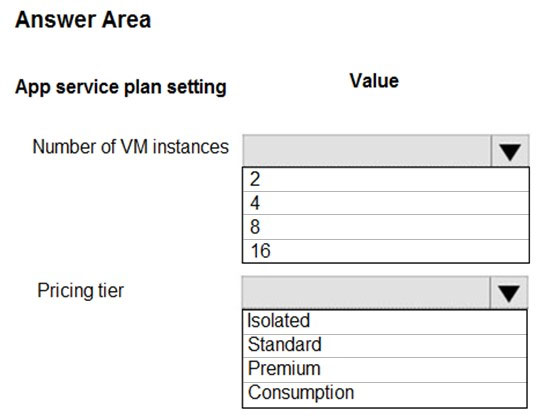

- [ ] Number of VM instances: 2. Pricing tier: Isolated.
- [ ] Number of VM instances: 8. Pricing tier: Standard.
- [ ] Number of VM instances: 16. Pricing tier: Premium.
- [x] Number of VM instances: 4. Pricing tier: Isolated.
- [ ] Number of VM instances: 4. Pricing tier: Consumption.

**[⬆ Back to Top](#table-of-contents)**

### You are a developer for a software as a service (SaaS) company that uses an Azure Function to process orders. The Azure Function currently runs on an Azure Function app that is triggered by an Azure Storage queue. You are preparing to migrate the Azure Function to Kubernetes using Kubernetes-based Event Driven Autoscaling (KEDA). You need to configure Kubernetes Custom Resource Definitions (CRD) for the Azure Function. Which CRDs should you configure?

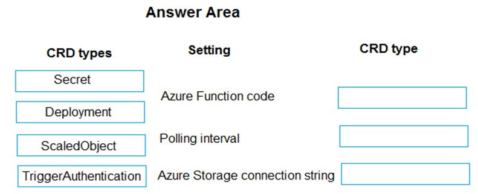

- [x] Box 1, CRD type: Deployment. Box 2, CRD type: ScaledObject. Box 3, CRD type: Secret.
- [ ] Box 1, CRD type: Secret. Box 2, CRD type: ScaledObject. Box 3, CRD type: Secret.
- [ ] Box 1, CRD type: TriggerAuthentication. Box 2, CRD type: Deployment. Box 3, CRD type: Secret.
- [ ] Box 1, CRD type: Deployment. Box 2, CRD type: ScaledObject. Box 3, CRD type: TriggerAuthentication.

**[⬆ Back to Top](#table-of-contents)**

### You are creating a CLI script that creates an Azure web app and related services in Azure App Service. The web app uses the following variables. You need to automatically deploy code from GitHub to the newly created web app. How should you complete the script?

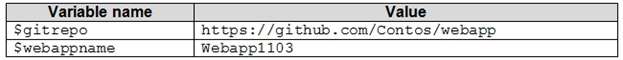

- [ ] Box 1: `az webapp`. Box 2: `az webapp create`. Box 3: `git clone $gitrepo`. Box 4: `az webapp`. Box 5: `--plan $webappname`.
- [x] Box 1: `az appservice plan create`. Box 2: `az webapp create`. Box 3: `--plan $webappname`. Box 4: `az webapp deployment`. Box 5: `--repo-url $gitrepo --branch master --manual-integration.`
- [ ] Box 1: `az appservice plan create`. Box 2: `az webapp deployment`. Box 3: `--plan $webappname`. Box 4: `az webapp deployment`. Box 5: `--repo-url $gitrepo --branch master --manual-integration.`
- [ ] Box 1: `az group delete`. Box 2: `az webapp create`. Box 3: `git clone $gitrepo`. Box 4: `az appservice plan create`. Box 5: `git clone $gitrepo`.

**[⬆ Back to Top](#table-of-contents)**

### You develop a software as a service (SaaS) offering to manage photographs. Users upload photos to a web service which then stores the photos in Azure Storage Blob storage. The storage account type is General-purpose V2. When photos are uploaded, they must be processed to produce and save a mobile-friendly version of the image. The process to produce a mobile-friendly version of the image must start in less than one minute. You need to design the process that starts the photo processing. Solution: Trigger the photo processing from Blob storage events. Does the solution meet the goal?

- [ ] Yes.
- [x] No.

**[⬆ Back to Top](#table-of-contents)**

### You develop and deploy an Azure App Service API app to a Windows-hosted deployment slot named Development. You create additional deployment slots named `Testing` and `Production`. You enable auto swap on the Production deployment slot. You need to ensure that scripts run and resources are available before a swap operation occurs. Solution: Update the web.config file to include the applicationInitialization configuration element. Specify custom initialization actions to run the scripts. Does the solution meet the goal?

- [x] Yes.
- [ ] No.

**[⬆ Back to Top](#table-of-contents)**

### You develop and deploy an Azure App Service API app to a Windows-hosted deployment slot named Development. You create additional deployment slots named `Testing` and `Production`. You enable auto swap on the Production deployment slot. You need to ensure that scripts run and resources are available before a swap operation occurs. Solution: Enable auto swap for the Testing slot. Deploy the app to the Testing slot. Does the solution meet the goal?

- [ ] Yes.
- [x] No.

**[⬆ Back to Top](#table-of-contents)**

### You develop and deploy an Azure App Service API app to a Windows-hosted deployment slot named Development. You create additional deployment slots named `Testing` and `Production`. You enable auto swap on the Production deployment slot. You need to ensure that scripts run and resources are available before a swap operation occurs. Solution: Disable auto swap. Update the app with a method named `statuscheck` to run the scripts. Re-enable auto swap and deploy the app to the Production slot. Does the solution meet the goal?

- [ ] Yes.
- [x] No.

**[⬆ Back to Top](#table-of-contents)**

### You develop a software as a service (SaaS) offering to manage photographs. Users upload photos to a web service which then stores the photos in Azure Storage Blob storage. The storage account type is General-purpose V2. When photos are uploaded, they must be processed to produce and save a mobile-friendly version of the image. The process to produce a mobile-friendly version of the image must start in less than one minute. You need to design the process that starts the photo processing. Solution: Convert the Azure Storage account to a BlockBlobStorage storage account. Does the solution meet the goal?

- [ ] Yes.
- [x] No.

**[⬆ Back to Top](#table-of-contents)**

### You are developing an Azure Web App. You configure TLS mutual authentication for the web app. You need to validate the client certificate in the web app.

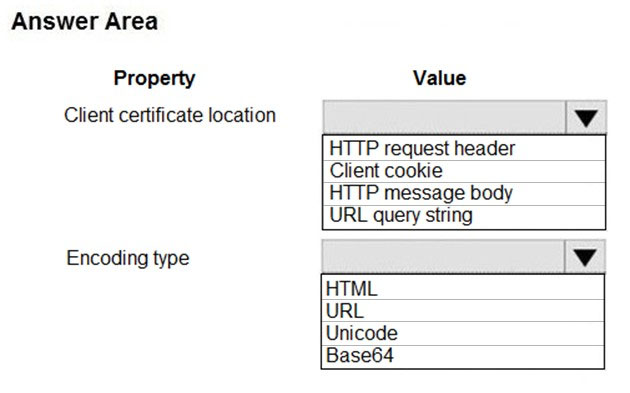

- [ ] Client certificate location: Client cookie. Encoding type: URL.
- [ ] Client certificate location: HTTP message body. Encoding type: Base64.
- [ ] Client certificate location: HTTP request header. Encoding type: Unicode.
- [x] Client certificate location: HTTP request header. Encoding type: Base64.

**[⬆ Back to Top](#table-of-contents)**

### You are developing a Docker/Go using Azure App Service Web App for Containers. You plan to run the container in an App Service on Linux. You identify a Docker container image to use. None of your current resource groups reside in a location that supports Linux. You must minimize the number of resource groups required. You need to create the application and perform an initial deployment. Which three Azure CLI commands should you use to develop the solution?

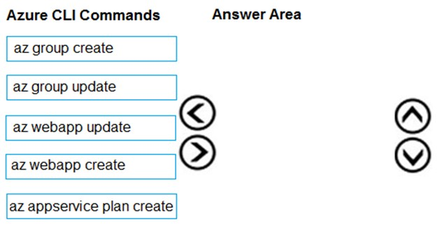

- [ ] Box 1: `az webapp create`. Box 2: `az appservice plan create`. Box 3: `az group create`.
- [ ] Box 1: `az appservice plan create`. Box 2: `az group create`. Box 3: `az group update`.
- [x] Box 1: `az group create`. Box 2: `az appservice plan create`. Box 3: `az webapp create`.
- [ ] Box 1: `az appservice plan create`. Box 2: `az webapp create`. Box 3: `az webapp update`.

**[⬆ Back to Top](#table-of-contents)**

### Fourth Coffee has an ASP.NET Core web app that runs in Docker. The app is mapped to the `www.fourthcoffee.com` domain. Fourth Coffee is migrating this application to Azure. You need to provision an App Service Web App to host this docker image and map the custom domain to the App Service web app. A resource group named `FourthCoffeePublicWebResourceGroup` has been created in the WestUS region that contains an App Service Plan named `AppServiceLinuxDockerPlan`. Which order should the CLI commands be used to develop the solution?

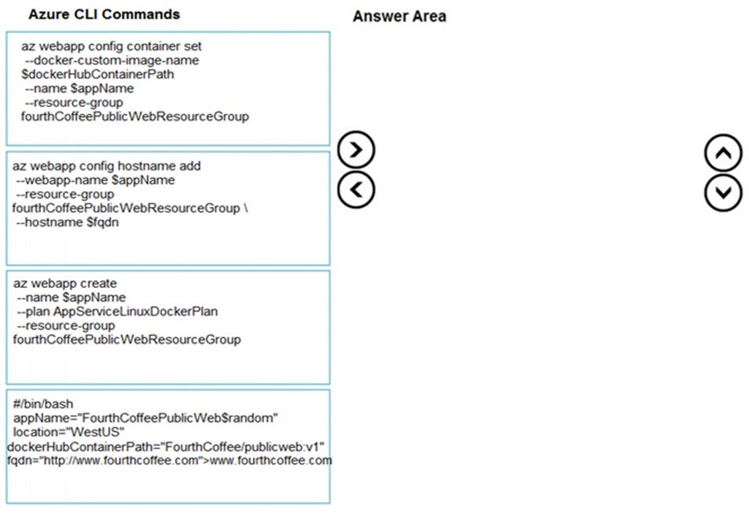

- [x] Box 1: `#/bin/bash appName='FourthCoffeePublicWeb$random' location='WestUS' dockerHubContainerPath='FourthCoffee/publicweb:v1' fqdn='http://www.fourthcoffee.com'>www.fourthcoffee.com`. Box 2: `az webapp create --name $appName --plan AppServiceLinuxDockerPlan --resource-group fourthCoffeePublicWebResourceGroup`. Box 3: `az webapp config container set --docker-custom-image-name $dockerHubContainerPath --name $appName --resource-group fourthCoffeePublicWebResourceGroup`. Box 4: `az webapp config hostname add --webapp-name $appName --resource-group fourthCoffeePublicWebResourceGroup --hostname $fqdn`.
- [ ] Box 1: `#/bin/bash appName='FourthCoffeePublicWeb$random' location='WestUS' dockerHubContainerPath='FourthCoffee/publicweb:v1' fqdn='http://www.fourthcoffee.com'>www.fourthcoffee.com`. Box 2: `az webapp create --name $appName --plan AppServiceLinuxDockerPlan --resource-group fourthCoffeePublicWebResourceGroup`. Box 3: `az webapp config hostname add --webapp-name $appName --resource-group fourthCoffeePublicWebResourceGroup --hostname $fqdn`. Box 4: `az webapp config container set --docker-custom-image-name $dockerHubContainerPath --name $appName --resource-group fourthCoffeePublicWebResourceGroup`.
- [ ] Box 1: `az webapp config container set --docker-custom-image-name $dockerHubContainerPath --name $appName --resource-group fourthCoffeePublicWebResourceGroup`. Box 2: `az webapp create --name $appName --plan AppServiceLinuxDockerPlan --resource-group fourthCoffeePublicWebResourceGroup`. Box 3: `az webapp config hostname add --webapp-name $appName --resource-group fourthCoffeePublicWebResourceGroup --hostname $fqdn`. Box 4: `#/bin/bash appName='FourthCoffeePublicWeb$random' location='WestUS' dockerHubContainerPath='FourthCoffee/publicweb:v1' fqdn='http://www.fourthcoffee.com'>www.fourthcoffee.com`.
- [ ] Box 1: `az webapp config hostname add --webapp-name $appName --resource-group fourthCoffeePublicWebResourceGroup --hostname $fqdn`. Box 2: `az webapp create --name $appName --plan AppServiceLinuxDockerPlan --resource-group fourthCoffeePublicWebResourceGroup`. Box 3: `#/bin/bash appName='FourthCoffeePublicWeb$random' location='WestUS' dockerHubContainerPath='FourthCoffee/publicweb:v1' fqdn='http://www.fourthcoffee.com'>www.fourthcoffee.com`. Box 4: `az webapp config container set --docker-custom-image-name $dockerHubContainerPath --name $appName --resource-group fourthCoffeePublicWebResourceGroup`.

**[⬆ Back to Top](#table-of-contents)**

### You are developing a serverless Java application on Azure. You create a new Azure Key Vault to work with secrets from a new Azure Functions application. The application must meet the following requirements: Reference the Azure Key Vault without requiring any changes to the Java code. Dynamically add and remove instances of the Azure Functions host based on the number of incoming application events. Ensure that instances are perpetually warm to avoid any cold starts. Connect to a VNet. Authentication to the Azure Key Vault instance must be removed if the Azure Function application is deleted. You need to grant the Azure Functions application access to the Azure Key Vault. Which three actions should you perform in sequence?

- [ ] Box 1: Create the Azure Functions app with a Consumption plan type. Box 2: Create an access policy in Azure Key Vault for the application identity. Box 3: Create a user-assigned managed identity for the application.
- [x] Box 1: Create the Azure Functions app with a Premium plan type. Box 2: Create a system-assigned managed identity for the application. Box 3: Create an access policy in Azure Key Vault for the application identity.
- [ ] Box 1: Create the Azure Functions app with a Consumption plan type. Box 2: Create a user-assigned managed identity for the application. Box 3: Create an access policy in Azure Key Vault for the application identity.
- [ ] Box 1: Create the Azure Functions app with a Premium plan type. Box 2: Create a user-assigned managed identity for the application. Box 3: Create an access policy in Azure Key Vault for the application identity.

**[⬆ Back to Top](#table-of-contents)**

### You develop a website. You plan to host the website in Azure. You expect the website to experience high traffic volumes after it is published. You must ensure that the website remains available and responsive while minimizing cost. You need to deploy the website. What should you do?

- [ ] Deploy the website to a virtual machine. Configure the virtual machine to automatically scale when the CPU load is high.
- [ ] Deploy the website to an App Service that uses the Shared service tier. Configure the App Service plan to automatically scale when the CPU load is high.
- [ ] Deploy the website to a virtual machine. Configure a Scale Set to increase the virtual machine instance count when the CPU load is high.
- [x] Deploy the website to an App Service that uses the Standard service tier. Configure the App Service plan to automatically scale when the CPU load is high.

**[⬆ Back to Top](#table-of-contents)**

### A company is developing a Java web app. The web app code is hosted in a GitHub repository located at https://github.com/Contoso/webapp. The web app must be evaluated before it is moved to production. You must deploy the initial code release to a deployment slot named `staging`. You need to create the web app and deploy the code. How should you complete the commands?

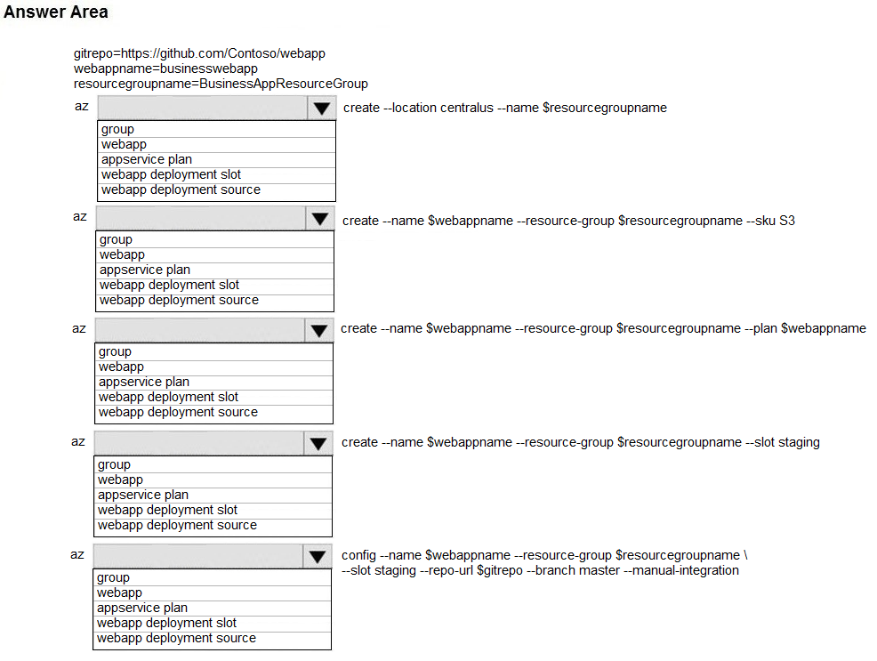

- [x] Box 1: `group`. Box 2: `appservice plan`. Box 3: `webapp`. Box 4: `webapp deployment slot`. Box 5: `webapp deployment source`.
- [ ] Box 1: `appservice plan`. Box 2: `group`. Box 3: `webapp`. Box 4: `webapp deployment slot`. Box 5: `webapp deployment source`.
- [ ] Box 1: `webapp`. Box 2: `group`. Box 3: `webapp deployment source`. Box 4: `webapp deployment slot`. Box 5: `appservice plan`.
- [ ] Box 1: `webapp`. Box 2: `group`. Box 3: `webapp deployment source`. Box 4: `webapp deployment slot`. Box 5: `appservice plan`.

**[⬆ Back to Top](#table-of-contents)**

### You have a web service that is used to pay for food deliveries. The web service uses Azure Cosmos DB as the data store. You plan to add a new feature that allows users to set a tip amount. The new feature requires that a property named tip on the document in Cosmos DB must be present and contain a numeric value. There are many existing websites and mobile apps that use the web service that will not be updated to set the tip property for some time. How should you complete the trigger?

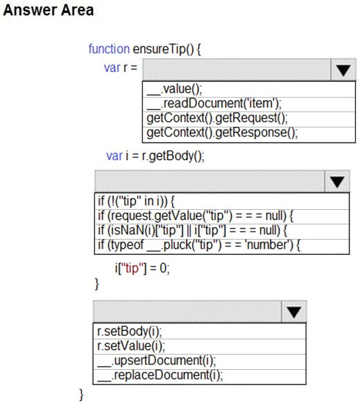

- [ ] Box 1: `__value();`. Box 2: `if (request.getValue('tip') === null) {`. Box 3: `__.upsertDocument(i);`.
- [ ] Box 1: `__readDocument()('item');`. Box 2: `if (!('tip' in i)) {`. Box 3: `__.replaceDocument(i);`.
- [x] Box 1: `getContext().getRequest();`. Box 2: `if (!('tip' in i)) {`. Box 3: `r.setBody(i);`.
- [ ] Box 1: `getContext().getRequest();`. Box 2: `if (isNaN(i)['tip'] || i['tip'] === null) {`. Box 3: `r.setValue(i);`.

**[⬆ Back to Top](#table-of-contents)**

### You develop an HTTP triggered Azure Function app to process Azure Storage blob data. The app is triggered using an output binding on the blob. The app continues to time out after four minutes. The app must process the blob data. You need to ensure the app does not time out and processes the blob data. Solution: Use the Durable Function async pattern to process the blob data. Does the solution meet the goal?

- [x] Yes.
- [ ] No.

**[⬆ Back to Top](#table-of-contents)**

### You develop an HTTP triggered Azure Function app to process Azure Storage blob data. The app is triggered using an output binding on the blob. The app continues to time out after four minutes. The app must process the blob data. You need to ensure the app does not time out and processes the blob data. Solution: Pass the HTTP trigger payload into an Azure Service Bus queue to be processed by a queue trigger function and return an immediate HTTP success response. Does the solution meet the goal?

- [x] Yes.
- [ ] No.

**[⬆ Back to Top](#table-of-contents)**

### You develop an HTTP triggered Azure Function app to process Azure Storage blob data. The app is triggered using an output binding on the blob. The app continues to time out after four minutes. The app must process the blob data. You need to ensure the app does not time out and processes the blob data. Solution: Configure the app to use an App Service hosting plan and enable the Always On setting. Does the solution meet the goal?

- [ ] Yes.
- [x] No.

**[⬆ Back to Top](#table-of-contents)**

### You develop a software as a service (SaaS) offering to manage photographs. Users upload photos to a web service which then stores the photos in Azure Storage Blob storage. The storage account type is General-purpose V2. When photos are uploaded, they must be processed to produce and save a mobile-friendly version of the image. The process to produce a mobile-friendly version of the image must start in less than one minute. You need to design the process that starts the photo processing. Solution: Move photo processing to an Azure Function triggered from the blob upload. Does the solution meet the goal?

- [x] Yes.
- [ ] No.

**[⬆ Back to Top](#table-of-contents)**

### You are developing an application that uses Azure Blob storage. The application must read the transaction logs of all the changes that occur to the blobs and the blob metadata in the storage account for auditing purposes. The changes must be in the order in which they occurred, include only create, update, delete, and copy operations and be retained for compliance reasons. You need to process the transaction logs asynchronously. What should you do?

- [ ] Process all Azure Blob storage events by using Azure Event Grid with a subscriber Azure Function app.
- [x] Enable the change feed on the storage account and process all changes for available events.
- [ ] Process all Azure Storage Analytics logs for successful blob events.
- [ ] Use the Azure Monitor HTTP Data Collector API and scan the request body for successful blob events.

**[⬆ Back to Top](#table-of-contents)**

### You plan to create a Docker image that runs an ASP.NET Core application named `ContosoApp`. You have a setup script named `setupScript.ps1` and a series of application files including `ContosoApp.dll`. You need to create a Dockerfile document that meets the following requirements: Call setupScripts.ps1 when the container is built. Run `ContosoApp.dll` when the container starts. The Dockerfile document must be created in the same folder where `ContosoApp.dll` and `setupScript.ps1` are stored. Which five commands should you use to develop the solution?

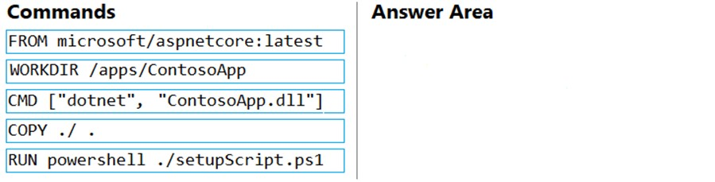

- [ ] Box 1: `CMD ['dotnet', 'ContosoApp.dll']`. Box 2: `FROM microsoft/aspnetcore:latest`. Box 3: `RUN powershell ./setupScript.ps1`. Box 4: `WORKDIR /apps/ContosoApp`. Box 5:` COPY ./ .`.
- [ ] Box 1:` COPY ./ .`.. Box 2: `RUN powershell ./setupScript.ps1`. Box 3: `FROM microsoft/aspnetcore:latest`. Box 4: `CMD ['dotnet', 'ContosoApp.dll']`. Box 5: `WORKDIR /apps/ContosoApp`.
- [ ] Box 1: `RUN powershell ./setupScript.ps1`. Box 2: `CMD ['dotnet', 'ContosoApp.dll']`. Box 3: `FROM microsoft/aspnetcore:latest`. Box 4: `WORKDIR /apps/ContosoApp`. Box 5:` COPY ./ .`.
- [x] Box 1: `FROM microsoft/aspnetcore:latest`. Box 2: `WORKDIR /apps/ContosoApp`. Box 3:` COPY ./ .`. Box 4: `RUN powershell ./setupScript.ps1`. Box 5: `CMD ['dotnet', 'ContosoApp.dll']`.

**[⬆ Back to Top](#table-of-contents)**

### You are developing an Azure Function App that processes images that are uploaded to an Azure Blob container. Images must be processed as quickly as possible after they are uploaded, and the solution must minimize latency. You create code to process images when the Function App is triggered. You need to configure the Function App. What should you do?

- [ ] Use an App Service plan. Configure the Function App to use an Azure Blob Storage input trigger.
- [ ] Use a Consumption plan. Configure the Function App to use an Azure Blob Storage trigger.
- [ ] Use a Consumption plan. Configure the Function App to use a Timer trigger.
- [x] Use an App Service plan. Configure the Function App to use an Azure Blob Storage trigger.
- [ ] Use a Consumption plan. Configure the Function App to use an Azure Blob Storage input trigger.

**[⬆ Back to Top](#table-of-contents)**

### You are configuring a new development environment for a Java application. The environment requires a Virtual Machine Scale Set (VMSS), several storage accounts, and networking components. The VMSS must not be created until the storage accounts have been successfully created and an associated load balancer and virtual network is configured. How should you complete the Azure Resource Manager template?

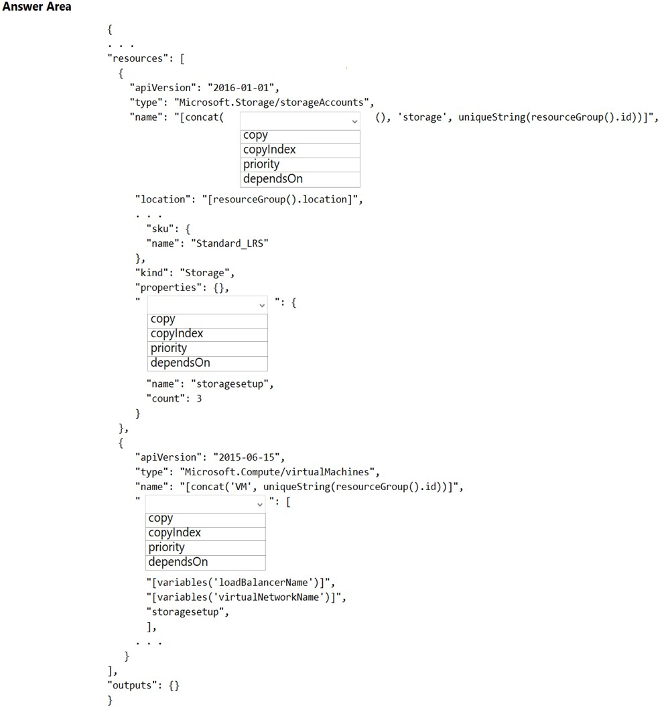

- [x] Box 1: `copyIndex`. Box 2: `copy`. Box 3: `dependsOn`.
- [ ] Box 1: `copy`. Box 2: `copyIndex`. Box 3: `dependsOn`.
- [ ] Box 1: `priority`. Box 2: `dependsOn`. Box 3: `copyIndex`.
- [ ] Box 1: `priority`. Box 2: `copyIndex`. Box 3: `dependsOn`.

**[⬆ Back to Top](#table-of-contents)**

### You are developing an Azure Function App by using Visual Studio. The app will process orders input by an Azure Web App. The web app places the order information into Azure Queue Storage. You need to review the Azure Function App code shown below. Question 1: The code will log the time that the order was processed from the queue.

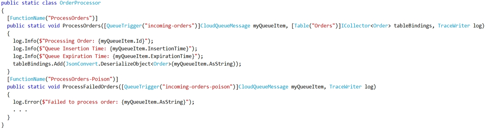

- [ ] Yes.
- [x] No.

**[⬆ Back to Top](#table-of-contents)**

### You are developing an Azure Function App by using Visual Studio. The app will process orders input by an Azure Web App. The web app places the order information into Azure Queue Storage. You need to review the Azure Function App code shown below. Question 2: When the ProcessOrders function fails, the function will retry up to five times for a given order, including the first try.

- [x] Yes.
- [ ] No.

**[⬆ Back to Top](#table-of-contents)**

### You are developing an Azure Function App by using Visual Studio. The app will process orders input by an Azure Web App. The web app places the order information into Azure Queue Storage. You need to review the Azure Function App code shown below. Question 3: When there are multiple orders in the queue, a batch of orders will be received from the queue and the ProcessOrders function will run multiple instances concurrently to process the orders.

- [x] Yes.
- [ ] No.

**[⬆ Back to Top](#table-of-contents)**

### You are developing an Azure Function App by using Visual Studio. The app will process orders input by an Azure Web App. The web app places the order information into Azure Queue Storage. You need to review the Azure Function App code shown below. Question 4: The ProcessOrders function will output the order to an Orders table in Azure Table Storage.

- [x] Yes.
- [ ] No.

**[⬆ Back to Top](#table-of-contents)**

### You are developing a solution for a hospital to support the following use cases: The most recent patient status details must be retrieved even if multiple users in different locations have updated the patient record. Patient health monitoring data retrieved must be the current version or the prior version. After a patient is discharged and all charges have been assessed, the patient billing record contains the final charges. You provision a Cosmos DB NoSQL database and set the default consistency level for the database account to Strong. You set the value for Indexing Mode to Consistent. You need to minimize latency and any impact to the availability of the solution. You must override the default consistency level at the query level to meet the required consistency guarantees for the scenarios. Which consistency levels should you implement?

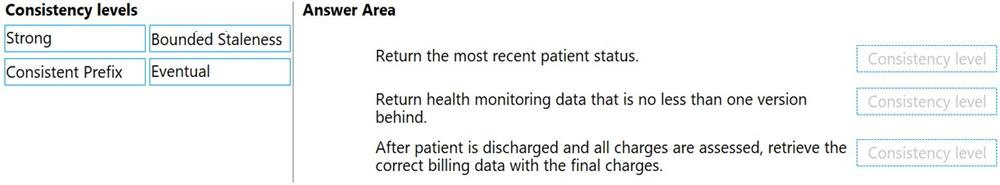

- [ ] Box 1: Strong. Box 2: Consistent Prefix. Box 3: Eventual.
- [ ] Box 1: Eventual. Box 2: Strong. Box 3: Bounded Staleness.
- [ ] Box 1: Consistent Prefix. Box 2: Bounded Staleness. Box 3: Eventual.
- [x] Box 1: Strong. Box 2: Bounded Staleness. Box 3: Eventual.

**[⬆ Back to Top](#table-of-contents)**

### You are configuring a development environment for your team. You deploy the latest Visual Studio image from the Azure Marketplace to your Azure subscription. The development environment requires several software development kits (SDKs) and third-party components to support application development across the organization. You install and customize the deployed virtual machine (VM) for your development team. The customized VM must be saved to allow provisioning of a new team member development environment. You need to save the customized VM for future provisioning. Which tools or services should you use?

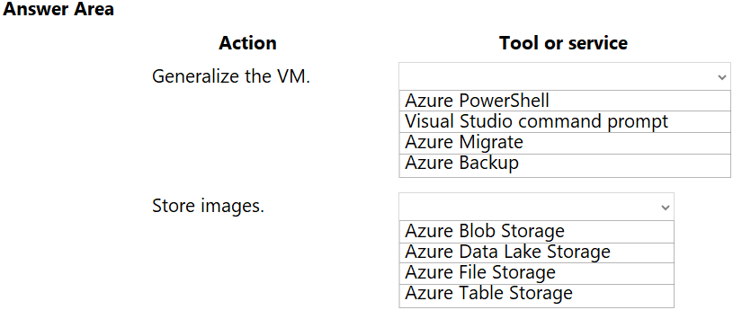

- [ ] Generalize the VM: Visual Studio command prompt. Store images: Azure Data Lake Storage.
- [x] Generalize the VM: Azure PowerShell. Store images: Azure Blob Storage.
- [ ] Generalize the VM: Visual Studio command prompt. Store images: Azure File Storage.
- [ ] Generalize the VM: Azure PowerShell. Store images: Azure File Storage.

**[⬆ Back to Top](#table-of-contents)**

### You are preparing to deploy a website to an Azure Web App from a GitHub repository. The website includes static content generated by a script. You plan to use the Azure Web App continuous deployment feature. You need to run the static generation script before the website starts serving traffic. What are two possible ways to achieve this goal?

- [ ] Add the path to the static content generation tool to `WEBSITE_RUN_FROM_PACKAGE` setting in the `host.json` file.
- [x] Add a PreBuild target in the websites `csproj` project file that runs the static content generation script.
- [ ] Create a file named `run.cmd` in the folder `/run` that calls a script which generates the static content and deploys the website.
- [x] Create a file named `.deployment` in the root of the repository that calls a script which generates the static content and deploys the website.

**[⬆ Back to Top](#table-of-contents)**

### You are developing an application to use Azure Blob storage. You have configured Azure Blob storage to include change feeds. A copy of your storage account must be created in another region. Data must be copied from the current storage account to the new storage account directly between the storage servers. You need to create a copy of the storage account in another region and copy the data. In which order should you perform the actions?

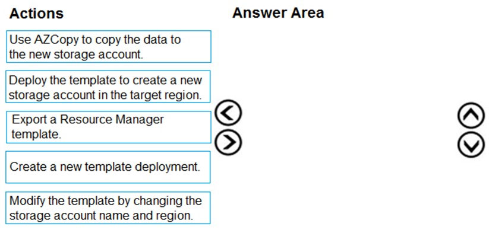

- [ ] Box 1: Create a new template deployment. Box 2: Export a Resource Manager template. Box 3: Modify the template by changing the storage account name and region. Box 4: Deploy the template to create a new storage account in the target region. Box 5: Use `AZCopy` to copy the data to the new storage account.
- [ ] Box 1: Use `AZCopy` to copy the data to the new storage account. Box 2: Create a new template deployment. Box 3: Modify the template by changing the storage account name and region. Box 4: Deploy the template to create a new storage account in the target region. Box 5: Export a Resource Manager template.
- [x] Box 1: Export a Resource Manager template. Box 2: Create a new template deployment. Box 3: Modify the template by changing the storage account name and region. Box 4: Deploy the template to create a new storage account in the target region. Box 5: Use `AZCopy` to copy the data to the new storage account.
- [ ] Box 1: Use `AZCopy` to copy the data to the new storage account. Box 2: Create a new template deployment. Box 3: Modify the template by changing the storage account name and region. Box 4: Deploy the template to create a new storage account in the target region. Box 5: Export a Resource Manager template.

**[⬆ Back to Top](#table-of-contents)**

### You are preparing to deploy an Azure virtual machine (VM)-based application. The VMs that run the application have the following requirements: When a VM is provisioned the firewall must be automatically configured before it can access Azure resources. Supporting services must be installed by using an Azure PowerShell script that is stored in Azure Storage. You need to ensure that the requirements are met. Which features should you use?

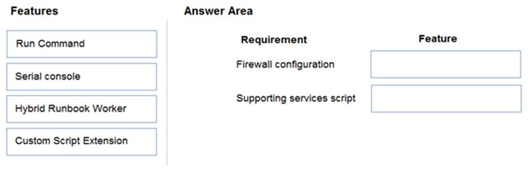

- [ ] Firewall configuration: Run Command. Supporting services script: Hybrid Runbook Worker.
- [ ] Firewall configuration: Custom Script Extension. Supporting services script: Serial console.
- [x] Firewall configuration: Run Command. Supporting services script: Custom Script Extension.
- [ ] Firewall configuration: Hybrid Runbook Worker. Supporting services script: Custom Script Extension.

**[⬆ Back to Top](#table-of-contents)**

### A company is developing a Node.js web app. The web app code is hosted in a GitHub repository located at https://github.com/TailSpinToys/webapp. The web app must be reviewed before it is moved to production. You must deploy the initial code release to a deployment slot named `review`. You need to create the web app and deploy the code. How should you complete the commands?

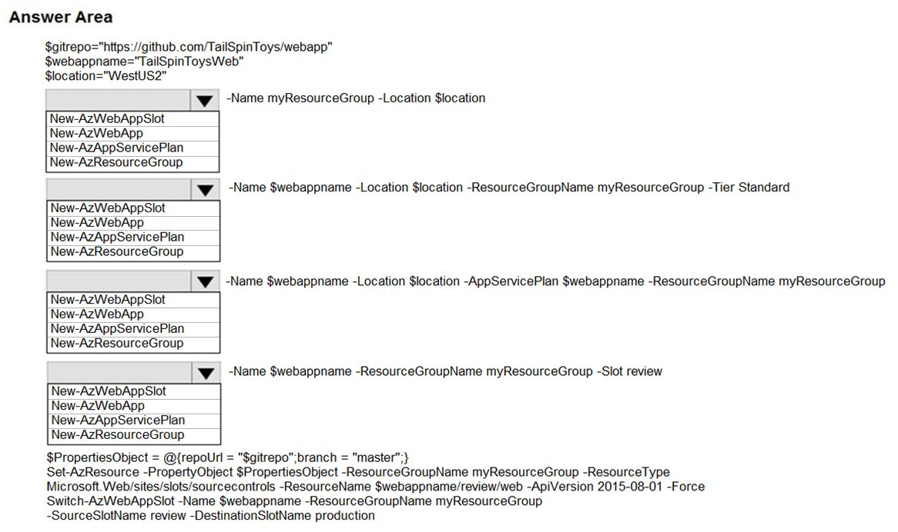

- [ ] Box 1: `New-AzWebAppSlot`. Box 2: `New-AzWebApp`. Box 3: `New-AzAppServicePlan`. Box 4: `New-AzResourceGroup`.
- [x] Box 1: `New-AzResourceGroup`. Box 2: `New-AzAppServicePlan`. Box 3: `New-AzWebApp`. Box 4: `New-AzWebAppSlot`.
- [ ] Box 1: `New-AzWebAppSlot`. Box 2: `New-AzAppServicePlan`. Box 3: `New-AzWebApp`. Box 4: `New-AzResourceGroup`.
- [ ] Box 1: `New-AzResourceGroup`. Box 2: `New-AzAppServicePlan`. Box 3: `New-AzWebAppSlot`. Box 4: `New-AzWebApp`.

**[⬆ Back to Top](#table-of-contents)**

### You are developing an application that needs access to an Azure virtual machine (VM). The access lifecycle for the application must be associated with the VM service instance. You need to enable managed identity for the VM. How should you complete the PowerShell segment?

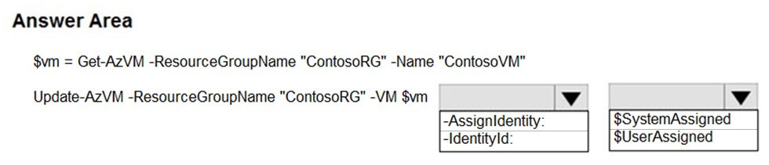

- [ ] Box 1: `-AssignIdentity:`. Box 2: `$SystemAssigned`.
- [ ] Box 1: `-AssignIdentity:`. Box 2: `$UserAssigned`.
- [x] Box 1: `-IdentityId:` (note: screenshot has mistake, it should be `-IdentityType:` in the dropdown). Box 2: `$SystemAssigned`.
- [ ] Box 1: `-IdentityId:` (note: screenshot has mistake, it should be `-IdentityType:` in the dropdown). Box 2: `$UserAssigned`.

**[⬆ Back to Top](#table-of-contents)**

### You develop a software as a service (SaaS) offering to manage photographs. Users upload photos to a web service which then stores the photos in Azure Storage Blob storage. The storage account type is General-purpose V2. When photos are uploaded, they must be processed to produce and save a mobile-friendly version of the image. The process to produce a mobile-friendly version of the image must start in less than one minute. You need to design the process that starts the photo processing. Solution: Create an Azure Function app that uses the Consumption hosting model and that is triggered from the blob upload. Does the solution meet the goal?

- [ ] Yes.
- [x] No.

**[⬆ Back to Top](#table-of-contents)**

### You develop and deploy an Azure App Service API app to a Windows-hosted deployment slot named Development. You create additional deployment slots named `Testing` and `Production`. You enable auto swap on the Production deployment slot. You need to ensure that scripts run and resources are available before a swap operation occurs. Solution: Update the app with a method named `statuscheck` to run the scripts. Update the app settings for the app. Set the `WEBSITE_SWAP_WARMUP_PING_PATH` and `WEBSITE_SWAP_WARMUP_PING_STATUSES` with a path to the new method and appropriate response codes. Does the solution meet the goal?

- [x] Yes.
- [ ] No.

**[⬆ Back to Top](#table-of-contents)**

### You create the following PowerShell script. Question 1: A log alert is created that sends an email when the CPU percentage is above 60 percent for five minutes.

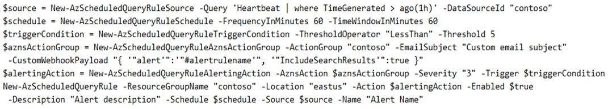

- [ ] Yes.
- [x] No.

**[⬆ Back to Top](#table-of-contents)**

### You create the following PowerShell script. Question 2: A log alert is created that sends an email when the number of machine heartbeats in the past hour is less than five.

- [x] Yes.
- [ ] No.

**[⬆ Back to Top](#table-of-contents)**

### You create the following PowerShell script. Question 3: The log alert is scheduled to run every two hours.

- [ ] Yes.
- [x] No.

**[⬆ Back to Top](#table-of-contents)**

### You are developing an Azure Function app. The app must meet the following requirements: Enable developers to write the functions by using the Rust language. Declaratively connect to an Azure Blob Storage account. You need to implement the app. Which Azure Function app features should you use?

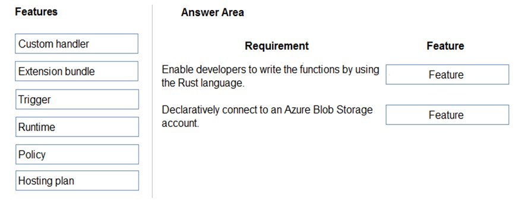

- [ ] Enable developers to write the functions by using the Rust language: Hosting plan. Declaratively connect to an Azure Blog Storage account: Custom handler.
- [ ] Enable developers to write the functions by using the Rust language: Runtime. Declaratively connect to an Azure Blog Storage account: Policy.
- [ ] Enable developers to write the functions by using the Rust language: Custom handler. Declaratively connect to an Azure Blog Storage account: Trigger.
- [x] Enable developers to write the functions by using the Rust language: Custom handler. Declaratively connect to an Azure Blog Storage account: Extension bundle.

**[⬆ Back to Top](#table-of-contents)**

### You are developing an ASP.NET Core web application. You plan to deploy the application to Azure Web App for Containers. The application needs to store runtime diagnostic data that must be persisted across application restarts. You have the following code. You need to configure the application settings so that diagnostic data is stored as required. How should you configure the web app's settings?

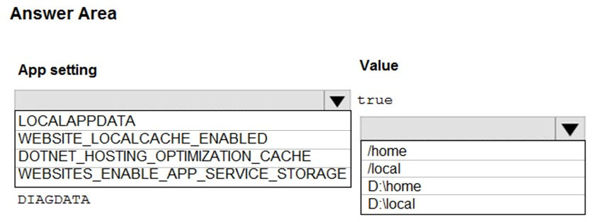

- [x] App setting: `WEBSITES_ENABLE_APP_SERVICE_STORAGE`. Value: `/home`.
- [ ] App setting: `WEBSITES_ENABLE_APP_SERVICE_STORAGE`. Value: `/local`.
- [ ] App setting: `LOCALAPPDATA`. Value: `D:\home`.
- [ ] App setting: `DOTNET_HOSTING_OPTIMIZATION_CACHE`. Value: `D:\home`.

**[⬆ Back to Top](#table-of-contents)**

### You are developing a web app that is protected by Azure Web Application Firewall (WAF). All traffic to the web app is routed through an Azure Application Gateway instance that is used by multiple web apps. The web app address is `contoso.azurewebsites.net`. All traffic must be secured with SSL. The Azure Application Gateway instance is used by multiple web apps. You need to configure the Azure Application Gateway for the web app. Which two actions should you perform?

- [x] In the Azure Application Gateway's HTTP setting, enable the Use for App service setting.
- [ ] Convert the web app to run in an Azure App service environment (ASE).
- [ ] Add an authentication certificate for `contoso.azurewebsites.net` to the Azure Application Gateway.
- [x] In the Azure Application Gateway's HTTP setting, set the value of the Override backend path option to `contoso22.azurewebsites.net`.

**[⬆ Back to Top](#table-of-contents)**

### You develop a software as a service (SaaS) offering to manage photographs. Users upload photos to a web service which then stores the photos in Azure Storage Blob storage. The storage account type is General-purpose V2. When photos are uploaded, they must be processed to produce and save a mobile-friendly version of the image. The process to produce a mobile-friendly version of the image must start in less than one minute. You need to design the process that starts the photo processing. Solution: Use the Azure Blob Storage change feed to trigger photo processing. Does the solution meet the goal?

- [ ] Yes.
- [x] No.

**[⬆ Back to Top](#table-of-contents)**

### A company develops a series of mobile games. All games use a single leaderboard service. You have the following requirements: Code must be scalable and allow for growth. Each record must consist of a playerId, gameId, score, and time played. When users reach a new high score, the system will save the new score using the SaveScore function below. Each game is assigned an Id based on the series title. You plan to store customer information in Azure Cosmos DB. The following data already exists in the database: You develop the following code to save scores in the data store. (Line numbers are included for reference only.) You develop the following code to query the database. (Line numbers are included for reference only.). Question 1: SaveScore will work with Cosmos DB.

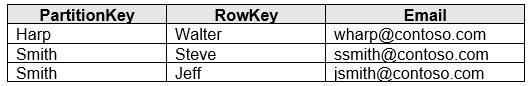
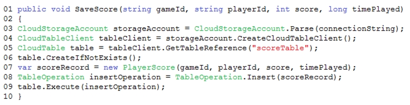
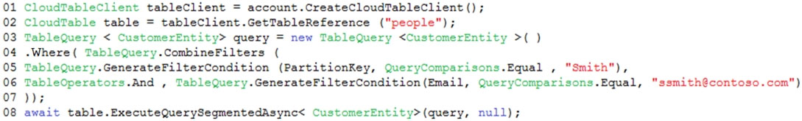

- [x] Yes.
- [ ] No.

**[⬆ Back to Top](#table-of-contents)**

### A company develops a series of mobile games. All games use a single leaderboard service. You have the following requirements: Code must be scalable and allow for growth. Each record must consist of a playerId, gameId, score, and time played. When users reach a new high score, the system will save the new score using the SaveScore function below. Each game is assigned an Id based on the series title. You plan to store customer information in Azure Cosmos DB. The following data already exists in the database: You develop the following code to save scores in the data store. (Line numbers are included for reference only.) You develop the following code to query the database. (Line numbers are included for reference only.). Question 2: SaveScore will update and replace a record if one already exists with the same playerId and gameId.

- [ ] Yes.
- [x] No.

**[⬆ Back to Top](#table-of-contents)**

### A company develops a series of mobile games. All games use a single leaderboard service. You have the following requirements: Code must be scalable and allow for growth. Each record must consist of a playerId, gameId, score, and time played. When users reach a new high score, the system will save the new score using the SaveScore function below. Each game is assigned an Id based on the series title. You plan to store customer information in Azure Cosmos DB. The following data already exists in the database: You develop the following code to save scores in the data store. (Line numbers are included for reference only.) You develop the following code to query the database. (Line numbers are included for reference only.). Question 3: Leader board data for the game will be automatically partitioned using gameId.

- [ ] Yes.
- [x] No.

**[⬆ Back to Top](#table-of-contents)**

### A company develops a series of mobile games. All games use a single leaderboard service. You have the following requirements: Code must be scalable and allow for growth. Each record must consist of a playerId, gameId, score, and time played. When users reach a new high score, the system will save the new score using the SaveScore function below. Each game is assigned an Id based on the series title. You plan to store customer information in Azure Cosmos DB. The following data already exists in the database: You develop the following code to save scores in the data store. (Line numbers are included for reference only.) You develop the following code to query the database. (Line numbers are included for reference only.). Question 4: SaveScore will store the values for the gameId and playerId parameters in the database.

- [x] Yes.
- [ ] No.

**[⬆ Back to Top](#table-of-contents)**

### You are developing a solution that uses the Azure Storage Client library for .NET. You have the following code: (Line numbers are included for reference only.). Question 1: The code creates an infinite lease.

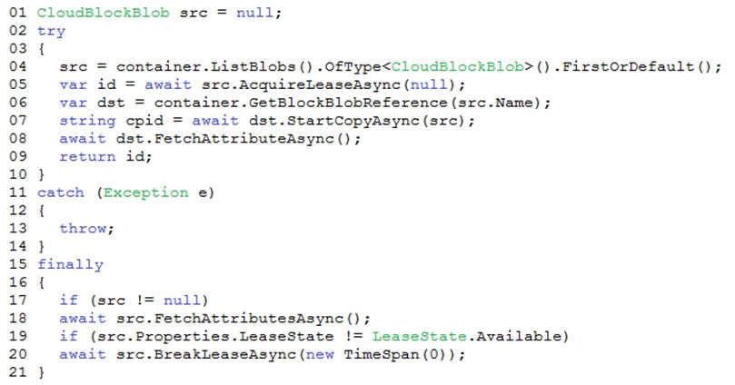

- [x] Yes.
- [ ] No.

**[⬆ Back to Top](#table-of-contents)**

### You are developing a solution that uses the Azure Storage Client library for .NET. You have the following code: (Line numbers are included for reference only.). Question 2: The code at line 06 always creates a new blob.

- [ ] Yes.
- [x] No.

**[⬆ Back to Top](#table-of-contents)**

### You are developing a solution that uses the Azure Storage Client library for .NET. You have the following code: (Line numbers are included for reference only.). Question 3: The finally block releases the lease.

- [x] Yes.
- [ ] No.

**[⬆ Back to Top](#table-of-contents)**

### You are building a website that uses Azure Blob storage for data storage. You configure Azure Blob storage lifecycle to move all blobs to the archive tier after 30 days. Customers have requested a service-level agreement (SLA) for viewing data older than 30 days. You need to document the minimum SLA for data recovery. Which SLA should you use?

- [ ] At least two days.
- [x] Between one and 15 hours.
- [ ] At least one day.
- [ ] Between zero and 60 minutes.

**[⬆ Back to Top](#table-of-contents)**

### You are developing a ticket reservation system for an airline. The storage solution for the application must meet the following requirements: Ensure at least 99.99% availability and provide low latency. Accept reservations even when localized network outages or other unforeseen failures occur. Process reservations in the exact sequence as reservations are submitted to minimize overbooking or selling the same seat to multiple travelers. Allow simultaneous and out-of-order reservations with a maximum five-second tolerance window. You provision a resource group named `airlineResourceGroup` in the Azure South-Central US region. You need to provision a SQL API Cosmos DB account to support the app. How should you complete the Azure CLI commands?

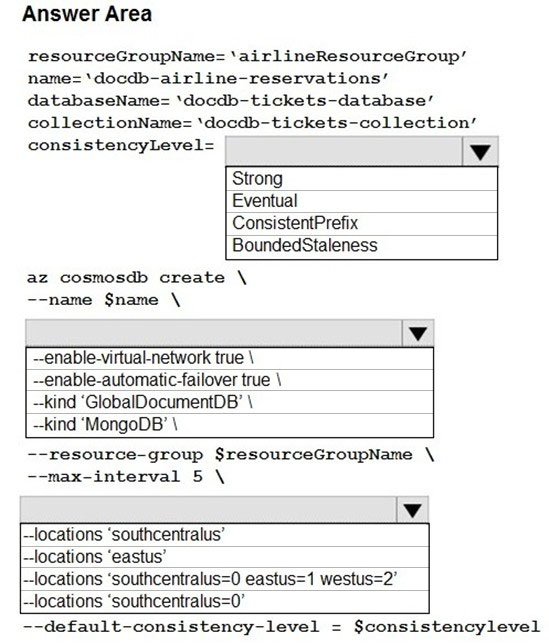

- [x] Box 1: `BoundedStaleness`. Box 2: `--enable-automatic-failover true \`. Box 3: `--locations 'southcentralplus=0 eastus=1 westus=2'`.
- [ ] Box 1: `Strong`. Box 2: `--enable-automatic-failover true \`. Box 3: `--locations 'southcentralplus=0 eastus=1 westus=2'`.
- [ ] Box 1: `BoundedStaleness`. Box 2: `--enable-automatic-failover true \`. Box 3: `--locations 'southcentralus'`.
- [ ] Box 1: `Strong`. Box 2: `--kind 'MongoDB' \`. Box 3: `--locations 'southcentralus'`.

**[⬆ Back to Top](#table-of-contents)**

### You are preparing to deploy a Python website to an Azure Web App using a container. The solution will use multiple containers in the same container group. The Dockerfile that builds the container is as follows. You build a container by using the following command. The Azure Container Registry instance named `images` is a private registry. The user name and password for the registry is admin. The Web App must always run the same version of the website regardless of future builds. You need to create an Azure Web App to run the website. How should you complete the commands?

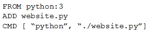

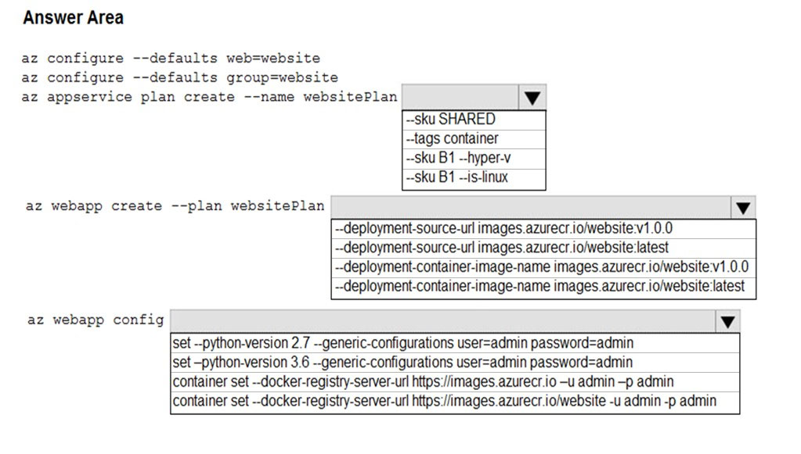

- [ ] Box 1: `--sku B1 --hyper-v`. Box 2: `--deployment-source-url images.azurecr.io/website:1.0.0`. Box 3: `container set --docker-registry-server-url https://images.azurecr.io -u admin -p admin`.
- [x] Box 1: `--sku B1 --is-linux`. Box 2: `--deployment-container-image-name images.azurecr.io/website:v1.0.0`. Box 3: `container set --docker-registry-server-url https://images.azurecr.io -u admin -p admin`.
- [ ] Box 1: `--tags container`. Box 2: `--deployment-source-url images.azurecr.io/website:latest`. Box 3: `set --python-version 2.7 --generic-configurations user=admin password=admin`.
- [ ] Box 1: `--sku SHARED`. Box 2: `--deployment-container-image-name images.azurecr.io/website:latest`. Box 3: `set --python-version 3.6 --generic-configurations user=admin password=admin`.

**[⬆ Back to Top](#table-of-contents)**

### You are developing a back-end Azure App Service that scales based on the number of messages contained in a Service Bus queue. A rule already exists to scale up the App Service when the average queue length of unprocessed and valid queue messages is greater than 1000. You need to add a new rule that will continuously scale down the App Service as long as the scale up condition is not met. How should you configure the Scale rule?

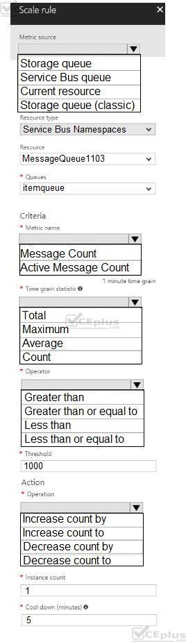

- [x] Metric source: Service Bus queue. Metric name: Active Message Count. Time train statistic: Average. Operator: Less than or equal to. Operation: Decrease count by.
- [ ] Metric source: Service Bus queue. Metric name: Active Message Count. Time train statistic: Count. Operator: Less than or equal to. Operation: Decrease count by.
- [ ] Metric source: Storage queue. Metric name: Active Message Count. Time train statistic: Count. Operator: Less than. Operation: Decrease count to.
- [ ] Metric source: Service Bus queue. Metric name: Message Count. Time train statistic: Average. Operator: Greater than. Operation: Decrease count to.

**[⬆ Back to Top](#table-of-contents)**

### You have an application that uses Azure Blob storage. You need to update the metadata of the blobs. Which three methods should you use to develop the solution?

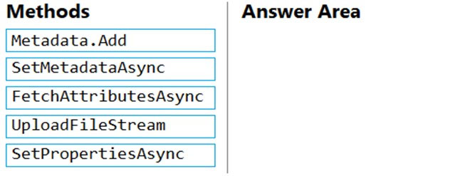

- [ ] Box 1: `Metadata.Add`. Box 2: `SetMetadataAsync`. Box 3: `SetPropertiesAsync`.
- [ ] Box 1: `Metadata.Add`. Box 2: `SetMetadataAsync`. Box 3: `UploadFileStream`.
- [ ] Box 1: `Metadata.Add`. Box 2: `FetchAttributesAsync`. Box 3: `SetPropertiesAsync`.
- [x] Box 1: `FetchAttributesAsync`. Box 2: `Metadata.Add`. Box 3: `SetMetadataAsync`.

**[⬆ Back to Top](#table-of-contents)**

### You are developing an Azure solution to collect point-of-sale (POS) device data from 2,000 stores located throughout the world. A single device can produce 2 megabytes (MB) of data every 24 hours. Each store location has one to five devices that send data. You must store the device data in Azure Blob storage. Device data must be correlated based on a device identifier. Additional stores are expected to open in the future. You need to implement a solution to receive the device data. Solution: Provision an Azure Event Grid. Configure the machine identifier as the partition key and enable capture. Does the solution meet the goal?

- [ ] Yes.
- [x] No.

**[⬆ Back to Top](#table-of-contents)**

### You develop Azure solutions. A .NET application needs to receive a message each time an Azure virtual machine finishes processing data. The messages must NOT persist after being processed by the receiving application. You need to implement the .NET object that will receive the messages. Which object should you use?

- [x] `QueueClient`.
- [ ] `SubscriptionClient`.
- [ ] `TopicClient`.
- [ ] `CloudQueueClient`.

**[⬆ Back to Top](#table-of-contents)**

### You are maintaining an existing application that uses an Azure Blob GPv1 Premium storage account. Data older than three months is rarely used. Data newer than three months must be available immediately. Data older than a year must be saved but does not need to be available immediately. You need to configure the account to support a lifecycle management rule that moves blob data to archive storage for data not modified in the last year. Which three actions should you perform in sequence?

- [ ] Box 1: Upgrade the storage account to GPv2. Box 2: Copy the data to be archived to a Standard GPv2 storage account and then delete the data from the original storage account. Box 3: Change the storage account access tier from hot to cool.
- [x] Box 1: Upgrade the storage account to GPv2. Box 2: Create a new GPv2 Standard account and set its default access tier level to cool. Box 3: Copy the data to be archived to a Standard GPv2 storage account and then delete the data from the original storage account.
- [ ] Box 1: Upgrade the storage account to GPv2. Box 2: Copy the data to be archived to a Standard GPv2 storage account and then delete the data from the original storage account. Box 3: Create a new GPv2 Standard account and set its default access tier level to cool.
- [ ] Box 1: Create a new GPv2 Standard account and set its default access tier level to cool. Box 2: Copy the data to be archived to a Standard GPv2 storage account and then delete the data from the original storage account. Box 3: Upgrade the storage account to GPv2.

**[⬆ Back to Top](#table-of-contents)**

### You develop Azure solutions. You must connect to a No-SQL globally-distributed database by using the .NET API. You need to create an object to configure and execute requests in the database. Which code segment should you use?

- [ ] `new Container(EndpointUri, PrimaryKey);`.
- [ ] `new Database(EndpointUri, PrimaryKey);`.
- [x] `new CosmosClient(EndpointUri, PrimaryKey);`.

**[⬆ Back to Top](#table-of-contents)**

### You have an existing Azure storage account that stores large volumes of data across multiple containers. You need to copy all data from the existing storage account to a new storage account. The copy process must meet the following requirements: Automate data movement. Minimize user input required to perform the operation. Ensure that the data movement process is recoverable. What should you use?

- [x] `AzCopy`.
- [ ] Azure Storage Explorer.
- [ ] Azure portal.
- [ ] .NET Storage Client Library.

**[⬆ Back to Top](#table-of-contents)**

### You are developing a web service that will run on Azure virtual machines that use Azure Storage. You configure all virtual machines to use managed identities. You have the following requirements: Secret-based authentication mechanisms are not permitted for accessing an Azure Storage account. Must use only Azure Instance Metadata Service endpoints. You need to write code to retrieve an access token to access Azure Storage.

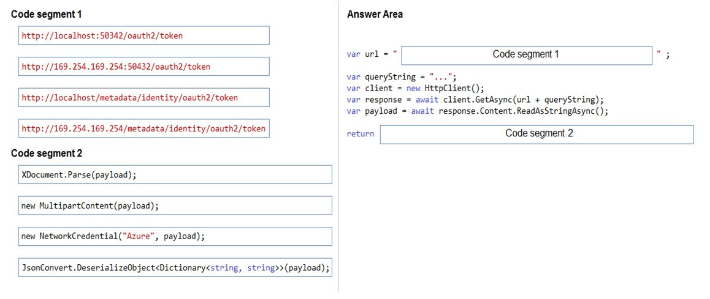

- [ ] Code segment 1: `<http://localhost::50342/oauth2/token>`. Code segment 2: `new MultipartContent(payload);`.
- [ ] Code segment 1: `<http://localhost/metadata/identity/oauth2/token>`. Code segment 2: `JsonConvert.DeserializeObject<Dictionary<string, string>>(payload);`.
- [ ] Code segment 1: `<http://169.254.169.254:50432/metadata/identity/oauth2/token>`. Code segment 2: `new NetworkCredential('Azure', payload);`.
- [x] Code segment 1: `<http://169.254.169.254:50432/metadata/identity/oauth2/token>`. Code segment 2: `JsonConvert.DeserializeObject<Dictionary<string, string>>(payload);`.

**[⬆ Back to Top](#table-of-contents)**

### You are developing a new page for a website that uses Azure Cosmos DB for data storage. The feature uses documents that have the following format. You must display data for the new page in a specific order. You create the following query for the page. You need to configure a Cosmos DB policy to support the query. How should you configure the policy?

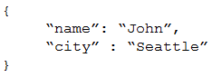
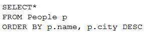
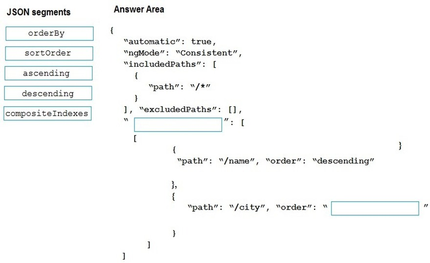

- [ ] Box 1: `orderBy`. Box 2: `compositeIndexes`.
- [x] Box 1: `compositeIndexes`. Box 2: `descending`.
- [ ] Box 1: `compositeIndexes`. Box 2: `ascending`.
- [ ] Box 1: `ascending`. Box 2: `descending`.

**[⬆ Back to Top](#table-of-contents)**

### You are building a traffic monitoring system that monitors traffic along six highways. The system produces time series analysis-based reports for each highway. Data from traffic sensors are stored in Azure Event Hub. Traffic data is consumed by four departments. Each department has an Azure Web App that displays the time series-based reports and contains a WebJob that processes the incoming data from Event Hub. All Web Apps run on App Service Plans with three instances. Data throughput must be maximized. Latency must be minimized. You need to implement the Azure Event Hub. Which settings should you use?

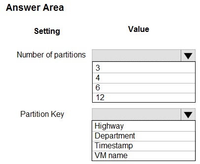

- [x] Number of partitions: 6. Partition Key: Highway.
- [ ] Number of partitions: 12. Partition Key: VM name.
- [ ] Number of partitions: 12. Partition Key: Highway.
- [ ] Number of partitions: 6 Partition Key: Department.

**[⬆ Back to Top](#table-of-contents)**

### You are developing a microservices solution. You plan to deploy the solution to a multinode Azure Kubernetes Service (AKS) cluster. You need to deploy a solution that includes the following features: reverse proxy capabilities configurable traffic routing TLS termination with a custom certificate. Which components should you use?

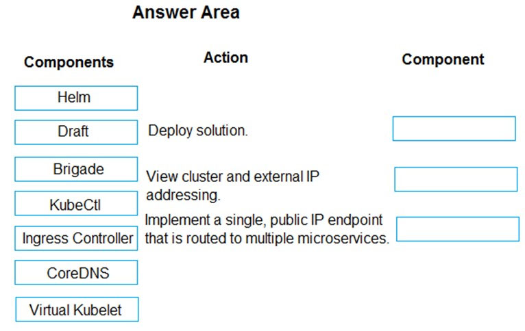

- [ ] Deploy solution: `Draft`. View cluster and external addressing: `CoreDNS`. Implement a single, public IP endpoint that is routed to multiple microservices: `Vrtual Kubelet`.
- [ ] Deploy solution: `Helm`. View cluster and external addressing: `Brigade`. Implement a single, public IP endpoint that is routed to multiple microservices: `KubeCtl`.
- [x] Deploy solution: `Helm`. View cluster and external addressing: `KubeCtl`. Implement a single, public IP endpoint that is routed to multiple microservices: `Ingress Controller`.
- [ ] Deploy solution: `Ingress Controller`. View cluster and external addressing: `Helm`. Implement a single, public IP endpoint that is routed to multiple microservices: `Brigade`.

**[⬆ Back to Top](#table-of-contents)**

### You are implementing an order processing system. A point of sale application publishes orders to topics in an Azure Service Bus queue. The Label property for the topic includes the following data. The system has the following requirements for subscriptions. You need to implement filtering and maximize throughput while evaluating filters. Which filter types should you implement?

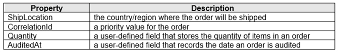
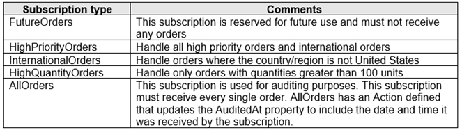
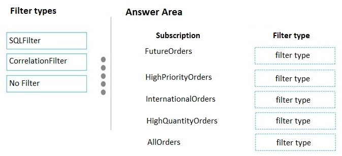

- [x] Box 1: `SQLFilter`. Box 2: `CorrelationFilter`. Box 3: `SQLFilter`. Box 4: `SQLFilter`. Box 5: No Filter.
- [ ] Box 1: `CorrelationFilter`. Box 2: `SQLFilter`. Box 3: No Filter. Box 4: `CorrelationFilter`. Box 5: `SQLFilter`.
- [ ] Box 1: No Filter. Box 2: `CorrelationFilter`. Box 3: `SQLFilter`. Box 4: `SQLFilter`. Box 5: No Filter.
- [ ] Box 1: No Filter. Box 2: `SQLFilter`. Box 3: `SQLFilter`. Box 4: `CorrelationFilter`. Box 5: `CorrelationFilter`.

**[⬆ Back to Top](#table-of-contents)**

### Your company has several websites that use a company logo image. You use Azure Content Delivery Network (CDN) to store the static image. You need to determine the correct process of how the CDN and the Point of Presence (POP) server will distribute the image and list the items in the correct order. In which order do the actions occur?

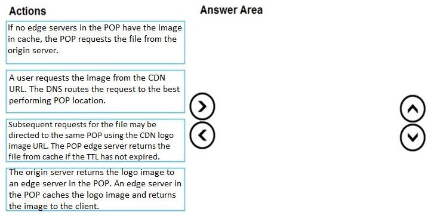

- [ ] Box 1: If no edge servers in the POP have the image in cache, the POP requests the file from the origin server. Box 2: Subsequent requests for the file may be directed to the same POP using the CDN logo image URL. The POP edge server returns the file from cache if the TTL has not expired. Box 3: The origin server returns the logo image to an edge server in the POP. An edge server in the POP caches the logo image and returns the image to the client. Box 4: A user requests the image from the CDN URL. The DNS routes the request to the best performing POP location.
- [x] Box 1: A user requests the image from the CDN URL. The DNS routes the request to the best performing POP location. Box 2: If no edge servers in the POP have the image in cache, the POP requests the file from the origin server. Box 3: The origin server returns the logo image to an edge server in the POP. An edge server in the POP caches the logo image and returns the image to the client. Box 4: Subsequent requests for the file may be directed to the same POP using the CDN logo image URL. The POP edge server returns the file from cache if the TTL has not expired.
- [ ] Box 1: Subsequent requests for the file may be directed to the same POP using the CDN logo image URL. The POP edge server returns the file from cache if the TTL has not expired. Box 2: A user requests the image from the CDN URL. The DNS routes the request to the best performing POP location. Box 3: If no edge servers in the POP have the image in cache, the POP requests the file from the origin server. Box 4: The origin server returns the logo image to an edge server in the POP. An edge server in the POP caches the logo image and returns the image to the client.
- [ ] Box 1: The origin server returns the logo image to an edge server in the POP. An edge server in the POP caches the logo image and returns the image to the client. Box 2: A user requests the image from the CDN URL. The DNS routes the request to the best performing POP location. Box 3: Subsequent requests for the file may be directed to the same POP using the CDN logo image URL. The POP edge server returns the file from cache if the TTL has not expired. Box 4: If no edge servers in the POP have the image in cache, the POP requests the file from the origin server.

**[⬆ Back to Top](#table-of-contents)**

### You are developing an Azure Cosmos DB solution by using the Azure Cosmos DB SQL API. The data includes millions of documents. Each document may contain hundreds of properties. The properties of the documents do not contain distinct values for partitioning. Azure Cosmos DB must scale individual containers in the database to meet the performance needs of the application by spreading the workload evenly across all partitions over time. You need to select a partition key. Which two partition keys can you use?

- [ ] A single property value that does not appear frequently in the documents.
- [ ] A value containing the collection name.
- [ ] A single property value that appears frequently in the documents.
- [x] A concatenation of multiple property values with a random suffix appended.
- [x] A hash suffix appended to a property value.

**[⬆ Back to Top](#table-of-contents)**

### You are developing an Azure-hosted e-commerce web application. The application will use Azure Cosmos DB to store sales orders. You are using the latest SDK to manage the sales orders in the database. You create a new Azure Cosmos DB instance. You include a valid endpoint and valid authorization key to an appSettings.json file in the code project. You are evaluating the following application code: (Line number are included for reference only.). Question 1: A database named `SalesOrders` is created. The database will include two containers.

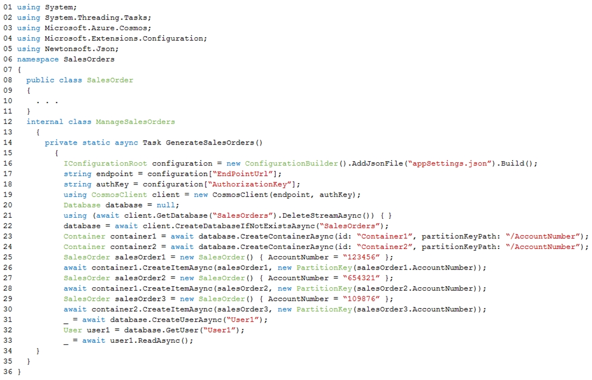

- [x] Yes.
- [ ] No.

**[⬆ Back to Top](#table-of-contents)**

### You are developing an Azure-hosted e-commerce web application. The application will use Azure Cosmos DB to store sales orders. You are using the latest SDK to manage the sales orders in the database. You create a new Azure Cosmos DB instance. You include a valid endpoint and valid authorization key to an appSettings.json file in the code project. You are evaluating the following application code: (Line number are included for reference only.). Question 2: Container1 will contain two items.

- [x] Yes.
- [ ] No.

**[⬆ Back to Top](#table-of-contents)**

### You are developing an Azure-hosted e-commerce web application. The application will use Azure Cosmos DB to store sales orders. You are using the latest SDK to manage the sales orders in the database. You create a new Azure Cosmos DB instance. You include a valid endpoint and valid authorization key to an appSettings.json file in the code project. You are evaluating the following application code: (Line number are included for reference only.). Question 3: Container2 will contain one item.

- [x] Yes.
- [ ] No.

**[⬆ Back to Top](#table-of-contents)**

### You develop an Azure solution that uses Cosmos DB. The current Cosmos DB container must be replicated and must use a partition key that is optimized for queries. You need to implement a change feed processor solution. Which change feed processor components should you use?

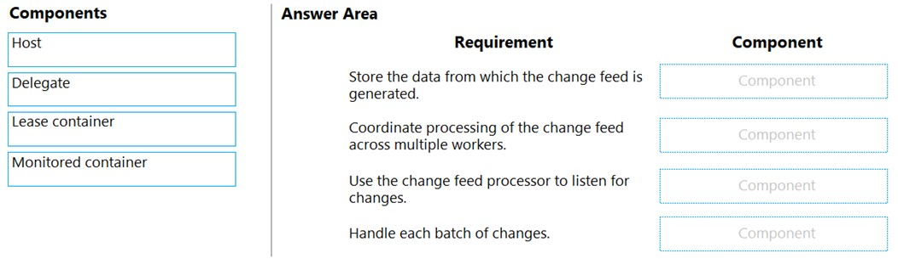

- [ ] Store the data from which the change feed is generated: Host. Coordinate processing of the change feed across multiple workers: Delegate. Use the change feed processor to listen for changes: Lease container. Handle each batch of changes: Monitored container.
- [ ] Store the data from which the change feed is generated: Lease container. Coordinate processing of the change feed across multiple workers: Host. Use the change feed processor to listen for changes: Delegate. Handle each batch of changes: Monitored container.
- [ ] Store the data from which the change feed is generated: Delegate. Coordinate processing of the change feed across multiple workers: Monitored container. Use the change feed processor to listen for changes: Lease container. Handle each batch of changes: Host.
- [x] Store the data from which the change feed is generated: Monitored container. Coordinate processing of the change feed across multiple workers: Lease container. Use the change feed processor to listen for changes: Host. Handle each batch of changes: Delegate.

**[⬆ Back to Top](#table-of-contents)**

### You develop a web application. You need to register the application with an active Azure Active Directory (Azure AD) tenant. Which three actions should you perform in sequence?

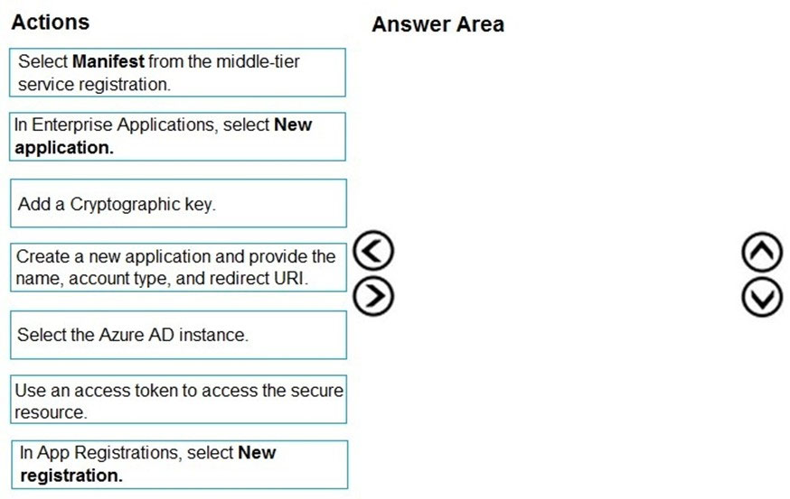

- [ ] Box 1: Select Manifest from the middle-tier service registration. Box 2: Add a Cryptographic key. Box 3: In App Registrations, select New registration.
- [ ] Box 1: In App Registrations, select New registration. Box 2: Select the Azure AD instance. Box 3: Select Manifest from the middle-tier service registration.
- [x] Box 1: In App Registrations, select New registration. Box 2: Select the Azure AD instance. Box 3: Create a new application and provide the name, account type, and redirect URI.
- [ ] Box 1: In Enterprise Applications, select New application. Box 2: In App Registrations, select New registration. Box 3: Select the Azure AD instance.

**[⬆ Back to Top](#table-of-contents)**

### You have a new Azure subscription. You are developing an internal website for employees to view sensitive data. The website uses Azure Active Directory (Azure AD) for authentication. You need to implement multifactor authentication for the website. Which two actions should you perform?

- [ ] Configure the website to use Azure AD B2C.
- [x] MFA Enabled by conditional access policy.
- [x] In Azure AD, create a new conditional access policy.
- [ ] Upgrade to Azure AD Premium.
- [ ] In Azure AD, enable application proxy.
- [ ] In Azure AD conditional access, enable the baseline policy.

**[⬆ Back to Top](#table-of-contents)**

### You are developing a Java application that uses Cassandra to store key and value data. You plan to use a new Azure Cosmos DB resource and the Cassandra API in the application. You create an Azure Active Directory (Azure AD) group named Cosmos DB Creators to enable provisioning of Azure Cosmos accounts, databases, and containers. The Azure AD group must not be able to access the keys that are required to access the data. You need to restrict access to the Azure AD group. Which role-based access control should you use?

- [ ] DocumentDB Accounts Contributor.
- [ ] Cosmos Backup Operator.
- [x] Cosmos DB Operator.
- [ ] Cosmos DB Account Reader.

**[⬆ Back to Top](#table-of-contents)**

### You are developing a website that will run as an Azure Web App. Users will authenticate by using their Azure Active Directory (Azure AD) credentials. You plan to assign users one of the following permission levels for the website: `admin`, `normal`, and `reader`. A user's Azure AD group membership must be used to determine the permission level. You need to configure authorization. Solution: Configure the Azure Web App for the website to allow only authenticated requests and require Azure AD log on. Does the solution meet the goal?

- [ ] Yes.
- [x] No.

**[⬆ Back to Top](#table-of-contents)**

### You are developing a website that will run as an Azure Web App. Users will authenticate by using their Azure Active Directory (Azure AD) credentials. You plan to assign users one of the following permission levels for the website: `admin`, `normal`, and `reader`. A user's Azure AD group membership must be used to determine the permission level. You need to configure authorization. Solution: Create a new Azure AD application. In the application's manifest, set value of the `groupMembershipClaims` option to All. In the website, use the value of the groups claim from the JWT for the user to determine permissions. Does the solution meet the goal?

- [x] Yes.
- [ ] No.

**[⬆ Back to Top](#table-of-contents)**

### You are developing a website that will run as an Azure Web App. Users will authenticate by using their Azure Active Directory (Azure AD) credentials. You plan to assign users one of the following permission levels for the website: `admin`, `normal`, and `reader`. A user's Azure AD group membership must be used to determine the permission level. You need to configure authorization. Solution: Create a new Azure AD application. In the application's manifest, define application roles that match the required permission levels for the application. Assign the appropriate Azure AD group to each role. In the website, use the value of the roles claim from the JWT for the user to determine permissions. Does the solution meet the goal?

- [ ] Yes.
- [x] No.

**[⬆ Back to Top](#table-of-contents)**

### You are developing an application to securely transfer data between on-premises file systems and Azure Blob storage. The application stores keys, secrets, and certificates in Azure Key Vault. The application uses the Azure Key Vault APIs. The application must allow recovery of an accidental deletion of the key vault or key vault objects. Key vault objects must be retained for 90 days after deletion. You need to protect the key vault and key vault objects. Which Azure Key Vault feature should you use?

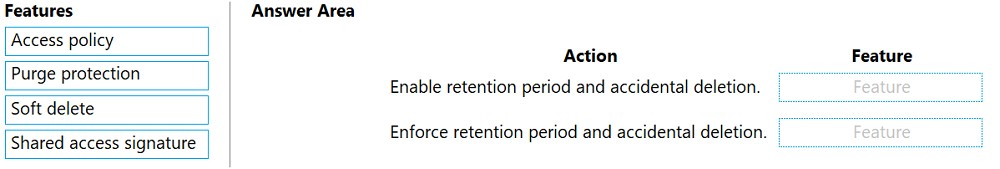

- [x] Enable retention period and accidental deletion: Soft delete. Enforce retention period and accidental deletion: Purge protection.
- [ ] Enable retention period and accidental deletion: Access policy. Enforce retention period and accidental deletion: Soft delete.
- [ ] Enable retention period and accidental deletion: Shared access signature. Enforce retention period and accidental deletion: Pure protection.
- [ ] Enable retention period and accidental deletion: Soft delete. Enforce retention period and accidental deletion: Shared access signature.

**[⬆ Back to Top](#table-of-contents)**

### You provide an Azure API Management managed web service to clients. The back-end web service implements HTTP Strict Transport Security (HSTS). Every request to the backend service must include a valid HTTP authorization header. You need to configure the Azure API Management instance with an authentication policy. Which two policies can you use?

- [x] Basic Authentication.
- [ ] Digest Authentication.
- [x] Certificate Authentication.
- [ ] OAuth Client Credential Grant.

**[⬆ Back to Top](#table-of-contents)**

### You are developing an ASP.NET Core website that can be used to manage photographs which are stored in Azure Blob Storage containers. Users of the website authenticate by using their Azure Active Directory (Azure AD) credentials. You implement role-based access control (RBAC) role permissions on the containers that store photographs. You assign users to RBAC roles. You need to configure the website's Azure AD Application so that user's permissions can be used with the Azure Blob containers. How should you configure the application?

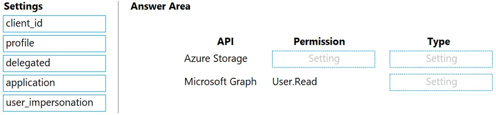

- [ ] Azure Storage Permission: `client_id`. Azure Storage Type: `application`. Microsoft Graph Type: `user_impersonation`.
- [ ] Azure Storage Permission: `client_id`. Azure Storage Type: `profile`. Microsoft Graph Type: `application`.
- [x] Azure Storage Permission: `user_impersonation`. Azure Storage Type: `delegated`. Microsoft Graph Type: `delegated`.
- [ ] Azure Storage Permission: `user_impersonation`. Azure Storage Type: `delegated`. Microsoft Graph Type: `profile`.

**[⬆ Back to Top](#table-of-contents)**

### You are developing an ASP.NET Core app that includes feature flags which are managed by Azure App Configuration. You create an Azure App Configuration store named `AppFeatureFlagStore` that contains a feature flag named `Export`. You need to update the app to meet the following requirements: Use the `Export` feature in the app without requiring a restart of the app. Validate users before users are allowed access to secure resources. Permit users to access secure resources. How should you complete the code segment?

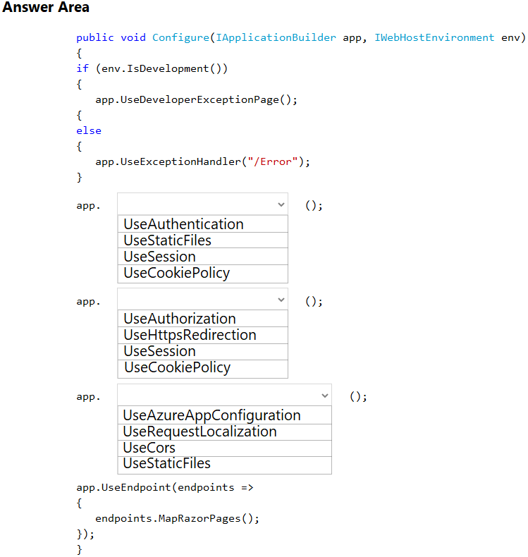

- [ ] Box 1: `UseSession`. Box 2: `UseCookiePolicy`. Box 3: `UseStaticFiles`.
- [ ] Box 1: `UseAuthentication`. Box 2: `UseAuthorization`. Box 3: `UseStaticFiles`.
- [ ] Box 1: `UseCookiePolicy`. Box 2: `UseHttpsRedirection`. Box 3: `UseCors`.
- [x] Box 1: `UseAuthentication`. Box 2: `UseAuthorization`. Box 3: `UseAzureAppConfiguration`.

**[⬆ Back to Top](#table-of-contents)**

### You have an application that includes an Azure Web app and several Azure Function apps. Application secrets including connection strings and certificates are stored in Azure Key Vault. Secrets must not be stored in the application or application runtime environment. Changes to Azure Active Directory (Azure AD) must be minimized. You need to design the approach to loading application secrets. What should you do?

- [ ] Create a single user-assigned Managed Identity with permission to access Key Vault and configure each App Service to use that Managed Identity.
- [ ] Create a single Azure AD Service Principal with permission to access Key Vault and use a client secret from within the App Services to access Key Vault.
- [x] Create a system assigned Managed Identity in each App Service with permission to access Key Vault.
- [ ] Create an Azure AD Service Principal with Permissions to access Key Vault for each App Service and use a certificate from within the App Services to access Key Vault.

**[⬆ Back to Top](#table-of-contents)**

### You are developing a medical records document management website. The website is used to store scanned copies of patient intake forms. If the stored intake forms are downloaded from storage by a third party, the contents of the forms must not be compromised. You need to store the intake forms according to the requirements. Solution: 1. Create an Azure Key Vault key named `skey`. 2. Encrypt the intake forms using the public key portion of skey. 3. Store the encrypted data in Azure Blob storage. Does the solution meet the goal?

- [x] Yes.
- [ ] No.

**[⬆ Back to Top](#table-of-contents)**

### You are developing a medical records document management website. The website is used to store scanned copies of patient intake forms. If the stored intake forms are downloaded from storage by a third party, the contents of the forms must not be compromised. You need to store the intake forms according to the requirements. Solution: 1. Create an Azure Cosmos DB database with Storage Service Encryption enabled. 2. Store the intake forms in the Azure Cosmos DB database. Does the solution meet the goal?

- [ ] Yes.
- [x] No.

**[⬆ Back to Top](#table-of-contents)**

### You are developing a medical records document management website. The website is used to store scanned copies of patient intake forms. If the stored intake forms are downloaded from storage by a third party, the contents of the forms must not be compromised. You need to store the intake forms according to the requirements. Solution: Store the intake forms as Azure Key Vault secrets. Does the solution meet the goal?

- [ ] Yes.
- [x] No.

**[⬆ Back to Top](#table-of-contents)**

### You plan to deploy a new application to a Linux virtual machine (VM) that is hosted in Azure. The entire VM must be secured at rest by using industry-standard encryption technology to address organizational security and compliance requirements. You need to configure Azure Disk Encryption for the VM. How should you complete the Azure CLI commands?

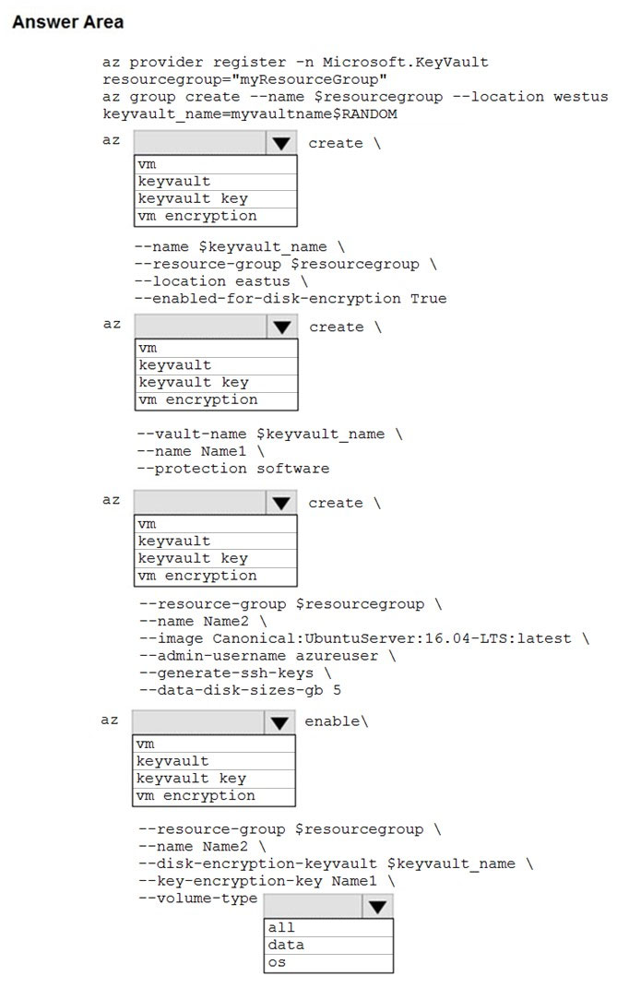

- [x] Box 1: `keyvault`. Box 2: `keyvault key`. Box 3: `vm`. Box 4: `vm encryption`. Box 5: `all`.
- [ ] Box 1: `vm`. Box 2: `vm encryption`. Box 3: `keyvault key`. Box 4: `keyvault`. Box 5: `data`.
- [ ] Box 1: `vm encryption`. Box 2: `vm`. Box 3: `keyvault`. Box 4: `keyvault key`. Box 5: `all`.
- [ ] Box 1: `keyvault key`. Box 2: `keyvault`. Box 3: `vm encryption`. Box 4: `vm`. Box 5: `os`.

**[⬆ Back to Top](#table-of-contents)**

### Your company is developing an Azure API hosted in Azure. You need to implement authentication for the Azure API to access other Azure resources. You have the following requirements: All API calls must be authenticated. Callers to the API must not send credentials to the API. Which authentication mechanism should you use?

- [ ] Basic.
- [ ] Anonymous.
- [x] Managed identity.
- [ ] Client certificate.

**[⬆ Back to Top](#table-of-contents)**

### You are using Azure Front Door Service. You are expecting inbound files to be compressed by using Brotli compression. You discover that inbound XML files are not compressed. The files are 9 megabytes (MB) in size. You need to determine the root cause for the issue. Question 1: The file MIME type is supported by the service.

- [ ] Yes.
- [x] No.

**[⬆ Back to Top](#table-of-contents)**

### You are using Azure Front Door Service. You are expecting inbound files to be compressed by using Brotli compression. You discover that inbound XML files are not compressed. The files are 9 megabytes (MB) in size. You need to determine the root cause for the issue. Question 2: Edge nodes must be purged of all cache assets.

- [x] Yes.
- [ ] No.

**[⬆ Back to Top](#table-of-contents)**

### You are using Azure Front Door Service. You are expecting inbound files to be compressed by using Brotli compression. You discover that inbound XML files are not compressed. The files are 9 megabytes (MB) in size. You need to determine the root cause for the issue. Question 3: The compression type is supported.

- [x] Yes.
- [ ] No.

**[⬆ Back to Top](#table-of-contents)**

### You are developing an application. You have an Azure user account that has access to two subscriptions. You need to retrieve a storage account key secret from Azure Key Vault. In which order should you arrange the PowerShell commands to develop the solution?

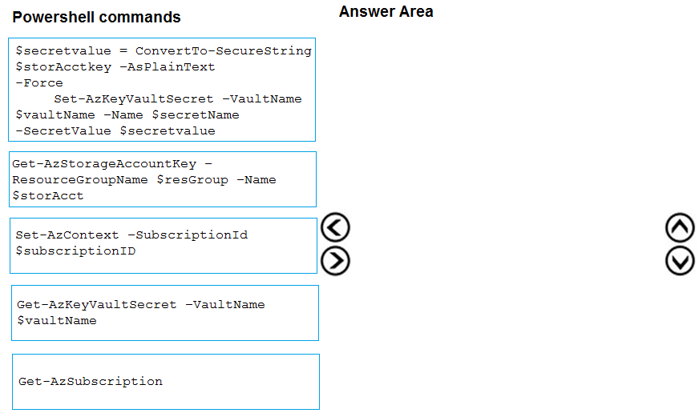

- [ ] Box 1: `Get-AzSubscription`. Box 2: `Set-AzContext -SubscriptionId $subscriptionID`. Box 3: `Get-AzStorageAccountKey -ResourceGroupName $resGroup -Name $storAcct`. Box 4: `Get-AzKeyVaultSecret -VaultName $vaultName`. Box 5: `$secretvalue = ConvertTo-SecureString $storAcctkey -AsPlainText -Force Set-AzKeyVaultSecret -VaultName $vaultName -Name $secretName -SecretValue $secretvalue`.
- [ ] Box 1: `Set-AzContext -SubscriptionId $subscriptionID`. Box 2: `Get-AzStorageAccountKey -ResourceGroupName $resGroup -Name $storAcct`. Box 3: `Get-AzKeyVaultSecret -VaultName $vaultName`. Box 4: `$secretvalue = ConvertTo-SecureString $storAcctkey -AsPlainText -Force Set-AzKeyVaultSecret -VaultName $vaultName -Name $secretName -SecretValue $secretvalue`. Box 5: `Get-AzSubscription`.
- [x] Box 1: `Get-AzSubscription`. Box 2: `Set-AzContext -SubscriptionId $subscriptionID`. Box 3: `Get-AzStorageAccountKey -ResourceGroupName $resGroup -Name $storAcct`. Box 4: `$secretvalue = ConvertTo-SecureString $storAcctkey -AsPlainText -Force Set-AzKeyVaultSecret -VaultName $vaultName -Name $secretName -SecretValue $secretvalue`. Box 5: `Get-AzKeyVaultSecret -VaultName $vaultName`.
- [ ] Box 1: `Get-AzKeyVaultSecret -VaultName $vaultName`. Box 2: `Get-AzSubscription`. Box 3: `Set-AzContext -SubscriptionId $subscriptionID`. Box 4: `Get-AzStorageAccountKey -ResourceGroupName $resGroup -Name $storAcct`. Box 5: `$secretvalue = ConvertTo-SecureString $storAcctkey -AsPlainText -Force Set-AzKeyVaultSecret -VaultName $vaultName -Name $secretName -SecretValue $secretvalue`.

**[⬆ Back to Top](#table-of-contents)**

### You develop Azure solutions. You must grant a virtual machine (VM) access to specific resource groups in Azure Resource Manager. You need to obtain an Azure Resource Manager access token. Solution: Use an `X.509` certificate to authenticate the VM with Azure Resource Manager. Does the solution meet the goal?

- [ ] Yes.
- [x] No.

**[⬆ Back to Top](#table-of-contents)**

### You develop Azure solutions. You must grant a virtual machine (VM) access to specific resource groups in Azure Resource Manager. You need to obtain an Azure Resource Manager access token. Solution: Use the Reader role-based access control (RBAC) role to authenticate the VM with Azure Resource Manager. Does the solution meet the goal?

- [ ] Yes.
- [x] No.

**[⬆ Back to Top](#table-of-contents)**

### You are building a website that is used to review restaurants. The website will use an Azure CDN to improve performance and add functionality to requests. You build and deploy a mobile app for Apple iPhones. Whenever a user accesses the website from an iPhone, the user must be redirected to the app store. You need to implement an Azure CDN rule that ensures that iPhone users are redirected to the app store. How should you complete the Azure Resource Manager template?

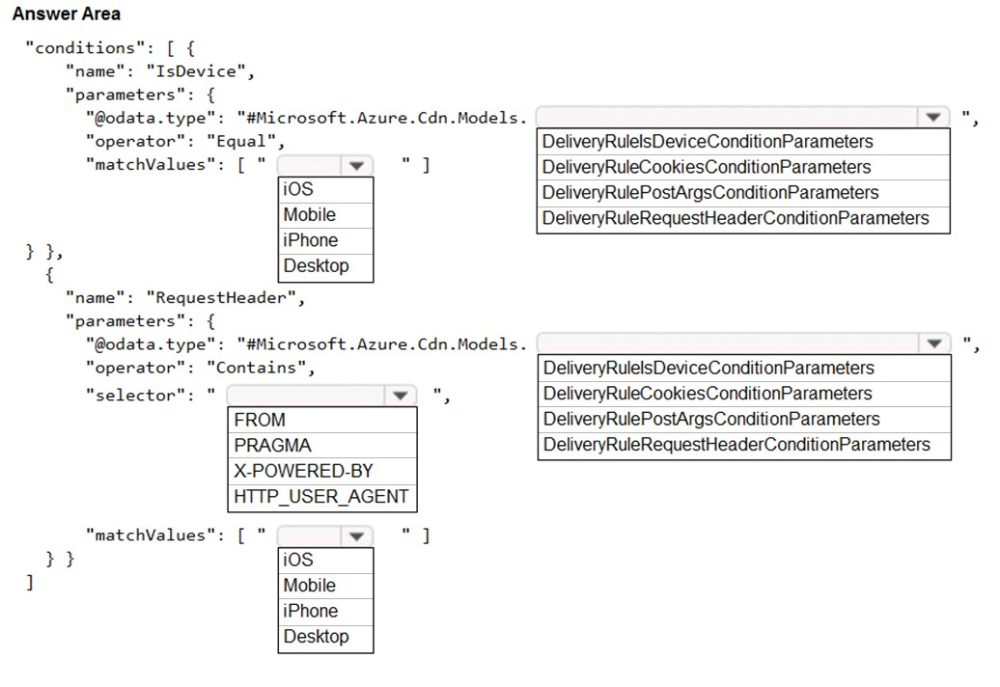

- [ ] Box 1: `iOS`. Box 2: `DeliveryRulelsDeviceConditionParameters`. Box 3: `HTTP_USER_AGENT`. Box 4: `DeliveryRuleRequestHeaderConditionParameters`. Box 5: `iOS`.
- [x] Box 1: `Mobile`. Box 2: `DeliveryRulelsDeviceConditionParameters`. Box 3: `HTTP_USER_AGENT`. Box 4: `DeliveryRuleRequestHeaderConditionParameters`. Box 5: `iPhone`.
- [ ] Box 1: `Desktop`. Box 2: `DeliveryRuleCookiesConditionParameters`. Box 3: `PRAGMA`. Box 4: `DeliveryRulelsDeviceConditionParameters`. Box 5: `Desktop`.
- [ ] Box 1: `iOS`. Box 2: `DeliveryRulelsDeviceConditionParameters`. Box 3: `FROM`. Box 4: `DeliveryRulePostArgsConditionParameters`. Box 5: `Mobile`.

**[⬆ Back to Top](#table-of-contents)**

### You are developing a website that will run as an Azure Web App. Users will authenticate by using their Azure Active Directory (Azure AD) credentials. You plan to assign users one of the following permission levels for the website: `admin`, `normal`, and `reader`. A user's Azure AD group membership must be used to determine the permission level. You need to configure authorization. Solution: Configure and use Integrated Windows Authentication in the website. In the website, query Microsoft Graph API to load the group to which the user is a member. Does the solution meet the goal?

- [ ] Yes.
- [x] No.

**[⬆ Back to Top](#table-of-contents)**

### You develop Azure solutions. You must grant a virtual machine (VM) access to specific resource groups in Azure Resource Manager. You need to obtain an Azure Resource Manager access token. Solution: Run the `Invoke-RestMethod` cmdlet to make a request to the local managed identity for Azure resources endpoint. Does the solution meet the goal?

- [x] Yes.
- [ ] No.

**[⬆ Back to Top](#table-of-contents)**

### Your company's Azure subscription includes an Azure Log Analytics workspace. Your company has a hundred on-premises servers that run either Windows Server 2012 R2 or Windows Server 2016, and is linked to the Azure Log Analytics workspace. The Azure Log Analytics workspace is set up to gather performance counters associated with security from these linked servers. You must configure alerts based on the information gathered by the Azure Log Analytics workspace. You have to make sure that alert rules allow for dimensions, and that alert creation time should be kept to a minimum. Furthermore, a single alert notification must be created when the alert is created and when the alert is resolved. You need to make use of the necessary signal type when creating the alert rules. Which of the following is the option you should use?

- [ ] The Activity log signal type.
- [ ] The Application Log signal type.
- [x] The Metric signal type.
- [ ] The Audit Log signal type.

**[⬆ Back to Top](#table-of-contents)**

### You are developing a .NET Core MVC application that allows customers to research independent holiday accommodation providers. You want to implement Azure Search to allow the application to search the index by using various criteria to locate documents related to accommodation. You want the application to allow customers to search the index by using regular expressions. What should you do?

- [ ] Configure the `SearchMode` property of the `SearchParameters` class.
- [x] Configure the `QueryType` property of the `SearchParameters` class.
- [ ] Configure the `Facets` property of the `SearchParameters` class.
- [ ] Configure the `Filter` property of the `SearchParameters` class.

**[⬆ Back to Top](#table-of-contents)**

### You are a developer at your company. You need to update the definitions for an existing Logic App. What should you use?

- [ ] The Enterprise Integration Pack (EIP).
- [x] The Logic App Code View.
- [ ] The API Connections.
- [ ] The Logic Apps Designer.

**[⬆ Back to Top](#table-of-contents)**

### The cluster uses Azure Monitor for containers to monitor the cluster. The application has sticky sessions enabled on the ingress controller. Some customers report a large number of errors in the application over the last 24 hours. You need to determine on which virtual machines (VMs) the errors are occurring. How should you complete the Azure Monitor query?

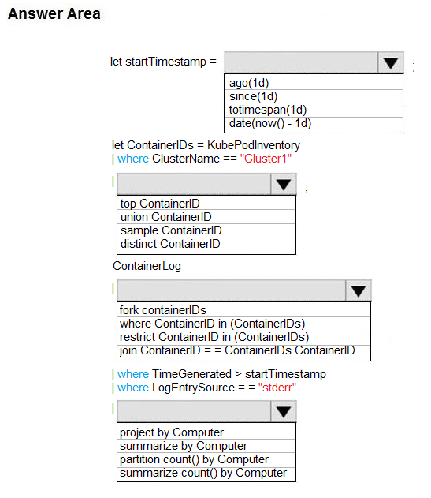

- [x] Box 1: `ago(1d)`. Box 2: `distinct ContainerID`. Box 3: `where ContainerID in (ContainerIDs)`. Box 4: `summarize count() by Computer`.
- [ ] Box 1: `date(now() - 1d)`. Box 2: `sample ContainerID`. Box 3: `where ContainerID in (ContainerIDs)`. Box 4: `partition count() by Computer`.
- [ ] Box 1: `ago(1d)`. Box 2: `distinct ContainerID`. Box 3: `join ContainerID = = ContainerIDs.ContainerID`. Box 4: `summarize by Computer`.
- [ ] Box 1: `totimespan(1d)`. Box 2: `top ContainerID`. Box 3: `fork containerIDs`. Box 4: `project by Computer`.

**[⬆ Back to Top](#table-of-contents)**

### You plan to deploy a web app to App Service on Linux. You create an App Service plan. You create and push a custom Docker image that contains the web app to Azure Container Registry. You need to access the console logs generated from inside the container in real-time. How should you complete the Azure CLI command?

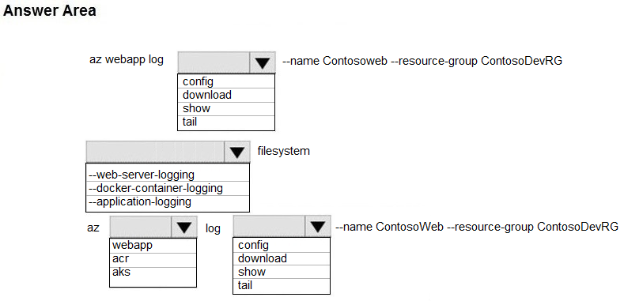

- [x] Box 1: `config`. Box 2: `--docker-container-logging`. Box 3: `webapp`. Box 4: `tail`.
- [ ] Box 1: `tail`. Box 2: `--web-server-logging`. Box 3: `aks` Box 4: `show`.
- [ ] Box 1: `show`. Box 2: `--web-server-logging`. Box 3: `acr`. Box 4: `config`.
- [ ] Box 1: `config`. Box 2: `--application-logging`. Box 3: `webapp`. Box 4: `show`.

**[⬆ Back to Top](#table-of-contents)**

### You develop an app that allows users to upload photos and videos to Azure storage. The app uses a storage REST API call to upload the media to a blob storage account named `Account1`. You have blob storage containers named `Container1` and `Container2`. Uploading of videos occurs on an irregular basis. You need to copy specific blobs from `Container1` to `Container2` when a new video is uploaded. What should you do?

- [ ] Copy blobs to `Container2` by using the Put Blob operation of the Blob Service REST API.
- [x] Create an Event Grid topic that uses the `Start-AzureStorageBlobCopy` cmdlet.
- [ ] Use `AzCopy` with the Snapshot switch to copy blobs to `Container2`.
- [ ] Download the blob to a virtual machine and then upload the blob to `Container2`.

**[⬆ Back to Top](#table-of-contents)**

### A web service provides customer summary information for e-commerce partners. The web service is implemented as an Azure Function app with an HTTP trigger. Access to the API is provided by an Azure API Management instance. The API Management instance is configured in consumption plan mode. All API calls are authenticated by using OAuth. API calls must be cached. Customers must not be able to view cached data for other customers. You need to configure API Management policies for caching. How should you complete the policy statement?

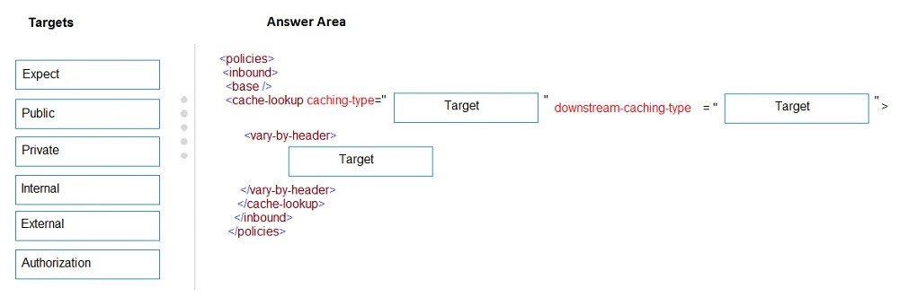

- [ ] caching-type: `Internal`. downstream-caching-type: `Private`. vary-by-header: `Authorization`.
- [ ] caching-type: `Public`. downstream-caching-type: `Expect`. vary-by-header: `Private`.
- [ ] caching-type: `Internal`. downstream-caching-type: `External`. vary-by-header: `Authorization`.
- [x] caching-type: `External`. downstream-caching-type: `Private`. vary-by-header: `Authorization`.

**[⬆ Back to Top](#table-of-contents)**

### You are developing an ASP.NET Core website that uses Azure FrontDoor. The website is used to build custom weather data sets for researchers. Data sets are downloaded by users as Comma Separated Value (CSV) files. The data is refreshed every 10 hours. Specific files must be purged from the FrontDoor cache based upon Response Header values. You need to purge individual assets from the Front Door cache. Which type of cache purge should you use?

- [x] `single path`.
- [ ] `wildcard`.
- [ ] `root domain`.

**[⬆ Back to Top](#table-of-contents)**

### Contoso, Ltd. provides an API to customers by using Azure API Management (APIM). The API authorizes users with a JWT token. You must implement response caching for the APIM gateway. The caching mechanism must detect the user ID of the client that accesses data for a given location and cache the response for that user ID. You need to add the following policies to the policies file: a set-variable policy to store the detected user identity a cache-lookup-value policy a cache-store-value policy a find-and-replace policy to update the response body with the user profile information To which policy section should you add the policies?

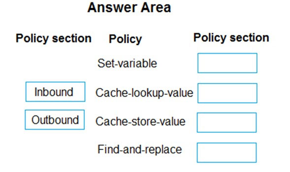

- [x] Set-variable: Inbound. Cache-lookup-value: Inbound. Cache-store-value: Outbound. Find-and-replace: Outbound.
- [ ] Set-variable: Outbound. Cache-lookup-value: Inbound. Cache-store-value: Outbound. Find-and-replace: Inbound.
- [ ] Set-variable: Inbound. Cache-lookup-value: Outbound. Cache-store-value: Inbound. Find-and-replace: Outbound.
- [ ] Set-variable: Outbound. Cache-lookup-value: Outbound. Cache-store-value: Inbound. Find-and-replace: Inbound.

**[⬆ Back to Top](#table-of-contents)**

### You are developing an application to retrieve user profile information. The application will use the Microsoft Graph SDK. The app must retrieve user profile information by using a Microsoft Graph API call. You need to call the Microsoft Graph API from the application. In which order should you perform the actions?

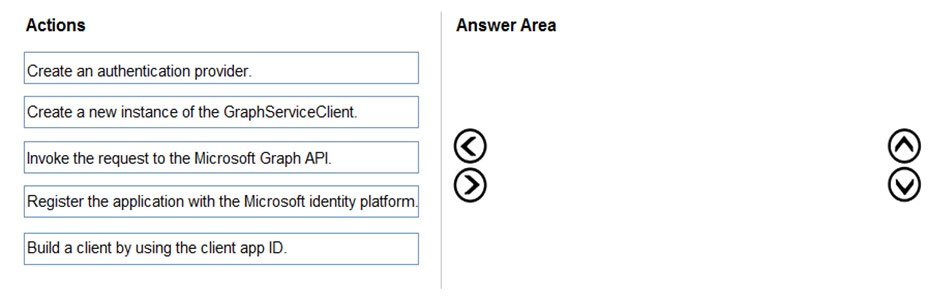

- [x] Box 1: Register the application with the Microsoft identity platform. Box 2: Build a client by using the client app ID. Box 3: Create an authentication provider. Box 4: Create a new instance of the GraphServiceClient. Box 5: Invoke the request to the Microsoft Graph API.
- [ ] Box 1: Invoke the request to the Microsoft Graph API. Box 2: Create an authentication provider. Box 3: Register the application with the Microsoft identity platform. Box 4: Build a client by using the client app ID. Box 5: Create a new instance of the GraphServiceClient.
- [ ] Box 1: Build a client by using the client app ID. Box 2: Register the application with the Microsoft identity platform. Box 3: Create an authentication provider. Box 4: Create a new instance of the GraphServiceClient. Box 5: Invoke the request to the Microsoft Graph API.
- [ ] Box 1: Register the application with the Microsoft identity platform. Box 2: Build a client by using the client app ID. Box 3: Invoke the request to the Microsoft Graph API. Box 4: Create a new instance of the GraphServiceClient. Box 5: Create an authentication provider. Graph API.

**[⬆ Back to Top](#table-of-contents)**

### You develop and deploy an Azure Logic App that calls an Azure Function app. The Azure Function App includes an OpenAPI (Swagger) definition and uses an Azure Blob storage account. All resources are secured by using Azure Active Directory (Azure AD). The Logic App must use Azure Monitor logs to record and store information about runtime data and events. The logs must be stored in the Azure Blob storage account. You need to set up Azure Monitor logs and collect diagnostics data for the Azure Logic App. Which three actions should you perform in sequence?

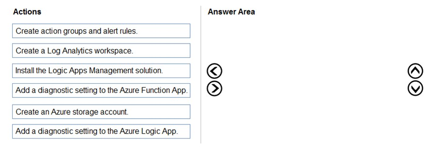

- [x] Box 1: Create a Log Analytics workspace. Box 2: Install the Logic Apps Management solution. Box 3: Add a diagnostic setting to the Azure Logic App.
- [ ] Box 1: Install the Logic Apps Management solution. Box 2: Add a diagnostic setting to the Azure Function App. Box 3: Create action groups and alert rules.
- [ ] Box 1: Add a diagnostic setting to the Azure Function App. Box 2: Create a Log Analytics workspace. Box 3: Create action groups and alert rules.
- [ ] Box 1: Create a Log Analytics workspace. Box 2: Create action groups and alert rules. Box 3: Add a diagnostic setting to the Azure Function App.

**[⬆ Back to Top](#table-of-contents)**

### You develop an application. You plan to host the application on a set of virtual machines (VMs) in Azure. You need to configure Azure Monitor to collect logs from the application. Which four actions should you perform in sequence?

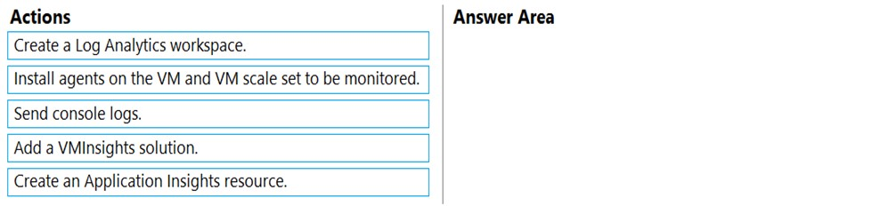

- [x] Box 1: Create a Log Analytics workspace. Box 2: Add a VMInsights solution. Box 3: Install agents on the VM and VM scale set to be monitored. Box 4: Create an Application Insights resource.
- [ ] Box 1: Add a VMInsights solution. Box 2: Create a Log Analytics workspace. Box 3: AInstall agents on the VM and VM scale set to be monitored. Box 4: Create an Application Insights resource.
- [ ] Box 1: Create an Application Insights resource. Box 2: Add a VMInsights solution. Box 3: AInstall agents on the VM and VM scale set to be monitored. Box 4: Create a Log Analytics workspace.
- [ ] Box 1: Create a Log Analytics workspace. Box 2: Add a VMInsights solution. Box 3: Create an Application Insights resource. Box 4: Install agents on the VM and VM scale set to be monitored.

**[⬆ Back to Top](#table-of-contents)**

### You have an application that provides weather forecasting data to external partners. You use Azure API Management to publish APIs. You must change the behavior of the API to meet the following requirements: Support alternative input parameters. Remove formatting text from responses. Provide additional context to back-end services. Which types of policies should you implement?

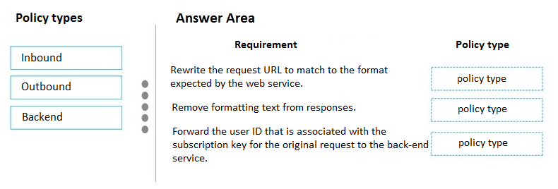

- [x] Rewrite the request URL to match to the format expected by the web service: Inbound. Remove formatting text from responses: Outbound. Forward the user ID that is associated with the subscription key for the original request to the back-end service: Inbound.
- [ ] Rewrite the request URL to match to the format expected by the web service: Inbound. Remove formatting text from responses: Outbound. Forward the user ID that is associated with the subscription key for the original request to the back-end service: Backend.
- [ ] Rewrite the request URL to match to the format expected by the web service: Inbound. Remove formatting text from responses: Backend. Forward the user ID that is associated with the subscription key for the original request to the back-end service: Inbound.
- [ ] Rewrite the request URL to match to the format expected by the web service: Backend. Remove formatting text from responses: Backend. Forward the user ID that is associated with the subscription key for the original request to the back-end service: Inbound.

**[⬆ Back to Top](#table-of-contents)**

### Your company is developing an Azure API. You need to implement authentication for the Azure API. You have the following requirements: All API calls must be secure. Callers to the API must not send credentials to the API. Which authentication mechanism should you use?

- [ ] Basic.
- [ ] Anonymous.
- [x] Managed identity.
- [ ] Client certificate.

**[⬆ Back to Top](#table-of-contents)**

### You are a developer for a SaaS company that offers many web services. All web services for the company must meet the following requirements: Use API Management to access the services Use OpenID Connect for authentication Prevent anonymous usage A recent security audit found that several web services can be called without any authentication. Which API Management policy should you implement?

- [ ] `jsonp`.
- [ ] `authentication-certificate`.
- [ ] `check-header`.
- [x] `validate-jwt`.

**[⬆ Back to Top](#table-of-contents)**

### You are developing an Azure App Service REST API. The API must be called by an Azure App Service web app. The API must retrieve and update user profile information stored in Azure Active Directory (Azure AD). You need to configure the API to make the updates. Which two tools should you use?

- [x] Microsoft Graph API.
- [ ] Microsoft Authentication Library (MSAL).
- [x] Azure API Management.
- [ ] Microsoft Azure Security Center.
- [ ] Microsoft Azure Key Vault SDK.

**[⬆ Back to Top](#table-of-contents)**

### You develop a REST API. You implement a user delegation SAS token to communicate with Azure Blob storage. The token is compromised. You need to revoke the token. What are two possible ways to achieve this goal?

- [x] Revoke the delegation key.
- [x] Delete the stored access policy.
- [ ] Regenerate the account key.
- [ ] Remove the role assignment for the security principle.

**[⬆ Back to Top](#table-of-contents)**

### You are developing an Azure-hosted application that must use an on-premises hardware security module (HSM) key. The key must be transferred to your existing Azure Key Vault by using the Bring Your Own Key (BYOK) process. You need to securely transfer the key to Azure Key Vault. Which four actions should you perform in sequence?

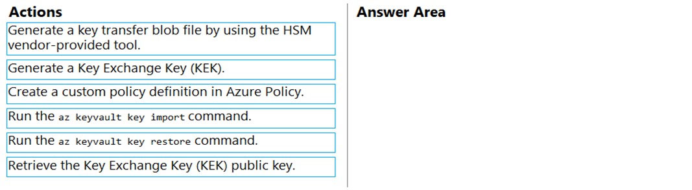

- [ ] Box 1: Create a custom policy definition in Azure Policy. Box 2: Generate a Key Exchange Key (KEK). Box 3: Retrieve the Key Exchange Key (KEK) public key. Box 4: Run the `az keyvault key import` command.
- [ ] Box 1: Create a custom policy definition in Azure Policy. Box 2: Retrieve the Key Exchange Key (KEK) public key. Box 3: Generate a key transfer blob file by using the HSM `vendor-provided` tool. Box 4: Run the `az keyvault key import` command.
- [ ] Box 1: Generate a Key Exchange Key (KEK). Box 2: Retrieve the Key Exchange Key (KEK) public key. Box 3: Generate a key transfer blob file by using the HSM `vendor-provided` tool. Box 4: Run the `az keyvault key restore` command.
- [x] Box 1: Generate a Key Exchange Key (KEK). Box 2: Retrieve the Key Exchange Key (KEK) public key. Box 3: Generate a key transfer blob file by using the HSM `vendor-provided` tool. Box 4: Run the `az keyvault key import` command.

**[⬆ Back to Top](#table-of-contents)**

### You develop and deploy an Azure Logic app that calls an Azure Function app. The Azure Function app includes an OpenAPI (Swagger) definition and uses an Azure Blob storage account. All resources are secured by using Azure Active Directory (Azure AD). The Azure Logic app must securely access the Azure Blob storage account. Azure AD resources must remain if the Azure Logic app is deleted. You need to secure the Azure Logic app. What should you do?

- [x] Create a user-assigned managed identity and assign role-based access controls.
- [ ] Create an Azure AD custom role and assign the role to the Azure Blob storage account.
- [ ] Create an Azure Key Vault and issue a client certificate.
- [ ] Create a system-assigned managed identity and issue a client certificate.
- [ ] Create an Azure AD custom role and assign role-based access controls.

**[⬆ Back to Top](#table-of-contents)**

### You manage several existing Logic Apps. You need to change definitions, add new logic, and optimize these apps on a regular basis. What should you use?

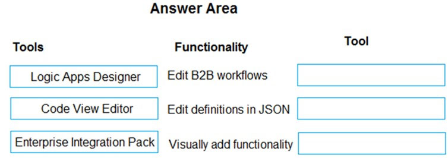

- [x] Edit B2B Workflows: Enterprise Integration Pack. Edit definitions in JSON: Code View Editor. Visually add functionality: Logic Apps Designer.
- [ ] Edit B2B Workflows: Logic Apps Designer. Edit definitions in JSON: Enterprise Integration Pack. Visually add functionality: Code View Editor.
- [ ] Edit B2B Workflows: Code View Editor. Edit definitions in JSON: Logic Apps Designer. Visually add functionality: Enterprise Integration Pack.
- [ ] Edit B2B Workflows: Enterprise Integration Pack. Edit definitions in JSON: Code View Editor. Visually add functionality: Code View Editor.

**[⬆ Back to Top](#table-of-contents)**

### You are developing a solution that will use a multi-partitioned Azure Cosmos DB database. You plan to use the latest Azure Cosmos DB SDK for development. The solution must meet the following requirements: Send insert and update operations to an Azure Blob storage account. Process changes to all partitions immediately. Allow parallelization of change processing. You need to process the Azure Cosmos DB operations. What are two possible ways to achieve this goal?

- [ ] Create an Azure App Service API and implement the change feed estimator of the SDK. Scale the API by using multiple Azure App Service instances.
- [ ] Create a background job in an Azure Kubernetes Service and implement the change feed feature of the SDK.
- [x] Create an Azure Function to use a trigger for Azure Cosmos DB. Configure the trigger to connect to the container.
- [x] Create an Azure Function that uses a FeedIterator object that processes the change feed by using the pull model on the container. Use a FeedRange object to parallelize the processing of the change feed across multiple functions.

**[⬆ Back to Top](#table-of-contents)**

### You are developing an application that uses Azure Storage Queues. You have the following code. Question 1: The code configures the lock duration for the queue.

- [ ] Yes.
- [x] No.

**[⬆ Back to Top](#table-of-contents)**

### You are developing an application that uses Azure Storage Queues. You have the following code. Question 2: The last message read remains in the queue after the code runs.

- [x] Yes.
- [ ] No.

**[⬆ Back to Top](#table-of-contents)**

### You are developing an application that uses Azure Storage Queues. You have the following code. Question 3: The storage queue remains in the storage account after the code runs.

- [x] Yes.
- [ ] No.

**[⬆ Back to Top](#table-of-contents)**

### You develop software solutions for a mobile delivery service. You are developing a mobile app that users can use to order from a restaurant in their area. The app uses the following workflow: 1. A driver selects the restaurants for which they will deliver orders. 2. Orders are sent to all available drivers in an area. 3. Only orders for the selected restaurants will appear for the driver. 4. The first driver to accept an order removes it from the list of available orders. You need to implement an Azure Service Bus solution. Which three actions should you perform in sequence?

- [x] Box 1: Create a single Service Bus Namespace. Box 2: Create a single Service Bus topic. Box 3: Create a Service Bus subscription for each restaurant for which a driver can receive orders.
- [ ] Box 1: Create a Service Bus subscription for each restaurant for which a driver can receive orders. Box 2: Create a Service Bus topic for each restaurant. Box 3: Create a Service Bus Namespace for each.
- [ ] Box 1: Create a single Service Bus topic. Box 2: Create a Service Bus subscription for each restaurant for which a driver can receive orders. Box 3: Create a single Service Bus topic.
- [ ] Box 1: Create a single Service Bus topic. Box 2: Create a Service Bus Namespace for each restaurant for which a driver can receive messages. Box 3: Create a Service Bus Namespace for each.

**[⬆ Back to Top](#table-of-contents)**

### You develop a news and blog content app for Windows devices. A notification must arrive on a user's device when there is a new article available for them to view. You need to implement push notifications. How should you complete the code segment?

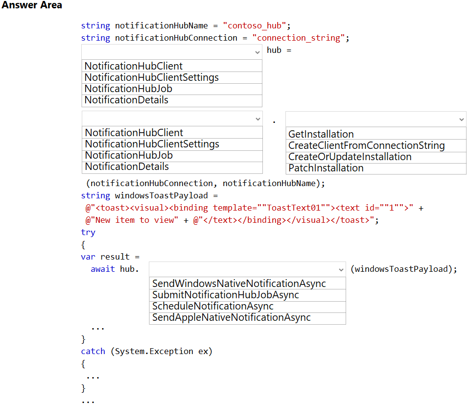

- [x] Box 1: `NotificationHubClient`. Box 2: `NotificationHubClient`. Box 3: `CreateClientFromConnectionString`. Box 4: `SendWindowsNativeNotificationAsync`.
- [ ] Box 1: `NotificationHubJob`. Box 2: `NotificationHubJob`. Box 3: `PatchInstallation`. Box 4: `SendWindowsNativeNotificationAsync`.
- [ ] Box 1: `NotificationHubClientSettings`. Box 2: `NotificationHubClientSettings`. Box 3: `CreateOrUpdatelnstallation`. Box 4: `ScheduleNotificationAsync`.
- [ ] Box 1: `NotificationHubClientSettings`. Box 2: `NotificationDetails`. Box 3: `CreateOrUpdatelnstallation`. Box 4: `SendWindowsNativeNotificationAsync`.

**[⬆ Back to Top](#table-of-contents)**

### You are developing an Azure messaging solution. You need to ensure that the solution meets the following requirements: Provide transactional support. Provide duplicate detection. Store the messages for an unlimited period of time. Which two technologies will meet the requirements?

- [x] Azure Service Bus Topic.
- [x] Azure Service Bus Queue.
- [ ] Azure Storage Queue.
- [ ] Azure Event Hub.

**[⬆ Back to Top](#table-of-contents)**

### You develop a gateway solution for a public facing news API. The news API back end is implemented as a RESTful service and hosted in an Azure App Service instance. You need to configure back-end authentication for the API Management service instance. Which target and gateway credential type should you use?

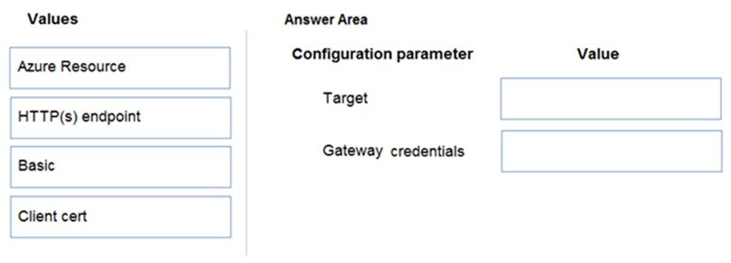

- [ ] Target: Azure Resource. Gateway credentials: Client cert.
- [ ] Target: Client cert. Gateway credentials: Basic.
- [ ] Target: Azure Resource. Gateway credentials: Basic.
- [x] Target: HTTP(s) endpoint. Gateway credentials: Client cert.

**[⬆ Back to Top](#table-of-contents)**

### You are creating an app that uses Event Grid to connect with other services. Your app's event data will be sent to a serverless function that checks compliance. This function is maintained by your company. You write a new event subscription at the scope of your resource. The event must be invalidated after a specific period of time. You need to configure Event Grid. What should you do?

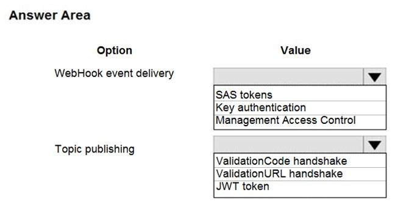

- [x] WebHook event delivery: SAS tokens. Topic publishing: ValidationCode handshake.
- [ ] WebHook event delivery: Key authentication. Topic publishing: ValidationCode handshake.
- [ ] WebHook event delivery: Management Access Control. Topic publishing: ValidationURL handshake.
- [ ] WebHook event delivery: SAS tokens. Topic publishing: ValidationURL handshake.

**[⬆ Back to Top](#table-of-contents)**

### You are working for Contoso, Ltd. You define an API Policy object by using the following XML markup. Question 1: The XML segment belongs in the `<inbound>` section of the policy.

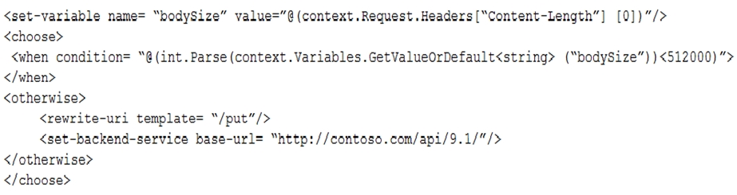

- [x] Yes.
- [ ] No.

**[⬆ Back to Top](#table-of-contents)**

### You are working for Contoso, Ltd. You define an API Policy object by using the following XML markup. Question 2: If the body size is >256k, an error will occur.

- [ ] Yes.
- [x] No.

**[⬆ Back to Top](#table-of-contents)**

### You are working for Contoso, Ltd. You define an API Policy object by using the following XML markup. Question 3: If the request is `<http://contoso.com/api/9.2/>`, the policy will retain the higher version.

- [ ] Yes.
- [x] No.

**[⬆ Back to Top](#table-of-contents)**

### You develop a gateway solution for a public facing news API. The news API back end is implemented as a RESTful service and uses an OpenAPI specification. You need to ensure that you can access the news API by using an Azure API Management service instance. Which Azure PowerShell command should you run?

- [x] `Import-AzureRmApiManagementApi -Context $ApiMgmtContext -SpecificationFormat 'Swagger' -SpecificationPath $SwaggerPath -Path $Path`.
- [ ] `New-AzureRmApiManagementBackend -Context $ApiMgmtContext-Url $Url -Protocol http`.
- [ ] `New-AzureRmApiManagement -ResourceGroupName $ResourceGroup -Name $Name 'Location $Location -Organization $Org -AdminEmail $AdminEmail`.
- [ ] `New-AzureRmApiManagementBackendProxy -Url $ApiUrl`.

**[⬆ Back to Top](#table-of-contents)**

### You are developing an Azure function that connects to an Azure SQL Database instance. The function is triggered by an Azure Storage queue. You receive reports of numerous System.InvalidOperationExceptions with the following message: 'Timeout expired. The timeout period elapsed prior to obtaining a connection from the pool. This may have occurred because all pooled connections were in use and max pool size was reached.' You need to prevent the exception. What should you do?

- [ ] In the `host.json` file, decrease the value of the batchSize option.
- [ ] Convert the trigger to Azure Event Hub.
- [x] Convert the Azure Function to the Premium plan.
- [ ] In the `function.json` file, change the value of the type option to queueScaling.

**[⬆ Back to Top](#table-of-contents)**

### You are developing a REST web service. Customers will access the service by using an Azure API Management instance. The web service does not correctly handle conflicts. Instead of returning an HTTP status code of 409, the service returns a status code of 500. The body of the status message contains only the word conflict. You need to ensure that conflicts produce the correct response. How should you complete the policy?

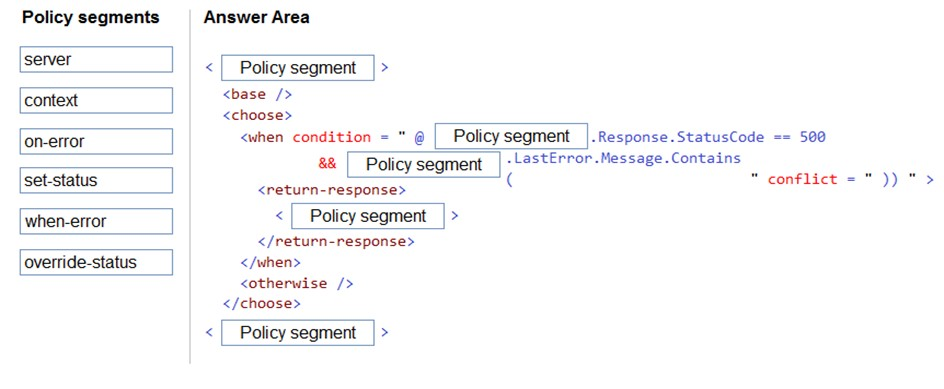

- [x] Box 1: `on-error`. Box 2: `context`. Box 3: `context`. Box 4: `set-status`. Box 5: `on-error`.
- [ ] Box 1: `when-error`. Box 2: `context`. Box 3: `server`. Box 4: `override-status`. Box 5:`on-error`.
- [ ] Box 1: `when-error`. Box 2: `context`. Box 3: `context`. Box 4: `set-status`. Box 5:`on-error`.
- [ ] Box 1: `on-error`. Box 2: `context`. Box 3: `server`. Box 4: `override-status`. Box 5:`on-error`.

**[⬆ Back to Top](#table-of-contents)**

### You are a developer for a Software as a Service (SaaS) company. You develop solutions that provide the ability to send notifications by using Azure Notification Hubs. You need to create sample code that customers can use as a reference for how to send raw notifications to Windows Push Notification Services (WNS) devices. The sample code must not use external packages. How should you complete the code segment?

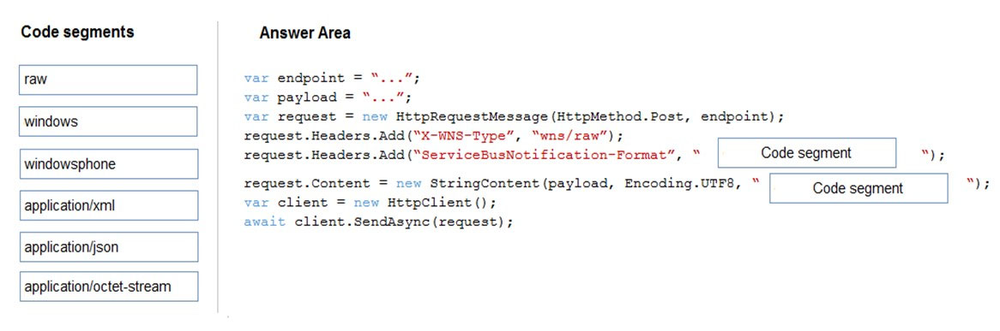

- [x] Box 1: `windows`. Box 2: `application/octet-stream`.
- [ ] Box 1: `windowsphone`. Box 2: `raw`.
- [ ] Box 1: `windows`. Box 2: `application/json`.
- [ ] Box 1: `windowsphone`. Box 2: `application/xml`.

**[⬆ Back to Top](#table-of-contents)**

### You develop and deploy an ASP.NET web app to Azure App Service. You use Application Insights telemetry to monitor the app. You must test the app to ensure that the app is available and responsive from various points around the world and at regular intervals. If the app is not responding, you must send an alert to support staff. You need to configure a test for the web app. Which two test types can you use?

- [ ] Integration.
- [x] TrackAvailablity.
- [x] URL ping.
- [ ] Unit.
- [ ] Load.

**[⬆ Back to Top](#table-of-contents)**

### You are developing an Azure solution to collect inventory data from thousands of stores located around the world. Each store location will send the inventory data hourly to an Azure Blob storage account for processing. The solution must meet the following requirements: Begin processing when data is saved to Azure Blob storage. Filter data based on store location information. Trigger an Azure Logic App to process the data for output to Azure Cosmos DB. Enable high availability and geographic distribution. Allow 24-hours for retries. Implement an exponential back off data processing. You need to configure the solution. What should you implement?

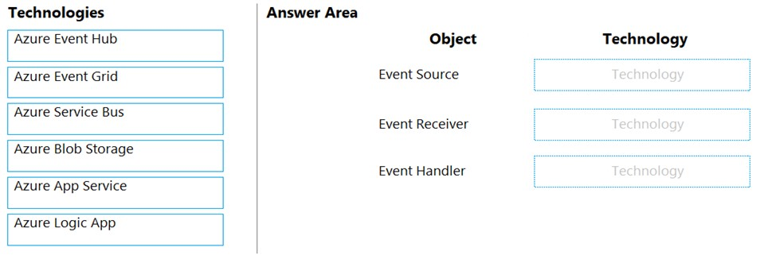

- [ ] Event Source: Azure Event Grid. Event Receiver: Azure Logic App. Event Handler: Azure Service Bus.
- [ ] Event Source: Azure Service Bus. Event Receiver: Azure App Service. Event Handler: Azure Blob Storage.
- [ ] Event Source: Azure Event Grid. Event Receiver: Azure Service Bus. Event Handler: Azure Blob Storage.
- [x] Event Source: Azure Blob Storage. Event Receiver: Azure Event Grid. Event Handler: Azure Logic App.

**[⬆ Back to Top](#table-of-contents)**

### Determine whether the solution meets the stated goals. You are developing and deploying several ASP.NET web applications to Azure App Service. You plan to save session state information and HTML output. You must use a storage mechanism with the following requirements: Share session state across all ASP.NET web applications. Support controlled, concurrent access to the same session state data for multiple readers and a single writer. Save full HTTP responses for concurrent requests. You need to store the information. Proposed Solution: Enable Application Request Routing (ARR). Does the solution meet the goal?

- [ ] Yes.
- [x] No.

**[⬆ Back to Top](#table-of-contents)**

### Determine whether the solution meets the stated goals. You are developing and deploying several ASP.NET web applications to Azure App Service. You plan to save session state information and HTML output. You must use a storage mechanism with the following requirements: Share session state across all ASP.NET web applications. Support controlled, concurrent access to the same session state data for multiple readers and a single writer. Save full HTTP responses for concurrent requests. You need to store the information. Proposed Solution: Deploy and configure an Azure Database for PostgreSQL. Update the web applications. Does the solution meet the goal?

- [ ] Yes.
- [x] No.

**[⬆ Back to Top](#table-of-contents)**

### Determine whether the solution meets the stated goals. You are developing and deploying several ASP.NET web applications to Azure App Service. You plan to save session state information and HTML output. You must use a storage mechanism with the following requirements: Share session state across all ASP.NET web applications. Support controlled, concurrent access to the same session state data for multiple readers and a single writer. Save full HTTP responses for concurrent requests. You need to store the information. Proposed Solution: Deploy and configure Azure Cache for Redis. Update the web applications. Does the solution meet the goal?

- [x] Yes.
- [ ] No.

**[⬆ Back to Top](#table-of-contents)**

### A company is developing a gaming platform. Users can join teams to play online and see leaderboards that include player statistics. The solution includes an entity named `Team`. You plan to implement an Azure Redis Cache instance to improve the efficiency of data operations for entities that rarely change. You need to invalidate the cache when team data is changed. How should you complete the code?

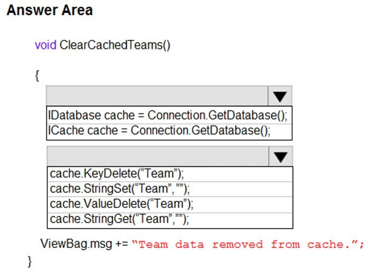

- [ ] Box 1: `IDatabase cache = Connection.GetDatabase();`. Box 2: `cache.StringSet('Team', '');`.
- [x] Box 1: `IDatabase cache = Connection.GetDatabase();`. Box 2: `cache KeyDelete('Team');`.
- [ ] Box 1: `ICache cache = Connection.GetDatabase();`. Box 2: `cache KeyDelete('Team');`.
- [ ] Box 1: `ICache cache = Connection.GetDatabase();`. Box 2: `cache StringGet('Team', '');`.

**[⬆ Back to Top](#table-of-contents)**

### A company has multiple warehouses. Each warehouse contains IoT temperature devices which deliver temperature data to an Azure Service Bus queue. You need to send email alerts to facility supervisors immediately if the temperature at a warehouse goes above or below specified threshold temperatures. Which five actions should you perform in sequence?

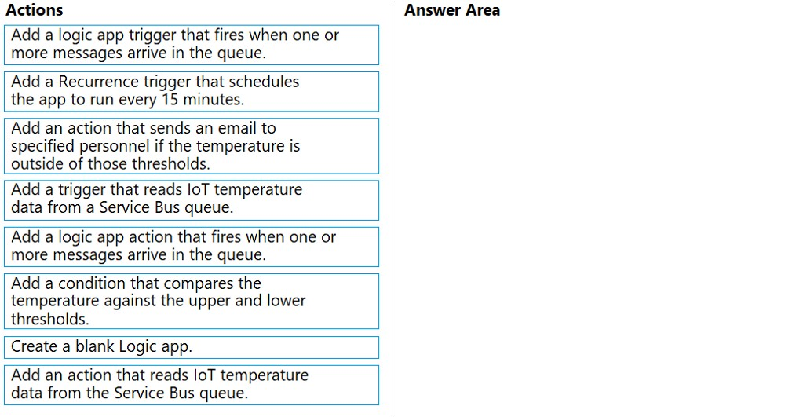

- [x] Box 1: Create a blank Logic app. Box 2: Add a logic app trigger that fires when one or more messages arrive in the queue. Box 3: Add an action that reads IoT temperature data from the Service Bus queue. Box 4: Add a condition that compares the temperature against the upper and lower thresholds. Box 5: Add an action that sends an email to
specified personnel if the temperature is outside of those thresholds.
- [ ] Box 1: Add a trigger that reads IoT temperature data from a Service Bus queue. Box 2: Add a condition that compares the temperature against the upper and lower thresholds. Box 3: Add a logic app action that fires when one or more messages arrive in the queue. Box 4: Create a blank Logic app. Box 5: Add an action that sends an email to specified personnel if the temperature is outside of those thresholds.
- [ ] Box 1: Add a condition that compares the temperature against the upper and lower thresholds. Box 2: Outbound. Box 3: Add a Recurence rigge that schedules the app to run every 15 minutes. Box 4: Add a trigger that reads IoT temperature data from a Service Bus queue. Box 5: Create a blank Logic app.
- [ ] Box 1: Create a blank Logic app. Box 2: Add a logic app action that fires when one or more messages arrive in the queue. Box 3: Add a condition that compares the temperature against the upper and lower thresholds. Box 4: Add an action that reads IoT temperature data from the Service Bus queue. Box 5: Add a condition that compares the temperature against the upper and lower thresholds.

**[⬆ Back to Top](#table-of-contents)**

### You are creating a hazard notification system that has a single signaling server which triggers audio and visual alarms to start and stop. You implement Azure Service Bus to publish alarms. Each alarm controller uses Azure Service Bus to receive alarm signals as part of a transaction. Alarm events must be recorded for audit purposes. Each transaction record must include information about the alarm type that was activated. You need to implement a reply trail auditing solution. Which two actions should you perform?

- [x] Assign the value of the hazard message `SessionID` property to the `ReplyToSessionId` property.
- [ ] Assign the value of the hazard message `MessageId` property to the `DevileryCount` property.
- [ ] Assign the value of the hazard message `SessionID` property to the `SequenceNumber` property.
- [x] Assign the value of the hazard message `MessageId` property to the `CorrelationId` property.
- [ ] Assign the value of the hazard message `SequenceNumber` property to the `DeliveryCount` property.
- [ ] Assign the value of the hazard message `MessageId` property to the `SequenceNumber` property.

**[⬆ Back to Top](#table-of-contents)**

### You are developing applications for a company. You plan to host the applications on Azure App Services. The company has the following requirements: Every five minutes verify that the websites are responsive. Verify that the websites respond within a specified time threshold. Dependent requests such as images and JavaScript files must load properly. Generate alerts if a website is experiencing issues. If a website fails to load, the system must attempt to reload the site three more times. You need to implement this process with the least amount of effort. What should you do?

- [ ] Create a Selenium web test and configure it to run from your workstation as a scheduled task.
- [x] Set up a URL ping test to query the home page.
- [ ] Create an Azure function to query the home page.
- [ ] Create a multi-step web test to query the home page.
- [ ] Create a Custom Track Availability Test to query the home page.

**[⬆ Back to Top](#table-of-contents)**

### You develop and add several functions to an Azure Function app that uses the latest runtime host. The functions contain several REST API endpoints secured by using SSL. The Azure Function app runs in a Consumption plan. You must send an alert when any of the function endpoints are unavailable or responding too slowly. You need to monitor the availability and responsiveness of the functions. What should you do?

- [ ] Create a URL ping test.
- [x] Create a timer triggered function that calls `TrackAvailability()` and send the results to Application Insights.
- [ ] Create a timer triggered function that calls `GetMetric('Request Size')` and send the results to Application Insights.
- [ ] Add a new diagnostic setting to the Azure Function app. Enable the `FunctionAppLogs` and Send to Log Analytics options.

**[⬆ Back to Top](#table-of-contents)**

### You are developing an e-commerce solution that uses a microservice architecture. You need to design a communication backplane for communicating transactional messages between various parts of the solution. Messages must be communicated in first-in-first-out (FIFO) order. What should you use?

- [ ] Azure Storage Queue.
- [ ] Azure Event Hub.
- [x] Azure Service Bus.
- [ ] Azure Event Grid.

**[⬆ Back to Top](#table-of-contents)**

### You are developing an Azure Service application that processes queue data when it receives a message from a mobile application. Messages may not be sent to the service consistently. You have the following requirements: Queue size must not grow larger than 80 gigabytes (GB). Use first-in-first-out (FIFO) ordering of messages. Minimize Azure costs. You need to implement the messaging solution. Solution: Use the .Net API to add a message to an Azure Service Bus Queue from the mobile application. Create an Azure Function App that uses an Azure Service Bus Queue trigger. Does the solution meet the goal?

- [x] Yes.
- [ ] No.

**[⬆ Back to Top](#table-of-contents)**

### You are developing an Azure solution to collect point-of-sale (POS) device data from 2,000 stores located throughout the world. A single device can produce 2 megabytes (MB) of data every 24 hours. Each store location has one to five devices that send data. You must store the device data in Azure Blob storage. Device data must be correlated based on a device identifier. Additional stores are expected to open in the future. You need to implement a solution to receive the device data. Solution: Provision an Azure Notification Hub. Register all devices with the hub. Does the solution meet the goal?

- [ ] Yes.
- [x] No.

**[⬆ Back to Top](#table-of-contents)**

### You are developing an Azure solution to collect point-of-sale (POS) device data from 2,000 stores located throughout the world. A single device can produce 2 megabytes (MB) of data every 24 hours. Each store location has one to five devices that send data. You must store the device data in Azure Blob storage. Device data must be correlated based on a device identifier. Additional stores are expected to open in the future. You need to implement a solution to receive the device data. Solution: Provision an Azure Service Bus. Configure a topic to receive the device data by using a correlation filter. Does the solution meet the goal?

- [x] Yes.
- [ ] No.

**[⬆ Back to Top](#table-of-contents)**

### You are developing an Azure solution to collect point-of-sale (POS) device data from 2,000 stores located throughout the world. A single device can produce 2 megabytes (MB) of data every 24 hours. Each store location has one to five devices that send data. You must store the device data in Azure Blob storage. Device data must be correlated based on a device identifier. Additional stores are expected to open in the future. You need to implement a solution to receive the device data. Solution: Provision an Azure Event Grid. Configure event filtering to evaluate the device identifier. Does the solution meet the goal?

- [ ] Yes.
- [x] No.

**[⬆ Back to Top](#table-of-contents)**

### You are developing an Azure Service application that processes queue data when it receives a message from a mobile application. Messages may not be sent to the service consistently. You have the following requirements: Queue size must not grow larger than 80 gigabytes (GB). Use first-in-first-out (FIFO) ordering of messages. Minimize Azure costs. You need to implement the messaging solution. Solution: Use the .Net API to add a message to an Azure Storage Queue from the mobile application. Create an Azure Function App that uses an Azure Storage Queue trigger. Does the solution meet the goal?

- [ ] Yes.
- [x] No.

**[⬆ Back to Top](#table-of-contents)**

### You are developing an Azure Service application that processes queue data when it receives a message from a mobile application. Messages may not be sent to the service consistently. You have the following requirements: Queue size must not grow larger than 80 gigabytes (GB). Use first-in-first-out (FIFO) ordering of messages. Minimize Azure costs. You need to implement the messaging solution. Solution: Use the .Net API to add a message to an Azure Storage Queue from the mobile application. Create an Azure VM that is triggered from Azure Storage Queue events. Does the solution meet the goal?

- [ ] Yes.
- [x] No.

**[⬆ Back to Top](#table-of-contents)**

### You are developing a solution that will use Azure messaging services. You need to ensure that the solution uses a publish-subscribe model and eliminates the need for constant polling. What are two possible ways to achieve the goal?

- [x] Service Bus.
- [ ] Event Hub.
- [x] Event Grid.
- [ ] Queue.

**[⬆ Back to Top](#table-of-contents)**

### A company is implementing a publish-subscribe (Pub/Sub) messaging component by using Azure Service Bus. You are developing the first subscription application. In the Azure portal you see that messages are being sent to the subscription for each topic. You create and initialize a subscription client object by supplying the correct details, but the subscription application is still not consuming the messages. You need to ensure that the subscription client processes all messages. Which code segment should you use?

- [ ] `await subscriptionClient.AddRuleAsync(new RuleDescription(RuleDescription.DefaultRuleName, new TrueFilter()));`.
- [ ] `subscriptionClient = new SubscriptionClient(ServiceBusConnectionString, TopicName, SubscriptionName);`.
- [ ] `await subscriptionClient.CloseAsync();`.
- [x] `subscriptionClient.RegisterMessageHandler(ProcessMessagesAsync, messageHandlerOptions);`.

**[⬆ Back to Top](#table-of-contents)**

### You are developing an Azure solution to collect point-of-sale (POS) device data from 2,000 stores located throughout the world. A single device can produce 2 megabytes (MB) of data every 24 hours. Each store location has one to five devices that send data. You must store the device data in Azure Blob storage. Device data must be correlated based on a device identifier. Additional stores are expected to open in the future. You need to implement a solution to receive the device data. Solution: Provision an Azure Event Hub. Configure the machine identifier as the partition key and enable capture. Does the solution meet the goal?

- [x] Yes.
- [ ] No.

**[⬆ Back to Top](#table-of-contents)**

### A company is developing a solution that allows smart refrigerators to send temperature information to a central location. The solution must receive and store messages until they can be processed. You create an Azure Service Bus instance by providing a name, pricing tier, subscription, resource group, and location. You need to complete the configuration. Which Azure CLI or PowerShell command should you run?

- [ ] `az group create --name fridge-rg --location fridge-loc`.
- [ ] `New-AzureRmServiceBusNamespace -ResourceGroupName fridge-rg -NamespaceName fridge-ns -Location fridge-loc`.
- [x] `New-AzureRmServiceBusQueue -ResourceGroupName fridge-rg -NamespaceName fridge-ns -Name fridge-q -EnablePartitioning $False`.
- [ ] `az servicebus namespace create --resource-group fridge-rg --name fridge-rg --location fridge-loc`.

**[⬆ Back to Top](#table-of-contents)**

### Your company has an azure subscription that includes a storage account, a resource group, a blob container and a file share. A fellow administrator named `Jon Ross` used an Azure Resource Manager template to deploy a virtual machine and an Azure Storage account. You need to identify the Azure Resource Manager template the Jon Ross used. Solution: You access the `Container` blade. Does the solution meet the goal?

- [ ] Yes.
- [x] No.

**[⬆ Back to Top](#table-of-contents)**

### Your company has an azure subscription that includes a storage account, a resource group, a blob container and a file share. A fellow administrator named `Jon Ross` used an Azure Resource Manager template to deploy a virtual machine and an Azure Storage account. You need to identify the Azure Resource Manager template the Jon Ross used. Solution: You access the `Virtual Machine` blade. Does the solution meet the goal?

- [ ] Yes.
- [x] No.

**[⬆ Back to Top](#table-of-contents)**

### Your company has an azure subscription that includes a storage account, a resource group, a blob container and a file share. A fellow administrator named `Jon Ross` used an Azure Resource Manager template to deploy a virtual machine and an Azure Storage account. You need to identify the Azure Resource Manager template the Jon Ross used. Solution: You access the `Resource Group` blade. Does the solution meet the goal?

- [x] Yes.
- [ ] No.

**[⬆ Back to Top](#table-of-contents)**

### You are developing a web app named `mywebapp1`. `Mywebapp1` uses the address myapp1.azurewebsites.net. You protect `mywebapp1` by implementing an Azure Web Application Firewall (WAF). The traffic to `mywebapp1` is routed through an Azure Application Gateway instance that is also used by other web apps. You want to secure all traffic to `mywebapp1` by using SSL. Solution: You open the Azure Application Gateway's HTTP setting and set the Override backend path option to `mywebapp1.azurewebsites.net`. You then enable the Use for App service option. Does this meet the goal?

- [x] Yes.
- [ ] No.

**[⬆ Back to Top](#table-of-contents)**

### You are developing a web app named `mywebapp1`. `Mywebapp1` uses the address myapp1.azurewebsites.net. You protect `mywebapp1` by implementing an Azure Web Application Firewall (WAF). The traffic to `mywebapp1` is routed through an Azure Application Gateway instance that is also used by other web apps. You want to secure all traffic to `mywebapp1` by using SSL. Solution: You configure `mywebapp1` to run in an Azure App service environment (ASE). Does this meet the goal?

- [ ] Yes.
- [x] No.

**[⬆ Back to Top](#table-of-contents)**

### You are developing a web app named `mywebapp1`. `Mywebapp1` uses the address myapp1.azurewebsites.net. You protect `mywebapp1` by implementing an Azure Web Application Firewall (WAF). The traffic to `mywebapp1` is routed through an Azure Application Gateway instance that is also used by other web apps. You want to secure all traffic to `mywebapp1` by using SSL. Solution: You open the Azure Application Gateway's HTTP setting and set the Override backend path option to `mywebapp1.azurewebsites.net`. You then add an authentication certificate for `mywebapp1.azurewebsites.net`. Does this meet the goal?

- [ ] Yes.
- [x] No.

**[⬆ Back to Top](#table-of-contents)**

### Your company has a web app named `WebApp1`. You use the WebJobs SDK to design a triggered App Service background task that automatically invokes a function in the code every time new data is received in a queue. You are preparing to configure the service processes a queue data item. Which of the following is the service you should use?

- [ ] Logic Apps.
- [x] WebJobs.
- [ ] Flow.
- [ ] Functions.

**[⬆ Back to Top](#table-of-contents)**

### Your company has an Azure subscription. You need to deploy a number of Azure virtual machines to the subscription by using Azure Resource Manager (ARM) templates. The virtual machines will be included in a single availability set. You need to ensure that the ARM template allows for as many virtual machines as possible to remain accessible in the event of fabric failure or maintenance. Which of the following is the value that you should configure for the `platformFaultDomainCount` property?

- [ ] 10.
- [ ] 30.
- [ ] Min Value.
- [x] Max Value.

**[⬆ Back to Top](#table-of-contents)**

### You have two Hyper-V hosts named `Host1` and `Host2`. Host1 has an Azure virtual machine named `VM1` that was deployed by using a custom Azure Resource Manager template. You need to move `VM1` to `Host2`. What should you do?

- [ ] From the `Update management` blade, click Enable.
- [ ] From the `Overview` blade, move `VM1` to a different subscription.
- [x] From the `Redeploy` blade, click Redeploy.
- [ ] From the `Profile` blade, modify the usage location.

**[⬆ Back to Top](#table-of-contents)**

### Your company has an Azure Kubernetes Service (AKS) cluster that you manage from an Azure AD-joined device. The cluster is located in a resource group. Developers have created an application named `MyApp`. `MyApp` was packaged into a container image. You need to deploy the YAML manifest file for the application. Solution: You install the Azure CLI on the device and run the `kubectl apply -f myapp.yaml` command. Does this meet the goal?

- [x] Yes.
- [ ] No.

**[⬆ Back to Top](#table-of-contents)**

### Your company has an Azure Kubernetes Service (AKS) cluster that you manage from an Azure AD-joined device. The cluster is located in a resource group. Developers have created an application named `MyApp`. `MyApp` was packaged into a container image. You need to deploy the YAML manifest file for the application. Solution: You install the docker client on the device and run the `docker run -it microsoft/azure-cli:0.10.17` command. Does this meet the goal?

- [ ] Yes.
- [x] No.

**[⬆ Back to Top](#table-of-contents)**

### Your company has an Azure subscription. You need to deploy a number of Azure virtual machines to the subscription by using Azure Resource Manager (ARM) templates. The virtual machines will be included in a single availability set. You need to ensure that the ARM template allows for as many virtual machines as possible to remain accessible in the event of fabric failure or maintenance. Which of the following is the value that you should configure for the platformUpdateDomainCount property?

- [ ] 10.
- [x] 20.
- [ ] 30.
- [ ] 40.

**[⬆ Back to Top](#table-of-contents)**

### You are designing an Azure WebJob that will run on the same instances as a web app. You want to make use of a suitable WebJob type. The webjob type should also allow for the option to restrict the WebJob to a single instance. Solution: You configure the use of the Triggered WebJob type. Does the solution meet the goal?

- [ ] Yes.
- [x] No.

**[⬆ Back to Top](#table-of-contents)**

### You are designing an Azure WebJob that will run on the same instances as a web app. You want to make use of a suitable WebJob type. The webjob type should also allow for the option to restrict the WebJob to a single instance. Solution: You configure the use of the Continuous WebJob type. Does the solution meet the goal?

- [x] Yes.
- [ ] No.

**[⬆ Back to Top](#table-of-contents)**

### You company has an on-premises deployment of MongoDB, and an Azure Cosmos DB account that makes use of the MongoDB API. You need to devise a strategy to migrate MongoDB to the Azure Cosmos DB account. You include the [Data Management Gateway] tool in your migration strategy.

- [ ] No change required.
- [x] mongorestore.
- [ ] Azure Storage Explorer.
- [ ] `AzCopy`.

**[⬆ Back to Top](#table-of-contents)**

### You are developing an application that processes Azure Blob storage events. Your application has the following requirements: Process transaction logs asynchronously for changes that occur to the blobs and the blob metadata. Process changes in the order in which they occurred. Retain changes for compliance reasons. Solution: You use Azure Event Grid with a subscriber Azure Function app. Does the solution meet the goal?

- [x] Yes.
- [ ] No.

**[⬆ Back to Top](#table-of-contents)**

### You are developing an application that processes Azure Blob storage events. Your application has the following requirements: Process transaction logs asynchronously for changes that occur to the blobs and the blob metadata. Process changes in the order in which they occurred. Retain changes for compliance reasons. Solution: You use Azure Monitor HTTP Data Collector API. Does the solution meet the goal?

- [ ] Yes.
- [x] No.

**[⬆ Back to Top](#table-of-contents)**

### You are developing a mobile app that uses an Azure SQL Database named `Weyland`. The database contains a table names Customers that has a field named `email_address`. You want to implement dynamic data masking to hide the data in the `email_address` field. Solution: You run the follows transact-SQL statement: `ALTER TABLE [dbo].[Weyland].[Customers] ALTER COLUMN [email_address] ADD MASKED WITH (FUNCTION = 'email()')`. Does the solution meet the goal?

- [x] Yes.
- [ ] No.

**[⬆ Back to Top](#table-of-contents)**

### You are developing a mobile app that uses an Azure SQL Database named `Weyland`. The database contains a table names Customers that has a field named `email_address`. You want to implement dynamic data masking to hide the data in the `email_address` field. Solution: You run the `Set-AzSqlDatabaseDataMaskingPolicy -DatabaseName 'Weyland'` Powershell cmdlet Does the solution meet the goal?

- [ ] Yes.
- [x] No.

**[⬆ Back to Top](#table-of-contents)**

### You are developing a mobile app that uses an Azure SQL Database named `Weyland`. The database contains a table names Customers that has a field named `email_address`. You want to implement dynamic data masking to hide the data in the `email_address` field. Solution: You run the `Set-AzSqlDatabaseDataMaskingRule -DatabaseName 'Weyland' -SchemaName 'dbo' -TableName 'Customers' -ColumnName 'email_address' -MaskingFunction 'email'` Powershell cmdlet Does the solution meet the goal?

- [x] Yes.
- [ ] No.

**[⬆ Back to Top](#table-of-contents)**

### You are developing an e-Commerce Web App. You want to use Azure Key Vault to ensure that sign-ins to the e-Commerce Web App are secured by using Azure App Service authentication and Azure Active Directory (AAD). What should you do on the e-Commerce Web App?

- [ ] Run the `az keyvault secret` command.
- [ ] Enable Azure AD Connect.
- [x] Enable Managed Service Identity (MSI).
- [ ] Create an Azure AD service principal.

**[⬆ Back to Top](#table-of-contents)**

### You are developing a web app that uses Azure Active Directory (Azure AD) for authentication. You want to configure the web app to use multifactor authentication. What should you do?

- [ ] Enable mobile app authentication.
- [ ] In Azure AD conditional access, enable the baseline policy.
- [x] In Azure AD, create a conditional access policy.
- [ ] Install the Azure Multi-Factor Authentication Server.

**[⬆ Back to Top](#table-of-contents)**

### You are creating an Azure key vault using PowerShell. Objects deleted from the key vault must be kept for a set period of 90 days. Which two of the following parameters must be used in conjunction to meet the requirement? (Choose two.)

- [ ] `EnabledForDeployment`.
- [x] `EnablePurgeProtection`.
- [ ] `EnabledForTemplateDeployment`.
- [x] `EnableSoftDelete`.

**[⬆ Back to Top](#table-of-contents)**

### Your company has an Azure Active Directory (Azure AD) environment. Users occasionally connect to Azure AD via the Internet. You need to ensure that users who connect to Azure AD via the internet using an unidentified IP address, are automatically instructed to change their passwords. Solution: You configure the use of Azure Key Vault. Does the solution meet the goal?

- [ ] Yes.
- [x] No.

**[⬆ Back to Top](#table-of-contents)**

### Your company has an Azure Active Directory (Azure AD) environment. Users occasionally connect to Azure AD via the Internet. You need to ensure that users who connect to Azure AD via the internet using an unidentified IP address, are automatically instructed to change their passwords. Solution: You configure the use of Azure AD Identity Protection. Does the solution meet the goal?

- [x] Yes.
- [ ] No.

**[⬆ Back to Top](#table-of-contents)**

### Your company has an Azure Active Directory (Azure AD) environment. Users occasionally connect to Azure AD via the Internet. You need to ensure that users who connect to Azure AD via the internet using an unidentified IP address, are automatically instructed to change their passwords. Solution: You configure the use of Azure AD Privileged Identity Management. Does the solution meet the goal?

- [ ] Yes.
- [x] No.

**[⬆ Back to Top](#table-of-contents)**

### You manage an Azure SQL database that allows for Azure AD authentication. You need to make sure that database developers can connect to the SQL database via Microsoft SQL Server Management Studio (SSMS). You also need to make sure the developers use their on-premises Active Directory account for authentication. Your strategy should allow for authentication prompts to be kept to a minimum. Which of the following should you implement?

- [ ] Azure AD token.
- [ ] Azure Multi-Factor authentication.
- [x] Active Directory integrated authentication.
- [ ] OATH software tokens.

**[⬆ Back to Top](#table-of-contents)**

### You are developing an application to transfer data between on-premises file servers and Azure Blob storage. The application stores keys, secrets, and certificates in Azure Key Vault and makes use of the Azure Key Vault APIs. You want to configure the application to allow recovery of an accidental deletion of the key vault or key vault objects for 90 days after deletion. What should you do?

- [ ] Run the `Add-AzKeyVaultKey` cmdlet.
- [x] Run the `az keyvault update --enable-soft-delete true --enable-purge-protection true` CLI.
- [ ] Implement virtual network service endpoints for Azure Key Vault.
- [ ] Run the `az keyvault update --enable-soft-delete false` CLI.

**[⬆ Back to Top](#table-of-contents)**

### You are configuring a web app that delivers streaming video to users. The application makes use of continuous integration and deployment. You need to ensure that the application is highly available and that the users' streaming experience is constant. You also want to configure the application to store data in a geographic location that is nearest to the user. Solution: You include the use of Azure Redis Cache in your design. Does the solution meet the goal?

- [ ] Yes.
- [x] No.

**[⬆ Back to Top](#table-of-contents)**

### You are configuring a web app that delivers streaming video to users. The application makes use of continuous integration and deployment. You need to ensure that the application is highly available and that the users' streaming experience is constant. You also want to configure the application to store data in a geographic location that is nearest to the user. Solution: You include the use of an Azure Content Delivery Network (CDN) in your design. Does the solution meet the goal?

- [x] Yes.
- [ ] No.

**[⬆ Back to Top](#table-of-contents)**

### You are configuring a web app that delivers streaming video to users. The application makes use of continuous integration and deployment. You need to ensure that the application is highly available and that the users' streaming experience is constant. You also want to configure the application to store data in a geographic location that is nearest to the user. Solution: You include the use of a Storage Area Network (SAN) in your design. Does the solution meet the goal?

- [ ] Yes.
- [x] No.

**[⬆ Back to Top](#table-of-contents)**

### You develop a Web App on a tier D1 app service plan. You notice that page load times increase during periods of peak traffic. You want to implement automatic scaling when CPU load is above 80 percent. Your solution must minimize costs. What should you do first?

- [ ] Enable autoscaling on the Web App.
- [ ] Switch to the Premium App Service tier plan.
- [x] Switch to the Standard App Service tier plan.
- [ ] Switch to the Azure App Services consumption plan.

**[⬆ Back to Top](#table-of-contents)**

### You are developing a solution for a public facing API. The API back end is hosted in an Azure App Service instance. You have implemented a RESTful service for the API back end. You must configure back-end authentication for the API Management service instance. Solution: You configure Basic gateway credentials for the Azure resource. Does the solution meet the goal?

- [ ] Yes.
- [x] No.

**[⬆ Back to Top](#table-of-contents)**

### You are developing a solution for a public facing API. The API back end is hosted in an Azure App Service instance. You have implemented a RESTful service for the API back end. You must configure back-end authentication for the API Management service instance. Solution: You configure Client cert gateway credentials for the HTTP(s) endpoint. Does the solution meet the goal?

- [ ] Yes.
- [x] No.

**[⬆ Back to Top](#table-of-contents)**

### You are developing a solution for a public facing API. The API back end is hosted in an Azure App Service instance. You have implemented a RESTful service for the API back end. You must configure back-end authentication for the API Management service instance. Solution: You configure Basic gateway credentials for the HTTP(s) endpoint. Does the solution meet the goal?

- [ ] Yes.
- [x] No.

**[⬆ Back to Top](#table-of-contents)**

### You are developing a solution for a public facing API. The API back end is hosted in an Azure App Service instance. You have implemented a RESTful service for the API back end. You must configure back-end authentication for the API Management service instance. Solution: You configure Client cert gateway credentials for the Azure resource. Does the solution meet the goal?

- [x] Yes.
- [ ] No.

**[⬆ Back to Top](#table-of-contents)**

### You are developing a .NET Core MVC application that allows customers to research independent holiday accommodation providers. You want to implement Azure Search to allow the application to search the index by using various criteria to locate documents related to accommodation venues. You want the application to list holiday accommodation venues that fall within a specific price range and are within a specified distance to an airport. What should you do?

- [ ] Configure the `SearchMode` property of the `SearchParameters` class.
- [ ] Configure the `QueryType` property of the `SearchParameters` class.
- [ ] Configure the `Facets` property of the `SearchParameters` class.
- [x] Configure the `Filter` property of the `SearchParameters` class.

**[⬆ Back to Top](#table-of-contents)**

### You are a developer at your company. You need to edit the workflows for an existing Logic App. What should you use?

- [ ] The Enterprise Integration Pack (EIP).
- [ ] The Logic App Code View.
- [ ] The API Connections.
- [x] The Logic Apps Designer.

**[⬆ Back to Top](#table-of-contents)**

### You are developing an application that applies a set of governance policies for internal and external services, as well as for applications. You develop a stateful ASP.NET Core 2.1 web application named `PolicyApp` and deploy it to an Azure App Service Web App. The `PolicyApp` reacts to events from Azure Event Grid and performs policy actions based on those events. You have the following requirements: Authentication events must be used to monitor users when they sign in and sign out. All authentication events must be processed by `PolicyApp`. Sign outs must be processed as fast as possible. What should you do?

- [ ] Create a new Azure Event Grid subscription for all authentication events. Use the subscription to process sign-out events.
- [ ] Create a separate Azure Event Grid handler for sign-in and sign-out events.
- [ ] Create separate Azure Event Grid topics and subscriptions for sign-in and sign-out events.
- [x] Add a subject prefix to sign-out events. Create an Azure Event Grid subscription. Configure the subscription to use the subjectBeginsWith filter.

**[⬆ Back to Top](#table-of-contents)**

### You are a developer for Contoso, Ltd. The company has a social networking website that is developed as a Single Page Application (SPA). The main web application for the social networking website loads user uploaded content from blob storage. You are developing a solution to monitor uploaded data for inappropriate content. The following process occurs when users upload content by using the SPA: Messages are sent to ContentUploadService. Content is processed by ContentAnalysisService. After processing is complete, the content is posted to the social network or a rejection message is posted in its place. The `ContentAnalysisService` is deployed with Azure Container Instances from a private Azure Container Registry named `contosoimages`. The solution will use eight CPU cores. Azure Active Directory: Contoso, Ltd. uses Azure Active Directory (Azure AD) for both internal and guest accounts. Requirements: `ContentAnalysisService` - The company's data science group built `ContentAnalysisService` which accepts user generated content as a string and returns a probable value for inappropriate content. Any values over a specific threshold must be reviewed by an employee of Contoso, Ltd. You must create an Azure Function named `CheckUserContent` to perform the content checks. Costs: You must minimize costs for all Azure services. Manual review: To review content, the user must authenticate to the website portion of the `ContentAnalysisService` using their Azure AD credentials. The website is built using React and all pages and API endpoints require authentication. In order to review content a user must be part of a ContentReviewer role. All completed reviews must include the reviewer's email address for auditing purposes. High availability: All services must run in multiple regions. The failure of any service in a region must not impact overall application availability. Monitoring: An alert must be raised if the `ContentUploadService` uses more than 80 percent of available CPU cores. Security: You have the following security requirements: Any web service accessible over the Internet must be protected from cross site scripting attacks. All websites and services must use SSL from a valid root certificate authority. Azure Storage access keys must only be stored in memory and must be available only to the service. All Internal services must only be accessible from internal Virtual Networks (VNets). All parts of the system must support inbound and outbound traffic restrictions. All service calls must be authenticated by using Azure AD. User agreements: When a user submits content, they must agree to a user agreement. The agreement allows employees of Contoso, Ltd. to review content, store cookies on user devices, and track user's IP addresses. Information regarding agreements is used by multiple divisions within Contoso, Ltd. User responses must not be lost and must be available to all parties regardless of individual service uptime. The volume of agreements is expected to be in the millions per hour. Validation testing: When a new version of the `ContentAnalysisService` is available the previous seven days of content must be processed with the new version to verify that the new version does not significantly deviate from the old version. Issues: Users of the `ContentUploadService` report that they occasionally see HTTP `502` responses on specific pages. Code - `ContentUploadService` - `ApplicationManifest`. You need to add code at line AM09 to ensure that users can review content using ContentAnalysisService. How should you complete the code?

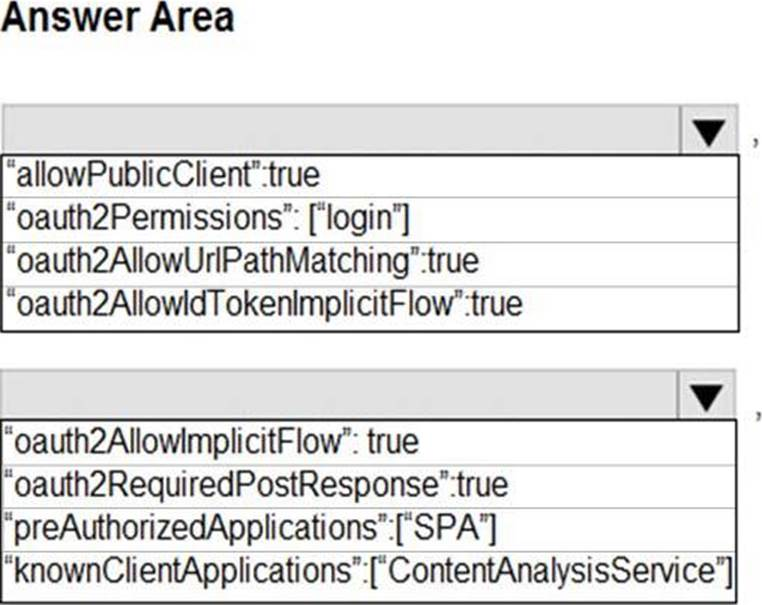

- [ ] Box 1: `"oauth2Permissions": ["login"]`. Box 2: `"oauth2AllowImplicitFlow": true`.
- [x] Box 1: `"oauth2AllowIdTokenImplicitFlow": true`. Box 2: `"oauth2AllowImplicitFlow": true`.
- [ ] Box 1: `"allowPublicClient": true`. Box 2: `"knownClientApplications": ["ContentAnalysisService"]`.
- [ ] Box 1: `"oauth2Permissions": ["login"]`. Box 2: `"preAuthorizedApplications": ["SPA"]`.

**[⬆ Back to Top](#table-of-contents)**

### You are a developer for Contoso, Ltd. The company has a social networking website that is developed as a Single Page Application (SPA). The main web application for the social networking website loads user uploaded content from blob storage. You are developing a solution to monitor uploaded data for inappropriate content. The following process occurs when users upload content by using the SPA: Messages are sent to ContentUploadService. Content is processed by ContentAnalysisService. After processing is complete, the content is posted to the social network or a rejection message is posted in its place. The `ContentAnalysisService` is deployed with Azure Container Instances from a private Azure Container Registry named `contosoimages`. The solution will use eight CPU cores. Azure Active Directory: Contoso, Ltd. uses Azure Active Directory (Azure AD) for both internal and guest accounts. Requirements: `ContentAnalysisService` - The company's data science group built `ContentAnalysisService` which accepts user generated content as a string and returns a probable value for inappropriate content. Any values over a specific threshold must be reviewed by an employee of Contoso, Ltd. You must create an Azure Function named `CheckUserContent` to perform the content checks. Costs: You must minimize costs for all Azure services. Manual review: To review content, the user must authenticate to the website portion of the `ContentAnalysisService` using their Azure AD credentials. The website is built using React and all pages and API endpoints require authentication. In order to review content a user must be part of a ContentReviewer role. All completed reviews must include the reviewer's email address for auditing purposes. High availability: All services must run in multiple regions. The failure of any service in a region must not impact overall application availability. Monitoring: An alert must be raised if the `ContentUploadService` uses more than 80 percent of available CPU cores. Security: You have the following security requirements: Any web service accessible over the Internet must be protected from cross site scripting attacks. All websites and services must use SSL from a valid root certificate authority. Azure Storage access keys must only be stored in memory and must be available only to the service. All Internal services must only be accessible from internal Virtual Networks (VNets). All parts of the system must support inbound and outbound traffic restrictions. All service calls must be authenticated by using Azure AD. User agreements: When a user submits content, they must agree to a user agreement. The agreement allows employees of Contoso, Ltd. to review content, store cookies on user devices, and track user's IP addresses. Information regarding agreements is used by multiple divisions within Contoso, Ltd. User responses must not be lost and must be available to all parties regardless of individual service uptime. The volume of agreements is expected to be in the millions per hour. Validation testing: When a new version of the `ContentAnalysisService` is available the previous seven days of content must be processed with the new version to verify that the new version does not significantly deviate from the old version. Issues: Users of the `ContentUploadService` report that they occasionally see HTTP `502` responses on specific pages. Code - `ContentUploadService` - `ApplicationManifest`. You need to add code at line AM10 of the application manifest to ensure that the requirement for manually reviewing content can be met. How should you complete the code?

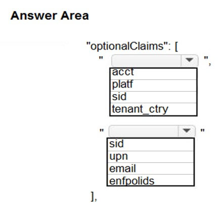

- [x] Box 1: `sid`. Box 2: `email`.
- [ ] Box 1: `platf`. Box 2: `sid`.
- [ ] Box 1: `tenant_ctry`. Box 2: `upn`.
- [ ] Box 1: `sid`. Box 2: `enfpolids`.

**[⬆ Back to Top](#table-of-contents)**

### You are a developer for Contoso, Ltd. The company has a social networking website that is developed as a Single Page Application (SPA). The main web application for the social networking website loads user uploaded content from blob storage. You are developing a solution to monitor uploaded data for inappropriate content. The following process occurs when users upload content by using the SPA: Messages are sent to ContentUploadService. Content is processed by ContentAnalysisService. After processing is complete, the content is posted to the social network or a rejection message is posted in its place. The `ContentAnalysisService` is deployed with Azure Container Instances from a private Azure Container Registry named `contosoimages`. The solution will use eight CPU cores. Azure Active Directory: Contoso, Ltd. uses Azure Active Directory (Azure AD) for both internal and guest accounts. Requirements: `ContentAnalysisService` - The company's data science group built `ContentAnalysisService` which accepts user generated content as a string and returns a probable value for inappropriate content. Any values over a specific threshold must be reviewed by an employee of Contoso, Ltd. You must create an Azure Function named `CheckUserContent` to perform the content checks. Costs: You must minimize costs for all Azure services. Manual review: To review content, the user must authenticate to the website portion of the `ContentAnalysisService` using their Azure AD credentials. The website is built using React and all pages and API endpoints require authentication. In order to review content a user must be part of a ContentReviewer role. All completed reviews must include the reviewer's email address for auditing purposes. High availability: All services must run in multiple regions. The failure of any service in a region must not impact overall application availability. Monitoring: An alert must be raised if the `ContentUploadService` uses more than 80 percent of available CPU cores. Security: You have the following security requirements: Any web service accessible over the Internet must be protected from cross site scripting attacks. All websites and services must use SSL from a valid root certificate authority. Azure Storage access keys must only be stored in memory and must be available only to the service. All Internal services must only be accessible from internal Virtual Networks (VNets). All parts of the system must support inbound and outbound traffic restrictions. All service calls must be authenticated by using Azure AD. User agreements: When a user submits content, they must agree to a user agreement. The agreement allows employees of Contoso, Ltd. to review content, store cookies on user devices, and track user's IP addresses. Information regarding agreements is used by multiple divisions within Contoso, Ltd. User responses must not be lost and must be available to all parties regardless of individual service uptime. The volume of agreements is expected to be in the millions per hour. Validation testing: When a new version of the `ContentAnalysisService` is available the previous seven days of content must be processed with the new version to verify that the new version does not significantly deviate from the old version. Issues: Users of the `ContentUploadService` report that they occasionally see HTTP `502` responses on specific pages. Code - `ContentUploadService` - `ApplicationManifest`. You need to ensure that network security policies are met. How should you configure network security?

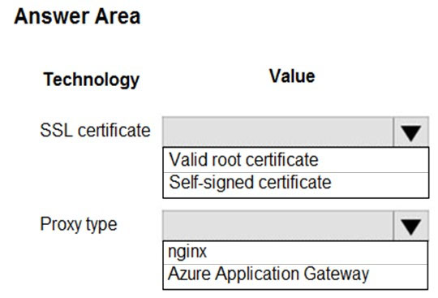

- [ ] SSL certificate: Self-signed certificate. Proxy type: nginx.
- [ ] SSL certificate: Self-signed certificate. Proxy type: Azure Application Gateway.
- [ ] SSL certificate: Valid root certificate. Proxy type: nginx.
- [x] SSL certificate: Valid root certificate. Proxy type: Azure Application Gateway.

**[⬆ Back to Top](#table-of-contents)**

### You are building a website to access project data related to teams within your organization. The website does not allow anonymous access. Authentication is performed using an Azure Active Directory (Azure AD) app named internal. The website has the following authentication requirements: Azure AD users must be able to login to the website. Personalization of the website must be based on membership in Active Directory groups. You need to configure the application's manifest to meet the authentication requirements. How should you configure the manifest?

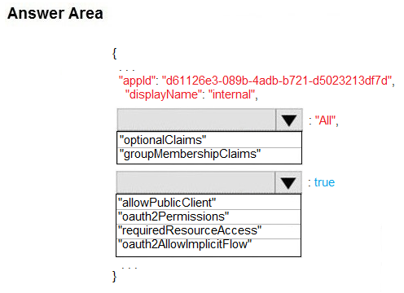

- [ ] Box 1: "optionalClaims". Box 2: "allowPublicClient".
- [ ] Box 1: "optionalClaims". Box 2: "requiredResourceAccess".
- [ ] Box 1: "groupMembershipClaims". Box 2: "oauth2Permissions".
- [x] Box 1: "groupMembershipClaims". Box 2: "oauth2AllowimplicitFlow".

**[⬆ Back to Top](#table-of-contents)**

### You are developing an Azure solution. You need to develop code to access a secret stored in Azure Key Vault. How should you complete the code segment?

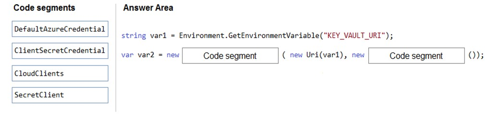

- [ ] Box 1: `DefaultAzureCredential`. Box 2: `ClientSecretCredential`.
- [ ] Box 1: `CloudClients`. Box 2: `ClientSecretCredential`.
- [ ] Box 1: `ClientSecretCredential`. Box 2: `SecretClient`.
- [x] Box 1: `SecretClient`. Box 2: `DefaultAzureCredential`.

**[⬆ Back to Top](#table-of-contents)**

### You are developing a web application that makes calls to the Microsoft Graph API. You register the application in the Azure portal and upload a valid `X509` certificate. You create an appsettings.json file containing the certificate name, client identifier for the application, and the tenant identifier of the Azure Active Directory (Azure AD). You create a method named `ReadCertificate` to return the `X509` certificate by name. You need to implement code that acquires a token by using the certificate. How should you complete the code segment?

- [ ] Box 1: `ConfidentialClientApplicationBuilder`. Box 2: `app`.
- [x] Box 1: `ConfidentialClientApplicationBuilder`. Box 2: `scopes`.
- [ ] Box 1: `GetAccountAsync()`. Box 2: `scopes`.
- [ ] Box 1: `ConfidentialClientApplication`. Box 2: `config`.

**[⬆ Back to Top](#table-of-contents)**

### You are developing an ASP.NET Core Web API web service. The web service uses Azure Application Insights for all telemetry and dependency tracking. The web service reads and writes data to a database other than Microsoft SQL Server. You need to ensure that dependency tracking works for calls to the third-party database. Which two dependency telemetry properties should you use?

- [ ] `Telemetry.Context.Cloud.RoleInstance`.
- [x] `Telemetry.Id`.
- [ ] `Telemetry.Name`.
- [x] `Telemetry.Context.Operation.Id`.
- [ ] `Telemetry.Context.Session.Id`.

**[⬆ Back to Top](#table-of-contents)**

### You are developing an Azure App Service hosted ASP.NET Core web app to deliver video-on-demand streaming media. You enable an Azure Content Delivery Network (CDN) Standard for the web endpoint. Customer videos are downloaded from the web app by using the following example URL: `http://www.contoso.com/content.mp4?quality=1`. All media content must expire from the cache after one hour. Customer videos with varying quality must be delivered to the closest regional point of presence (POP) node. You need to configure Azure CDN caching rules. Which options should you use?

- [x] Caching behavior: Override. Cache expiration duration: 1 hour. Query string caching behavior: Cache every unique URL.
- [ ] Caching behavior: Bypass cache. Cache expiration duration: 1 day. Query string caching behavior: Bypass caching for query strings.
- [ ] Caching behavior: Set if missing. Cache expiration duration: 1 second. Query string caching behavior: Ignore query strings.
- [ ] Caching behavior: Override. Cache expiration duration: 1 hour. Query string caching behavior: Ignore query strings.

**[⬆ Back to Top](#table-of-contents)**

### You develop a web app that uses tier D1 app service plan by using the Web Apps feature of Microsoft Azure App Service. Spikes in traffic have caused increases in page load times. You need to ensure that the web app automatically scales when CPU load is about 85 percent and minimize costs. Which four actions should you perform in sequence?

- [x] Box 1: Configure the web app to the Standard App Service tier. Box 2: Enable autoscaling on the web app. Box 3: Add a Scale rule. Box 4: Configure a Scale condition.
- [ ] Box 1: Enable autoscaling on the web app. Box 2: Add a Scale rule. Box 3:Configure a Scale condition. Box 4:Switch to an Azure App Services consumption plan.
- [ ] Box 1: Configure the web app to the Standard App Service tier. Box 2: Enable autoscaling on the web app. Box 3: Configure a Scale condition. Box 4: SecretClient.
- [ ] Box 1: Switch to an Azure App Services consumption plan. Box 2: Configure the web app to the Premium App Service tier. Box 3: Enable autoscaling on the web app. Box 4: Configure a Scale condition.

**[⬆ Back to Top](#table-of-contents)**

### A company backs up all manufacturing data to Azure Blob Storage. Admins move blobs from hot storage to archive tier storage every month. You must automatically move blobs to Archive tier after they have not been modified within 180 days. The path for any item that is not archived must be placed in an existing queue. This operation must be performed automatically once a month. You set the value of TierAgeInDays to -180. How should you configure the Logic App?

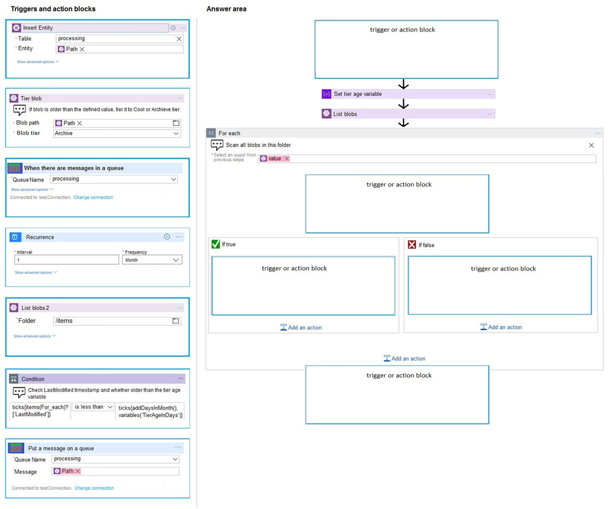

- [ ] Box 1: Put a message on a queue. Box 2: Recurrence. Box 3: Condition. Box 4: When there are messages in a queue. Box 5: List blobs 2.
- [ ] Box 1: Recurrence. Box 2: Condition. Box 3: When there are messages in a queue. Box 4: Tier blob. Box 5: List blobs 2.
- [ ] Box 1: Recurrence. Box 2: Condition. Box 3: Put a message on a queue. Box 4: When there are messages in a queue. Box 5: Tier blob.
- [x] Box 1: Recurrence. Box 2: Condition. Box 3: Put a message on a queue. Box 4: Tier blob. Box 5: List blobs 2.

**[⬆ Back to Top](#table-of-contents)**

### You have an Azure Web app that uses Cosmos DB as a data store. You create a CosmosDB container by running the following PowerShell script: `$resourceGroupName = 'testResourceGroup' $accountName = 'testCosmosAccount' $databaseName = 'testDatabase' $containerName = 'testContainer' $partitionKeyPath = '/EmployeeId' $autoscaleMaxThroughput = 5000 New-AzCosmosDBSqlContainer - -ResourceGroupName $resourceGroupName -AccountName $accountName -DatabaseName $databaseName -Name $containerName -PartitionKeyKind Hash -PartitionKeyPath $partitionKeyPath -AutoscaleMaxThroughput $autoscaleMaxThroughput`. You create the following queries that target the container: `SELECT * FROM c WHERE c.EmployeeId > '12345' SELECT * FROM c WHERE c.UserID = '12345'`. Question 1: The minimum throughput for the container is 400 R/Us.

- [ ] Yes.
- [x] No.

**[⬆ Back to Top](#table-of-contents)**

### You have an Azure Web app that uses Cosmos DB as a data store. You create a CosmosDB container by running the following PowerShell script: `$resourceGroupName = 'testResourceGroup' $accountName = 'testCosmosAccount' $databaseName = 'testDatabase' $containerName = 'testContainer' $partitionKeyPath = '/EmployeeId' $autoscaleMaxThroughput = 5000 New-AzCosmosDBSqlContainer - -ResourceGroupName $resourceGroupName -AccountName $accountName -DatabaseName $databaseName -Name $containerName -PartitionKeyKind Hash -PartitionKeyPath $partitionKeyPath -AutoscaleMaxThroughput $autoscaleMaxThroughput`. You create the following queries that target the container: `SELECT * FROM c WHERE c.EmployeeId > '12345' SELECT * FROM c WHERE c.UserID = '12345'`. Question 2: The first query statement is an in-partition query.

- [ ] Yes.
- [x] No.

**[⬆ Back to Top](#table-of-contents)**

### You have an Azure Web app that uses Cosmos DB as a data store. You create a CosmosDB container by running the following PowerShell script: `$resourceGroupName = 'testResourceGroup' $accountName = 'testCosmosAccount' $databaseName = 'testDatabase' $containerName = 'testContainer' $partitionKeyPath = '/EmployeeId' $autoscaleMaxThroughput = 5000 New-AzCosmosDBSqlContainer - -ResourceGroupName $resourceGroupName -AccountName $accountName -DatabaseName $databaseName -Name $containerName -PartitionKeyKind Hash -PartitionKeyPath $partitionKeyPath -AutoscaleMaxThroughput $autoscaleMaxThroughput`. You create the following queries that target the container: `SELECT * FROM c WHERE c.EmployeeId > '12345' SELECT * FROM c WHERE c.UserID = '12345'`. Question 3: The second query statement is a cross-partition query.

- [x] Yes.
- [ ] No.

**[⬆ Back to Top](#table-of-contents)**

### Your Azure Active Directory Azure (Azure AD) tenant has an Azure subscription linked to it. Your developer has created a mobile application that obtains Azure AD access tokens using the OAuth 2 implicit grant type. The mobile application must be registered in Azure AD. You require [a redirect URI] from the developer for registration purposes.

- [x] No change required.
- [ ] a secret.
- [ ] a login hint.
- [ ] a client ID.

**[⬆ Back to Top](#table-of-contents)**

### You develop an ASP.NET Core MVC application. You configure the application to track webpages and custom events. You need to identify trends in application usage. Which Azure Application Insights Usage Analysis features should you use?

- [x] Box 1: Funnels. Box 2: Impact. Box 3: Retention. Box 4: User Flows.
- [ ] Box 1: Impact. Box 2: Funnels. Box 3: Retention. Box 4: User Flows.
- [ ] Box 1: Users. Box 2: Impact. Box 3: Retention. Box 4: User Flows.
- [ ] Box 1: Impact. Box 2: Users. Box 3: User Flows. Box 4: Funnels.

**[⬆ Back to Top](#table-of-contents)**

### You are developing an application that uses a premium block blob storage account. You are optimizing costs by automating Azure Blob Storage access tiers. You apply the following policy rules to the storage account. You must determine the implications of applying the rules to the data. (Line numbers are included for reference only.) Question 1: Block blobs prefixed with container1/salesorders or container2/inventory which have not been modified in over 60 days are moved to cool storage. Blobs that have not been modified in 120 days are moved to the archive tier.

- [x] Yes.
- [ ] No.

**[⬆ Back to Top](#table-of-contents)**

### You are developing an application that uses a premium block blob storage account. You are optimizing costs by automating Azure Blob Storage access tiers. You apply the following policy rules to the storage account. You must determine the implications of applying the rules to the data. (Line numbers are included for reference only.) Question 2: Blobs are moved to cool storage if they have not been accessed for 30 days.

- [x] Yes.
- [ ] No.

**[⬆ Back to Top](#table-of-contents)**

### You are developing an application that uses a premium block blob storage account. You are optimizing costs by automating Azure Blob Storage access tiers. You apply the following policy rules to the storage account. You must determine the implications of applying the rules to the data. (Line numbers are included for reference only.) Question 3: Blobs will automatically be tiered from cool back to hot if accessed again after being tiered to cool.

- [x] Yes.
- [ ] No.

**[⬆ Back to Top](#table-of-contents)**

### You are developing an application that uses a premium block blob storage account. You are optimizing costs by automating Azure Blob Storage access tiers. You apply the following policy rules to the storage account. You must determine the implications of applying the rules to the data. (Line numbers are included for reference only.) Question 4: All block blobs older than 730 days will be deleted.

- [ ] Yes.
- [x] No.

**[⬆ Back to Top](#table-of-contents)**

### You are a developer for Contoso, Ltd. The company has a social networking website that is developed as a Single Page Application (SPA). The main web application for the social networking website loads user uploaded content from blob storage. You are developing a solution to monitor uploaded data for inappropriate content. The following process occurs when users upload content by using the SPA: Messages are sent to ContentUploadService. Content is processed by ContentAnalysisService. After processing is complete, the content is posted to the social network or a rejection message is posted in its place. The `ContentAnalysisService` is deployed with Azure Container Instances from a private Azure Container Registry named `contosoimages`. The solution will use eight CPU cores. Azure Active Directory: Contoso, Ltd. uses Azure Active Directory (Azure AD) for both internal and guest accounts. Requirements: `ContentAnalysisService` - The company's data science group built `ContentAnalysisService` which accepts user generated content as a string and returns a probable value for inappropriate content. Any values over a specific threshold must be reviewed by an employee of Contoso, Ltd. You must create an Azure Function named `CheckUserContent` to perform the content checks. Costs: You must minimize costs for all Azure services. Manual review: To review content, the user must authenticate to the website portion of the `ContentAnalysisService` using their Azure AD credentials. The website is built using React and all pages and API endpoints require authentication. In order to review content a user must be part of a ContentReviewer role. All completed reviews must include the reviewer's email address for auditing purposes. High availability: All services must run in multiple regions. The failure of any service in a region must not impact overall application availability. Monitoring: An alert must be raised if the `ContentUploadService` uses more than 80 percent of available CPU cores. Security: You have the following security requirements: Any web service accessible over the Internet must be protected from cross site scripting attacks. All websites and services must use SSL from a valid root certificate authority. Azure Storage access keys must only be stored in memory and must be available only to the service. All Internal services must only be accessible from internal Virtual Networks (VNets). All parts of the system must support inbound and outbound traffic restrictions. All service calls must be authenticated by using Azure AD. User agreements: When a user submits content, they must agree to a user agreement. The agreement allows employees of Contoso, Ltd. to review content, store cookies on user devices, and track user's IP addresses. Information regarding agreements is used by multiple divisions within Contoso, Ltd. User responses must not be lost and must be available to all parties regardless of individual service uptime. The volume of agreements is expected to be in the millions per hour. Validation testing: When a new version of the `ContentAnalysisService` is available the previous seven days of content must be processed with the new version to verify that the new version does not significantly deviate from the old version. Issues: Users of the `ContentUploadService` report that they occasionally see HTTP `502` responses on specific pages. Code - `ContentUploadService` - `ApplicationManifest`. You need to store the user agreements. Where should you store the agreement after it is completed?

- [ ] Azure Storage queue.
- [x] Azure Event Hub.
- [ ] Azure Service Bus topic.
- [ ] Azure Event Grid topic.

**[⬆ Back to Top](#table-of-contents)**

### You are a developer for Contoso, Ltd. The company has a social networking website that is developed as a Single Page Application (SPA). The main web application for the social networking website loads user uploaded content from blob storage. You are developing a solution to monitor uploaded data for inappropriate content. The following process occurs when users upload content by using the SPA: Messages are sent to ContentUploadService. Content is processed by ContentAnalysisService. After processing is complete, the content is posted to the social network or a rejection message is posted in its place. The `ContentAnalysisService` is deployed with Azure Container Instances from a private Azure Container Registry named `contosoimages`. The solution will use eight CPU cores. Azure Active Directory: Contoso, Ltd. uses Azure Active Directory (Azure AD) for both internal and guest accounts. Requirements: `ContentAnalysisService` - The company's data science group built `ContentAnalysisService` which accepts user generated content as a string and returns a probable value for inappropriate content. Any values over a specific threshold must be reviewed by an employee of Contoso, Ltd. You must create an Azure Function named `CheckUserContent` to perform the content checks. Costs: You must minimize costs for all Azure services. Manual review: To review content, the user must authenticate to the website portion of the `ContentAnalysisService` using their Azure AD credentials. The website is built using React and all pages and API endpoints require authentication. In order to review content a user must be part of a ContentReviewer role. All completed reviews must include the reviewer's email address for auditing purposes. High availability: All services must run in multiple regions. The failure of any service in a region must not impact overall application availability. Monitoring: An alert must be raised if the `ContentUploadService` uses more than 80 percent of available CPU cores. Security: You have the following security requirements: Any web service accessible over the Internet must be protected from cross site scripting attacks. All websites and services must use SSL from a valid root certificate authority. Azure Storage access keys must only be stored in memory and must be available only to the service. All Internal services must only be accessible from internal Virtual Networks (VNets). All parts of the system must support inbound and outbound traffic restrictions. All service calls must be authenticated by using Azure AD. User agreements: When a user submits content, they must agree to a user agreement. The agreement allows employees of Contoso, Ltd. to review content, store cookies on user devices, and track user's IP addresses. Information regarding agreements is used by multiple divisions within Contoso, Ltd. User responses must not be lost and must be available to all parties regardless of individual service uptime. The volume of agreements is expected to be in the millions per hour. Validation testing: When a new version of the `ContentAnalysisService` is available the previous seven days of content must be processed with the new version to verify that the new version does not significantly deviate from the old version. Issues: Users of the `ContentUploadService` report that they occasionally see HTTP `502` responses on specific pages. Code - `ContentUploadService` - `ApplicationManifest`. You need to monitor `ContentUploadService` according to the requirements. Which command should you use?

- [ ] az monitor metrics alert create Cn alert Cg … - -scopes … - -condition "avg Percentage CPU > 8".
- [ ] az monitor metrics alert create Cn alert Cg … - -scopes … - -condition "avg Percentage CPU > 800".
- [x] az monitor metrics alert create Cn alert Cg … - -scopes … - -condition "CPU Usage > 800".
- [ ] az monitor metrics alert create Cn alert Cg … - -scopes … - -condition "CPU Usage > 8".

**[⬆ Back to Top](#table-of-contents)**

### You are a developer for Contoso, Ltd. The company has a social networking website that is developed as a Single Page Application (SPA). The main web application for the social networking website loads user uploaded content from blob storage. You are developing a solution to monitor uploaded data for inappropriate content. The following process occurs when users upload content by using the SPA: Messages are sent to ContentUploadService. Content is processed by ContentAnalysisService. After processing is complete, the content is posted to the social network or a rejection message is posted in its place. The `ContentAnalysisService` is deployed with Azure Container Instances from a private Azure Container Registry named `contosoimages`. The solution will use eight CPU cores. Azure Active Directory: Contoso, Ltd. uses Azure Active Directory (Azure AD) for both internal and guest accounts. Requirements: `ContentAnalysisService` - The company's data science group built `ContentAnalysisService` which accepts user generated content as a string and returns a probable value for inappropriate content. Any values over a specific threshold must be reviewed by an employee of Contoso, Ltd. You must create an Azure Function named `CheckUserContent` to perform the content checks. Costs: You must minimize costs for all Azure services. Manual review: To review content, the user must authenticate to the website portion of the `ContentAnalysisService` using their Azure AD credentials. The website is built using React and all pages and API endpoints require authentication. In order to review content a user must be part of a ContentReviewer role. All completed reviews must include the reviewer's email address for auditing purposes. High availability: All services must run in multiple regions. The failure of any service in a region must not impact overall application availability. Monitoring: An alert must be raised if the `ContentUploadService` uses more than 80 percent of available CPU cores. Security: You have the following security requirements: Any web service accessible over the Internet must be protected from cross site scripting attacks. All websites and services must use SSL from a valid root certificate authority. Azure Storage access keys must only be stored in memory and must be available only to the service. All Internal services must only be accessible from internal Virtual Networks (VNets). All parts of the system must support inbound and outbound traffic restrictions. All service calls must be authenticated by using Azure AD. User agreements: When a user submits content, they must agree to a user agreement. The agreement allows employees of Contoso, Ltd. to review content, store cookies on user devices, and track user's IP addresses. Information regarding agreements is used by multiple divisions within Contoso, Ltd. User responses must not be lost and must be available to all parties regardless of individual service uptime. The volume of agreements is expected to be in the millions per hour. Validation testing: When a new version of the `ContentAnalysisService` is available the previous seven days of content must be processed with the new version to verify that the new version does not significantly deviate from the old version. Issues: Users of the `ContentUploadService` report that they occasionally see HTTP `502` responses on specific pages. Code - `ContentUploadService` - `ApplicationManifest`. You need to investigate the http server log output to resolve the issue with the ContentUploadService. Which command should you use first?

- [ ] az webapp log.
- [ ] az ams live-output.
- [ ] az monitor activity-log.
- [x] az container attach.

**[⬆ Back to Top](#table-of-contents)**

### You are a developer for Contoso, Ltd. The company has a social networking website that is developed as a Single Page Application (SPA). The main web application for the social networking website loads user uploaded content from blob storage. You are developing a solution to monitor uploaded data for inappropriate content. The following process occurs when users upload content by using the SPA: Messages are sent to ContentUploadService. Content is processed by ContentAnalysisService. After processing is complete, the content is posted to the social network or a rejection message is posted in its place. The `ContentAnalysisService` is deployed with Azure Container Instances from a private Azure Container Registry named `contosoimages`. The solution will use eight CPU cores. Azure Active Directory: Contoso, Ltd. uses Azure Active Directory (Azure AD) for both internal and guest accounts. Requirements: `ContentAnalysisService` - The company's data science group built `ContentAnalysisService` which accepts user generated content as a string and returns a probable value for inappropriate content. Any values over a specific threshold must be reviewed by an employee of Contoso, Ltd. You must create an Azure Function named `CheckUserContent` to perform the content checks. Costs: You must minimize costs for all Azure services. Manual review: To review content, the user must authenticate to the website portion of the `ContentAnalysisService` using their Azure AD credentials. The website is built using React and all pages and API endpoints require authentication. In order to review content a user must be part of a ContentReviewer role. All completed reviews must include the reviewer's email address for auditing purposes. High availability: All services must run in multiple regions. The failure of any service in a region must not impact overall application availability. Monitoring: An alert must be raised if the `ContentUploadService` uses more than 80 percent of available CPU cores. Security: You have the following security requirements: Any web service accessible over the Internet must be protected from cross site scripting attacks. All websites and services must use SSL from a valid root certificate authority. Azure Storage access keys must only be stored in memory and must be available only to the service. All Internal services must only be accessible from internal Virtual Networks (VNets). All parts of the system must support inbound and outbound traffic restrictions. All service calls must be authenticated by using Azure AD. User agreements: When a user submits content, they must agree to a user agreement. The agreement allows employees of Contoso, Ltd. to review content, store cookies on user devices, and track user's IP addresses. Information regarding agreements is used by multiple divisions within Contoso, Ltd. User responses must not be lost and must be available to all parties regardless of individual service uptime. The volume of agreements is expected to be in the millions per hour. Validation testing: When a new version of the `ContentAnalysisService` is available the previous seven days of content must be processed with the new version to verify that the new version does not significantly deviate from the old version. Issues: Users of the `ContentUploadService` report that they occasionally see HTTP `502` responses on specific pages. Code - `ContentUploadService` - `ApplicationManifest`. You need to implement the bindings for the CheckUserContent function. How should you complete the code segment?

- [ ] Box 1: [CosmosDBTrigger("content", "userContent")]. Box 2: [Table("content", "userContent", "{name}")].
- [ ] Box 1: [CosmosDBTrigger("content", "userContent")]. Box 2: [Queue("userContent")].
- [ ] Box 1: [BlobTrigger("userContent/{name}")]. Box 2: [Blob("userContent/{name}", FileAccess.Write)].
- [x] Box 1: [QueueTrigger("userContent")]. Box 2: [Blob("userContent/{name}", FileAccess.Write)].

**[⬆ Back to Top](#table-of-contents)**

### You are a developer for Contoso, Ltd. The company has a social networking website that is developed as a Single Page Application (SPA). The main web application for the social networking website loads user uploaded content from blob storage. You are developing a solution to monitor uploaded data for inappropriate content. The following process occurs when users upload content by using the SPA: Messages are sent to ContentUploadService. Content is processed by ContentAnalysisService. After processing is complete, the content is posted to the social network or a rejection message is posted in its place. The `ContentAnalysisService` is deployed with Azure Container Instances from a private Azure Container Registry named `contosoimages`. The solution will use eight CPU cores. Azure Active Directory: Contoso, Ltd. uses Azure Active Directory (Azure AD) for both internal and guest accounts. Requirements: `ContentAnalysisService` - The company's data science group built `ContentAnalysisService` which accepts user generated content as a string and returns a probable value for inappropriate content. Any values over a specific threshold must be reviewed by an employee of Contoso, Ltd. You must create an Azure Function named `CheckUserContent` to perform the content checks. Costs: You must minimize costs for all Azure services. Manual review: To review content, the user must authenticate to the website portion of the `ContentAnalysisService` using their Azure AD credentials. The website is built using React and all pages and API endpoints require authentication. In order to review content a user must be part of a ContentReviewer role. All completed reviews must include the reviewer's email address for auditing purposes. High availability: All services must run in multiple regions. The failure of any service in a region must not impact overall application availability. Monitoring: An alert must be raised if the `ContentUploadService` uses more than 80 percent of available CPU cores. Security: You have the following security requirements: Any web service accessible over the Internet must be protected from cross site scripting attacks. All websites and services must use SSL from a valid root certificate authority. Azure Storage access keys must only be stored in memory and must be available only to the service. All Internal services must only be accessible from internal Virtual Networks (VNets). All parts of the system must support inbound and outbound traffic restrictions. All service calls must be authenticated by using Azure AD. User agreements: When a user submits content, they must agree to a user agreement. The agreement allows employees of Contoso, Ltd. to review content, store cookies on user devices, and track user's IP addresses. Information regarding agreements is used by multiple divisions within Contoso, Ltd. User responses must not be lost and must be available to all parties regardless of individual service uptime. The volume of agreements is expected to be in the millions per hour. Validation testing: When a new version of the `ContentAnalysisService` is available the previous seven days of content must be processed with the new version to verify that the new version does not significantly deviate from the old version. Issues: Users of the `ContentUploadService` report that they occasionally see HTTP `502` responses on specific pages. Code - `ContentUploadService` - `ApplicationManifest`. You need to add markup at line AM04 to implement the ContentReview role. How should you complete the markup?

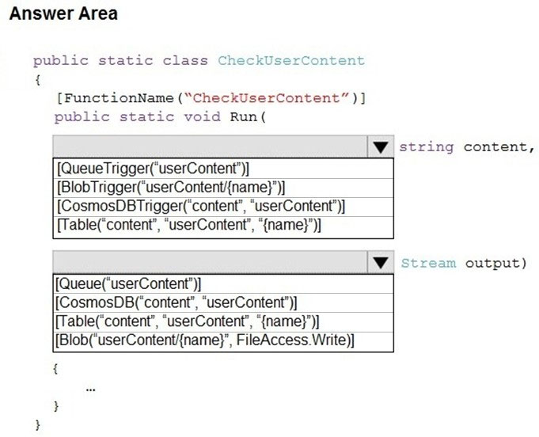

- [ ] Box 1: allowedAccountTypes. Box 2: User. Box 3: value.
- [ ] Box 1: role. Box 2: User. Box 3: value.
- [x] Box 1: allowedMemberTypes. Box 2: User. Box 3: value.
- [ ] Box 1: allowedMemberTypes. Box 2: value. Box 3: User.

**[⬆ Back to Top](#table-of-contents)**

### You are a developer for Contoso, Ltd. The company has a social networking website that is developed as a Single Page Application (SPA). The main web application for the social networking website loads user uploaded content from blob storage. You are developing a solution to monitor uploaded data for inappropriate content. The following process occurs when users upload content by using the SPA: Messages are sent to ContentUploadService. Content is processed by ContentAnalysisService. After processing is complete, the content is posted to the social network or a rejection message is posted in its place. The `ContentAnalysisService` is deployed with Azure Container Instances from a private Azure Container Registry named `contosoimages`. The solution will use eight CPU cores. Azure Active Directory: Contoso, Ltd. uses Azure Active Directory (Azure AD) for both internal and guest accounts. Requirements: `ContentAnalysisService` - The company's data science group built `ContentAnalysisService` which accepts user generated content as a string and returns a probable value for inappropriate content. Any values over a specific threshold must be reviewed by an employee of Contoso, Ltd. You must create an Azure Function named `CheckUserContent` to perform the content checks. Costs: You must minimize costs for all Azure services. Manual review: To review content, the user must authenticate to the website portion of the `ContentAnalysisService` using their Azure AD credentials. The website is built using React and all pages and API endpoints require authentication. In order to review content a user must be part of a ContentReviewer role. All completed reviews must include the reviewer's email address for auditing purposes. High availability: All services must run in multiple regions. The failure of any service in a region must not impact overall application availability. Monitoring: An alert must be raised if the `ContentUploadService` uses more than 80 percent of available CPU cores. Security: You have the following security requirements: Any web service accessible over the Internet must be protected from cross site scripting attacks. All websites and services must use SSL from a valid root certificate authority. Azure Storage access keys must only be stored in memory and must be available only to the service. All Internal services must only be accessible from internal Virtual Networks (VNets). All parts of the system must support inbound and outbound traffic restrictions. All service calls must be authenticated by using Azure AD. User agreements: When a user submits content, they must agree to a user agreement. The agreement allows employees of Contoso, Ltd. to review content, store cookies on user devices, and track user's IP addresses. Information regarding agreements is used by multiple divisions within Contoso, Ltd. User responses must not be lost and must be available to all parties regardless of individual service uptime. The volume of agreements is expected to be in the millions per hour. Validation testing: When a new version of the `ContentAnalysisService` is available the previous seven days of content must be processed with the new version to verify that the new version does not significantly deviate from the old version. Issues: Users of the `ContentUploadService` report that they occasionally see HTTP `502` responses on specific pages. Code - `ContentUploadService` - `ApplicationManifest`. You need to add YAML markup at line CS17 to ensure that the `ContentUploadService` can access Azure Storage access keys. How should you complete the YAML markup?

- [ ] Box 1: volumes. Box 2: volumeMounts. Box 3: secret.
- [x] Box 1: volumeMounts. Box 2: volumes. Box 3: secret.
- [ ] Box 1: envVar. Box 2: secretValues. Box 3: environmentVariables.
- [ ] Box 1: secret. Box 2: environmentVariables. Box 3: secretValues.

**[⬆ Back to Top](#table-of-contents)**

### You are a developer for Contoso, Ltd. The company has a social networking website that is developed as a Single Page Application (SPA). The main web application for the social networking website loads user uploaded content from blob storage. You are developing a solution to monitor uploaded data for inappropriate content. The following process occurs when users upload content by using the SPA: Messages are sent to ContentUploadService. Content is processed by ContentAnalysisService. After processing is complete, the content is posted to the social network or a rejection message is posted in its place. The `ContentAnalysisService` is deployed with Azure Container Instances from a private Azure Container Registry named `contosoimages`. The solution will use eight CPU cores. Azure Active Directory: Contoso, Ltd. uses Azure Active Directory (Azure AD) for both internal and guest accounts. Requirements: `ContentAnalysisService` - The company's data science group built `ContentAnalysisService` which accepts user generated content as a string and returns a probable value for inappropriate content. Any values over a specific threshold must be reviewed by an employee of Contoso, Ltd. You must create an Azure Function named `CheckUserContent` to perform the content checks. Costs: You must minimize costs for all Azure services. Manual review: To review content, the user must authenticate to the website portion of the `ContentAnalysisService` using their Azure AD credentials. The website is built using React and all pages and API endpoints require authentication. In order to review content a user must be part of a ContentReviewer role. All completed reviews must include the reviewer's email address for auditing purposes. High availability: All services must run in multiple regions. The failure of any service in a region must not impact overall application availability. Monitoring: An alert must be raised if the `ContentUploadService` uses more than 80 percent of available CPU cores. Security: You have the following security requirements: Any web service accessible over the Internet must be protected from cross site scripting attacks. All websites and services must use SSL from a valid root certificate authority. Azure Storage access keys must only be stored in memory and must be available only to the service. All Internal services must only be accessible from internal Virtual Networks (VNets). All parts of the system must support inbound and outbound traffic restrictions. All service calls must be authenticated by using Azure AD. User agreements: When a user submits content, they must agree to a user agreement. The agreement allows employees of Contoso, Ltd. to review content, store cookies on user devices, and track user's IP addresses. Information regarding agreements is used by multiple divisions within Contoso, Ltd. User responses must not be lost and must be available to all parties regardless of individual service uptime. The volume of agreements is expected to be in the millions per hour. Validation testing: When a new version of the `ContentAnalysisService` is available the previous seven days of content must be processed with the new version to verify that the new version does not significantly deviate from the old version. Issues: Users of the `ContentUploadService` report that they occasionally see HTTP `502` responses on specific pages. Code - `ContentUploadService` - `ApplicationManifest`. You need to deploy the CheckUserContent Azure Function. The solution must meet the security and cost requirements. Which hosting model should you use?

- [ ] Premium plan.
- [x] App Service plan.
- [ ] Consumption plan.

**[⬆ Back to Top](#table-of-contents)**

### You are a developer for Contoso, Ltd. The company has a social networking website that is developed as a Single Page Application (SPA). The main web application for the social networking website loads user uploaded content from blob storage. You are developing a solution to monitor uploaded data for inappropriate content. The following process occurs when users upload content by using the SPA: Messages are sent to ContentUploadService. Content is processed by ContentAnalysisService. After processing is complete, the content is posted to the social network or a rejection message is posted in its place. The `ContentAnalysisService` is deployed with Azure Container Instances from a private Azure Container Registry named `contosoimages`. The solution will use eight CPU cores. Azure Active Directory: Contoso, Ltd. uses Azure Active Directory (Azure AD) for both internal and guest accounts. Requirements: `ContentAnalysisService` - The company's data science group built `ContentAnalysisService` which accepts user generated content as a string and returns a probable value for inappropriate content. Any values over a specific threshold must be reviewed by an employee of Contoso, Ltd. You must create an Azure Function named `CheckUserContent` to perform the content checks. Costs: You must minimize costs for all Azure services. Manual review: To review content, the user must authenticate to the website portion of the `ContentAnalysisService` using their Azure AD credentials. The website is built using React and all pages and API endpoints require authentication. In order to review content a user must be part of a ContentReviewer role. All completed reviews must include the reviewer's email address for auditing purposes. High availability: All services must run in multiple regions. The failure of any service in a region must not impact overall application availability. Monitoring: An alert must be raised if the `ContentUploadService` uses more than 80 percent of available CPU cores. Security: You have the following security requirements: Any web service accessible over the Internet must be protected from cross site scripting attacks. All websites and services must use SSL from a valid root certificate authority. Azure Storage access keys must only be stored in memory and must be available only to the service. All Internal services must only be accessible from internal Virtual Networks (VNets). All parts of the system must support inbound and outbound traffic restrictions. All service calls must be authenticated by using Azure AD. User agreements: When a user submits content, they must agree to a user agreement. The agreement allows employees of Contoso, Ltd. to review content, store cookies on user devices, and track user's IP addresses. Information regarding agreements is used by multiple divisions within Contoso, Ltd. User responses must not be lost and must be available to all parties regardless of individual service uptime. The volume of agreements is expected to be in the millions per hour. Validation testing: When a new version of the `ContentAnalysisService` is available the previous seven days of content must be processed with the new version to verify that the new version does not significantly deviate from the old version. Issues: Users of the `ContentUploadService` report that they occasionally see HTTP `502` responses on specific pages. Code - `ContentUploadService` - `ApplicationManifest`. You need to ensure that validation testing is triggered per the requirements. How should you complete the code segment?

- [x] Box 1: ImagePushed. Box 2: repository. Box 3: topic.
- [ ] Box 1: ImageDeployed. Box 2: service. Box 3: imageCollection.
- [ ] Box 1: RepositoryUpdated. Box 2: service. Box 3: imageCollection.
- [ ] Box 1: RepositoryItem. Box 2: aci. Box 3: topic.

**[⬆ Back to Top](#table-of-contents)**

### You are a developer for Contoso, Ltd. The company has a social networking website that is developed as a Single Page Application (SPA). The main web application for the social networking website loads user uploaded content from blob storage. You are developing a solution to monitor uploaded data for inappropriate content. The following process occurs when users upload content by using the SPA: Messages are sent to ContentUploadService. Content is processed by ContentAnalysisService. After processing is complete, the content is posted to the social network or a rejection message is posted in its place. The `ContentAnalysisService` is deployed with Azure Container Instances from a private Azure Container Registry named `contosoimages`. The solution will use eight CPU cores. Azure Active Directory: Contoso, Ltd. uses Azure Active Directory (Azure AD) for both internal and guest accounts. Requirements: `ContentAnalysisService` - The company's data science group built `ContentAnalysisService` which accepts user generated content as a string and returns a probable value for inappropriate content. Any values over a specific threshold must be reviewed by an employee of Contoso, Ltd. You must create an Azure Function named `CheckUserContent` to perform the content checks. Costs: You must minimize costs for all Azure services. Manual review: To review content, the user must authenticate to the website portion of the `ContentAnalysisService` using their Azure AD credentials. The website is built using React and all pages and API endpoints require authentication. In order to review content a user must be part of a ContentReviewer role. All completed reviews must include the reviewer's email address for auditing purposes. High availability: All services must run in multiple regions. The failure of any service in a region must not impact overall application availability. Monitoring: An alert must be raised if the `ContentUploadService` uses more than 80 percent of available CPU cores. Security: You have the following security requirements: Any web service accessible over the Internet must be protected from cross site scripting attacks. All websites and services must use SSL from a valid root certificate authority. Azure Storage access keys must only be stored in memory and must be available only to the service. All Internal services must only be accessible from internal Virtual Networks (VNets). All parts of the system must support inbound and outbound traffic restrictions. All service calls must be authenticated by using Azure AD. User agreements: When a user submits content, they must agree to a user agreement. The agreement allows employees of Contoso, Ltd. to review content, store cookies on user devices, and track user's IP addresses. Information regarding agreements is used by multiple divisions within Contoso, Ltd. User responses must not be lost and must be available to all parties regardless of individual service uptime. The volume of agreements is expected to be in the millions per hour. Validation testing: When a new version of the `ContentAnalysisService` is available the previous seven days of content must be processed with the new version to verify that the new version does not significantly deviate from the old version. Issues: Users of the `ContentUploadService` report that they occasionally see HTTP `502` responses on specific pages. Code - `ContentUploadService` - `ApplicationManifest`. You need to configure the `ContentUploadService` deployment. Which two actions should you perform?

- [x] Add the following markup to line CS23: `type: Private`.
- [ ] Add the following markup to line CS24: `osType: Windows`.
- [x] Add the following markup to line CS24: `osType: Linux`.
- [ ] Add the following markup to line CS23: `type: Public`.

**[⬆ Back to Top](#table-of-contents)**
